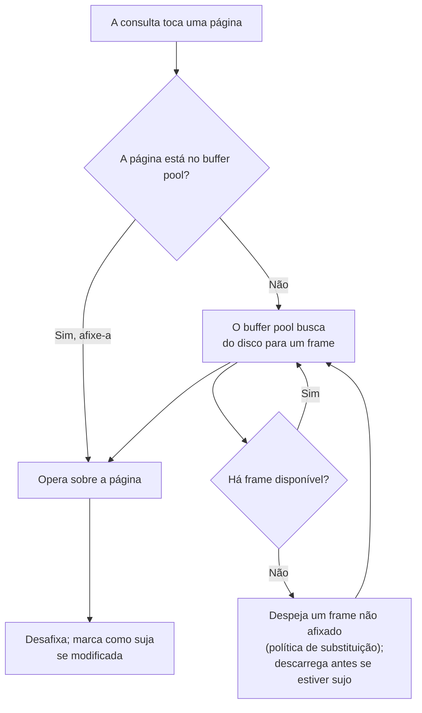

## Objetivos de Aprendizagem

- Explicar por que um SGBD mantém o seu próprio cache de páginas (o buffer pool) em vez de depender apenas do cache de arquivos do SO.
- Descrever o papel dos contadores de pin e das flags de sujo na contabilidade do buffer pool.
- Conectar a substituição de páginas do buffer pool ao mesmo problema de despejo já resolvido para os frames físicos do SO.
- Definir STEAL e NO-FORCE e explicar por que eles tornam a recuperação de travamentos um problema real de engenharia em vez de trivial.

## Contexto e Motivação

`computer/operating-systems-i` já construiu a versão geral deste problema duas vezes: `address-spaces-and-memory-virtualization` estabeleceu que um processo vê um espaço de endereçamento virtual sustentado por frames físicos que o SO gerencia, e `page-replacement-policies` estabeleceu que, quando a memória física está cheia, o SO precisa escolher qual página residente despejar para abrir espaço para uma nova, uma decisão que ele toma usando uma aproximação de "qual página vai ser usada mais longe no futuro" (o LRU e os seus parentes). O **buffer pool** de um SGBD é exatamente a mesma ideia, uma camada acima: é uma região de memória de tamanho fixo que guarda páginas do banco de dados buscadas do disco, e quando ele está cheio e uma nova página precisa ser carregada, o gerenciador do buffer pool precisa decidir qual página residente despejar, o problema idêntico que `page-replacement-policies` já resolveu, só que aplicado a páginas de banco de dados em vez de frames de memória de processos.

Um SGBD poderia, em princípio, simplesmente depender do próprio cache de arquivos do sistema operacional para manter as páginas quentes em memória e não construir um segundo cache por cima. Sistemas reais de produção não fazem isso, por razões específicas do que um SGBD sabe e um cache de arquivos genérico do SO não consegue saber: um SGBD sabe exatamente quais páginas fazem parte de uma transação em andamento e ainda não podem ser despejadas, quais páginas foram modificadas e precisam de tratamento especial antes do despejo, e qual padrão de acesso uma consulta específica vai seguir (varredura sequencial vs. busca aleatória por índice). Nada disso um cache de páginas do SO de propósito geral, alheio ao que uma "transação" sequer é, consegue aproveitar.

## Teoria Central

### Estrutura do buffer pool: páginas, contadores de pin e flags de sujo

O buffer pool é um array em memória de frames de tamanho fixo, cada um vazio ou guardando o equivalente a uma página de bytes, mais uma **tabela de páginas** que mapeia IDs de página para o frame que atualmente as guarda (se houver). Dois metadados por frame dirigem toda decisão do buffer pool:

- **Contador de pin**: o número de referências "em uso" atualmente mantidas sobre uma página por operações ativas. Uma página com contador de pin acima de zero nunca pode ser despejada, já que despejá-la invalidaria um ponteiro que alguma operação em andamento ainda está usando; só depois que toda operação "desafixou" (unpin) uma página ela se torna elegível para despejo.
- **Flag de sujo** (dirty): definida no momento em que qualquer operação modifica uma página enquanto ela está residente no buffer pool. O conteúdo em memória de uma página suja difere do que está atualmente no disco, então despejá-la com segurança exige primeiro escrevê-la (descarregá-la) de volta no disco, a menos que a política de substituição do buffer pool permita despejá-la mesmo assim e lidar com as consequências depois (a política STEAL, abaixo).

### Política de substituição

Quando todo frame está ocupado e pelo menos um deles tem contador de pin zero, o gerenciador do buffer pool precisa escolher uma vítima de despejo entre os frames não afixados, a exata decisão de despejo para a qual `page-replacement-policies` já construiu uma aproximação. Sistemas reais tipicamente usam LRU ou o algoritmo do relógio (clock: uma aproximação mais barata de LRU usando um bit de referência por frame, varrido numa passada circular) em vez do LRU verdadeiro, pela mesma razão que um SO usa: rastrear a recência exata de todo frame tem um overhead real de contabilidade que uma aproximação barata evita, perdendo pouco em taxa de acerto efetiva.

### STEAL e NO-FORCE: as duas políticas que tornam a recuperação difícil

Duas escolhas de política do buffer pool, cada uma independente da outra, determinam quanto a recuperação de travamentos (vários conceitos adiante nesta disciplina) precisa trabalhar:

- **STEAL** (sim/não): o buffer pool pode despejar ("roubar" o frame de) uma página suja que pertence a uma transação que *ainda não confirmou*? Uma política **no-steal** nunca despeja as páginas sujas de uma transação não confirmada, o que torna o undo trivial (nada não confirmado jamais chega ao disco), mas força o buffer pool a manter em memória simultaneamente toda página suja de toda transação de longa duração, frequentemente inviável. Uma política **steal** permite o despejo de páginas sujas não confirmadas sempre que necessário, trocando uma recuperação simples por um uso de memória muito mais prático.
- **FORCE** (sim/não): toda página suja que pertence a uma transação precisa ser descarregada no disco *antes* que essa transação tenha permissão de confirmar? Uma política **force** torna a durabilidade trivial (as escritas de uma transação confirmada já estão no disco no instante em que ela confirma), mas acrescenta latência real e síncrona de E/S a cada commit. Uma política **no-force** deixa o commit retornar imediatamente enquanto as páginas sujas são descarregadas preguiçosamente depois, trocando um commit rápido pela exigência de que algum outro mecanismo garanta que essas escritas sobrevivam a um travamento antes de estarem de fato no disco.

Sistemas reais de alto desempenho escolhem universalmente **STEAL + NO-FORCE** (máxima flexibilidade para o buffer pool, mínima latência no commit), e é precisamente por isso que o write-ahead logging e a recuperação de travamentos no estilo ARIES, ambos mais adiante nesta disciplina, precisam sequer existir: nenhum dos casos triviais acima se aplica quando o buffer pool de um sistema real está livre para despejar trabalho não confirmado e atrasar o descarregamento de trabalho confirmado.

## Exemplos Resolvidos

### Exemplo 1: contadores de pin bloqueando o despejo no meio de uma varredura

Uma varredura sequencial sobre uma tabela grande está no meio da página nº 17: o operador de varredura mantém um pin sobre a página nº 17 enquanto itera sobre as tuplas atualmente carregadas dela. Se, nesse mesmo momento, uma consulta diferente precisa carregar uma nova página e o buffer pool está cheio, a política de substituição precisa pular a página nº 17 como candidata a vítima (contador de pin > 0) e escolher entre as outras páginas residentes atualmente não afixadas, mesmo que a página nº 17 fosse, de outro modo, a menos recentemente usada e portanto o "melhor" alvo de despejo pela própria métrica da política.

### Exemplo 2: uma página suja despejada no meio de uma transação sob STEAL

Sob uma política STEAL, uma transação de longa duração modificou a página nº 42 (definindo a sua flag de sujo), mas ainda não confirmou. Se o buffer pool precisa do frame da página nº 42 para outra coisa e nenhum outro frame não afixado está disponível, ele descarrega no disco o conteúdo atual (não confirmado!) da página nº 42 e reutiliza o frame. Este é exatamente o cenário que uma política NO-STEAL proibiria, e exatamente o cenário que torna necessária a fase de Undo da recuperação de travamentos (construída em `aries-style-crash-recovery`, vários conceitos adiante): se o sistema travar antes que esta transação confirme, o disco agora contém mudanças não confirmadas que precisam ser ativamente revertidas no reinício, e não simplesmente ignoradas.

### Exemplo 3: NO-FORCE significando que "confirmado" e "no disco" são momentos diferentes

Uma transação atualiza uma linha na página nº 8, e então confirma. Sob uma política NO-FORCE, o commit retorna ao cliente imediatamente: a página nº 8 ainda está suja no buffer pool e ainda não foi fisicamente escrita no disco. Se a máquina travar um segundo depois, antes do próximo descarregamento agendado da página nº 8, o disco ainda guarda o conteúdo *antigo*, anterior à atualização, da página nº 8, mesmo que o cliente já tenha sido informado de que a transação confirmou com sucesso. A durabilidade ainda assim vale, mas só porque o write-ahead logging (o conceito depois do próximo desta disciplina) garante que o *registro de log* descrevendo esta exata mudança chegou ao armazenamento durável antes que o commit retornasse, mesmo que a própria página de dados não tenha chegado.

## Equívocos Comuns e Armadilhas

- **"O buffer pool é só o cache de arquivos do SO com outro nome."** Um SGBD mantém deliberadamente o seu próprio cache, contornando ou trabalhando ao lado do cache de arquivos do SO, justamente porque tem conhecimento do domínio (contadores de pin ligados a transações ativas, rastreamento de sujeira ligado ao write-ahead logging) que um cache de arquivos genérico não consegue representar. Os dois caches podem coexistir, e frequentemente coexistem, com o buffer pool do SGBD tomando as decisões que importam para a corretude.
- **"NO-FORCE significa que dados confirmados podem ser perdidos."** O NO-FORCE só atrasa *quando* uma página suja chega fisicamente ao disco em relação ao commit; ele não enfraquece a durabilidade, porque o write-ahead logging (construído dois conceitos adiante) garante que a mudança seja registrada de forma durável no log antes que o commit retorne, independentemente de quando a própria página de dados é descarregada. O NO-FORCE move o fardo da durabilidade da página de dados para o log; ele não o remove.
- **"Uma página afixada sempre pode ser modificada com segurança."** Um contador de pin acima de zero só impede o *despejo*; ele não diz nada sobre se um lock foi adquirido para o acesso concorrente correto às tuplas daquela página. O pin é um mecanismo de contabilidade interno do buffer pool, completamente separado do mecanismo de controle de concorrência por two-phase locking construído mais adiante nesta disciplina, e uma página pode ser afixada por múltiplos leitores concorrentes ao mesmo tempo sem conflito algum.

## Resumo

O buffer pool é o cache de páginas do próprio SGBD, sobreposto ao armazenamento de páginas em disco, tomando a mesma decisão de despejo que `page-replacement-policies` já resolveu para os frames físicos do SO, mas rastreada via contadores de pin (bloqueando o despejo de páginas em uso) e flags de sujo (marcando páginas que diferem da sua cópia em disco) que só um SGBD, ciente das suas próprias transações, consegue manter corretamente. Sistemas reais escolhem universalmente a combinação STEAL + NO-FORCE de políticas do buffer pool por desempenho, e essa única escolha é exatamente o que torna a recuperação de travamentos (o write-ahead logging e o ARIES, vários conceitos adiante) um problema de engenharia genuinamente difícil, em vez de algo que uma política ingênua no-steal/force poderia contornar de graça.

## Documentation Links

- [CMU 15-445/645: Database Storage I Slides](https://15445.courses.cs.cmu.edu/fall2025/slides/03-storage1.pdf): cobre a contabilidade de tabela de páginas/contador de pin/flag de sujo do buffer pool e as escolhas de política STEAL/NO-FORCE sobre as quais este conceito constrói o seu argumento da dificuldade da recuperação.
- [Berkeley CS186: Course Notes (Buffer Management)](https://cs186berkeley.net/notes/): o tratamento das notas do curso sobre a política de substituição e a mecânica de despejo do buffer pool, a mesma decisão de despejo que este conceito liga de volta a `page-replacement-policies`.
