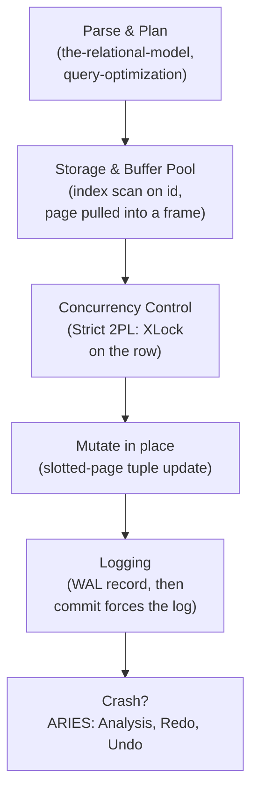

## Learning Objectives

- Trace one real `UPDATE` statement end to end through parsing/planning, storage and the buffer pool, concurrency control, and logging.
- Identify exactly which earlier concept in this discipline is responsible for each stage of that trace.
- Trace two contrasting crash scenarios — a crash just after commit, and a crash mid-transaction — through ARIES recovery, and show each produces the correct final state.
- State honestly what a production database engine does beyond this discipline's deliberately small, complete trace.

## Context & Motivation

Every concept in this discipline has, up to this point, examined one layer of a database engine in isolation — storage, indexing, query processing, transactions, recovery. This capstone does what `computer/operating-systems-i`'s own capstone (`capstone-tracing-a-process-from-fork-to-page-fault-to-disk`) already did for an operating system: pick one small, completely concrete operation and follow it through every layer, in order, showing that this discipline was never five independent topics — it was five cooperating parts of one engine, and this is the connected story that proves it. The operation: `UPDATE accounts SET balance = balance - 100 WHERE id = 42`.

## Core Theory

### The full pipeline, stage by stage

**Parsing & planning**: the statement is checked against the `Accounts` relation's schema (`the-relational-model-and-relational-algebra`), and the query optimizer (`query-optimization-cost-based-and-rule-based`) recognizes the equality predicate `id = 42` and, given a B+Tree index on `id` exists, produces a physical plan of exactly one **index scan** operator (`query-execution-the-iterator-model-and-scans`) feeding a **mutate** operator, rather than a full sequential scan — the cheapest plan for a single-row equality lookup, exactly the decision `choosing-an-index-hash-vs-b-plus-tree` established B+Trees (and, for a pure equality workload, hash indexes) are built for.

**Storage & the buffer pool**: the index scan descends the B+Tree (`b-plus-trees-structure-and-search`) from root to the leaf holding the entry for `id = 42`, following its pointer to the actual data page. The buffer pool (`buffer-pool-management`) checks whether that page is already resident; if not, it is fetched from disk into a frame and pinned, exactly as `disk-based-storage-pages-and-tuples`'s slotted-page layout expects — a slot array entry pointing at the tuple's exact byte offset within the page.

**Concurrency control**: before mutating anything, the transaction acquires an exclusive lock on the target row under Strict 2PL (`two-phase-locking-and-conflict-serializability`) — blocking, per `deadlocks-in-two-phase-locking`, only if some other transaction already holds a conflicting lock on the same row, and otherwise proceeding immediately. The lock is held until this transaction's own commit or abort, exactly as Strict 2PL requires, guaranteeing no other transaction can read this row's intermediate state.

**Mutation**: the tuple's `balance` field is updated in place within the page (via the slot array's offset, per `disk-based-storage-pages-and-tuples`), and the page is marked dirty in the buffer pool.

**Logging & commit**: a WAL record describing the exact before/after values is appended and assigned an LSN, and the page's pageLSN is updated to match (`write-ahead-logging`). Under NO-FORCE, the dirty page itself is *not* immediately flushed to disk — but the WAL rule requires the log to be flushed at least through this transaction's eventual commit record before the client is ever told the update succeeded.

## Worked Examples

### Example 1 — the full successful trace, with real numbers

`Accounts.id = 42` currently has `balance = 850`, stored on page `#17`. The optimizer produces `IndexScan(id=42) → Mutate(balance -= 100)`. The index scan descends the B+Tree (say 3 levels, per `b-plus-trees-structure-and-search`'s fanout reasoning) to the leaf entry for `id = 42`, finds it points at page `#17`, and the buffer pool fetches page `#17` into a frame (or finds it already resident). The transaction acquires `XLock` on this row — uncontended, granted immediately. The tuple's `balance` field is mutated in place: `850 → 750`. A WAL record `LSN 500: [T, UPDATE, page=17, before=850, after=750]` is appended, and page `#17`'s pageLSN becomes `500`. The transaction commits: `LSN 501: [T, COMMIT]` is appended, and the log is force-flushed through `LSN 501` before the client is told "1 row updated." Page `#17` itself, still only `750` in the buffer pool, may not reach disk for some time afterward — Durability is already fully guaranteed regardless, exactly as `write-ahead-logging` established.

### Example 2 — a crash just after commit, recovered by Redo alone

Suppose the machine crashes immediately after `LSN 501` is durably flushed, but before page `#17`'s in-memory `750` ever reaches disk (on-disk `balance` is still `850`, on-disk pageLSN still below `500`). On restart, ARIES's Analysis phase (`aries-style-crash-recovery`) scans the log and finds `T`'s commit record — `T` is *not* a loser, nothing needs undoing. Redo scans forward and finds `LSN 500`: the on-disk page's pageLSN is below `500`, so the change is reapplied — `balance` is set to `750` on disk, and the page's pageLSN is updated to `500`. No Undo work is needed at all. The final on-disk state, `balance = 750`, correctly reflects the committed update, exactly as if the crash had never happened.

### Example 3 — a crash mid-transaction, recovered by Redo and Undo together

Now suppose instead the crash happens *before* `T` ever commits — the update's log record `LSN 500` was written and, say, page `#17` was even evicted under STEAL and written to disk (`balance = 750` on disk, pageLSN `500`) — but `T`'s commit record was never written at all, because the transaction was still deciding on a second statement when the crash occurred. On restart, Analysis finds `T` in the log with no commit or abort record — `T` **is** a loser, and must be undone. Redo scans forward and finds `LSN 500`: the on-disk pageLSN is already `500` (not less than `500`), so this change is skipped — already durably applied, nothing to redo. Undo then processes `T`'s loser status: it finds `LSN 500`, restores `balance` to its before-value `850`, and writes a compensation record `LSN 502: [T, CLR, page=17, undoing 500, restore=850]`. The final on-disk state is `balance = 850` — correctly reverted to its pre-transaction value, because `T` never actually committed, exactly the Atomicity guarantee `acid-properties-precisely-defined` named at the start of this discipline's transactions cluster.

## Common Misconceptions & Pitfalls

- **"A single-row UPDATE is too simple to need most of this discipline's machinery."** Every layer traced above is genuinely load-bearing for this one statement: without the index (`choosing-an-index-hash-vs-b-plus-tree`), the plan would need a full table scan instead of a few B+Tree page fetches; without Strict 2PL, a concurrent reader could see the balance mid-update; without WAL, the update's durability (Example 2) or its correct rollback (Example 3) would both be impossible to guarantee after a crash — nothing traced here is optional machinery included only for completeness.
- **"Recovery only matters for complicated, multi-statement transactions."** Examples 2 and 3 show recovery mattering for the simplest possible transaction — a single `UPDATE` — precisely because a crash can happen at literally any instant relative to that one statement's own internal steps (logged-but-not-committed, committed-but-not-flushed), not only in elaborate multi-step business transactions.
- **"Once Redo and Undo are described in the abstract, tracing them on a real example adds nothing new."** Examples 2 and 3 are structurally different recovery outcomes from the *same* update statement, differing only in exactly when the crash occurred relative to the commit record — seeing both play out concretely is what confirms ARIES's Analysis phase is doing real, necessary work (correctly classifying `T` as a winner in one case and a loser in the other) rather than a fixed response applied uniformly regardless of timing.

## Summary

`UPDATE accounts SET balance = balance - 100 WHERE id = 42` is parsed against the relational schema and planned into an index-scan-then-mutate physical plan, its target page pulled through the buffer pool, an exclusive lock acquired under Strict 2PL, the tuple mutated in place within its slotted page, and a WAL record flushed before the now-dirty page ever needs to be. A crash just after commit is recovered by Redo alone, reconstructing the committed `750` from the durable log; a crash mid-transaction is recovered by Redo followed by Undo, correctly reverting to the pre-transaction `850` via a compensation log record — the same complete-pipeline capstone pattern `capstone-tracing-a-process-from-fork-to-page-fault-to-disk` already used to trace a single OS-level operation through every layer of an operating system, now applied to a single database engine operation through every layer this discipline built. A production engine would additionally check declared constraints (foreign keys, `CHECK`) as part of Consistency, replicate this WAL record to standby replicas for high availability, and — in an MVCC-based engine like PostgreSQL — create a new tuple version rather than mutating in place, later reclaimed by a vacuum process; none of that additional machinery changes the correctness of the trace built here, it extends it.

## Documentation Links

- [CMU 15-445/645 — Schedule (Full Course Structure)](https://15445.courses.cs.cmu.edu/fall2026/schedule.html) — the course's own full structure, confirming the storage → indexing → query processing → concurrency control → recovery layering this capstone traces one real statement through.
- [Database System Concepts (Silberschatz, Korth, Sudarshan) — Companion Site](https://www.db-book.com/) — the standard textbook reference spanning every layer this capstone touches, useful for cross-checking the end-to-end trace against a second complete presentation of how a DBMS executes and recovers a single statement.
