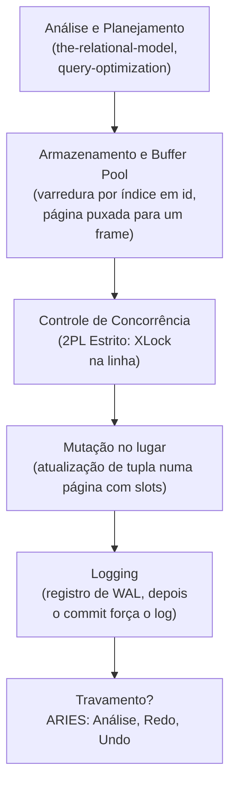

## Objetivos de Aprendizagem

- Rastrear uma instrução `UPDATE` real de ponta a ponta pela análise/planejamento, pelo armazenamento e o buffer pool, pelo controle de concorrência e pelo logging.
- Identificar exatamente qual conceito anterior desta disciplina é responsável por cada estágio desse rastro.
- Rastrear dois cenários de travamento contrastantes (um travamento logo depois do commit e um travamento no meio da transação) pela recuperação ARIES, e mostrar que cada um produz o estado final correto.
- Enunciar honestamente o que um motor de banco de dados de produção faz além do rastro deliberadamente pequeno e completo desta disciplina.

## Contexto e Motivação

Todo conceito desta disciplina, até este ponto, examinou uma camada de um motor de banco de dados isoladamente: armazenamento, indexação, processamento de consultas, transações, recuperação. Este capstone faz o que o próprio capstone de `computer/operating-systems-i` (`capstone-tracing-a-process-from-fork-to-page-fault-to-disk`) já fez para um sistema operacional: escolher uma operação pequena e completamente concreta e segui-la por cada camada, em ordem, mostrando que esta disciplina nunca foi cinco tópicos independentes; ela foi cinco partes cooperantes de um único motor, e esta é a história conectada que prova isso. A operação: `UPDATE accounts SET balance = balance - 100 WHERE id = 42`.

## Teoria Central

### O pipeline completo, estágio por estágio

**Análise e planejamento**: a instrução é checada contra o schema da relação `Accounts` (`the-relational-model-and-relational-algebra`), e o otimizador de consultas (`query-optimization-cost-based-and-rule-based`) reconhece o predicado de igualdade `id = 42` e, dado que existe um índice B+Tree em `id`, produz um plano físico de exatamente um operador de **varredura por índice** (`query-execution-the-iterator-model-and-scans`) alimentando um operador de **mutação**, em vez de uma varredura sequencial completa: o plano mais barato para uma busca por igualdade de uma única linha, exatamente a decisão para a qual `choosing-an-index-hash-vs-b-plus-tree` estabeleceu que as B+Trees (e, para uma carga de trabalho pura de igualdade, os índices hash) são construídas.

**Armazenamento e o buffer pool**: a varredura por índice desce a B+Tree (`b-plus-trees-structure-and-search`) da raiz até a folha que guarda a entrada de `id = 42`, seguindo o seu ponteiro para a página de dados de fato. O buffer pool (`buffer-pool-management`) checa se essa página já está residente; se não, ela é buscada do disco para um frame e afixada, exatamente como o layout de página com slots de `disk-based-storage-pages-and-tuples` espera: uma entrada do array de slots apontando para o deslocamento exato em bytes da tupla dentro da página.

**Controle de concorrência**: antes de modificar qualquer coisa, a transação adquire um lock exclusivo sobre a linha alvo sob 2PL Estrito (`two-phase-locking-and-conflict-serializability`), bloqueando, segundo `deadlocks-in-two-phase-locking`, só se alguma outra transação já segurar um lock conflitante sobre a mesma linha, e de outro modo prosseguindo imediatamente. O lock é mantido até o próprio commit ou aborto desta transação, exatamente como o 2PL Estrito exige, garantindo que nenhuma outra transação consiga ler o estado intermediário desta linha.

**Mutação**: o campo `balance` da tupla é atualizado no lugar dentro da página (via o deslocamento do array de slots, segundo `disk-based-storage-pages-and-tuples`), e a página é marcada como suja no buffer pool.

**Logging e commit**: um registro de WAL descrevendo os valores exatos de antes/depois é anexado e recebe um LSN, e o pageLSN da página é atualizado para bater (`write-ahead-logging`). Sob NO-FORCE, a própria página suja *não* é descarregada imediatamente no disco, mas a regra do WAL exige que o log seja descarregado pelo menos até o eventual registro de commit desta transação antes que o cliente seja jamais informado de que a atualização teve sucesso.

## Exemplos Resolvidos

### Exemplo 1: o rastro completo bem-sucedido, com números reais

`Accounts.id = 42` tem atualmente `balance = 850`, guardado na página `#17`. O otimizador produz `IndexScan(id=42) → Mutate(balance -= 100)`. A varredura por índice desce a B+Tree (digamos 3 níveis, segundo o raciocínio de fanout de `b-plus-trees-structure-and-search`) até a entrada de folha de `id = 42`, descobre que ela aponta para a página `#17`, e o buffer pool busca a página `#17` para um frame (ou a encontra já residente). A transação adquire `XLock` sobre esta linha, sem contenção, concedido imediatamente. O campo `balance` da tupla é modificado no lugar: `850 → 750`. Um registro de WAL `LSN 500: [T, UPDATE, page=17, before=850, after=750]` é anexado, e o pageLSN da página `#17` passa a ser `500`. A transação confirma: `LSN 501: [T, COMMIT]` é anexado, e o log é descarregado à força até o `LSN 501` antes que o cliente seja informado de "1 linha atualizada". A própria página `#17`, ainda só com `750` no buffer pool, pode não chegar ao disco por algum tempo depois disso; a Durabilidade já está totalmente garantida de qualquer forma, exatamente como `write-ahead-logging` estabeleceu.

### Exemplo 2: um travamento logo depois do commit, recuperado só pelo Redo

Suponha que a máquina trave imediatamente depois que o `LSN 501` é descarregado de forma durável, mas antes que o `750` em memória da página `#17` jamais chegue ao disco (o `balance` em disco ainda é `850`, o pageLSN em disco ainda abaixo de `500`). No reinício, a fase de Análise do ARIES (`aries-style-crash-recovery`) varre o log e encontra o registro de commit de `T`: `T` *não* é perdedora, nada precisa ser desfeito. O Redo varre para frente e encontra o `LSN 500`: o pageLSN da página em disco está abaixo de `500`, então a mudança é reaplicada (`balance` é definido como `750` no disco, e o pageLSN da página é atualizado para `500`). Nenhum trabalho de Undo é necessário. O estado final em disco, `balance = 750`, reflete corretamente a atualização confirmada, exatamente como se o travamento nunca tivesse acontecido.

### Exemplo 3: um travamento no meio da transação, recuperado por Redo e Undo juntos

Agora suponha que o travamento aconteça *antes* que `T` jamais confirme: o registro de log da atualização, `LSN 500`, foi escrito e, digamos, a página `#17` foi até despejada sob STEAL e escrita no disco (`balance = 750` no disco, pageLSN `500`), mas o registro de commit de `T` nunca chegou a ser escrito, porque a transação ainda estava decidindo sobre uma segunda instrução quando o travamento ocorreu. No reinício, a Análise encontra `T` no log sem registro de commit nem de aborto: `T` **é** perdedora, e precisa ser desfeita. O Redo varre para frente e encontra o `LSN 500`: o pageLSN em disco já é `500` (não menor que `500`), então esta mudança é pulada; ela já estava aplicada de forma durável, nada a refazer. O Undo então processa o status de perdedora de `T`: encontra o `LSN 500`, restaura `balance` para o seu valor "antes", `850`, e escreve um registro de compensação `LSN 502: [T, CLR, page=17, undoing 500, restore=850]`. O estado final em disco é `balance = 850`, corretamente revertido ao seu valor anterior à transação, porque `T` nunca de fato confirmou, exatamente a garantia de Atomicidade que `acid-properties-precisely-defined` nomeou no início do bloco de transações desta disciplina.

## Equívocos Comuns e Armadilhas

- **"Um UPDATE de uma única linha é simples demais para precisar da maior parte da maquinaria desta disciplina."** Toda camada rastreada acima é genuinamente estrutural para esta única instrução: sem o índice (`choosing-an-index-hash-vs-b-plus-tree`), o plano precisaria de uma varredura completa da tabela em vez de umas poucas buscas de página na B+Tree; sem o 2PL Estrito, um leitor concorrente poderia ver o saldo no meio da atualização; sem o WAL, a durabilidade da atualização (Exemplo 2) ou a sua reversão correta (Exemplo 3) seriam ambas impossíveis de garantir depois de um travamento. Nada rastreado aqui é maquinaria opcional incluída só por completude.
- **"A recuperação só importa para transações complicadas, de várias instruções."** Os Exemplos 2 e 3 mostram a recuperação importando para a transação mais simples possível (um único `UPDATE`), justamente porque um travamento pode acontecer literalmente em qualquer instante em relação aos próprios passos internos dessa única instrução (registrada no log mas não confirmada, confirmada mas não descarregada), e não só em transações de negócio elaboradas, de vários passos.
- **"Uma vez que Redo e Undo são descritos em abstrato, rastreá-los num exemplo real não acrescenta nada novo."** Os Exemplos 2 e 3 são resultados de recuperação estruturalmente diferentes a partir da *mesma* instrução de atualização, diferindo só em exatamente quando o travamento ocorreu em relação ao registro de commit. Ver os dois acontecerem concretamente é o que confirma que a fase de Análise do ARIES está fazendo um trabalho real e necessário (classificando corretamente `T` como vencedora num caso e como perdedora no outro), e não uma resposta fixa aplicada uniformemente, independentemente do timing.

## Resumo

`UPDATE accounts SET balance = balance - 100 WHERE id = 42` é analisado contra o schema relacional e planejado num plano físico de varredura por índice seguida de mutação, a sua página alvo é puxada pelo buffer pool, um lock exclusivo é adquirido sob 2PL Estrito, a tupla é modificada no lugar dentro da sua página com slots, e um registro de WAL é descarregado antes que a página agora suja jamais precise ser. Um travamento logo depois do commit é recuperado só pelo Redo, reconstruindo o `750` confirmado a partir do log durável; um travamento no meio da transação é recuperado pelo Redo seguido do Undo, revertendo corretamente para o `850` anterior à transação via um registro de log de compensação. É o mesmo padrão de capstone de pipeline completo que `capstone-tracing-a-process-from-fork-to-page-fault-to-disk` já usou para rastrear uma única operação no nível do SO por cada camada de um sistema operacional, agora aplicado a uma única operação de motor de banco de dados por cada camada que esta disciplina construiu. Um motor de produção adicionalmente checaria as restrições declaradas (chaves estrangeiras, `CHECK`) como parte da Consistência, replicaria este registro de WAL para réplicas standby por alta disponibilidade e, num motor baseado em MVCC como o PostgreSQL, criaria uma nova versão da tupla em vez de modificá-la no lugar, recuperada depois por um processo de vacuum; nenhuma dessa maquinaria adicional muda a corretude do rastro construído aqui, ela o estende.

## Documentation Links

- [CMU 15-445/645: Schedule (Full Course Structure)](https://15445.courses.cs.cmu.edu/fall2026/schedule.html): a própria estrutura completa do curso, confirmando a disposição em camadas armazenamento → indexação → processamento de consultas → controle de concorrência → recuperação pela qual este capstone rastreia uma instrução real.
- [Database System Concepts (Silberschatz, Korth, Sudarshan): Companion Site](https://www.db-book.com/): a referência padrão de livro-texto abrangendo toda camada que este capstone toca, útil para conferir o rastro de ponta a ponta contra uma segunda apresentação completa de como um SGBD executa e recupera uma única instrução.
