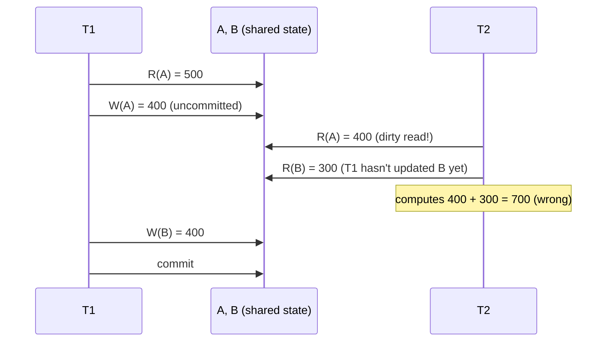

## Learning Objectives

- Trace a concrete, unconstrained interleaving of two transactions' read/write operations and show exactly where it produces a wrong answer.
- Define a dirty read precisely: reading data written by a transaction that has not yet committed (and might still abort).
- Define a lost update precisely: a committed write silently overwritten because it was computed from data that was already stale.
- Explain why a cascading abort is a real, additional danger of allowing dirty reads, not just an academic corner case.

## Context & Motivation

`acid-properties-precisely-defined` defined Isolation precisely — the result of running transactions concurrently must be equivalent to *some* serial execution of them — but gave no mechanism for actually achieving that equivalence. Before building one, it is worth seeing exactly what goes wrong *without* any concurrency-control mechanism at all: a real, concrete interleaving of operations from two transactions that violates Isolation and produces a genuinely wrong answer, using nothing more exotic than the same A/B bank-account transfer already introduced in the previous concept's worked examples. This concept builds that failure case in full, with real numbers, establishing exactly the concrete problem `two-phase-locking-and-conflict-serializability`, immediately next, exists to solve.

## Core Theory

### An unconstrained interleaving

With no concurrency-control mechanism in place, the DBMS is free to interleave two transactions' individual read and write operations in literally any order, executing them essentially as separate threads racing against the same underlying pages. Nothing forces "all of `T1`, then all of `T2`" or vice versa — any interleaving that respects each transaction's own internal statement order is, absent a mechanism to prevent it, a possible schedule the system might actually produce.

### Dirty reads

A **dirty read** occurs when a transaction reads a value written by another transaction that has **not yet committed** — and might still abort, in which case the value read never became part of the database's real, permanent history at all. A dirty read is dangerous for two separate reasons: first, the reading transaction may compute a wrong result using a value that turns out to have never truly existed; second — the more insidious danger — the reading transaction might act on that value (write something else based on it, or return it to an external system), a problem called a **cascading abort**: if the transaction that produced the dirty value later aborts, every transaction that read it must, in principle, also be undone, and every transaction that read *those* transactions' output must be undone too, cascading outward from a single abort.

### Lost updates

A **lost update** occurs when two transactions both read the same value, both compute a new value based on what they read, and both write back — with the second write silently overwriting the first, so that one of the two intended updates is lost entirely, with no error raised and no trace that it ever happened. Unlike a dirty read, a lost update can occur even if both transactions only ever read and write **committed** data — the problem is purely about *timing*: both transactions read the same stale value before either one's write is visible to the other.

## Worked Examples

### Example 1 — a dirty read producing a wrong total mid-transfer

Accounts `A = $500` and `B = $300`; true total is `$800`. `T1` transfers `$100` from `A` to `B`: `R(A)` → `500`; `A := A − 100 = 400`; `W(A)`. `T2`, interleaved right after `T1`'s write to `A` but before `T1` writes `B`, computes the grand total: `R(A)` → `400` (the value `T1` just wrote, still **uncommitted**); `R(B)` → `300` (the pre-transfer value, since `T1` hasn't written `B` yet). `T2` computes `400 + 300 = 700` and reports it. The true total, both before and after `T1`'s transfer fully completes, is `$800` — `T2`'s answer of `$700` is simply wrong, and is wrong specifically because it read `A`'s **dirty**, not-yet-committed intermediate value at the exact moment `T1`'s transaction was only half-finished.

### Example 2 — a lost update from two concurrent increments

Account `A = $500`. `T1` deposits `$50`: `R(A)` → `500`. Before `T1` writes back, `T3` also deposits `$30` into the same account: `R(A)` → `500` (the same stale value `T1` already read). `T3` computes `500 + 30 = 530` and writes `W(A) = 530`; `T3` commits. `T1`, still holding its own earlier read of `500`, now computes `500 + 50 = 550` and writes `W(A) = 550`, overwriting `T3`'s committed `530`. The correct final balance, reflecting both deposits, should be `500 + 50 + 30 = 580` — instead, `A` ends at `550`, and `T3`'s entire `$30` deposit has vanished with no error, no conflict reported, and no trace in the final state that it was ever applied.

### Example 3 — a dirty read propagating into a cascading abort

Continuing Example 1: suppose immediately after `T2` reads `A`'s dirty value of `400` and reports the (wrong) total of `700` to a downstream system — say, a fraud-monitoring service that flags the account for review based on that number — `T1` then hits an error partway through (perhaps a constraint violation on the write to `B`) and **aborts**, rolling `A` back to its original `500`. `T2`'s already-reported total of `700` was computed from a value (`A = 400`) that, after the rollback, never actually existed in the database's real committed history at any point in time. If any further transaction had itself read `T2`'s output and acted on it, that transaction would need to be undone too — a cascade of rollbacks radiating outward from `T1`'s single abort, entirely because nothing prevented `T2` from reading `T1`'s uncommitted write in the first place. This exact scenario is why `two-phase-locking-and-conflict-serializability`, immediately next, introduces **Strict** 2PL specifically to eliminate cascading aborts, not just to guarantee serializability in the abstract.

## Common Misconceptions & Pitfalls

- **"A dirty read only matters if the reading transaction later gets the wrong final answer."** Example 3 shows the deeper danger: even if `T2`'s own computation were somehow harmless, any *action taken* based on a dirty read (a report sent, a decision made, a further write based on it) cannot be safely undone just by rolling back the database state — cascading aborts are a real, structural risk of allowing dirty reads at all, independent of whether any single read's numeric result looks obviously wrong.
- **"A lost update requires reading uncommitted data, so it's really just a dirty read."** Example 2's lost update involves only reads and writes of **committed** values at every step — `T3`'s read of `500` and write of `530` are both fully committed operations, and `T1`'s subsequent overwrite is likewise a read-then-write of what were, at each moment, valid states; the problem is purely that both transactions computed their new value from the *same* stale read, a genuinely distinct failure mode from reading another transaction's not-yet-committed write.
- **"These anomalies are rare edge cases that only show up under unusual timing."** Both examples above require no unusual timing at all — any system running multiple concurrent transactions against shared rows with zero concurrency control will produce exactly these anomalies routinely, at a frequency proportional to how often transactions actually overlap on the same data, which for a busy production system can be constantly.

## Summary

With no concurrency-control mechanism at all, nothing prevents the DBMS from interleaving two transactions' operations in a way that violates Isolation and produces real, wrong answers: a **dirty read** lets one transaction see another's uncommitted, possibly-to-be-rolled-back write (Example 1's mid-transfer total of `$700` instead of `$800`, and Example 3's cascading-abort danger when that dirty value gets acted upon), and a **lost update** silently discards one of two concurrent writes that were both computed from the same stale read (Example 2's vanished `$30` deposit). Both anomalies are concrete, reproducible failures of the Isolation guarantee `acid-properties-precisely-defined` defined in the abstract — and both are exactly what `two-phase-locking-and-conflict-serializability`, immediately next, is built specifically to eliminate.

## Documentation Links

- [CMU 15-445/645 — Two-Phase Locking Concurrency Control Slides](https://15445.courses.cs.cmu.edu/fall2025/slides/18-twophaselocking.pdf) — covers dirty reads, lost updates, and the broader class of concurrency anomalies these slides motivate before introducing two-phase locking as the fix.
- [Database System Concepts (Silberschatz, Korth, Sudarshan) — Companion Site](https://www.db-book.com/) — the standard textbook treatment of concurrency anomalies, useful for cross-checking the dirty-read and lost-update schedules worked through in this concept's examples.
