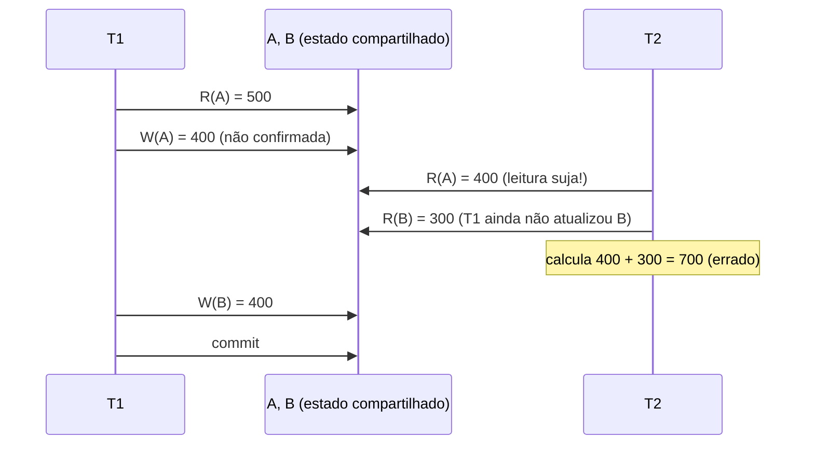

## Objetivos de Aprendizagem

- Rastrear uma intercalação concreta e sem restrições das operações de leitura/escrita de duas transações e mostrar exatamente onde ela produz uma resposta errada.
- Definir com precisão uma leitura suja: ler dados escritos por uma transação que ainda não confirmou (e ainda pode abortar).
- Definir com precisão uma atualização perdida: uma escrita confirmada sobrescrita silenciosamente porque foi calculada a partir de dados que já estavam desatualizados.
- Explicar por que um aborto em cascata é um perigo real e adicional de permitir leituras sujas, e não só um caso de canto acadêmico.

## Contexto e Motivação

`acid-properties-precisely-defined` definiu o Isolamento com precisão (o resultado de rodar transações concorrentemente precisa ser equivalente a *alguma* execução serial delas), mas não deu mecanismo algum para de fato alcançar essa equivalência. Antes de construir um, vale ver exatamente o que dá errado *sem* mecanismo algum de controle de concorrência: uma intercalação real e concreta de operações de duas transações que viola o Isolamento e produz uma resposta genuinamente errada, usando nada mais exótico que a mesma transferência entre as contas bancárias A/B já introduzida nos exemplos resolvidos do conceito anterior. Este conceito constrói esse caso de falha por completo, com números reais, estabelecendo exatamente o problema concreto que `two-phase-locking-and-conflict-serializability`, logo a seguir, existe para resolver.

## Teoria Central

### Uma intercalação sem restrições

Sem nenhum mecanismo de controle de concorrência em vigor, o SGBD é livre para intercalar as operações individuais de leitura e escrita de duas transações em literalmente qualquer ordem, executando-as essencialmente como threads separadas disputando as mesmas páginas subjacentes. Nada força "todo o `T1`, depois todo o `T2`" ou vice-versa: qualquer intercalação que respeite a própria ordem interna de instruções de cada transação é, na ausência de um mecanismo que a impeça, um agendamento possível que o sistema pode de fato produzir.

### Leituras sujas

Uma **leitura suja** (dirty read) ocorre quando uma transação lê um valor escrito por outra transação que **ainda não confirmou**, e que ainda pode abortar, caso em que o valor lido nunca chegou a fazer parte do histórico real e permanente do banco de dados. Uma leitura suja é perigosa por duas razões separadas: primeiro, a transação que lê pode calcular um resultado errado usando um valor que acaba nunca tendo existido de verdade; segundo (o perigo mais insidioso), a transação que lê pode agir com base nesse valor (escrever outra coisa com base nele, ou retorná-lo a um sistema externo), um problema chamado de **aborto em cascata**: se a transação que produziu o valor sujo depois abortar, toda transação que o leu precisa, em princípio, ser desfeita também, e toda transação que leu a saída *dessas* transações precisa ser desfeita também, em cascata para fora a partir de um único aborto.

### Atualizações perdidas

Uma **atualização perdida** (lost update) ocorre quando duas transações leem ambas o mesmo valor, calculam ambas um novo valor com base no que leram e escrevem ambas de volta, com a segunda escrita sobrescrevendo silenciosamente a primeira, de modo que uma das duas atualizações pretendidas é perdida por completo, sem erro levantado e sem vestígio de que ela tenha acontecido. Diferente de uma leitura suja, uma atualização perdida pode ocorrer mesmo que as duas transações só leiam e escrevam dados **confirmados**: o problema é puramente de *timing*, as duas transações leem o mesmo valor desatualizado antes que a escrita de qualquer uma delas fique visível para a outra.

## Exemplos Resolvidos

### Exemplo 1: uma leitura suja produzindo um total errado no meio da transferência

Contas `A = $500` e `B = $300`; o total verdadeiro é `$800`. `T1` transfere `$100` de `A` para `B`: `R(A)` → `500`; `A := A − 100 = 400`; `W(A)`. `T2`, intercalada logo depois da escrita de `T1` em `A`, mas antes de `T1` escrever `B`, calcula o total geral: `R(A)` → `400` (o valor que `T1` acabou de escrever, ainda **não confirmado**); `R(B)` → `300` (o valor anterior à transferência, já que `T1` ainda não escreveu `B`). `T2` calcula `400 + 300 = 700` e o reporta. O total verdadeiro, tanto antes quanto depois de a transferência de `T1` completar por inteiro, é `$800`: a resposta de `T2`, `$700`, está simplesmente errada, e está errada especificamente porque leu o valor intermediário **sujo**, ainda não confirmado, de `A` no exato momento em que a transação de `T1` estava só pela metade.

### Exemplo 2: uma atualização perdida por dois incrementos concorrentes

Conta `A = $500`. `T1` deposita `$50`: `R(A)` → `500`. Antes que `T1` escreva de volta, `T3` também deposita `$30` na mesma conta: `R(A)` → `500` (o mesmo valor desatualizado que `T1` já leu). `T3` calcula `500 + 30 = 530` e escreve `W(A) = 530`; `T3` confirma. `T1`, ainda segurando a sua própria leitura anterior de `500`, agora calcula `500 + 50 = 550` e escreve `W(A) = 550`, sobrescrevendo o `530` confirmado de `T3`. O saldo final correto, refletindo os dois depósitos, deveria ser `500 + 50 + 30 = 580`; em vez disso, `A` termina em `550`, e o depósito inteiro de `$30` de `T3` desapareceu sem erro, sem conflito reportado e sem vestígio no estado final de que ele tenha sido aplicado.

### Exemplo 3: uma leitura suja se propagando num aborto em cascata

Continuando o Exemplo 1: suponha que, logo depois de `T2` ler o valor sujo de `A`, `400`, e reportar o total (errado) de `700` a um sistema a jusante (digamos, um serviço de monitoramento de fraudes que sinaliza a conta para revisão com base nesse número), `T1` então encontra um erro no meio do caminho (talvez uma violação de restrição na escrita em `B`) e **aborta**, revertendo `A` para o seu `500` original. O total já reportado por `T2`, `700`, foi calculado a partir de um valor (`A = 400`) que, depois da reversão, nunca existiu de fato no histórico confirmado real do banco de dados em momento algum. Se qualquer transação adicional tivesse lido ela mesma a saída de `T2` e agido com base nela, essa transação também precisaria ser desfeita: uma cascata de reversões irradiando para fora a partir do único aborto de `T1`, inteiramente porque nada impediu `T2` de ler a escrita não confirmada de `T1`, para começo de conversa. Este exato cenário é por que `two-phase-locking-and-conflict-serializability`, logo a seguir, introduz o 2PL **Estrito** especificamente para eliminar abortos em cascata, e não só para garantir a serializabilidade no abstrato.

## Equívocos Comuns e Armadilhas

- **"Uma leitura suja só importa se a transação que lê obtiver depois a resposta final errada."** O Exemplo 3 mostra o perigo mais profundo: mesmo que o próprio cálculo de `T2` fosse de alguma forma inofensivo, qualquer *ação tomada* com base numa leitura suja (um relatório enviado, uma decisão tomada, uma escrita adicional com base nela) não pode ser desfeita com segurança só revertendo o estado do banco de dados. Os abortos em cascata são um risco real e estrutural de permitir leituras sujas, independentemente de o resultado numérico de qualquer leitura isolada parecer obviamente errado.
- **"Uma atualização perdida exige ler dados não confirmados, então é na verdade só uma leitura suja."** A atualização perdida do Exemplo 2 envolve só leituras e escritas de valores **confirmados** em todo passo: a leitura de `500` e a escrita de `530` de `T3` são ambas operações totalmente confirmadas, e a sobrescrita subsequente de `T1` é igualmente uma leitura-seguida-de-escrita do que eram, em cada momento, estados válidos. O problema é puramente que as duas transações calcularam o seu novo valor a partir da *mesma* leitura desatualizada, um modo de falha genuinamente distinto de ler a escrita ainda não confirmada de outra transação.
- **"Estas anomalias são casos de canto raros que só aparecem sob timing incomum."** Nenhum dos dois exemplos acima exige timing incomum algum: qualquer sistema rodando múltiplas transações concorrentes contra linhas compartilhadas com zero controle de concorrência vai produzir exatamente estas anomalias rotineiramente, numa frequência proporcional a quão frequentemente as transações de fato se sobrepõem nos mesmos dados, o que, para um sistema de produção movimentado, pode ser o tempo todo.

## Resumo

Sem mecanismo algum de controle de concorrência, nada impede o SGBD de intercalar as operações de duas transações de uma forma que viola o Isolamento e produz respostas reais e erradas: uma **leitura suja** deixa uma transação ver a escrita não confirmada, e possivelmente a ser revertida, de outra (o total de `$700` em vez de `$800` no meio da transferência do Exemplo 1, e o perigo de aborto em cascata do Exemplo 3 quando esse valor sujo vira base para uma ação), e uma **atualização perdida** descarta silenciosamente uma de duas escritas concorrentes que foram ambas calculadas a partir da mesma leitura desatualizada (o depósito de `$30` que desapareceu no Exemplo 2). As duas anomalias são falhas concretas e reproduzíveis da garantia de Isolamento que `acid-properties-precisely-defined` definiu no abstrato, e as duas são exatamente o que `two-phase-locking-and-conflict-serializability`, logo a seguir, é construído especificamente para eliminar.

## Documentation Links

- [CMU 15-445/645: Two-Phase Locking Concurrency Control Slides](https://15445.courses.cs.cmu.edu/fall2025/slides/18-twophaselocking.pdf): cobre leituras sujas, atualizações perdidas e a classe mais ampla de anomalias de concorrência que estes slides usam como motivação antes de introduzir o two-phase locking como a correção.
- [Database System Concepts (Silberschatz, Korth, Sudarshan): Companion Site](https://www.db-book.com/): o tratamento padrão de livro-texto das anomalias de concorrência, útil para conferir os agendamentos de leitura suja e atualização perdida percorridos nos exemplos deste conceito.
