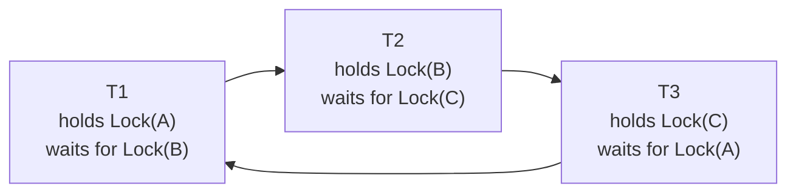

## Learning Objectives

- Explain why 2PL's growing phase can deadlock, and why that deadlock has exactly the same structure as an OS-level resource deadlock.
- Build a waits-for graph for a real multi-transaction schedule and use it to detect a deadlock cycle.
- Describe how a system resolves a detected deadlock by choosing and aborting a victim transaction.
- Explain the wait-die and wound-wait deadlock-*prevention* schemes and how transaction timestamps decide who waits and who aborts.

## Context & Motivation

`two-phase-locking-and-conflict-serializability` built 2PL's growing phase — acquire every lock a transaction needs before releasing any — as the mechanism that guarantees conflict serializability. That same growing phase introduces a new failure mode `computer/operating-systems-i`'s `deadlock-conditions-and-detection` already defined precisely, just at a different granularity: a **deadlock** is a cycle of transactions, each waiting to acquire a lock currently held by the next transaction in the cycle, with no transaction able to proceed. The structure is identical to an OS-level resource deadlock — mutual exclusion, hold-and-wait, no preemption, and a circular wait — except the "resources" are database tuples/pages instead of OS-managed devices or memory, and the "processes" are transactions instead of OS threads.

## Core Theory

### Deadlock as a cycle in the waits-for graph

Exactly as `deadlock-conditions-and-detection` built for OS resources, a **waits-for graph** for a set of active transactions has one node per transaction and a directed edge `Tᵢ → Tⱼ` whenever `Tᵢ` is currently blocked waiting for a lock held by `Tⱼ`. A **deadlock exists if and only if this graph contains a cycle** — a set of transactions each waiting on the next, with no way for any of them to ever make progress, since each is holding something the next one in the cycle needs and none will release anything until it acquires what it's waiting for.

### Detecting and resolving a deadlock

A DBMS periodically checks its waits-for graph for cycles (using the same cycle-detection technique `deadlock-conditions-and-detection` already built for OS resource graphs). When a cycle is found, the system must break it by choosing a **victim** transaction to abort — releasing all of its locks and rolling back its work — freeing up the resource the next transaction in the cycle was waiting for and letting the remaining transactions in the cycle proceed. Real systems typically choose a victim using criteria like the amount of work already done (aborting a transaction that has done the least work wastes the least effort) or how many other transactions would need to be rolled back as a consequence, rather than choosing arbitrarily.

### Deadlock prevention: wait-die and wound-wait

Detecting cycles after they've already formed means some transactions genuinely sit blocked, unable to progress, until a periodic check catches the cycle — real systems can instead **prevent** deadlocks from forming at all, using each transaction's **start timestamp** (assigned once, when the transaction begins, and never changed even if that transaction later aborts and restarts) to decide, at the moment of a lock conflict, whether the requester should wait or should itself abort:

- **Wait-die**: when transaction `Tᵢ` requests a lock held by `Tⱼ`, if `Tᵢ` is **older** than `Tⱼ` (started first), `Tᵢ` is allowed to **wait**. If `Tᵢ` is **younger** than `Tⱼ`, `Tᵢ` **dies** — aborts immediately rather than waiting — and restarts later, keeping its *original* timestamp so that it eventually becomes the oldest transaction in the system and is guaranteed to win any future conflict, preventing it from starving forever.
- **Wound-wait**: when `Tᵢ` requests a lock held by `Tⱼ`, if `Tᵢ` is **older** than `Tⱼ`, `Tᵢ` **wounds** `Tⱼ` — forces `Tⱼ` to abort immediately, preempting it — and takes the lock. If `Tᵢ` is **younger**, `Tᵢ` **waits**.

Both schemes only ever have an *older* transaction wait for a *younger* one never the reverse, which is exactly what makes a cycle in the waits-for graph structurally impossible: a cycle would require some transaction to be waiting on one both older and younger than itself simultaneously, which the ordering rule above never allows to occur.

## Worked Examples

### Example 1 — building the waits-for graph and finding a real cycle

Three transactions run concurrently: `T1` holds `XLock(A)` and requests `XLock(B)`; `T2` holds `XLock(B)` and requests `XLock(C)`; `T3` holds `XLock(C)` and requests `XLock(A)`. The waits-for graph has exactly the edges `T1 → T2` (T1 waits on the lock T2 holds), `T2 → T3`, and `T3 → T1` — a 3-node cycle, confirming a deadlock: none of the three can ever acquire the lock it's waiting for, because each is held by the next transaction in the same cycle, and none will release its own held lock until its own request succeeds.

### Example 2 — resolving the deadlock by choosing a victim

Detecting the cycle from Example 1, the system must abort one of `T1`, `T2`, or `T3` to break it. Suppose `T3` has done the least work so far (it only just acquired `XLock(C)` and made its first request); the system chooses `T3` as the victim, aborts it, and releases `XLock(C)`. `T2`, which was waiting on exactly that lock, can now acquire it and proceed; `T1` remains waiting on `T2` until `T2` eventually finishes and releases `XLock(B)`. The cycle is broken with the smallest amount of wasted work, though `T3` itself must now restart from scratch.

### Example 3 — wait-die and wound-wait preventing the same deadlock from ever forming

Assign start timestamps `T1 = 100` (oldest), `T2 = 105`, `T3 = 110` (youngest), and replay the same lock requests from Example 1 using **wait-die**: `T1` (100) requests a lock held by `T2` (105) — `T1` is older, so `T1` waits. `T2` (105) requests a lock held by `T3` (110) — `T2` is older, so `T2` waits. Now `T3` (110) requests a lock held by `T1` (100) — `T3` is *younger* than `T1`, so under wait-die, `T3` **dies immediately** rather than waiting, aborting and releasing `XLock(C)` before the third edge of the cycle can ever form. The deadlock in Example 1 never actually completes. Replaying the same scenario with **wound-wait** instead resolves it even earlier: `T1` (100) requesting a lock held by `T2` (105) is now the *older* transaction, so instead of waiting, `T1` **wounds** `T2` — forcing `T2` to abort immediately at the very first conflict, before `T2` ever gets to make its own request against `T3` at all.

## Common Misconceptions & Pitfalls

- **"Database deadlocks and OS resource deadlocks are only superficially similar."** The structure is identical, not merely analogous: both are precisely a cycle in a waits-for graph among entities (transactions or processes) each holding something the next one in the cycle needs — `deadlock-conditions-and-detection`'s cycle-detection technique transfers directly, with the only real difference being what's being waited for (a database tuple/page lock versus an OS-managed resource).
- **"Wait-die and wound-wait guarantee no transaction is ever aborted."** Both schemes are deadlock-*prevention*, not deadlock-*avoidance-without-any-cost* — Example 3 shows real transactions genuinely aborting (`T3` under wait-die, `T2` under wound-wait) specifically to prevent a cycle from ever completing; the win is that the abort happens proactively, at a single conflict point, rather than after several transactions sit fully blocked in an unbreakable cycle.
- **"Wait-die and wound-wait produce the same outcome, just with different names."** Example 3 shows the two schemes resolve the *same* scenario differently: wait-die lets both `T1` and `T2` wait initially and only aborts `T3` at the point where the cycle would otherwise complete, while wound-wait preemptively aborts `T2` at the very first conflict, before `T3` is even involved — the two rules (younger dies vs. younger waits, older waits vs. older wounds) are inverses of each other, not equivalent formulations of one rule.

## Summary

2PL's growing phase can deadlock exactly the way `deadlock-conditions-and-detection` already defined a deadlock for OS resources — a cycle of transactions, each holding a lock the next one in the cycle needs — just at the granularity of database tuples/pages. A DBMS can detect this after the fact by building a waits-for graph and checking for cycles (Example 1's real 3-transaction cycle), resolving it by aborting a chosen victim (Example 2), or prevent it from forming in the first place using transaction start timestamps: **wait-die** (an older requester waits, a younger one dies) or **wound-wait** (an older requester wounds the holder, a younger one waits) — both shown in Example 3 breaking the identical cycle before it can ever complete, by construction of the ordering rule rather than by detecting the cycle after the fact.

## Documentation Links

- [CMU 15-445/645 — Two-Phase Locking Concurrency Control Slides](https://15445.courses.cs.cmu.edu/fall2025/slides/18-twophaselocking.pdf) — the source of this concept's waits-for graph deadlock-detection technique and the wait-die/wound-wait deadlock-prevention schemes worked through in the examples.
- [ACM/IEEE CS2013 — Data Management (DM) Knowledge Area](https://csed.acm.org/knowledge-areas-data-management-dm-cs2013-version/) — the curricular standard covering transaction concurrency control and deadlock handling as expected knowledge within the Data Management knowledge area.
