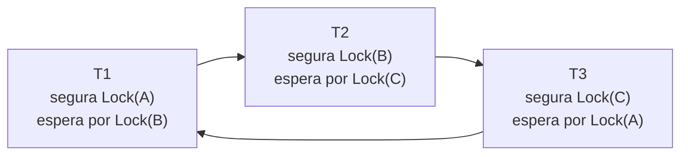

## Objetivos de Aprendizagem

- Explicar por que a fase de crescimento do 2PL pode entrar em deadlock, e por que esse deadlock tem exatamente a mesma estrutura de um deadlock de recursos no nível do SO.
- Construir um grafo de espera para um agendamento real de várias transações e usá-lo para detectar um ciclo de deadlock.
- Descrever como um sistema resolve um deadlock detectado escolhendo e abortando uma transação vítima.
- Explicar os esquemas de *prevenção* de deadlock wait-die e wound-wait e como os carimbos de tempo das transações decidem quem espera e quem aborta.

## Contexto e Motivação

`two-phase-locking-and-conflict-serializability` construiu a fase de crescimento do 2PL (adquirir todo lock de que uma transação precisa antes de liberar qualquer um) como o mecanismo que garante a serializabilidade por conflito. Essa mesma fase de crescimento introduz um novo modo de falha que `deadlock-conditions-and-detection`, de `computer/operating-systems-i`, já definiu com precisão, só que numa granularidade diferente: um **deadlock** é um ciclo de transações, cada uma esperando para adquirir um lock atualmente detido pela próxima transação do ciclo, sem nenhuma transação conseguindo prosseguir. A estrutura é idêntica à de um deadlock de recursos no nível do SO (exclusão mútua, hold-and-wait, sem preempção e espera circular), exceto que os "recursos" são tuplas/páginas de banco de dados em vez de dispositivos ou memória gerenciados pelo SO, e os "processos" são transações em vez de threads do SO.

## Teoria Central

### O deadlock como um ciclo no grafo de espera

Exatamente como `deadlock-conditions-and-detection` construiu para recursos do SO, um **grafo de espera** (waits-for graph) para um conjunto de transações ativas tem um nó por transação e uma aresta dirigida `Tᵢ → Tⱼ` sempre que `Tᵢ` está atualmente bloqueada esperando por um lock detido por `Tⱼ`. **Um deadlock existe se e somente se este grafo contém um ciclo**: um conjunto de transações cada uma esperando pela próxima, sem forma de nenhuma delas jamais progredir, já que cada uma segura algo de que a próxima do ciclo precisa e nenhuma vai liberar nada até adquirir aquilo pelo qual está esperando.

### Detectando e resolvendo um deadlock

Um SGBD checa periodicamente o seu grafo de espera atrás de ciclos (usando a mesma técnica de detecção de ciclos que `deadlock-conditions-and-detection` já construiu para grafos de recursos do SO). Quando um ciclo é encontrado, o sistema precisa quebrá-lo escolhendo uma transação **vítima** para abortar, liberando todos os seus locks e revertendo o seu trabalho, o que libera o recurso pelo qual a próxima transação do ciclo estava esperando e deixa as transações restantes do ciclo prosseguirem. Sistemas reais tipicamente escolhem uma vítima usando critérios como a quantidade de trabalho já feito (abortar uma transação que fez o mínimo de trabalho desperdiça o mínimo de esforço) ou quantas outras transações precisariam ser revertidas como consequência, em vez de escolher arbitrariamente.

### Prevenção de deadlock: wait-die e wound-wait

Detectar ciclos depois que eles já se formaram significa que algumas transações genuinamente ficam bloqueadas, incapazes de progredir, até que uma checagem periódica pegue o ciclo. Sistemas reais podem, em vez disso, **prevenir** que os deadlocks sequer se formem, usando o **carimbo de início** de cada transação (atribuído uma vez, quando a transação começa, e nunca alterado, mesmo que essa transação depois aborte e reinicie) para decidir, no momento de um conflito de lock, se quem pede deve esperar ou deve ela mesma abortar:

- **Wait-die**: quando a transação `Tᵢ` pede um lock detido por `Tⱼ`, se `Tᵢ` for **mais velha** que `Tⱼ` (começou antes), `Tᵢ` tem permissão para **esperar**. Se `Tᵢ` for **mais nova** que `Tⱼ`, `Tᵢ` **morre**: aborta imediatamente em vez de esperar, e reinicia depois, mantendo o seu carimbo *original*, de modo que ela eventualmente se torne a transação mais velha do sistema e tenha garantia de vencer qualquer conflito futuro, evitando que fique em inanição para sempre.
- **Wound-wait**: quando `Tᵢ` pede um lock detido por `Tⱼ`, se `Tᵢ` for **mais velha** que `Tⱼ`, `Tᵢ` **fere** `Tⱼ`: força `Tⱼ` a abortar imediatamente, fazendo a sua preempção, e toma o lock. Se `Tᵢ` for **mais nova**, `Tᵢ` **espera**.

Os dois esquemas só deixam uma transação *mais velha* esperar por uma *mais nova* ou só o contrário, nunca as duas coisas, e é exatamente isso que torna um ciclo no grafo de espera estruturalmente impossível: um ciclo exigiria que alguma transação estivesse esperando por uma que fosse ao mesmo tempo mais velha e mais nova que ela, o que a regra de ordenação acima nunca permite acontecer.

## Exemplos Resolvidos

### Exemplo 1: construindo o grafo de espera e encontrando um ciclo real

Três transações rodam concorrentemente: `T1` segura `XLock(A)` e pede `XLock(B)`; `T2` segura `XLock(B)` e pede `XLock(C)`; `T3` segura `XLock(C)` e pede `XLock(A)`. O grafo de espera tem exatamente as arestas `T1 → T2` (T1 espera pelo lock que T2 segura), `T2 → T3` e `T3 → T1`: um ciclo de 3 nós, confirmando um deadlock. Nenhuma das três jamais consegue adquirir o lock pelo qual está esperando, porque cada um é detido pela próxima transação do mesmo ciclo, e nenhuma vai liberar o próprio lock detido até que o seu próprio pedido tenha sucesso.

### Exemplo 2: resolvendo o deadlock escolhendo uma vítima

Detectando o ciclo do Exemplo 1, o sistema precisa abortar uma de `T1`, `T2` ou `T3` para quebrá-lo. Suponha que `T3` fez o mínimo de trabalho até agora (ela acabou de adquirir `XLock(C)` e fazer o seu primeiro pedido); o sistema escolhe `T3` como vítima, a aborta e libera `XLock(C)`. `T2`, que estava esperando exatamente por esse lock, agora consegue adquiri-lo e prosseguir; `T1` continua esperando por `T2` até que `T2` eventualmente termine e libere `XLock(B)`. O ciclo é quebrado com a menor quantidade de trabalho desperdiçado, embora a própria `T3` agora precise reiniciar do zero.

### Exemplo 3: wait-die e wound-wait impedindo que o mesmo deadlock sequer se forme

Atribua os carimbos de início `T1 = 100` (a mais velha), `T2 = 105`, `T3 = 110` (a mais nova), e repita os mesmos pedidos de lock do Exemplo 1 usando **wait-die**: `T1` (100) pede um lock detido por `T2` (105); `T1` é mais velha, então `T1` espera. `T2` (105) pede um lock detido por `T3` (110); `T2` é mais velha, então `T2` espera. Agora `T3` (110) pede um lock detido por `T1` (100); `T3` é *mais nova* que `T1`, então, sob wait-die, `T3` **morre imediatamente** em vez de esperar, abortando e liberando `XLock(C)` antes que a terceira aresta do ciclo possa sequer se formar. O deadlock do Exemplo 1 nunca chega de fato a se completar. Repetir o mesmo cenário com **wound-wait** o resolve ainda mais cedo: `T1` (100), pedindo um lock detido por `T2` (105), é agora a transação *mais velha*, então, em vez de esperar, `T1` **fere** `T2`, forçando `T2` a abortar imediatamente no primeiríssimo conflito, antes que `T2` chegue sequer a fazer o seu próprio pedido contra `T3`.

## Equívocos Comuns e Armadilhas

- **"Deadlocks de banco de dados e deadlocks de recursos do SO só são superficialmente parecidos."** A estrutura é idêntica, e não meramente análoga: os dois são precisamente um ciclo num grafo de espera entre entidades (transações ou processos) cada uma segurando algo de que a próxima do ciclo precisa. A técnica de detecção de ciclos de `deadlock-conditions-and-detection` se transfere diretamente, com a única diferença real sendo aquilo pelo qual se espera (um lock de tupla/página de banco de dados versus um recurso gerenciado pelo SO).
- **"Wait-die e wound-wait garantem que nenhuma transação jamais seja abortada."** Os dois esquemas são de *prevenção* de deadlock, e não de *evitação de deadlock sem custo algum*: o Exemplo 3 mostra transações reais genuinamente abortando (`T3` sob wait-die, `T2` sob wound-wait) especificamente para impedir que um ciclo jamais se complete. O ganho é que o aborto acontece de forma proativa, num único ponto de conflito, em vez de depois que várias transações ficam totalmente bloqueadas num ciclo inquebrável.
- **"Wait-die e wound-wait produzem o mesmo resultado, só com nomes diferentes."** O Exemplo 3 mostra os dois esquemas resolvendo o *mesmo* cenário de forma diferente: o wait-die deixa `T1` e `T2` esperarem inicialmente e só aborta `T3` no ponto em que o ciclo de outro modo se completaria, enquanto o wound-wait aborta preventivamente `T2` no primeiríssimo conflito, antes que `T3` sequer esteja envolvida. As duas regras (a mais nova morre vs. a mais nova espera, a mais velha espera vs. a mais velha fere) são inversas uma da outra, e não formulações equivalentes de uma mesma regra.

## Resumo

A fase de crescimento do 2PL pode entrar em deadlock exatamente do jeito que `deadlock-conditions-and-detection` já definiu um deadlock para recursos do SO (um ciclo de transações, cada uma segurando um lock de que a próxima do ciclo precisa), só que na granularidade de tuplas/páginas de banco de dados. Um SGBD pode detectar isso depois do fato construindo um grafo de espera e checando ciclos (o ciclo real de 3 transações do Exemplo 1), resolvendo-o ao abortar uma vítima escolhida (Exemplo 2), ou impedir que ele sequer se forme usando os carimbos de início das transações: **wait-die** (quem pede mais velha espera, mais nova morre) ou **wound-wait** (quem pede mais velha fere quem detém, mais nova espera), ambos mostrados no Exemplo 3 quebrando o ciclo idêntico antes que ele possa jamais se completar, pela construção da regra de ordenação, e não por detectar o ciclo depois do fato.

## Documentation Links

- [CMU 15-445/645: Two-Phase Locking Concurrency Control Slides](https://15445.courses.cs.cmu.edu/fall2025/slides/18-twophaselocking.pdf): a fonte da técnica de detecção de deadlock por grafo de espera deste conceito e dos esquemas de prevenção de deadlock wait-die/wound-wait percorridos nos exemplos.
- [ACM/IEEE CS2013: Data Management (DM) Knowledge Area](https://csed.acm.org/knowledge-areas-data-management-dm-cs2013-version/): o padrão curricular que cobre o controle de concorrência de transações e o tratamento de deadlocks como conhecimento esperado dentro da área de conhecimento de Data Management.
