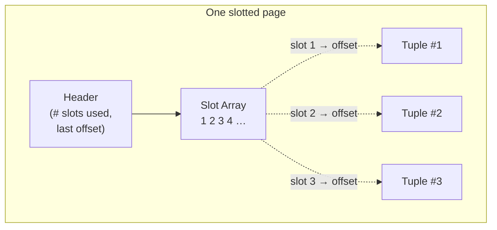

## Learning Objectives

- Explain why a DBMS organizes disk storage into fixed-size pages rather than reading/writing individual tuples directly.
- Describe heap-file organization and the role of a page directory in locating pages.
- Explain the slotted-page layout and why it — rather than a naive append-only tuple list — is the layout real systems use.
- Trace what happens to a page's slot array and tuple data on an insert and on a delete.

## Context & Motivation

`computer/operating-systems-i`'s `files-directories-and-inodes` already established the core idea this concept reuses: a file system does not read or write a file byte-by-byte against the disk — it reads and writes fixed-size **blocks**, because that's the granularity disks are physically efficient at, and it needs metadata (an inode) to track which blocks belong to which file. A DBMS makes the exact same architectural choice one layer up: it organizes the data it stores into fixed-size **pages** (typically a few kilobytes, matching or multiplying the underlying disk/filesystem block size), and needs its own metadata to track which pages belong to which table and where free space remains. The reasoning is identical — disk I/O is expensive and most efficient in fixed-size chunks — the DBMS is simply making that decision for its own data instead of delegating it to the file system's block layer.

Once pages are the unit of I/O, a genuinely new problem appears that a file system's block layer doesn't have to solve: a page is going to hold many tuples (rows) of possibly varying size, and those tuples will be inserted, updated, and deleted over the table's lifetime, all while the DBMS needs to find any specific tuple by address quickly and without unnecessary internal fragmentation. Solving that problem well is what the slotted-page layout, built in this concept, is for.

## Core Theory

### Page storage architecture: heap files

Different DBMSs organize the *pages themselves* within database files in different ways — heap file organization (an unordered collection of pages), tree file organization, sorted/ISAM file organization, or hashing file organization. This discipline builds the simplest and most common: a **heap file** is an unordered collection of pages holding tuples in no particular order, supporting create/get/write/delete-page operations plus iteration over every page in the file. Locating a specific page requires additional metadata beyond just the raw file bytes: a **page directory** — special pages the DBMS maintains that map a logical page number to its physical location, along with per-page metadata like how much free space each page has and whether a page is a data page or a directory/meta-data page. Retrieving "page #23" of a table means first consulting the directory to translate that logical page number into a physical file offset, then reading exactly that one page — the DBMS never needs to scan the whole file to find one page once the directory exists.

### Page layout

Once a specific page's raw bytes are in hand, something inside the page still needs to organize the tuples themselves. Every page starts with a **page header** carrying metadata about the page's own contents — page size, a checksum, DBMS version, transaction-visibility information, compression metadata, and (in some systems) full schema information, since some systems require every page to be self-contained. Below the header, real systems mostly choose between three page-layout strategies: tuple-oriented storage (this concept's focus, storing whole rows directly), log-structured storage (storing deltas/changes rather than full rows — used by LSM-tree-based storage engines), and index-organized storage (the table itself *is* the index, the subject of the choosing-an-index concept later in this discipline).

### Tuple-oriented storage and the slotted page

A naive tuple-oriented layout would simply track a count of tuples in the page and append each new tuple after the last one — but this breaks immediately on two very common operations: deleting a tuple leaves either a gap or requires shifting every later tuple down, and a variable-length attribute (a `VARCHAR`, for instance) means tuples aren't even a uniform size to begin with, so there's no fixed offset formula for "the third tuple."

The **slotted page** is the layout essentially every real row-oriented DBMS uses to solve both problems at once. A **slot array** grows from the front of the page, each slot holding the *offset* of one tuple's actual starting position, rather than the tuple data itself; the raw tuple bytes are packed from the *back* of the page, growing toward the middle. The page header tracks the number of slots currently in use and the offset of the start of the last tuple packed in so far.

This one level of indirection is what makes both problems tractable: deleting a tuple just marks its slot as empty (or has it point to a tombstone) without moving any other tuple's bytes at all, and a variable-length tuple is simply a variable-length run of bytes referenced by exactly one slot offset — nothing about the slot array itself needs to be a fixed size to accommodate it. A **tuple header** inside each tuple's own bytes additionally tracks per-tuple metadata (e.g. a visibility/transaction timestamp, relevant again once the concurrency-control cluster of this discipline introduces multi-version concurrency control), followed by the actual tuple data.

## Worked Examples

### Example 1 — locating page #23 via the page directory

A table `Employees` spans several pages across two underlying files. A query needs page #23 of that table. The DBMS does not scan the files looking for it; it looks up entry #23 in the page directory, which returns a physical file + byte offset (computed, in the simplest case, as `page_number × page_size`), and reads exactly that one page. If the directory shows page #23 currently has 40% free space, the buffer-pool/insert logic (the next concept) can also use that fact directly, without opening the page first, to decide whether a new tuple will fit there.

### Example 2 — inserting into a slotted page

A page currently holds three tuples referenced by slots 1, 2, 3, with tuple bytes packed from the back of the page. Inserting a fourth tuple: (1) check the header's free-space bookkeeping to confirm the new tuple's bytes fit in the gap between the end of the slot array and the start of the packed tuple data; (2) append the new tuple's raw bytes just before the current last-tuple offset; (3) add a new slot (slot 4) at the front, pointing at that new offset; (4) update the header's used-slot count and last-offset. No existing tuple's bytes or slot are touched.

### Example 3 — deleting a tuple without shifting anything

Continuing from Example 2's four-tuple page, tuple #2 (referenced by slot 2) is deleted. The DBMS does not shift tuples #1, #3, #4's bytes to close the gap — it simply marks slot 2 as empty (a sentinel offset value, e.g. −1, or a tombstone flag), leaving a hole in the packed tuple-data region. That hole is available for reuse by a future insert of a tuple small enough to fit it (tracked via the page's free-space metadata), and only a page-level compaction operation — run occasionally, not on every delete — would actually repack the remaining tuples to reclaim the hole contiguously. This is exactly why real systems periodically report needing to "vacuum" or compact tables: the slotted-page design deliberately defers repacking cost rather than paying it on every single delete.

## Common Misconceptions & Pitfalls

- **"A page is the same thing as a disk sector or filesystem block."** A DBMS page is a logical unit the DBMS itself defines and manages (typically 4–16 KB), chosen to be a multiple of the underlying OS/filesystem block size for efficiency — but the DBMS's page directory, headers, and slot arrays are entirely the DBMS's own bookkeeping, layered on top of whatever block size the file system underneath happens to use, not something the file system is aware of.
- **"Deleting a tuple immediately frees its space for a different table."** A deleted tuple's slot is marked empty within its own page, and its bytes become reusable free space *within that same page* for future inserts — the space is not returned to the operating system or to a different table until an explicit compaction/reclaim step, and even then it typically stays allocated to the same table's heap file.
- **"Slotted pages exist just to save space."** The slot array's real job is indirection, not compression — it lets every reference to a tuple anywhere else in the system (an index entry, a lock table entry) point at a stable `(page_id, slot_number)` address that survives the tuple's bytes moving around within the page during compaction, rather than an absolute byte offset that would be invalidated by every insert or delete.

## Summary

A DBMS organizes disk storage the same way a file system organizes its blocks — into fixed-size pages, tracked via a page directory — but then has to solve a problem a file system's block layer never faces: packing many variable-length tuples into one page in a way that supports fast lookup, in-place insert, and delete without wholesale data movement. The slotted page solves this with one level of indirection: a slot array of offsets at the front of the page, and packed tuple bytes growing from the back, so a delete only ever touches one slot and an insert only ever appends one new slot plus one new tuple, leaving every other tuple's address stable. This page-and-slot foundation is exactly what the buffer pool, built next, caches in memory, and what every index structure built later in this discipline ultimately points into.

## Documentation Links

- [CMU 15-445/645 — Database Storage I Slides](https://15445.courses.cs.cmu.edu/fall2025/slides/03-storage1.pdf) — the source of this concept's page-directory and slotted-page layout, including the header/slot-array/tuple-data structure diagrammed here.
- [Berkeley CS186 — Course Notes (Disks and Files)](https://cs186berkeley.net/notes/) — covers heap-file organization and page layout alternatives from the disks-and-files angle, complementing the slotted-page focus of the CMU slides above.
