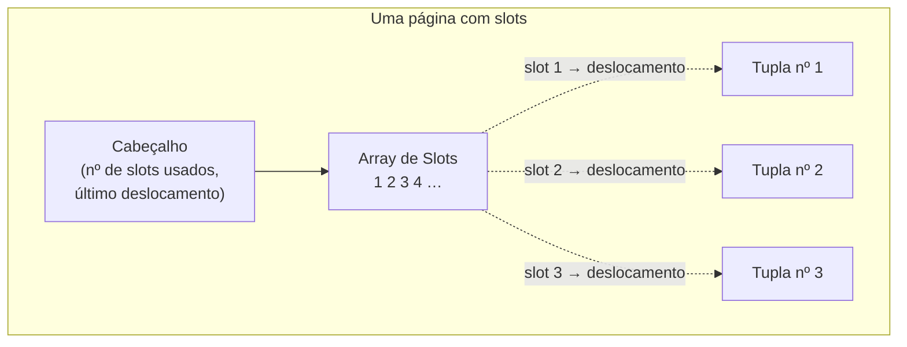

## Objetivos de Aprendizagem

- Explicar por que um SGBD organiza o armazenamento em disco em páginas de tamanho fixo em vez de ler/escrever tuplas individuais diretamente.
- Descrever a organização em heap file e o papel de um diretório de páginas na localização de páginas.
- Explicar o layout de página com slots e por que ele (em vez de uma lista ingênua de tuplas só com anexação) é o layout que sistemas reais usam.
- Rastrear o que acontece com o array de slots e os dados de tuplas de uma página numa inserção e numa remoção.

## Contexto e Motivação

`files-directories-and-inodes`, de `computer/operating-systems-i`, já estabeleceu a ideia central que este conceito reutiliza: um sistema de arquivos não lê nem escreve um arquivo byte a byte contra o disco; ele lê e escreve **blocos** de tamanho fixo, porque essa é a granularidade em que os discos são fisicamente eficientes, e precisa de metadados (um inode) para rastrear quais blocos pertencem a qual arquivo. Um SGBD faz exatamente a mesma escolha arquitetural uma camada acima: ele organiza os dados que armazena em **páginas** de tamanho fixo (tipicamente alguns kilobytes, igual ou múltiplo do tamanho de bloco do disco/sistema de arquivos subjacente), e precisa dos seus próprios metadados para rastrear quais páginas pertencem a qual tabela e onde ainda há espaço livre. O raciocínio é idêntico (a E/S de disco é cara e mais eficiente em pedaços de tamanho fixo); o SGBD está simplesmente tomando essa decisão para os seus próprios dados em vez de delegá-la à camada de blocos do sistema de arquivos.

Uma vez que as páginas são a unidade de E/S, aparece um problema genuinamente novo que a camada de blocos de um sistema de arquivos não precisa resolver: uma página vai guardar muitas tuplas (linhas) de tamanho possivelmente variável, e essas tuplas serão inseridas, atualizadas e removidas ao longo da vida da tabela, tudo isso enquanto o SGBD precisa encontrar qualquer tupla específica por endereço rapidamente e sem fragmentação interna desnecessária. Resolver bem esse problema é para que serve o layout de página com slots, construído neste conceito.

## Teoria Central

### Arquitetura de armazenamento em páginas: heap files

SGBDs diferentes organizam *as próprias páginas* dentro dos arquivos do banco de dados de formas diferentes: organização em heap file (uma coleção não ordenada de páginas), organização em árvore, organização ordenada/ISAM ou organização por hashing. Esta disciplina constrói a mais simples e mais comum: um **heap file** é uma coleção não ordenada de páginas que guardam tuplas em nenhuma ordem particular, suportando operações de criar/obter/escrever/apagar página mais a iteração sobre toda página do arquivo. Localizar uma página específica exige metadados adicionais além dos bytes brutos do arquivo: um **diretório de páginas**, páginas especiais que o SGBD mantém e que mapeiam um número de página lógico para a sua localização física, junto com metadados por página, como quanto espaço livre cada página tem e se uma página é de dados ou de diretório/metadados. Obter "a página nº 23" de uma tabela significa primeiro consultar o diretório para traduzir esse número de página lógico num deslocamento físico no arquivo, e depois ler exatamente essa página. O SGBD nunca precisa varrer o arquivo inteiro para encontrar uma página depois que o diretório existe.

### Layout de página

Uma vez que os bytes brutos de uma página específica estão em mãos, algo dentro da página ainda precisa organizar as próprias tuplas. Toda página começa com um **cabeçalho de página** carregando metadados sobre o próprio conteúdo da página: tamanho da página, um checksum, versão do SGBD, informação de visibilidade transacional, metadados de compressão e (em alguns sistemas) a informação completa do schema, já que alguns sistemas exigem que toda página seja autocontida. Abaixo do cabeçalho, sistemas reais escolhem principalmente entre três estratégias de layout de página: armazenamento orientado a tuplas (o foco deste conceito, guardando linhas inteiras diretamente), armazenamento estruturado em log (guardando deltas/mudanças em vez de linhas completas, usado por motores de armazenamento baseados em LSM-tree) e armazenamento organizado por índice (a própria tabela *é* o índice, o assunto do conceito de escolha de índice mais adiante nesta disciplina).

### Armazenamento orientado a tuplas e a página com slots

Um layout ingênuo orientado a tuplas simplesmente rastrearia uma contagem de tuplas na página e anexaria cada nova tupla depois da última, mas isso quebra imediatamente em duas operações muito comuns: remover uma tupla deixa um buraco ou exige deslocar toda tupla posterior para baixo, e um atributo de tamanho variável (um `VARCHAR`, por exemplo) significa que as tuplas nem sequer têm um tamanho uniforme, para começo de conversa, então não há fórmula de deslocamento fixo para "a terceira tupla".

A **página com slots** (slotted page) é o layout que essencialmente todo SGBD real orientado a linhas usa para resolver os dois problemas de uma vez. Um **array de slots** cresce a partir do início da página, cada slot guardando o *deslocamento* da posição inicial real de uma tupla, e não os dados da tupla em si; os bytes brutos das tuplas são empacotados a partir do *fim* da página, crescendo em direção ao meio. O cabeçalho da página rastreia o número de slots atualmente em uso e o deslocamento do início da última tupla empacotada até agora.

Este único nível de indireção é o que torna os dois problemas tratáveis: remover uma tupla só marca o seu slot como vazio (ou o faz apontar para uma lápide) sem mover os bytes de nenhuma outra tupla, e uma tupla de tamanho variável é simplesmente uma sequência de bytes de tamanho variável referenciada por exatamente um deslocamento de slot; nada no próprio array de slots precisa ter tamanho fixo para acomodá-la. Um **cabeçalho de tupla** dentro dos próprios bytes de cada tupla rastreia adicionalmente metadados por tupla (ex.: um carimbo de visibilidade/transação, relevante de novo quando o bloco de controle de concorrência desta disciplina introduz o controle de concorrência multiversão), seguido dos dados de fato da tupla.

## Exemplos Resolvidos

### Exemplo 1: localizando a página nº 23 via o diretório de páginas

Uma tabela `Employees` se estende por várias páginas em dois arquivos subjacentes. Uma consulta precisa da página nº 23 dessa tabela. O SGBD não varre os arquivos procurando-a; ele consulta a entrada nº 23 do diretório de páginas, que retorna um arquivo físico + deslocamento em bytes (calculado, no caso mais simples, como `page_number × page_size`), e lê exatamente essa página. Se o diretório mostra que a página nº 23 tem atualmente 40% de espaço livre, a lógica de buffer pool/inserção (o próximo conceito) também pode usar esse fato diretamente, sem abrir a página antes, para decidir se uma nova tupla vai caber ali.

### Exemplo 2: inserindo numa página com slots

Uma página guarda atualmente três tuplas referenciadas pelos slots 1, 2, 3, com os bytes das tuplas empacotados a partir do fim da página. Inserindo uma quarta tupla: (1) checar a contabilidade de espaço livre do cabeçalho para confirmar que os bytes da nova tupla cabem no vão entre o fim do array de slots e o início dos dados de tuplas empacotados; (2) anexar os bytes brutos da nova tupla logo antes do deslocamento atual da última tupla; (3) acrescentar um novo slot (slot 4) no início, apontando para esse novo deslocamento; (4) atualizar a contagem de slots usados e o último deslocamento no cabeçalho. Nenhum byte nem slot de tupla existente é tocado.

### Exemplo 3: removendo uma tupla sem deslocar nada

Continuando a partir da página de quatro tuplas do Exemplo 2, a tupla nº 2 (referenciada pelo slot 2) é removida. O SGBD não desloca os bytes das tuplas nº 1, nº 3 e nº 4 para fechar o vão; ele simplesmente marca o slot 2 como vazio (um valor de deslocamento sentinela, ex.: −1, ou uma flag de lápide), deixando um buraco na região de dados de tuplas empacotados. Esse buraco fica disponível para reuso por uma inserção futura de uma tupla pequena o suficiente para caber nele (rastreado via os metadados de espaço livre da página), e só uma operação de compactação no nível da página (rodada ocasionalmente, e não a cada remoção) de fato reempacotaria as tuplas restantes para recuperar o buraco de forma contígua. É exatamente por isso que sistemas reais periodicamente reportam precisar fazer "vacuum" ou compactar tabelas: o projeto de página com slots deliberadamente adia o custo de reempacotamento em vez de pagá-lo a cada remoção.

## Equívocos Comuns e Armadilhas

- **"Uma página é a mesma coisa que um setor de disco ou um bloco do sistema de arquivos."** Uma página de SGBD é uma unidade lógica que o próprio SGBD define e gerencia (tipicamente de 4 a 16 KB), escolhida para ser múltipla do tamanho de bloco do SO/sistema de arquivos subjacente por eficiência. Mas o diretório de páginas, os cabeçalhos e os arrays de slots do SGBD são inteiramente contabilidade do próprio SGBD, sobreposta a qualquer tamanho de bloco que o sistema de arquivos por baixo calhe de usar, e não algo de que o sistema de arquivos tenha conhecimento.
- **"Remover uma tupla libera imediatamente o seu espaço para uma tabela diferente."** O slot de uma tupla removida é marcado como vazio dentro da sua própria página, e os seus bytes se tornam espaço livre reutilizável *dentro daquela mesma página* para inserções futuras. O espaço não é devolvido ao sistema operacional nem a uma tabela diferente até um passo explícito de compactação/recuperação, e mesmo então ele tipicamente continua alocado ao heap file da mesma tabela.
- **"Páginas com slots existem só para economizar espaço."** O trabalho real do array de slots é a indireção, e não a compressão: ele permite que toda referência a uma tupla em qualquer outro lugar do sistema (uma entrada de índice, uma entrada da tabela de locks) aponte para um endereço estável `(page_id, slot_number)`, que sobrevive aos bytes da tupla se movendo dentro da página durante a compactação, em vez de um deslocamento absoluto em bytes que seria invalidado a cada inserção ou remoção.

## Resumo

Um SGBD organiza o armazenamento em disco da mesma forma que um sistema de arquivos organiza os seus blocos (em páginas de tamanho fixo, rastreadas via um diretório de páginas), mas depois precisa resolver um problema que a camada de blocos de um sistema de arquivos nunca enfrenta: empacotar muitas tuplas de tamanho variável numa página de uma forma que suporte busca rápida, inserção no lugar e remoção sem movimentação de dados em massa. A página com slots resolve isso com um nível de indireção: um array de slots com deslocamentos no início da página, e bytes de tuplas empacotados crescendo a partir do fim, de modo que uma remoção só toca um slot e uma inserção só anexa um slot novo mais uma tupla nova, deixando estável o endereço de toda outra tupla. Esta fundação de páginas e slots é exatamente o que o buffer pool, construído a seguir, guarda em cache na memória, e para onde toda estrutura de índice construída mais adiante nesta disciplina, no fim das contas, aponta.

## Documentation Links

- [CMU 15-445/645: Database Storage I Slides](https://15445.courses.cs.cmu.edu/fall2025/slides/03-storage1.pdf): a fonte do diretório de páginas e do layout de página com slots deste conceito, incluindo a estrutura de cabeçalho/array de slots/dados de tuplas diagramada aqui.
- [Berkeley CS186: Course Notes (Disks and Files)](https://cs186berkeley.net/notes/): cobre a organização em heap file e alternativas de layout de página pelo ângulo de discos e arquivos, complementando o foco em páginas com slots dos slides da CMU acima.
