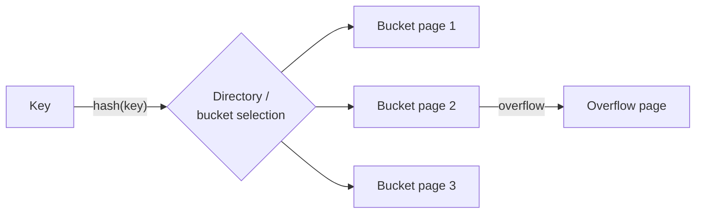

## Learning Objectives

- Explain why scanning every page of a heap file to answer a lookup is unacceptable, motivating indexes in general.
- Describe how a disk-based hash index reuses in-memory hash-table machinery, and what changes when buckets are pages.
- Explain bucket overflow and why a naive full rehash is too expensive for a disk-resident hash table.
- State precisely which queries a hash index can and cannot answer.

## Context & Motivation

With storage and the buffer pool built, a query like "find the employee with `id = 4217`" can already be answered — by scanning every page of the `Employees` heap file, pulling each one through the buffer pool, and checking every tuple. This works, but it costs one page I/O per page in the table, no matter how selective the query is; for a table with a million pages, that's up to a million I/Os to answer one single-row lookup. An **index** is a separate data structure, built on top of a heap file's contents, whose entire purpose is answering exactly this kind of lookup without touching every page.

`foundations/data-structures-i` already built the in-memory version of the specific index this concept covers: `hashing-and-hash-functions` established a hash function mapping keys to bucket positions in O(1) expected time, and `collision-resolution-open-addressing` established one real strategy for handling two keys landing in the same bucket. A **hash index** is exactly that machinery, reapplied with one structural change: instead of buckets being slots in an in-memory array, they are disk pages, fetched through the buffer pool like any other page — and that one change is what forces every other design decision in this concept.

## Core Theory

### From in-memory buckets to page-based buckets

An in-memory hash table's buckets live in RAM, so growing the table (more buckets) or resolving a collision (probing another array slot) costs essentially nothing extra. A disk-based hash index's buckets are pages: resolving a collision by probing a neighboring bucket means an *extra page I/O*, not a cheap in-memory pointer chase, so a hash index is built to make collisions rare within a bucket rather than cheap to resolve. The standard approach is a **bucket overflow page**: when a bucket page fills up, rather than probing elsewhere, the DBMS chains an overflow page directly off the full bucket, and a lookup that hashes into a full bucket simply follows the overflow chain — a real, disk-friendly analogue of the separate-chaining collision strategy, now chaining whole pages instead of individual entries.

### Why a static hash table doesn't scale on disk

A hash table sized for `n` buckets at creation time degrades exactly the way `load-factor-and-rehashing` already described once too many keys are inserted — long overflow chains, and lookups that degrade from O(1) toward O(chain length). The in-memory fix, rehashing into a larger table, is far more expensive on disk: a full rehash means re-reading and re-writing every single bucket page in the index, a massive I/O cost to pay all at once. Real systems avoid this with **extendible hashing** (a directory of pointers to buckets, doubled incrementally only when needed, letting individual buckets split independently without touching every other bucket) or **linear hashing** (buckets split one at a time in a fixed round-robin order as the table grows, entirely avoiding a separate directory structure) — both grow the index's total bucket count gradually, a few pages at a time, instead of ever re-writing the whole structure in one operation.

### What a hash index can and cannot answer

A hash index answers **equality lookups** — `WHERE id = 4217` — in O(1) expected page I/Os: hash the key, jump directly to the matching bucket page (following overflow pages if needed), done. It provides no help at all for a **range query** — `WHERE id BETWEEN 100 AND 200` — because a hash function deliberately scatters keys with no relationship between key order and bucket order; two keys one apart numerically can land in buckets on opposite ends of the index, so there is no way to "walk forward" through a range without effectively rehashing every candidate key or falling back to a full scan. This single limitation is exactly the axis the choosing-an-index concept, later in this cluster, uses to decide between a hash index and a B+Tree.

## Worked Examples

### Example 1 — an equality lookup, no overflow

A hash index on `Employees.id` has 4 buckets (pages), and `hash(4217) mod 4 = 1`. A lookup for `id = 4217` computes the same hash, jumps directly to bucket page 1, scans that one page's entries (typically far fewer than a full heap-file page's worth of tuples, since an index entry is just a key + a pointer to the actual tuple, not the whole row) for a match, and returns the matching entry's pointer to the actual data page — one or two page I/Os total, regardless of how many total employees exist.

### Example 2 — a collision forcing an overflow page

Bucket page 1 is already holding its maximum number of index entries when a new employee with `id = 9001`, hashing to the same bucket 1, is inserted. Rather than resizing bucket 1 itself, the DBMS allocates a new overflow page, links it from bucket 1's page header, and inserts the new entry there. A subsequent lookup for `id = 9001` first checks bucket 1's primary page (no match), then follows the overflow-page link and finds it there — two page I/Os for this lookup instead of one, exactly the degradation `load-factor-and-rehashing` already predicted as a table fills up.

### Example 3 — why a range query cannot use this index at all

The same hash index on `Employees.id`, queried for `WHERE id BETWEEN 4200 AND 4300`, cannot be used productively: `id = 4200` might hash to bucket 3, `id = 4201` to bucket 0, `id = 4300` to bucket 2 — there is no ordering relationship at all between consecutive keys' bucket assignments, by design (a good hash function actively destroys any such relationship to keep the load balanced). The query processor is forced to fall back to a full heap-file scan, or to use a B+Tree index instead if one exists on the same column — exactly the choice the next four concepts build toward.

## Common Misconceptions & Pitfalls

- **"A hash index is always the fastest choice since equality lookups are O(1)."** O(1) expected-time equality lookup is real, but it is the *only* query shape a hash index accelerates — any query with a range predicate, an ORDER BY on the indexed column, or a prefix match gets zero benefit from a hash index and must fall back to a scan or a different index entirely.
- **"Resizing a disk-based hash index works the same way as resizing an in-memory one."** `load-factor-and-rehashing`'s in-memory rehash — allocate a bigger array, recompute every key's position, copy everything over — is exactly the operation extendible/linear hashing are built to *avoid* on disk, since it would mean rewriting every bucket page in a single expensive burst; the whole design of both real schemes is incremental growth, a few pages at a time, specifically because the cost model changed from cheap RAM to expensive disk I/O.
- **"Bucket overflow is a bug to be eliminated."** Overflow chaining is not a failure mode to design away entirely — it's an accepted, bounded cost that real hash indexes tolerate in exchange for not rehashing the whole structure on every insert; the real engineering question is keeping overflow chains *short* (via a good load factor and periodic incremental splitting), not eliminating them outright.

## Summary

A hash index is the in-memory hash table `hashing-and-hash-functions` and `collision-resolution-open-addressing` already built, reapplied with disk pages as buckets instead of array slots — a change that makes collision handling (bucket overflow pages, a disk-friendly separate-chaining variant) and resizing (extendible or linear hashing, growing incrementally rather than via one expensive full rehash) the central engineering problems, exactly because a disk I/O costs orders of magnitude more than an in-memory pointer chase. The result answers equality lookups in O(1) expected page I/Os but provides no support at all for range queries — the exact gap the B+Tree, built over the next three concepts, exists to fill.

## Documentation Links

- [CMU 15-445/645 — Hash Tables Slides](https://15445.courses.cs.cmu.edu/fall2025/slides/07-hashtables.pdf) — the source of this concept's bucket-overflow-page design and the extendible/linear hashing schemes for growing a disk-based hash index incrementally.
- [Berkeley CS186 — Course Notes (Hashing)](https://cs186berkeley.net/notes/) — covers static vs. extendible hashing on disk, backing this concept's contrast between why in-memory rehashing is cheap and disk-based rehashing is not.
