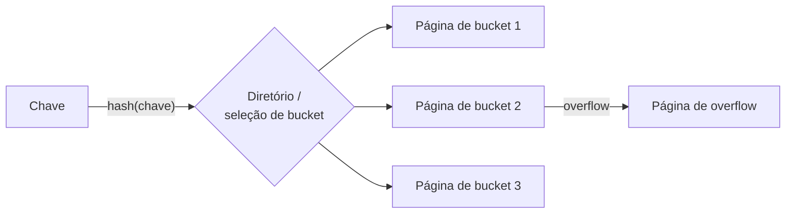

## Objetivos de Aprendizagem

- Explicar por que varrer toda página de um heap file para responder uma busca é inaceitável, motivando os índices em geral.
- Descrever como um índice hash baseado em disco reutiliza a maquinaria de tabela hash em memória, e o que muda quando os buckets são páginas.
- Explicar o overflow de bucket e por que um rehash completo ingênuo é caro demais para uma tabela hash residente em disco.
- Enunciar com precisão quais consultas um índice hash consegue e não consegue responder.

## Contexto e Motivação

Com o armazenamento e o buffer pool construídos, uma consulta como "encontre o funcionário com `id = 4217`" já pode ser respondida: varrendo toda página do heap file de `Employees`, passando cada uma pelo buffer pool e checando cada tupla. Isso funciona, mas custa uma E/S de página por página da tabela, não importa quão seletiva seja a consulta; para uma tabela com um milhão de páginas, são até um milhão de E/Ss para responder uma única busca de uma linha. Um **índice** é uma estrutura de dados separada, construída sobre o conteúdo de um heap file, cujo único propósito é responder exatamente este tipo de busca sem tocar toda página.

`foundations/data-structures-i` já construiu a versão em memória do índice específico que este conceito cobre: `hashing-and-hash-functions` estabeleceu uma função hash que mapeia chaves para posições de bucket em tempo esperado O(1), e `collision-resolution-open-addressing` estabeleceu uma estratégia real para lidar com duas chaves caindo no mesmo bucket. Um **índice hash** é exatamente essa maquinaria, reaplicada com uma mudança estrutural: em vez de os buckets serem posições num array em memória, eles são páginas de disco, buscadas pelo buffer pool como qualquer outra página, e essa única mudança é o que força toda outra decisão de projeto deste conceito.

## Teoria Central

### De buckets em memória para buckets baseados em páginas

Os buckets de uma tabela hash em memória vivem na RAM, então fazer a tabela crescer (mais buckets) ou resolver uma colisão (sondar outra posição do array) não custa essencialmente nada a mais. Os buckets de um índice hash baseado em disco são páginas: resolver uma colisão sondando um bucket vizinho significa uma *E/S de página extra*, e não uma perseguição barata de ponteiro em memória, então um índice hash é construído para tornar as colisões raras dentro de um bucket, em vez de baratas de resolver. A abordagem padrão é uma **página de overflow de bucket**: quando uma página de bucket enche, em vez de sondar em outro lugar, o SGBD encadeia uma página de overflow diretamente a partir do bucket cheio, e uma busca cujo hash cai num bucket cheio simplesmente segue a cadeia de overflow. É um análogo real e amigável ao disco da estratégia de colisão por encadeamento separado, agora encadeando páginas inteiras em vez de entradas individuais.

### Por que uma tabela hash estática não escala em disco

Uma tabela hash dimensionada para `n` buckets no momento da criação se degrada exatamente da forma que `load-factor-and-rehashing` já descreveu quando chaves demais são inseridas: cadeias de overflow longas, e buscas que se degradam de O(1) para O(tamanho da cadeia). A correção em memória, fazer rehash para uma tabela maior, é muito mais cara em disco: um rehash completo significa reler e reescrever toda página de bucket do índice, um custo de E/S enorme a pagar de uma vez só. Sistemas reais evitam isso com **hashing extensível** (um diretório de ponteiros para buckets, dobrado incrementalmente só quando necessário, permitindo que buckets individuais se dividam de forma independente sem tocar todos os outros) ou **hashing linear** (os buckets se dividem um por vez, numa ordem round-robin fixa, conforme a tabela cresce, evitando inteiramente uma estrutura de diretório separada). Os dois fazem o número total de buckets do índice crescer gradualmente, algumas páginas por vez, em vez de jamais reescrever a estrutura inteira numa única operação.

### O que um índice hash consegue e não consegue responder

Um índice hash responde **buscas por igualdade** (`WHERE id = 4217`) em O(1) E/Ss de página esperadas: calcula o hash da chave, salta diretamente para a página de bucket correspondente (seguindo páginas de overflow se necessário), e pronto. Ele não ajuda em nada numa **consulta por intervalo** (`WHERE id BETWEEN 100 AND 200`), porque uma função hash deliberadamente espalha as chaves sem nenhuma relação entre a ordem das chaves e a ordem dos buckets; duas chaves com uma unidade de diferença numericamente podem cair em buckets em extremos opostos do índice, então não há como "andar para frente" por um intervalo sem efetivamente recalcular o hash de toda chave candidata ou recorrer a uma varredura completa. Esta única limitação é exatamente o eixo que o conceito de escolha de índice, mais adiante neste bloco, usa para decidir entre um índice hash e uma B+Tree.

## Exemplos Resolvidos

### Exemplo 1: uma busca por igualdade, sem overflow

Um índice hash sobre `Employees.id` tem 4 buckets (páginas), e `hash(4217) mod 4 = 1`. Uma busca por `id = 4217` calcula o mesmo hash, salta diretamente para a página de bucket 1, varre as entradas dessa única página (tipicamente muito menos que o equivalente a uma página inteira de heap file em tuplas, já que uma entrada de índice é só uma chave + um ponteiro para a tupla de fato, e não a linha inteira) atrás de uma correspondência, e retorna o ponteiro da entrada correspondente para a página de dados de fato: uma ou duas E/Ss de página no total, não importa quantos funcionários existam ao todo.

### Exemplo 2: uma colisão forçando uma página de overflow

A página de bucket 1 já guarda o seu número máximo de entradas de índice quando um novo funcionário com `id = 9001`, cujo hash cai no mesmo bucket 1, é inserido. Em vez de redimensionar o próprio bucket 1, o SGBD aloca uma nova página de overflow, a liga a partir do cabeçalho da página do bucket 1 e insere a nova entrada ali. Uma busca subsequente por `id = 9001` primeiro checa a página primária do bucket 1 (sem correspondência), depois segue a ligação para a página de overflow e a encontra ali: duas E/Ss de página para esta busca em vez de uma, exatamente a degradação que `load-factor-and-rehashing` já previu conforme uma tabela enche.

### Exemplo 3: por que uma consulta por intervalo não consegue usar este índice de forma alguma

O mesmo índice hash sobre `Employees.id`, consultado com `WHERE id BETWEEN 4200 AND 4300`, não pode ser usado de forma produtiva: o hash de `id = 4200` pode cair no bucket 3, o de `id = 4201` no bucket 0, o de `id = 4300` no bucket 2. Não há relação de ordem alguma entre as atribuições de bucket de chaves consecutivas, por projeto (uma boa função hash destrói ativamente qualquer relação desse tipo para manter a carga balanceada). O processador de consultas é forçado a recorrer a uma varredura completa do heap file, ou a usar um índice B+Tree se existir um na mesma coluna, exatamente a escolha para a qual os próximos quatro conceitos constroem.

## Equívocos Comuns e Armadilhas

- **"Um índice hash é sempre a escolha mais rápida, já que buscas por igualdade são O(1)."** A busca por igualdade em tempo esperado O(1) é real, mas é o *único* formato de consulta que um índice hash acelera: qualquer consulta com um predicado de intervalo, um ORDER BY na coluna indexada ou uma correspondência de prefixo não ganha benefício algum de um índice hash e precisa recorrer a uma varredura ou a um índice inteiramente diferente.
- **"Redimensionar um índice hash baseado em disco funciona do mesmo jeito que redimensionar um em memória."** O rehash em memória de `load-factor-and-rehashing` (alocar um array maior, recalcular a posição de toda chave, copiar tudo) é exatamente a operação que o hashing extensível/linear foram construídos para *evitar* em disco, já que significaria reescrever toda página de bucket numa única rajada cara. Todo o projeto dos dois esquemas reais é o crescimento incremental, algumas páginas por vez, especificamente porque o modelo de custo mudou de RAM barata para E/S de disco cara.
- **"O overflow de bucket é um bug a ser eliminado."** O encadeamento de overflow não é um modo de falha a ser eliminado por projeto: é um custo aceito e limitado que índices hash reais toleram em troca de não fazer rehash da estrutura inteira a cada inserção. A pergunta de engenharia real é manter as cadeias de overflow *curtas* (via um bom fator de carga e divisão incremental periódica), e não eliminá-las por completo.

## Resumo

Um índice hash é a tabela hash em memória que `hashing-and-hash-functions` e `collision-resolution-open-addressing` já construíram, reaplicada com páginas de disco como buckets em vez de posições de array, uma mudança que torna o tratamento de colisões (páginas de overflow de bucket, uma variante amigável ao disco do encadeamento separado) e o redimensionamento (hashing extensível ou linear, crescendo incrementalmente em vez de via um único rehash completo e caro) os problemas centrais de engenharia, exatamente porque uma E/S de disco custa ordens de grandeza a mais que uma perseguição de ponteiro em memória. O resultado responde buscas por igualdade em O(1) E/Ss de página esperadas, mas não fornece suporte algum para consultas por intervalo, exatamente a lacuna que a B+Tree, construída nos próximos três conceitos, existe para preencher.

## Documentation Links

- [CMU 15-445/645: Hash Tables Slides](https://15445.courses.cs.cmu.edu/fall2025/slides/07-hashtables.pdf): a fonte do projeto de páginas de overflow de bucket deste conceito e dos esquemas de hashing extensível/linear para fazer crescer incrementalmente um índice hash baseado em disco.
- [Berkeley CS186: Course Notes (Hashing)](https://cs186berkeley.net/notes/): cobre o hashing estático vs. extensível em disco, sustentando o contraste deste conceito entre por que o rehash em memória é barato e o rehash baseado em disco não é.
