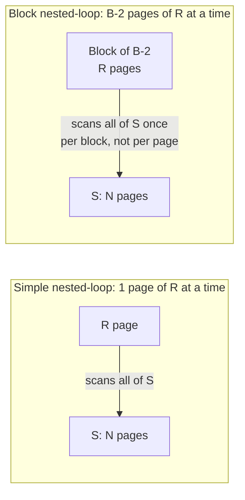

## Learning Objectives

- Implement the tuple-at-a-time and page-at-a-time forms of nested-loop join and explain why the naive version is unacceptably expensive.
- Compute the exact page-I/O cost of a simple (page-at-a-time) nested-loop join given each relation's size in pages.
- Build block nested-loop join by reading a full buffer's worth of outer pages per pass, and compute its cost.
- Explain why choosing the smaller relation as the outer relation matters for both algorithms.

## Context & Motivation

`query-execution-the-iterator-model-and-scans` established that a join is just another physical operator in a plan tree, implementing the same `open()`/`next()`/`close()` interface as a scan — but a join's `next()` is different in one important way: it has *two* children to pull from, `R` and `S`, and has to decide, for each output tuple, which combination of an `R`-tuple and an `S`-tuple to examine next. This concept builds the simplest possible strategy for that decision — try every combination — and shows exactly how much it costs, then fixes the single biggest inefficiency in the naive version.

## Core Theory

### Tuple-at-a-time nested-loop join

The most naive possible join implementation: for every tuple `r` of the **outer** relation `R`, scan the *entire* **inner** relation `S`, checking the join condition against every tuple of `S` in turn.

```
for each tuple r in R:
    for each tuple s in S:
        if match(r, s): emit (r, s)
```

This is correct — it genuinely tries every `(r, s)` pair — but its I/O cost is determined by *tuples*, not pages: if `R` has `m` tuples, this algorithm re-reads all of `S`'s pages once per tuple of `R`, not once per page of `R`. For any table with more than a handful of tuples per page, this cost is wildly higher than necessary, since every tuple sharing a page with the previous one triggers an entirely redundant re-scan of `S`.

### Simple (page-at-a-time) nested-loop join

The first real fix is to loop over **pages**, not tuples, of the outer relation, and — for each outer page — compare every tuple on it against every tuple of each inner page in turn:

```
for each page pr in R:
    for each page ps in S:
        for each tuple r in pr:
            for each tuple s in ps:
                if match(r, s): emit (r, s)
```

Now the cost is exactly `M + (M × N)` page I/Os, where `M` is the number of pages in `R` and `N` is the number of pages in `S`: `M` to read `R` once, and — for each of `R`'s `M` pages — a full re-scan of `S`'s `N` pages. This is a dramatic improvement over the tuple-at-a-time version (which paid that inner re-scan cost once per *tuple*, not once per *page*), but it still re-reads all of `S` once for every single page of `R`, which is the next inefficiency to fix.

### Block nested-loop join

**Block nested-loop join** amortizes the repeated inner-relation scan across an entire *block* of outer pages at once, using the buffer pool's available memory (`B` total buffer frames) to hold as many outer pages as will fit — typically `B − 2` pages, reserving one frame for the current inner page being scanned and one for output:

```
for each block of (B-2) pages of R:
    for each page ps in S:
        for each tuple r in the block:
            for each tuple s in ps:
                if match(r, s): emit (r, s)
```

Now `S` is scanned once per **block** of `R`'s pages, not once per individual page — the cost becomes `M + ⌈M / (B − 2)⌉ × N`. As `B` grows, the number of blocks (and therefore the number of times `S` is re-scanned) shrinks accordingly, converging toward the ideal of scanning `S` exactly once if the entire outer relation fits in a single block.



### Choosing the smaller relation as outer

Both algorithms' costs are asymmetric in `R` and `S` — the outer relation's page count `M` is paid exactly once (read straight through), while the inner relation's page count `N` is paid once *per block* of the outer. Making the **smaller** relation the outer relation minimizes the number of blocks (`⌈M/(B−2)⌉`), and therefore minimizes how many times the (larger) inner relation gets rescanned — a real, concrete optimization decision the query optimizer, two concepts ahead, makes automatically based on each table's known page count.

## Worked Examples

### Example 1 — simple nested-loop join cost on real numbers

Let `R` (the outer relation) have `M = 1,000` pages, and `S` (the inner relation) have `N = 500` pages. Simple (page-at-a-time) nested-loop join costs `M + (M × N) = 1,000 + (1,000 × 500) = 501,000` page I/Os — every one of `R`'s 1,000 pages triggers a full 500-page re-scan of `S`.

### Example 2 — the same join, block nested-loop, with a real buffer size

Using the same `R` (1,000 pages) and `S` (500 pages), suppose `B = 22` buffer frames are available, so each block holds `B − 2 = 20` pages of `R`. The number of blocks is `⌈1,000 / 20⌉ = 50`. Cost is `M + ⌈M/(B−2)⌉ × N = 1,000 + (50 × 500) = 26,000` page I/Os — roughly **19× fewer I/Os** than Example 1's simple nested-loop join, purely from reading `R` in chunks of 20 pages instead of one page at a time, with no change at all to the join *logic* itself.

### Example 3 — why swapping outer and inner matters

Suppose the roles in Example 2 were reversed — `S` (500 pages) as the outer relation, `R` (1,000 pages) as the inner — using the same buffer, so each block now holds 20 pages of `S`. The number of blocks becomes `⌈500/20⌉ = 25`, and the cost is `500 + (25 × 1,000) = 25,500` page I/Os — very close to, but in this specific case slightly cheaper than, Example 2's `26,000`, because 500 does not divide evenly by 20 as cleanly relative to `R`'s size. In general the win from choosing the smaller relation as outer grows sharply as the size *gap* between the two relations widens — with a highly skewed size ratio (e.g., a 10-page table joined against a 100,000-page table), always making the tiny table the outer relation keeps the number of blocks at 1, making the larger table's `N` cost paid only once total, instead of potentially thousands of times.

## Common Misconceptions & Pitfalls

- **"Nested-loop join's cost is dominated by the number of tuples, not pages."** Once the algorithm is written page-at-a-time (Example 1) rather than tuple-at-a-time, the cost formula is expressed entirely in terms of page counts (`M`, `N`), not tuple counts — the *number of tuples per page* only matters insofar as it determines how many pages a relation occupies, not as a separate term in the I/O cost formula itself.
- **"Blocking just makes the same amount of work happen faster."** Block nested-loop join genuinely reduces the *total number of page I/Os* performed, not just the wall-clock time of the same I/O count — Example 2's 26,000 I/Os versus Example 1's 501,000 for the identical join result is a real, nearly 20× reduction in actual disk operations, not a constant-factor speedup from batching.
- **"It never matters which relation is 'outer' as long as both get fully joined."** The final *result* of the join is identical regardless of which relation is chosen as outer — but the real I/O *cost* is not symmetric, exactly as Example 3 shows; a query optimizer that ignores this and picks the larger relation as outer pays a real, measurable, and entirely avoidable I/O penalty.

## Summary

Tuple-at-a-time nested-loop join is correct but re-scans the entire inner relation once per *tuple* of the outer relation — an unnecessarily expensive cost driven by tuple count rather than page count. Rewriting the loop page-at-a-time fixes that, giving a simple nested-loop join cost of `(pages of R) × (pages of S)` page fetches (plus reading R once) — and block nested-loop join improves on that further by reading the outer relation a full buffer's worth of pages at a time, amortizing the inner relation's re-scan cost across an entire block instead of a single page, exactly as the two real worked examples above show (501,000 I/Os down to 26,000 for the identical join, using only a modest, realistic buffer size). Choosing the smaller relation as the outer additionally minimizes the number of blocks, and therefore the number of times the larger relation is re-scanned — a concrete lever the query optimizer, two concepts ahead, uses automatically.

## Documentation Links

- [CMU 15-445/645 — Schedule (Joins Algorithms)](https://15445.courses.cs.cmu.edu/fall2026/schedule.html) — the course schedule confirming the tuple-at-a-time, simple, and block nested-loop join progression this concept builds and costs out.
- [Database System Concepts (Silberschatz, Korth, Sudarshan) — Companion Site](https://www.db-book.com/) — the standard textbook treatment of nested-loop join cost formulas, useful for cross-checking the page-I/O arithmetic worked through in this concept's examples.
