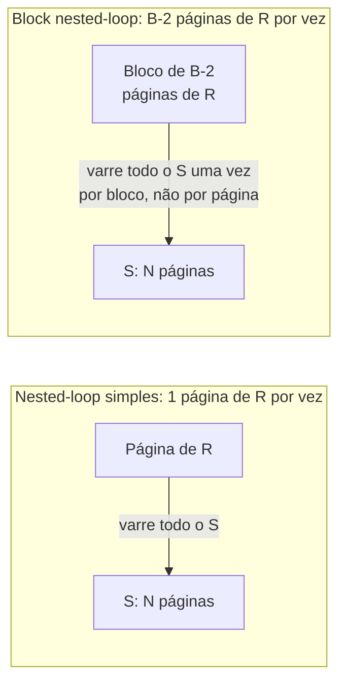

## Objetivos de Aprendizagem

- Implementar as formas uma tupla por vez e uma página por vez do nested-loop join e explicar por que a versão ingênua é inaceitavelmente cara.
- Calcular o custo exato de E/S de páginas de um nested-loop join simples (uma página por vez) dado o tamanho de cada relação em páginas.
- Construir o block nested-loop join lendo o equivalente a um buffer inteiro de páginas externas a cada passada, e calcular o seu custo.
- Explicar por que escolher a relação menor como relação externa importa para os dois algoritmos.

## Contexto e Motivação

`query-execution-the-iterator-model-and-scans` estabeleceu que um join é só mais um operador físico numa árvore de plano, implementando a mesma interface `open()`/`next()`/`close()` de uma varredura, mas o `next()` de um join é diferente de uma forma importante: ele tem *dois* filhos dos quais puxar, `R` e `S`, e precisa decidir, para cada tupla de saída, qual combinação de uma tupla de `R` e uma tupla de `S` examinar em seguida. Este conceito constrói a estratégia mais simples possível para essa decisão (tentar toda combinação) e mostra exatamente quanto ela custa, e depois conserta a maior ineficiência isolada da versão ingênua.

## Teoria Central

### Nested-loop join uma tupla por vez

A implementação de join mais ingênua possível: para cada tupla `r` da relação **externa** `R`, varrer a relação **interna** `S` *inteira*, checando a condição de join contra cada tupla de `S` por vez.

```
for each tuple r in R:
    for each tuple s in S:
        if match(r, s): emit (r, s)
```

Isto é correto (genuinamente tenta todo par `(r, s)`), mas o seu custo de E/S é determinado por *tuplas*, e não por páginas: se `R` tem `m` tuplas, este algoritmo relê todas as páginas de `S` uma vez por tupla de `R`, e não uma vez por página de `R`. Para qualquer tabela com mais que um punhado de tuplas por página, este custo é absurdamente maior que o necessário, já que toda tupla que compartilha uma página com a anterior dispara uma revarredura de `S` inteiramente redundante.

### Nested-loop join simples (uma página por vez)

A primeira correção real é iterar sobre **páginas**, e não tuplas, da relação externa e, para cada página externa, comparar cada tupla dela com cada tupla de cada página interna por vez:

```
for each page pr in R:
    for each page ps in S:
        for each tuple r in pr:
            for each tuple s in ps:
                if match(r, s): emit (r, s)
```

Agora o custo é exatamente `M + (M × N)` E/Ss de página, onde `M` é o número de páginas de `R` e `N` é o número de páginas de `S`: `M` para ler `R` uma vez e, para cada uma das `M` páginas de `R`, uma revarredura completa das `N` páginas de `S`. Esta é uma melhoria drástica em relação à versão uma tupla por vez (que pagava esse custo de revarredura interna uma vez por *tupla*, e não uma vez por *página*), mas ainda relê todo o `S` uma vez para cada página de `R`, que é a próxima ineficiência a consertar.

### Block nested-loop join

O **block nested-loop join** amortiza a varredura repetida da relação interna por um *bloco* inteiro de páginas externas de uma vez, usando a memória disponível do buffer pool (`B` frames de buffer no total) para guardar tantas páginas externas quantas couberem, tipicamente `B − 2` páginas, reservando um frame para a página interna atual sendo varrida e um para a saída:

```
for each block of (B-2) pages of R:
    for each page ps in S:
        for each tuple r in the block:
            for each tuple s in ps:
                if match(r, s): emit (r, s)
```

Agora `S` é varrida uma vez por **bloco** de páginas de `R`, e não uma vez por página individual; o custo se torna `M + ⌈M / (B − 2)⌉ × N`. Conforme `B` cresce, o número de blocos (e portanto o número de vezes que `S` é revarrida) encolhe de acordo, convergindo para o ideal de varrer `S` exatamente uma vez se a relação externa inteira couber num único bloco.



### Escolhendo a relação menor como externa

Os custos dos dois algoritmos são assimétricos em `R` e `S`: a contagem de páginas `M` da relação externa é paga exatamente uma vez (lida direto do começo ao fim), enquanto a contagem de páginas `N` da relação interna é paga uma vez *por bloco* da externa. Fazer da relação **menor** a relação externa minimiza o número de blocos (`⌈M/(B−2)⌉`) e, portanto, minimiza quantas vezes a relação interna (maior) é revarrida, uma decisão real e concreta de otimização que o otimizador de consultas, dois conceitos adiante, toma automaticamente com base na contagem de páginas conhecida de cada tabela.

## Exemplos Resolvidos

### Exemplo 1: custo do nested-loop join simples com números reais

Seja `R` (a relação externa) com `M = 1.000` páginas, e `S` (a relação interna) com `N = 500` páginas. O nested-loop join simples (uma página por vez) custa `M + (M × N) = 1.000 + (1.000 × 500) = 501.000` E/Ss de página: cada uma das 1.000 páginas de `R` dispara uma revarredura completa de 500 páginas de `S`.

### Exemplo 2: o mesmo join, block nested-loop, com um tamanho de buffer real

Usando os mesmos `R` (1.000 páginas) e `S` (500 páginas), suponha que `B = 22` frames de buffer estão disponíveis, então cada bloco guarda `B − 2 = 20` páginas de `R`. O número de blocos é `⌈1.000 / 20⌉ = 50`. O custo é `M + ⌈M/(B−2)⌉ × N = 1.000 + (50 × 500) = 26.000` E/Ss de página: cerca de **19× menos E/Ss** que o nested-loop join simples do Exemplo 1, puramente por ler `R` em pedaços de 20 páginas em vez de uma página por vez, sem mudança alguma na *lógica* do join em si.

### Exemplo 3: por que trocar externa e interna importa

Suponha que os papéis do Exemplo 2 fossem invertidos (`S`, com 500 páginas, como a relação externa, e `R`, com 1.000 páginas, como a interna) usando o mesmo buffer, então cada bloco agora guarda 20 páginas de `S`. O número de blocos se torna `⌈500/20⌉ = 25`, e o custo é `500 + (25 × 1.000) = 25.500` E/Ss de página: muito próximo, mas neste caso específico ligeiramente mais barato que os `26.000` do Exemplo 2. Em geral, o ganho de escolher a relação menor como externa cresce acentuadamente conforme a *diferença* de tamanho entre as duas relações aumenta: com uma razão de tamanho muito desproporcional (ex.: uma tabela de 10 páginas unida a uma de 100.000 páginas), fazer sempre da tabela minúscula a relação externa mantém o número de blocos em 1, fazendo o custo `N` da tabela maior ser pago só uma vez no total, em vez de potencialmente milhares de vezes.

## Equívocos Comuns e Armadilhas

- **"O custo do nested-loop join é dominado pelo número de tuplas, e não de páginas."** Uma vez que o algoritmo é escrito uma página por vez (Exemplo 1) em vez de uma tupla por vez, a fórmula de custo é expressa inteiramente em termos de contagens de páginas (`M`, `N`), e não de contagens de tuplas. O *número de tuplas por página* só importa na medida em que determina quantas páginas uma relação ocupa, e não como um termo separado na própria fórmula de custo de E/S.
- **"O bloqueio só faz a mesma quantidade de trabalho acontecer mais rápido."** O block nested-loop join genuinamente reduz o *número total de E/Ss de página* realizadas, e não só o tempo de relógio da mesma contagem de E/S: as 26.000 E/Ss do Exemplo 2 contra as 501.000 do Exemplo 1, para o mesmo resultado de join, são uma redução real de quase 20× em operações de disco de fato, e não um ganho de fator constante por agrupamento.
- **"Nunca importa qual relação é a 'externa', desde que as duas sejam unidas por completo."** O *resultado* final do join é idêntico independentemente de qual relação é escolhida como externa, mas o *custo* real de E/S não é simétrico, exatamente como o Exemplo 3 mostra; um otimizador de consultas que ignore isso e escolha a relação maior como externa paga uma penalidade de E/S real, mensurável e inteiramente evitável.

## Resumo

O nested-loop join uma tupla por vez é correto, mas revarre a relação interna inteira uma vez por *tupla* da relação externa, um custo desnecessariamente caro guiado pela contagem de tuplas, e não de páginas. Reescrever o loop uma página por vez conserta isso, dando ao nested-loop join simples um custo de `(páginas de R) × (páginas de S)` buscas de página (mais ler R uma vez), e o block nested-loop join melhora ainda mais isso lendo a relação externa o equivalente a um buffer inteiro de páginas por vez, amortizando o custo de revarredura da relação interna por um bloco inteiro em vez de uma única página, exatamente como os dois exemplos reais acima mostram (de 501.000 E/Ss para 26.000 para o mesmo join, usando só um tamanho de buffer modesto e realista). Escolher a relação menor como externa adicionalmente minimiza o número de blocos e, portanto, o número de vezes que a relação maior é revarrida, uma alavanca concreta que o otimizador de consultas, dois conceitos adiante, usa automaticamente.

## Documentation Links

- [CMU 15-445/645: Schedule (Joins Algorithms)](https://15445.courses.cs.cmu.edu/fall2026/schedule.html): o calendário do curso que confirma a progressão de nested-loop join uma tupla por vez, simples e em blocos que este conceito constrói e cujo custo calcula.
- [Database System Concepts (Silberschatz, Korth, Sudarshan): Companion Site](https://www.db-book.com/): o tratamento padrão de livro-texto das fórmulas de custo do nested-loop join, útil para conferir a aritmética de E/S de páginas percorrida nos exemplos deste conceito.
