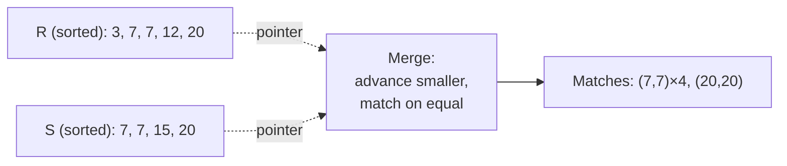
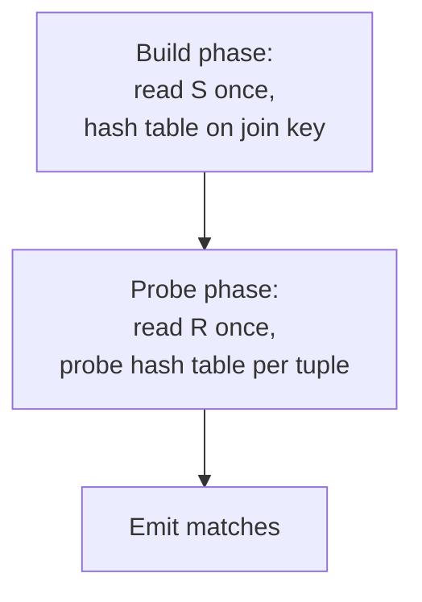

## Learning Objectives

- Explain how sort-merge join reuses the merge step of external merge sort, and compute its cost both when inputs are already sorted and when they must be sorted first.
- Explain the build and probe phases of hash join and compute its cost when the build side fits in the buffer pool.
- Compare the real, concrete costs of block nested-loop, sort-merge, and hash join on the same dataset.
- State the real trade-off between sort-merge and hash join: sortedness/output order versus memory pressure on the build side.

## Context & Motivation

`join-algorithms-nested-loop-and-block-nested-loop` built block nested-loop join and showed it costs `M + ⌈M/(B−2)⌉ × N` page I/Os on a 1,000-page/500-page dataset — a real, working join algorithm, but one that pays a cost proportional to the *product* of the two relations' sizes (mitigated, not eliminated, by blocking). This concept builds the two algorithms real systems actually reach for when a much better cost is available: **sort-merge join**, which reuses the exact merge step `algorithms-software/algorithms`'s `merge-sort-revisited` already built, and **hash join**, which builds an in-memory hash table on one relation and probes it with the other. Both, under the right conditions, cost close to `M + N` — linear in the total size of the two inputs, not their product.

## Core Theory

### Sort-merge join: reusing the merge step

If both relations are already sorted on the join key — or are sorted first, using **external merge sort** (the exact same merge operation `merge-sort-revisited` built for in-memory sorting, generalized to work on sorted runs of pages too large to fit in memory at once, merging multiple sorted runs from disk the same way that algorithm merges two sorted in-memory arrays) — sort-merge join walks both sorted streams forward together with two pointers, exactly like the merge step of merge sort: compare the current key from each side; if they're equal, emit the matched pair(s) and advance; if one side's key is smaller, advance only that side. Because both inputs are sorted, no tuple is ever revisited, and each relation is read through exactly once during the merge phase itself.

### Cost of sort-merge join

If both `R` (`M` pages) and `S` (`N` pages) are **already sorted** on the join key (for instance, because a clustered B+Tree index already stores them that way), the merge phase alone costs `M + N` page I/Os — one pass through each relation. If they are **not** already sorted, each must first be externally sorted, at a real, well-defined cost: for a relation of `P` pages with `B` buffer frames available, external merge sort costs `2 × P × passes` page I/Os, where `passes = 1` (the initial pass, sorting `B`-page runs in memory) `+ ⌈log_{B−1}(P/B)⌉` (the number of merge passes needed to combine those runs, each pass reading and writing every page once, using `B−1` frames as merge-fan-in and one for output). The full sort-merge join cost is then the sum of sorting both relations (if needed) plus the final `M + N` merge pass.

### Hash join: build and probe

**Hash join** takes an entirely different approach: build phase — read the smaller relation (the **build side**) once, computing a hash of the join key for each tuple and inserting it into an in-memory hash table; probe phase — read the larger relation (the **probe side**) once, hashing each of *its* join keys and probing the hash table for matches, emitting every match found. When the build side's hash table fits entirely within the available buffer-pool memory, this costs exactly `M + N` page I/Os — one full pass over each relation, with no sorting step at all.

If the build side does **not** fit in the buffer pool, a simple in-memory hash table isn't possible, and real systems fall back to **grace hash join**: both relations are first partitioned into smaller buckets using a hash function on the join key (writing each bucket to disk), so that corresponding buckets from each relation are guaranteed to hold all of that bucket's matching tuples and are individually small enough to join in memory — adding a full extra read-and-write pass over both relations before the actual build/probe step, roughly tripling the simple case's `M + N` cost.

### The real trade-off

Sort-merge join wins decisively when an input is **already sorted** (no sort cost to pay at all) or when the query needs its **output in sorted order** (sort-merge produces sorted output for free, as a side effect of merging two sorted streams; hash join's output order is essentially arbitrary, determined by hash-bucket layout). Hash join wins in essentially every other case, **unless** the build side is too large to fit in the buffer pool, in which case grace hash join's extra partitioning passes narrow or eliminate its advantage over sort-merge.

## Worked Examples

### Example 1 — sort-merge join, both relations already sorted

Reusing the exact dataset from the previous concept — `R` at `M = 1,000` pages, `S` at `N = 500` pages — suppose both are already sorted on the join key (e.g., via a clustered B+Tree index on that column). Sort-merge join's cost is just the merge pass: `M + N = 1,000 + 500 = 1,500` page I/Os. Compare this to block nested-loop join's `26,000` I/Os (with `B = 22`, from the previous concept's Example 2) on the identical dataset — over **17× fewer I/Os**, entirely because no sorting had to be done from scratch.

### Example 2 — sort-merge join, sorting from scratch

Same `R` and `S`, but neither is sorted, with `B = 22` buffer frames available. For `S` (`N = 500` pages): pass 0 creates `⌈500/22⌉ = 23` sorted runs; merge passes needed = `⌈log_{21}(23)⌉ = 2`; total passes = `1 + 2 = 3`; cost = `2 × 500 × 3 = 3,000` I/Os. For `R` (`M = 1,000` pages): pass 0 creates `⌈1,000/22⌉ = 46` runs; merge passes = `⌈log_{21}(46)⌉ = 2`; total passes = `3`; cost = `2 × 1,000 × 3 = 6,000` I/Os. Adding the final merge pass (`1,500` I/Os, as in Example 1): total sort-merge join cost from scratch = `6,000 + 3,000 + 1,500 = 10,500` I/Os — still less than half of block nested-loop join's `26,000`, even paying the full sorting cost for both relations from nothing.

### Example 3 — hash join versus sort-merge from scratch

Same dataset, and suppose `S` (the smaller relation, `500` pages) is chosen as the build side and fits entirely in the available buffer-pool memory as a hash table. Hash join's cost is `M + N = 1,000 + 500 = 1,500` page I/Os — identical to Example 1's already-sorted merge cost, and **7× cheaper** than Example 2's `10,500`-I/O sort-from-scratch cost, because hash join never pays any sorting cost at all. If instead `S` did *not* fit in memory and grace hash join's partitioning step were required, the cost would rise to roughly `3 × (M + N) = 4,500` I/Os (one partitioning pass plus the build/probe pass) — still meaningfully cheaper than sort-merge from scratch's `10,500`, which is exactly why hash join is the default choice in most real systems unless the query specifically needs sorted output or an input happens to already be sorted.

## Common Misconceptions & Pitfalls

- **"Sort-merge join is obsolete now that hash join exists."** Example 1 shows the case where sort-merge wins outright: when an input is already sorted (a clustered index, or output from a previous sort-requiring operator like `ORDER BY`), sort-merge pays zero sorting cost and matches hash join's best case exactly — and if the query itself needs sorted output, sort-merge produces it for free while hash join would need an extra sort step afterward.
- **"Hash join always costs M + N."** `M + N` is hash join's cost only when the build side fits entirely in the buffer pool's available memory; when it doesn't, grace hash join's partitioning step adds real extra I/O (Example 3's `4,500` versus `1,500`) — the simple formula is a best case, not a guarantee independent of memory pressure.
- **"Sort-merge join and merge sort are merely similar, not the same algorithm."** The merge *step* is literally identical — advance the pointer on whichever side has the smaller current key, emit on equality — the only difference is what's done on a match (merge sort simply keeps the smaller element; sort-merge join emits a joined output tuple) and that the "arrays" being merged may be entire relations' worth of pages read from disk in sorted runs rather than in-memory arrays.

## Summary

Sort-merge join reuses exactly the merge step `merge-sort-revisited` already built, applied to two relations that are already sorted (or externally sorted first, at a real and computable cost) — walking both sorted streams forward together and matching on equal keys. Hash join instead builds an in-memory hash table on the smaller relation and probes it once per tuple of the larger relation, costing `M + N` I/Os whenever the build side fits in memory. On the same 1,000-page/500-page dataset used throughout this cluster, sort-merge costs `1,500` I/Os when already sorted or `10,500` from scratch, and hash join costs `1,500` in its best case or roughly `4,500` when the build side must be partitioned — all dramatically cheaper than block nested-loop join's `26,000`, with the real remaining choice between the two coming down to whether an input is already sorted or sorted output is required (favoring sort-merge) versus everything else (favoring hash join, unless the build side cannot fit in the buffer pool).

## Documentation Links

- [CMU 15-445/645 — Schedule (Sorting & Aggregations, Joins Algorithms)](https://15445.courses.cs.cmu.edu/fall2026/schedule.html) — the course schedule confirming the external-merge-sort cost formula and the sort-merge/hash join progression built and costed out in this concept.
- [Database System Concepts (Silberschatz, Korth, Sudarshan) — Companion Site](https://www.db-book.com/) — the standard textbook treatment of sort-merge and hash join, useful for cross-checking the build/probe mechanics and cost formulas worked through in this concept's examples.
