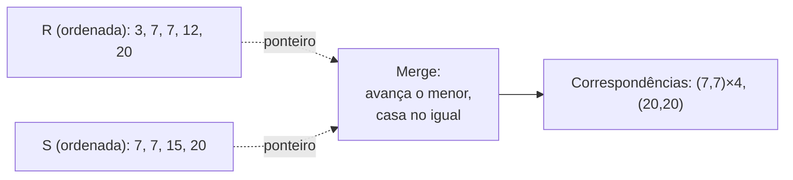
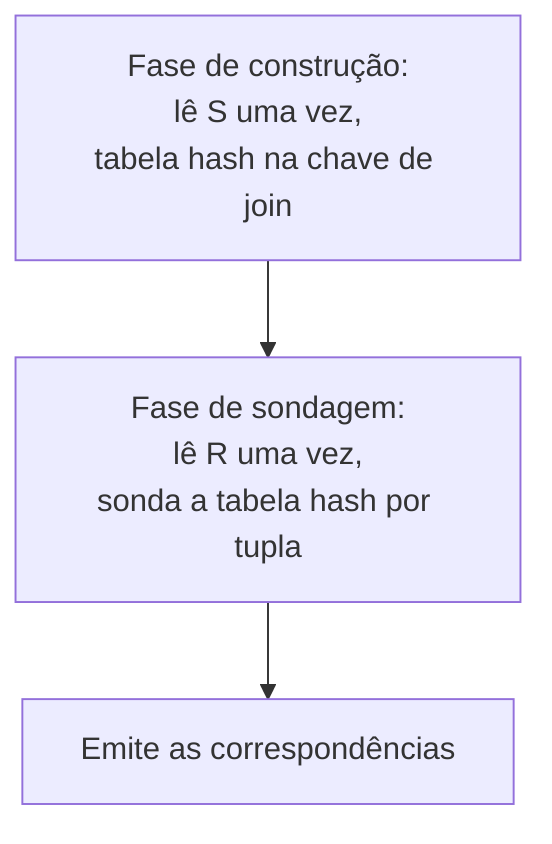

## Objetivos de Aprendizagem

- Explicar como o sort-merge join reutiliza o passo de merge do merge sort externo, e calcular o seu custo tanto quando as entradas já estão ordenadas quanto quando precisam ser ordenadas antes.
- Explicar as fases de construção (build) e sondagem (probe) do hash join e calcular o seu custo quando o lado de construção cabe no buffer pool.
- Comparar os custos reais e concretos do block nested-loop, do sort-merge e do hash join sobre o mesmo conjunto de dados.
- Enunciar o trade-off real entre sort-merge e hash join: ordenação/ordem da saída versus pressão de memória sobre o lado de construção.

## Contexto e Motivação

`join-algorithms-nested-loop-and-block-nested-loop` construiu o block nested-loop join e mostrou que ele custa `M + ⌈M/(B−2)⌉ × N` E/Ss de página num conjunto de dados de 1.000 e 500 páginas: um algoritmo de join real e funcional, mas que paga um custo proporcional ao *produto* dos tamanhos das duas relações (mitigado, não eliminado, pelo bloqueio). Este conceito constrói os dois algoritmos aos quais sistemas reais de fato recorrem quando um custo muito melhor está disponível: o **sort-merge join**, que reutiliza o exato passo de merge que `merge-sort-revisited`, de `algorithms-software/algorithms`, já construiu, e o **hash join**, que constrói uma tabela hash em memória sobre uma relação e a sonda com a outra. Os dois, nas condições certas, custam perto de `M + N`: linear no tamanho total das duas entradas, e não no seu produto.

## Teoria Central

### Sort-merge join: reutilizando o passo de merge

Se as duas relações já estão ordenadas pela chave de join (ou são ordenadas antes, usando o **merge sort externo**: exatamente a mesma operação de merge que `merge-sort-revisited` construiu para a ordenação em memória, generalizada para funcionar sobre sequências ordenadas de páginas grandes demais para caber na memória de uma vez, mesclando múltiplas sequências ordenadas do disco da mesma forma que aquele algoritmo mescla dois arrays ordenados em memória), o sort-merge join percorre os dois fluxos ordenados para frente juntos com dois ponteiros, exatamente como o passo de merge do merge sort: compara a chave atual de cada lado; se forem iguais, emite o(s) par(es) casado(s) e avança; se a chave de um lado for menor, avança só esse lado. Como as duas entradas estão ordenadas, nenhuma tupla é jamais revisitada, e cada relação é lida exatamente uma vez durante a própria fase de merge.

### Custo do sort-merge join

Se tanto `R` (`M` páginas) quanto `S` (`N` páginas) **já estão ordenadas** pela chave de join (por exemplo, porque um índice B+Tree clusterizado já as guarda assim), só a fase de merge custa `M + N` E/Ss de página: uma passada por cada relação. Se elas **não** estão ordenadas, cada uma precisa ser ordenada externamente antes, a um custo real e bem definido: para uma relação de `P` páginas com `B` frames de buffer disponíveis, o merge sort externo custa `2 × P × passes` E/Ss de página, onde `passes = 1` (a passada inicial, ordenando sequências de `B` páginas em memória) `+ ⌈log_{B−1}(P/B)⌉` (o número de passadas de merge necessárias para combinar essas sequências, cada passada lendo e escrevendo toda página uma vez, usando `B−1` frames como fan-in do merge e um para a saída). O custo completo do sort-merge join é então a soma da ordenação das duas relações (se necessária) mais a passada final de merge de `M + N`.

### Hash join: construção e sondagem

O **hash join** adota uma abordagem inteiramente diferente. Fase de construção: lê a relação menor (o **lado de construção**) uma vez, calculando um hash da chave de join para cada tupla e inserindo-a numa tabela hash em memória. Fase de sondagem: lê a relação maior (o **lado de sondagem**) uma vez, calculando o hash de cada uma das *suas* chaves de join e sondando a tabela hash atrás de correspondências, emitindo toda correspondência encontrada. Quando a tabela hash do lado de construção cabe inteiramente na memória disponível do buffer pool, isso custa exatamente `M + N` E/Ss de página: uma passada completa por cada relação, sem passo de ordenação algum.

Se o lado de construção **não** cabe no buffer pool, uma tabela hash simples em memória não é possível, e sistemas reais recorrem ao **grace hash join**: as duas relações são primeiro particionadas em buckets menores usando uma função hash sobre a chave de join (escrevendo cada bucket no disco), de modo que os buckets correspondentes de cada relação tenham garantia de guardar todas as tuplas correspondentes daquele bucket e sejam individualmente pequenos o suficiente para fazer o join em memória. Isso acrescenta uma passada extra completa de leitura e escrita sobre as duas relações antes do passo de construção/sondagem de fato, aproximadamente triplicando o custo `M + N` do caso simples.

### O trade-off real

O sort-merge join vence de forma decisiva quando uma entrada **já está ordenada** (nenhum custo de ordenação a pagar) ou quando a consulta precisa da sua **saída em ordem** (o sort-merge produz saída ordenada de graça, como efeito colateral de mesclar dois fluxos ordenados; a ordem da saída do hash join é essencialmente arbitrária, determinada pelo layout dos buckets de hash). O hash join vence em essencialmente todo outro caso, **a menos que** o lado de construção seja grande demais para caber no buffer pool, caso em que as passadas extras de particionamento do grace hash join estreitam ou eliminam a sua vantagem sobre o sort-merge.

## Exemplos Resolvidos

### Exemplo 1: sort-merge join, as duas relações já ordenadas

Reutilizando exatamente o conjunto de dados do conceito anterior (`R` com `M = 1.000` páginas, `S` com `N = 500` páginas), suponha que as duas já estejam ordenadas pela chave de join (ex.: via um índice B+Tree clusterizado naquela coluna). O custo do sort-merge join é só a passada de merge: `M + N = 1.000 + 500 = 1.500` E/Ss de página. Compare com as `26.000` E/Ss do block nested-loop join (com `B = 22`, do Exemplo 2 do conceito anterior) sobre o conjunto de dados idêntico: mais de **17× menos E/Ss**, inteiramente porque nenhuma ordenação precisou ser feita do zero.

### Exemplo 2: sort-merge join, ordenando do zero

Mesmos `R` e `S`, mas nenhuma está ordenada, com `B = 22` frames de buffer disponíveis. Para `S` (`N = 500` páginas): a passada 0 cria `⌈500/22⌉ = 23` sequências ordenadas; passadas de merge necessárias = `⌈log_{21}(23)⌉ = 2`; passadas totais = `1 + 2 = 3`; custo = `2 × 500 × 3 = 3.000` E/Ss. Para `R` (`M = 1.000` páginas): a passada 0 cria `⌈1.000/22⌉ = 46` sequências; passadas de merge = `⌈log_{21}(46)⌉ = 2`; passadas totais = `3`; custo = `2 × 1.000 × 3 = 6.000` E/Ss. Somando a passada final de merge (`1.500` E/Ss, como no Exemplo 1): custo total do sort-merge join do zero = `6.000 + 3.000 + 1.500 = 10.500` E/Ss, ainda menos da metade das `26.000` do block nested-loop join, mesmo pagando o custo completo de ordenação das duas relações a partir do nada.

### Exemplo 3: hash join versus sort-merge do zero

Mesmo conjunto de dados, e suponha que `S` (a relação menor, `500` páginas) seja escolhida como o lado de construção e caiba inteiramente na memória disponível do buffer pool como uma tabela hash. O custo do hash join é `M + N = 1.000 + 500 = 1.500` E/Ss de página: idêntico ao custo de merge já ordenado do Exemplo 1, e **7× mais barato** que o custo de ordenar do zero do Exemplo 2, de `10.500` E/Ss, porque o hash join nunca paga custo de ordenação algum. Se, em vez disso, `S` *não* coubesse na memória e o passo de particionamento do grace hash join fosse necessário, o custo subiria para aproximadamente `3 × (M + N) = 4.500` E/Ss (uma passada de particionamento mais a passada de construção/sondagem), ainda significativamente mais barato que as `10.500` do sort-merge do zero, e é exatamente por isso que o hash join é a escolha padrão na maioria dos sistemas reais, a menos que a consulta precise especificamente de saída ordenada ou que uma entrada calhe de já estar ordenada.

## Equívocos Comuns e Armadilhas

- **"O sort-merge join é obsoleto agora que o hash join existe."** O Exemplo 1 mostra o caso em que o sort-merge vence de imediato: quando uma entrada já está ordenada (um índice clusterizado, ou a saída de um operador anterior que exige ordenação, como `ORDER BY`), o sort-merge paga custo de ordenação zero e iguala exatamente o melhor caso do hash join, e se a própria consulta precisa de saída ordenada, o sort-merge a produz de graça, enquanto o hash join precisaria de um passo de ordenação extra depois.
- **"O hash join sempre custa M + N."** `M + N` é o custo do hash join só quando o lado de construção cabe inteiramente na memória disponível do buffer pool; quando não cabe, o passo de particionamento do grace hash join acrescenta E/S extra real (as `4.500` contra `1.500` do Exemplo 3). A fórmula simples é um melhor caso, e não uma garantia independente da pressão de memória.
- **"Sort-merge join e merge sort são só parecidos, e não o mesmo algoritmo."** O *passo* de merge é literalmente idêntico (avançar o ponteiro do lado que tem a menor chave atual, emitir na igualdade); a única diferença é o que se faz numa correspondência (o merge sort simplesmente mantém o elemento menor; o sort-merge join emite uma tupla de saída unida) e que os "arrays" sendo mesclados podem ser relações inteiras de páginas lidas do disco em sequências ordenadas, em vez de arrays em memória.

## Resumo

O sort-merge join reutiliza exatamente o passo de merge que `merge-sort-revisited` já construiu, aplicado a duas relações que já estão ordenadas (ou ordenadas externamente antes, a um custo real e calculável), percorrendo os dois fluxos ordenados para frente juntos e casando nas chaves iguais. O hash join, em vez disso, constrói uma tabela hash em memória sobre a relação menor e a sonda uma vez por tupla da relação maior, custando `M + N` E/Ss sempre que o lado de construção cabe na memória. Sobre o mesmo conjunto de dados de 1.000 e 500 páginas usado ao longo deste bloco, o sort-merge custa `1.500` E/Ss quando já ordenado ou `10.500` do zero, e o hash join custa `1.500` no seu melhor caso ou aproximadamente `4.500` quando o lado de construção precisa ser particionado, todos drasticamente mais baratos que as `26.000` do block nested-loop join. A escolha real restante entre os dois se resume a se uma entrada já está ordenada ou se a saída ordenada é exigida (favorecendo o sort-merge) versus todo o resto (favorecendo o hash join, a menos que o lado de construção não caiba no buffer pool).

## Documentation Links

- [CMU 15-445/645: Schedule (Sorting & Aggregations, Joins Algorithms)](https://15445.courses.cs.cmu.edu/fall2026/schedule.html): o calendário do curso que confirma a fórmula de custo do merge sort externo e a progressão de sort-merge/hash join construída e calculada neste conceito.
- [Database System Concepts (Silberschatz, Korth, Sudarshan): Companion Site](https://www.db-book.com/): o tratamento padrão de livro-texto do sort-merge e do hash join, útil para conferir a mecânica de construção/sondagem e as fórmulas de custo percorridas nos exemplos deste conceito.
