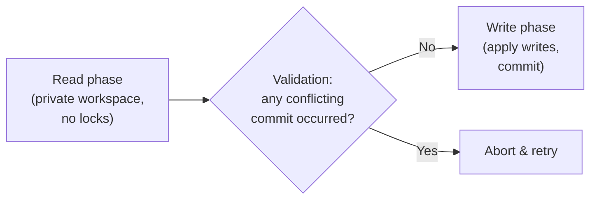
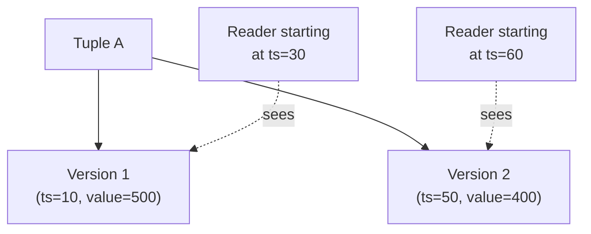

## Learning Objectives

- Explain why locking is a pessimistic strategy, and what an optimistic alternative trades in exchange.
- Describe Optimistic Concurrency Control's three phases (read, validate, write) and trace a validation conflict causing a real abort-and-retry.
- Describe Multi-Version Concurrency Control's core idea — multiple timestamped tuple versions, readers routed by start time — and explain why a reader under MVCC never blocks on a writer.
- Connect MVCC to the real mechanism behind snapshot isolation in a production system.

## Context & Motivation

Every mechanism built since `two-phase-locking-and-conflict-serializability` has been **pessimistic**: it assumes conflicts between concurrent transactions are common enough to be worth paying an up-front coordination cost for, on every single read and write, via locks acquired before touching any data. `isolation-levels-and-what-serializable-guarantees` closed by noting that this coordination cost is real and sometimes unnecessary — this concept builds the two real alternatives production systems reach for instead, both of which avoid blocking a reader on a writer at all: **Optimistic Concurrency Control (OCC)**, which pays the coordination cost only at commit time, and **Multi-Version Concurrency Control (MVCC)**, which sidesteps blocking entirely by keeping more than one version of each tuple around at once.

Notably, `disk-based-storage-pages-and-tuples` already planted the exact hook MVCC needs: that concept's tuple-header discussion mentioned a per-tuple "visibility/transaction timestamp," explicitly flagged as "relevant again once the concurrency-control cluster of this discipline introduces multi-version concurrency control" — this is that moment.

## Core Theory

### Locking is pessimistic; OCC is optimistic

2PL acquires a lock *before* reading or writing anything, on the assumption that a conflicting concurrent transaction might show up at any moment — paying that coordination cost on every operation, whether or not a real conflict ever actually occurs. **Optimistic Concurrency Control** instead assumes conflicts are the exception, not the rule: a transaction reads and computes freely, with no locking at all, and pays the coordination cost exactly once, at commit time, by checking whether any concurrent transaction actually did conflict with it.

### OCC's three phases

OCC structures every transaction into three phases:

1. **Read phase** — the transaction reads whatever data it needs (recording exactly what it read and the values/versions it saw) and computes its intended writes entirely in a private, transaction-local workspace, without touching the shared database or acquiring any lock.
2. **Validation phase** — at the point the transaction wants to commit, the system checks whether any other transaction that committed *during* this transaction's read phase wrote to any of the same data this transaction read. If no such conflict is found, validation succeeds.
3. **Write phase** — only after successful validation are this transaction's buffered writes actually applied to the shared database and made visible; if validation instead detects a conflict, the transaction **aborts and retries** from scratch (typically re-reading the now-current values and recomputing).

### Multi-Version Concurrency Control

**MVCC** takes a different route to the same goal: rather than validating a single current value against concurrent writers, it keeps **multiple timestamped versions** of each tuple simultaneously. Every write creates a *new* version of a tuple (tagged with the timestamp of the transaction that wrote it) rather than overwriting the old one in place, and every read is given a **snapshot timestamp** — typically the reader's own transaction start time — that determines exactly which version of each tuple it is allowed to see: the most recent version that was already committed *as of* that snapshot timestamp, ignoring any version created by a transaction that started later or hasn't committed yet.

Because a reader is simply routed to an already-existing, already-committed version consistent with its own snapshot, it **never has to wait** for a concurrent writer to finish — the writer is busy creating a *new* version, entirely separate from the version the reader is already reading, so the two literally never contend for the same physical data at all.

### MVCC and snapshot isolation in production

The isolation level real production systems build directly from MVCC is usually called **snapshot isolation**: every transaction reads from a single, consistent snapshot of the database fixed at its own start time, exactly as described above. PostgreSQL's actual implementation of REPEATABLE READ (and its stricter SERIALIZABLE mode, built with additional conflict-detection machinery on top of the same MVCC substrate) is snapshot isolation via MVCC — a direct, real-world instance of the mechanism built in this concept, not a simplified teaching model of it.

## Worked Examples

### Example 1 — OCC catching a lost update at validation time

Account `A = $500`. `T1` (read phase) reads `A = 500`, computes a private `A_new = 550` (a `$50` deposit), without touching the shared database yet. Concurrently, `T2` (read phase) also reads `A = 500`, computing `A_new = 530` (a `$30` deposit). `T1` reaches its validation phase first: no other transaction committed a write to `A` during `T1`'s read phase, so validation succeeds, and `T1`'s write phase commits `A = 550`. `T2` now reaches its own validation phase: the system checks whether `A` was written by any transaction that committed since `T2`'s read phase began — and finds `T1`'s commit of `A = 550` did exactly that. Validation **fails**, and `T2` aborts and retries: it re-reads the now-current `A = 550`, recomputes `550 + 30 = 580`, and this time commits successfully. Unlike `concurrency-anomalies-dirty-reads-and-lost-updates`'s lost-update example — where `T3`'s deposit silently vanished with no error at all — OCC's validation phase catches the exact same conflict and forces a real retry instead of silently losing an update.

### Example 2 — MVCC routing two readers to two different, consistent versions

Account `A` has two versions: `V1` (created at timestamp `10`, value `500`) and `V2` (created at timestamp `50`, value `400`, from a debit transaction that has already committed). A reader `Tr1` with snapshot timestamp `30` requests `A`'s current value: MVCC routes it to `V1` (`500`), the most recent version committed as of timestamp `30` — `V2` didn't exist yet at that point in the timeline, so `Tr1` correctly never sees it, even though `V2` is already fully committed and visible to *other*, later readers by the time `Tr1`'s query actually executes. A second reader `Tr2` with snapshot timestamp `60`, querying the identical tuple at the identical physical moment, is instead routed to `V2` (`400`) — the two readers see two different, individually consistent answers to the same question, and neither one ever had to wait for the other, or for the debit transaction's writer, at any point.

### Example 3 — why this is exactly snapshot isolation, not full serializability by default

Extend Example 2: suppose `Tr1` (snapshot at `30`) and a concurrent writer `Tw` both read `A`'s `V1 = 500` at nearly the same moment, and both independently decide to debit `$100` based on that same snapshot value, each creating its own new version (`V2` from `Tw` at timestamp `50`, and a hypothetical `V3` from `Tr1`'s eventual write at timestamp `55`, both computed from the same stale `500`). Snapshot isolation, by itself, does not automatically prevent this — validating a single-key read/write conflict is exactly what Example 1's OCC validation phase does, but a pure snapshot-isolation implementation needs that same kind of write-write conflict check layered on top of MVCC's versioning to catch it, which is exactly why PostgreSQL's SERIALIZABLE mode adds real extra conflict-detection machinery on top of its MVCC/snapshot-isolation foundation rather than treating "multiple versions" alone as sufficient for full serializability.

## Common Misconceptions & Pitfalls

- **"OCC has no cost at all since it doesn't lock anything."** OCC moves the coordination cost from every individual read/write (locking's approach) to a single validation step at commit — but a transaction that fails validation has to abort and completely redo its work (Example 1's `T2`), which under high contention can mean *more* wasted work overall than locking would have caused, not less; OCC is a genuine trade-off, favorable specifically when conflicts are actually rare.
- **"MVCC means a reader can see any version it wants."** A reader is routed to exactly one specific version per tuple — the most recent one already committed as of its own snapshot timestamp — never an arbitrary choice among available versions and never a version created after its snapshot was taken, exactly as Example 2's two readers each see one deterministic, correct answer, not a menu of options.
- **"Snapshot isolation is the same thing as full serializability."** Example 3 shows a real gap: snapshot isolation via MVCC alone does not automatically prevent every anomaly `isolation-levels-and-what-serializable-guarantees` associated with SERIALIZABLE — genuinely achieving full serializability on top of MVCC requires additional conflict-detection machinery beyond plain multi-versioning, which is precisely why real systems offering a true SERIALIZABLE mode build it as an enhancement over their MVCC substrate, not as a free consequence of having multiple versions.

## Summary

Locking pays a coordination cost on every operation, on the pessimistic assumption that conflicts are common; **Optimistic Concurrency Control** instead reads and computes freely in a private workspace and validates against concurrent writers only at commit time, aborting and retrying on a detected conflict rather than blocking (Example 1's caught, retried lost update). **Multi-Version Concurrency Control** takes a different route to the same goal, keeping several timestamped versions of a tuple so a reader is simply routed to the version consistent with its own snapshot timestamp, never blocking on a concurrent writer at all (Example 2) — the real mechanism behind snapshot isolation in production systems like PostgreSQL, though genuinely achieving full serializability on top of it, as Example 3 shows, requires real additional conflict-detection machinery, not multi-versioning alone.

## Documentation Links

- [CMU 15-445/645 — Schedule (Timestamp Ordering & Multi-Version Concurrency Control)](https://15445.courses.cs.cmu.edu/fall2026/schedule.html) — the course schedule confirming the OCC three-phase model and the MVCC versioning/snapshot-timestamp mechanism worked through in this concept's examples.
- [Database System Concepts (Silberschatz, Korth, Sudarshan) — Companion Site](https://www.db-book.com/) — the standard textbook treatment of optimistic concurrency control and multiversion schemes, useful for cross-checking the validation-phase and version-routing logic in this concept.
