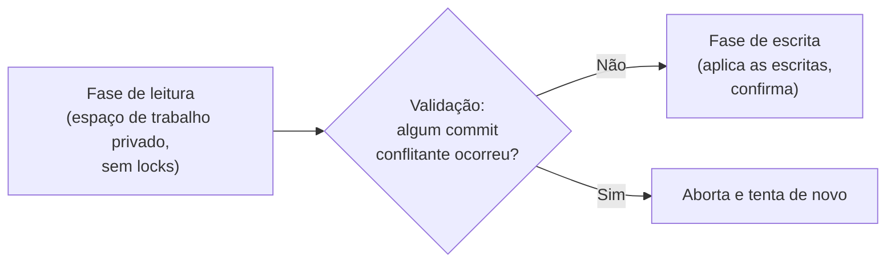
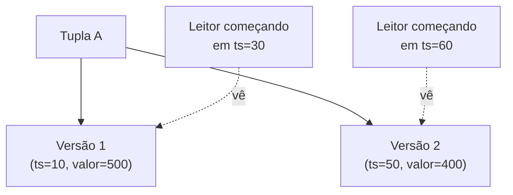

## Objetivos de Aprendizagem

- Explicar por que o locking é uma estratégia pessimista, e o que uma alternativa otimista troca em compensação.
- Descrever as três fases do Controle de Concorrência Otimista (leitura, validação, escrita) e rastrear um conflito de validação causando um aborto e uma retentativa reais.
- Descrever a ideia central do Controle de Concorrência Multiversão (múltiplas versões de tupla com carimbo de tempo, leitores encaminhados pelo instante de início) e explicar por que um leitor sob MVCC nunca bloqueia num escritor.
- Conectar o MVCC ao mecanismo real por trás do isolamento por snapshot num sistema de produção.

## Contexto e Motivação

Todo mecanismo construído desde `two-phase-locking-and-conflict-serializability` foi **pessimista**: ele supõe que conflitos entre transações concorrentes são comuns o suficiente para valer a pena pagar um custo de coordenação de antemão, em toda leitura e escrita, via locks adquiridos antes de tocar qualquer dado. `isolation-levels-and-what-serializable-guarantees` terminou observando que esse custo de coordenação é real e às vezes desnecessário; este conceito constrói as duas alternativas reais às quais sistemas de produção recorrem no lugar, ambas evitando completamente bloquear um leitor num escritor: o **Controle de Concorrência Otimista (OCC)**, que paga o custo de coordenação só no momento do commit, e o **Controle de Concorrência Multiversão (MVCC)**, que contorna o bloqueio por completo mantendo mais de uma versão de cada tupla ao mesmo tempo.

Notavelmente, `disk-based-storage-pages-and-tuples` já plantou o exato gancho de que o MVCC precisa: a discussão do cabeçalho de tupla daquele conceito mencionou um "carimbo de visibilidade/transação" por tupla, explicitamente sinalizado como "relevante de novo quando o bloco de controle de concorrência desta disciplina introduz o controle de concorrência multiversão". Este é esse momento.

## Teoria Central

### O locking é pessimista; o OCC é otimista

O 2PL adquire um lock *antes* de ler ou escrever qualquer coisa, supondo que uma transação concorrente conflitante pode aparecer a qualquer momento, pagando esse custo de coordenação em toda operação, ocorra ou não um conflito real. O **Controle de Concorrência Otimista**, em vez disso, supõe que os conflitos são a exceção, e não a regra: uma transação lê e calcula livremente, sem locking algum, e paga o custo de coordenação exatamente uma vez, no momento do commit, checando se alguma transação concorrente de fato conflitou com ela.

### As três fases do OCC

O OCC estrutura toda transação em três fases:

1. **Fase de leitura**: a transação lê quaisquer dados de que precisa (registrando exatamente o que leu e os valores/versões que viu) e calcula as suas escritas pretendidas inteiramente num espaço de trabalho privado, local à transação, sem tocar o banco de dados compartilhado nem adquirir lock algum.
2. **Fase de validação**: no ponto em que a transação quer confirmar, o sistema checa se alguma outra transação que confirmou *durante* a fase de leitura desta transação escreveu em algum dos mesmos dados que esta transação leu. Se nenhum conflito desse tipo for encontrado, a validação tem sucesso.
3. **Fase de escrita**: só depois de uma validação bem-sucedida as escritas bufferizadas desta transação são de fato aplicadas ao banco de dados compartilhado e tornadas visíveis; se a validação, em vez disso, detectar um conflito, a transação **aborta e tenta de novo** do zero (tipicamente relendo os valores agora atuais e recalculando).

### Controle de Concorrência Multiversão

O **MVCC** toma uma rota diferente para o mesmo objetivo: em vez de validar um único valor atual contra escritores concorrentes, ele mantém **múltiplas versões com carimbo de tempo** de cada tupla simultaneamente. Toda escrita cria uma *nova* versão de uma tupla (marcada com o carimbo da transação que a escreveu) em vez de sobrescrever a antiga no lugar, e toda leitura recebe um **carimbo de snapshot** (tipicamente o próprio instante de início da transação leitora) que determina exatamente qual versão de cada tupla ela tem permissão de ver: a versão mais recente que já estava confirmada *até* aquele carimbo de snapshot, ignorando qualquer versão criada por uma transação que começou depois ou que ainda não confirmou.

Como um leitor é simplesmente encaminhado para uma versão já existente e já confirmada, consistente com o seu próprio snapshot, ele **nunca precisa esperar** que um escritor concorrente termine: o escritor está ocupado criando uma versão *nova*, inteiramente separada da versão que o leitor já está lendo, então os dois literalmente nunca disputam os mesmos dados físicos.

### MVCC e isolamento por snapshot em produção

O nível de isolamento que sistemas reais de produção constroem diretamente a partir do MVCC é geralmente chamado de **isolamento por snapshot**: toda transação lê de um único snapshot consistente do banco de dados, fixado no seu próprio instante de início, exatamente como descrito acima. A implementação real do REPEATABLE READ no PostgreSQL (e o seu modo SERIALIZABLE, mais estrito, construído com maquinaria adicional de detecção de conflitos em cima do mesmo substrato de MVCC) é isolamento por snapshot via MVCC: uma instância direta, do mundo real, do mecanismo construído neste conceito, e não um modelo didático simplificado dele.

## Exemplos Resolvidos

### Exemplo 1: o OCC pegando uma atualização perdida no momento da validação

Conta `A = $500`. `T1` (fase de leitura) lê `A = 500` e calcula um `A_new = 550` privado (um depósito de `$50`), sem tocar ainda o banco de dados compartilhado. Concorrentemente, `T2` (fase de leitura) também lê `A = 500`, calculando `A_new = 530` (um depósito de `$30`). `T1` chega primeiro à sua fase de validação: nenhuma outra transação confirmou uma escrita em `A` durante a fase de leitura de `T1`, então a validação tem sucesso, e a fase de escrita de `T1` confirma `A = 550`. `T2` agora chega à sua própria fase de validação: o sistema checa se `A` foi escrito por alguma transação que confirmou desde que a fase de leitura de `T2` começou, e encontra que o commit de `A = 550` por `T1` fez exatamente isso. A validação **falha**, e `T2` aborta e tenta de novo: relê o `A = 550` agora atual, recalcula `550 + 30 = 580` e desta vez confirma com sucesso. Diferente do exemplo de atualização perdida de `concurrency-anomalies-dirty-reads-and-lost-updates` (em que o depósito de `T3` desapareceu silenciosamente sem erro algum), a fase de validação do OCC pega exatamente o mesmo conflito e força uma retentativa real, em vez de perder silenciosamente uma atualização.

### Exemplo 2: o MVCC encaminhando dois leitores para duas versões diferentes e consistentes

A conta `A` tem duas versões: `V1` (criada no carimbo `10`, valor `500`) e `V2` (criada no carimbo `50`, valor `400`, por uma transação de débito que já confirmou). Um leitor `Tr1` com carimbo de snapshot `30` pede o valor atual de `A`: o MVCC o encaminha para `V1` (`500`), a versão mais recente confirmada até o carimbo `30`. `V2` ainda não existia naquele ponto da linha do tempo, então `Tr1` corretamente nunca a vê, mesmo que `V2` já esteja totalmente confirmada e visível para *outros* leitores, posteriores, no momento em que a consulta de `Tr1` de fato executa. Um segundo leitor `Tr2` com carimbo de snapshot `60`, consultando a tupla idêntica no idêntico momento físico, é em vez disso encaminhado para `V2` (`400`). Os dois leitores veem duas respostas diferentes, individualmente consistentes, para a mesma pergunta, e nenhum deles jamais precisou esperar pelo outro, nem pelo escritor da transação de débito, em ponto algum.

### Exemplo 3: por que isto é exatamente isolamento por snapshot, e não serializabilidade completa por padrão

Estenda o Exemplo 2: suponha que `Tr1` (snapshot em `30`) e um escritor concorrente `Tw` leiam ambos a `V1 = 500` de `A` quase no mesmo momento, e ambos decidam independentemente debitar `$100` com base nesse mesmo valor de snapshot, cada um criando a sua própria nova versão (`V2` de `Tw` no carimbo `50`, e uma hipotética `V3` da escrita eventual de `Tr1` no carimbo `55`, ambas calculadas a partir do mesmo `500` desatualizado). O isolamento por snapshot, por si só, não evita isso automaticamente: validar um conflito de leitura/escrita numa única chave é exatamente o que a fase de validação do OCC do Exemplo 1 faz, mas uma implementação pura de isolamento por snapshot precisa desse mesmo tipo de checagem de conflito escrita-escrita sobreposta ao versionamento do MVCC para pegá-lo, e é exatamente por isso que o modo SERIALIZABLE do PostgreSQL acrescenta maquinaria real e extra de detecção de conflitos em cima da sua fundação de MVCC/isolamento por snapshot, em vez de tratar "múltiplas versões" sozinhas como suficientes para a serializabilidade completa.

## Equívocos Comuns e Armadilhas

- **"O OCC não tem custo algum, já que não trava nada."** O OCC move o custo de coordenação de cada leitura/escrita individual (a abordagem do locking) para um único passo de validação no commit, mas uma transação que falha na validação precisa abortar e refazer completamente o seu trabalho (o `T2` do Exemplo 1), o que, sob alta contenção, pode significar *mais* trabalho desperdiçado no total do que o locking teria causado, e não menos. O OCC é um trade-off genuíno, favorável especificamente quando os conflitos são de fato raros.
- **"MVCC significa que um leitor pode ver qualquer versão que quiser."** Um leitor é encaminhado para exatamente uma versão específica por tupla (a mais recente já confirmada até o seu próprio carimbo de snapshot), nunca uma escolha arbitrária entre as versões disponíveis e nunca uma versão criada depois que o seu snapshot foi tirado, exatamente como os dois leitores do Exemplo 2 veem cada um uma resposta determinística e correta, e não um cardápio de opções.
- **"O isolamento por snapshot é a mesma coisa que a serializabilidade completa."** O Exemplo 3 mostra uma lacuna real: o isolamento por snapshot via MVCC sozinho não evita automaticamente toda anomalia que `isolation-levels-and-what-serializable-guarantees` associou ao SERIALIZABLE. Alcançar genuinamente a serializabilidade completa em cima do MVCC exige maquinaria adicional de detecção de conflitos além do simples multiversionamento, e é precisamente por isso que sistemas reais que oferecem um modo SERIALIZABLE verdadeiro o constroem como um aprimoramento sobre o seu substrato de MVCC, e não como uma consequência gratuita de ter múltiplas versões.

## Resumo

O locking paga um custo de coordenação em toda operação, com a suposição pessimista de que os conflitos são comuns; o **Controle de Concorrência Otimista**, em vez disso, lê e calcula livremente num espaço de trabalho privado e valida contra escritores concorrentes só no momento do commit, abortando e tentando de novo num conflito detectado em vez de bloquear (a atualização perdida pega e retentada do Exemplo 1). O **Controle de Concorrência Multiversão** toma uma rota diferente para o mesmo objetivo, mantendo várias versões com carimbo de tempo de uma tupla, de modo que um leitor seja simplesmente encaminhado para a versão consistente com o seu próprio carimbo de snapshot, nunca bloqueando num escritor concorrente (Exemplo 2). É o mecanismo real por trás do isolamento por snapshot em sistemas de produção como o PostgreSQL, embora alcançar genuinamente a serializabilidade completa em cima dele, como o Exemplo 3 mostra, exija maquinaria real e adicional de detecção de conflitos, e não o multiversionamento sozinho.

## Documentation Links

- [CMU 15-445/645: Schedule (Timestamp Ordering & Multi-Version Concurrency Control)](https://15445.courses.cs.cmu.edu/fall2026/schedule.html): o calendário do curso que confirma o modelo de três fases do OCC e o mecanismo de versionamento/carimbo de snapshot do MVCC percorridos nos exemplos deste conceito.
- [Database System Concepts (Silberschatz, Korth, Sudarshan): Companion Site](https://www.db-book.com/): o tratamento padrão de livro-texto do controle de concorrência otimista e dos esquemas multiversão, útil para conferir a lógica da fase de validação e de encaminhamento de versões deste conceito.
