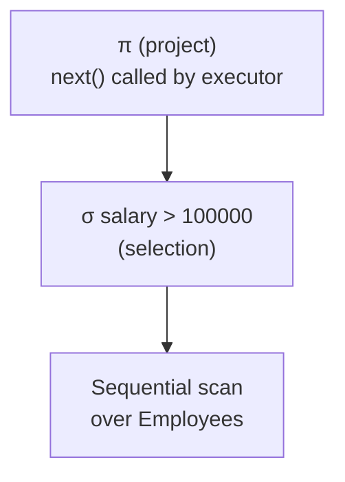

## Learning Objectives

- Explain why a query plan is a tree of physical operators, not a direct interpretation of a relational algebra expression.
- State the iterator (pull-based) interface precisely — `open()`, `next()`, `close()` — and connect it to the same interface already built for in-memory collections.
- Distinguish a sequential scan from an index scan as physical implementations of the same logical "get me these tuples" step.
- Trace a small multi-operator plan tree evaluated lazily, one tuple at a time, driven entirely by repeated calls from the root.

## Context & Motivation

`choosing-an-index-hash-vs-b-plus-tree` closed the indexing cluster with a decision procedure for *which* index structure to use — but a query never touches a hash index or a B+Tree directly. Something has to translate a declarative query (or, at the algebra level built two clusters back, a `σ`/`π`/`⋈` expression) into an actual sequence of function calls that walk pages through the buffer pool and follow index pointers. That translator's output is a **query plan**: a tree of **physical operators**, each one a concrete algorithm implementing one logical relational-algebra step — a sequential scan or an index scan implementing access to a relation, a nested-loop or hash join implementing `⋈`, and so on through the rest of this cluster.

`foundations/data-structures-i`'s `iterators` already established the exact interface this concept reuses: a uniform way to traverse any collection without the caller needing to know the collection's internal representation — `hasNext()`/`next()`, called repeatedly until exhausted. A query-execution engine's physical operators implement precisely that same interface, just over database tuples pulled from disk instead of elements already sitting in memory. This is not a loose analogy — it is the literal design real database engines use, usually called the **iterator model** or the **Volcano model** (after the research system that popularized it).

## Core Theory

### The iterator interface: open, next, close

Every physical operator in a query plan implements the same three-method interface, regardless of what it actually does internally:

- **`open()`** — initializes the operator's internal state (e.g., positions a scan at the first page, or initializes a join's inner loop).
- **`next()`** — produces exactly one output tuple per call, or a sentinel signaling "no more tuples" once exhausted. Crucially, an operator's `next()` typically calls `next()` on its own child operator(s) one or more times to obtain the input it needs to produce one output tuple.
- **`close()`** — releases any resources the operator was holding (unpinning buffer-pool pages, for instance).

This is exactly the same `hasNext()`/`next()` contract `iterators` built for traversing an in-memory list or tree, reapplied to a tree of operators pulling tuples from disk-backed storage instead of a single in-memory structure. The uniformity is what lets operators compose freely: a join operator's child can be a scan, another join, or a sort — the join's `next()` method never needs to know or care which.

### A query plan is a tree, evaluated bottom-up but driven top-down

A query plan is literally a tree of these operators — leaves are **access operators** (scans) that read tuples from a table or index, and internal nodes are operators that consume one or more child operators' output (joins, selections, projections, sorts). Execution is driven entirely by the **root** operator: something above the plan (the query executor) calls `next()` once on the root to get one output row, and the root's `next()` implementation calls `next()` on its own children as needed, which in turn call `next()` on *their* children, all the way down to the leaf scans that actually touch disk pages.

Calling `next()` on the root once produces exactly one final output tuple (or signals end-of-results) — the *entire* plan runs one tuple at a time, lazily, never materializing the full intermediate result of any operator unless a specific operator (like a sort, which genuinely needs to see everything before producing its first output) is forced to.

### Sequential scan

A **sequential scan** is the simplest access operator: it iterates over every page of a heap file, in whatever physical order the heap file's page directory lists them, pulling each page through the buffer pool (`buffer-pool-management`) and yielding each tuple on that page as one `next()` call's result, applying any selection predicate (`WHERE …`) as it goes so that only matching tuples are actually returned upward. Its cost is fixed and workload-independent: exactly one page fetch per page of the table (fewer, if pages are already buffer-pool-resident from a previous query), regardless of how selective the predicate is.

### Index scan

An **index scan** instead uses an index (a hash index or a B+Tree built in the previous cluster) to jump directly to the pages holding qualifying tuples, rather than examining every page of the table. For an equality predicate matching a hash index, or a range predicate matching a B+Tree, an index scan can examine only a small fraction of the table's total pages — but each matching entry found in the index typically requires a *separate* random-access fetch of the actual data page it points to (unless the index is itself covering, i.e., holds every column the query needs), which is why an index scan's real cost depends heavily on how many matching tuples exist and how they're physically clustered, not just on the index's own O(1) or O(logₘ n) lookup cost.

## Worked Examples

### Example 1 — a two-operator plan, tuple by tuple

Consider the plan `σ_salary>100000(Employees)` — a selection directly over a sequential scan, matching the diagram above without the projection. The executor calls `next()` on the selection operator. The selection's `next()` calls `next()` on the scan below it, gets back one raw tuple, checks whether `salary > 100000`; if not, it calls `next()` on the scan *again* (and again) until either a qualifying tuple is found (returned upward) or the scan signals exhaustion. No list of "all employees" and no list of "all qualifying employees" is ever built in memory — one tuple flows up at a time, exactly one scan-page's worth of I/O paid only as needed to keep producing output.

### Example 2 — three-operator plan pulling through an index

Consider `π_name(σ_id=4217(Employees))` with a B+Tree index on `id`. The plan's leaf is now an **index scan**, not a sequential scan: the executor calls `next()` on the projection, which calls `next()` on the selection, which calls `next()` on the index scan. The index scan descends the B+Tree once (a small, fixed number of page fetches — `⌈log_m n⌉`, per `b-plus-trees-structure-and-search`) to find the leaf entry for `id = 4217`, fetches the one matching data page it points to, and returns that one tuple. The selection operator, receiving a tuple that already satisfies `id = 4217` by construction of the index lookup, passes it straight through (or could re-check for correctness); the projection then narrows it to just the `name` column before returning it to the executor. Compare this to Example 1's plan: a sequential scan would have paid one I/O per page of the whole table to find this single row, while the index scan pays only a few I/Os total.

### Example 3 — when a sequential scan beats an index scan

A query `SELECT * FROM Employees WHERE department = 'Engineering'` runs against a table where 40% of all rows are in Engineering, with an index on `department`. Using the index means one random-access page fetch per matching tuple's data page — potentially thousands of scattered, non-sequential I/Os for a large, low-selectivity result. A sequential scan instead reads every page exactly once, sequentially (a pattern disks and OS read-ahead both handle efficiently), examining and returning the 40% of tuples that match as it goes. For a predicate this unselective, the sequential scan's fixed, sequential cost is frequently *cheaper* in total I/O than the index scan's many scattered random fetches — precisely the kind of trade-off the query-optimization concept, two concepts ahead, is built to evaluate and choose between automatically rather than always preferring "the index."

## Common Misconceptions & Pitfalls

- **"An index scan is always faster than a sequential scan."** Example 3 shows a real, common counter-case: for a low-selectivity predicate (matching a large fraction of the table), an index scan's per-tuple random-access page fetches can cost more in total I/O than a sequential scan's fixed, sequential cost — the query optimizer's job, several concepts ahead, is precisely to make this choice per query rather than hardcoding a universal preference.
- **"The query plan computes the whole intermediate result of each operator before moving to the next one."** The iterator model's entire point is the opposite: a plan is evaluated lazily, one final output tuple per `next()` call on the root, with each operator pulling only as much from its children as it needs to produce its own next tuple — no full intermediate materialization happens unless a specific operator (like a sort) genuinely requires seeing all its input first.
- **"Physical operators and relational algebra operators are the same thing."** Relational algebra (`the-relational-model-and-relational-algebra`) fixes only a *logical* sequence of set operations — it says nothing about execution strategy. `σ` might be implemented as a filter inside a scan's `next()`, and `⋈` might be implemented as nested-loop, sort-merge, or hash join (the next two concepts) — the physical operator is a specific algorithm chosen to realize a logical algebra step, and a single logical plan can map to many different physical plans with very different real costs.

## Summary

A query plan is a tree of physical operators, each implementing the exact same pull-based `open()`/`next()`/`close()` interface `iterators` already established for traversing any collection uniformly — a sequential scan pulls tuples page by page through the buffer pool with a fixed, predicate-independent cost, while an index scan instead pulls them through a hash index or B+Tree built in the previous cluster, at a cost that depends on how selective the query actually is. The whole plan runs lazily, one tuple at a time, driven entirely by the root operator repeatedly calling `next()` on its children — never materializing a full intermediate result unless a specific operator genuinely requires it — setting up exactly the execution substrate the join algorithms and query optimizer, later in this cluster, build on top of.

## Documentation Links

- [CMU 15-445/645 — Schedule (Query Execution I & II)](https://15445.courses.cs.cmu.edu/fall2026/schedule.html) — the course schedule confirming the iterator/Volcano model and the sequential-scan/index-scan operator split this concept builds from.
- [Berkeley CS186 — Course Notes (Iterators and Joins)](https://cs186berkeley.net/notes/) — covers the iterator-based query execution model and its role as the foundation the join algorithms in the next two concepts are built on top of.
