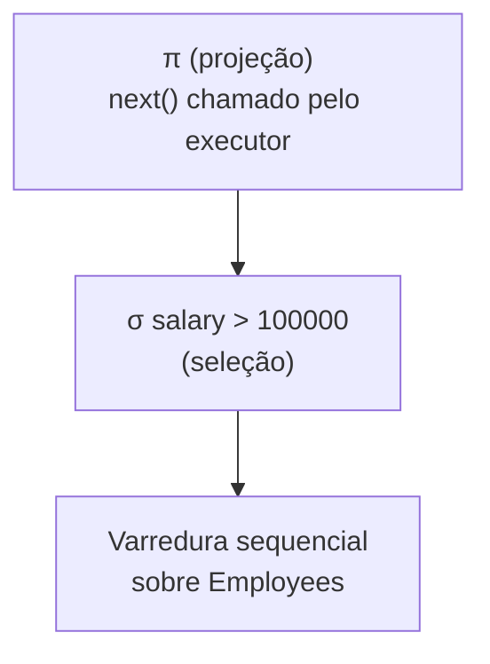

## Objetivos de Aprendizagem

- Explicar por que um plano de consulta é uma árvore de operadores físicos, e não uma interpretação direta de uma expressão de álgebra relacional.
- Enunciar com precisão a interface de iterador (baseada em pull), `open()`, `next()`, `close()`, e conectá-la à mesma interface já construída para coleções em memória.
- Distinguir uma varredura sequencial de uma varredura por índice como implementações físicas do mesmo passo lógico de "me dê estas tuplas".
- Rastrear uma pequena árvore de plano com vários operadores avaliada de forma preguiçosa, uma tupla por vez, dirigida inteiramente por chamadas repetidas a partir da raiz.

## Contexto e Motivação

`choosing-an-index-hash-vs-b-plus-tree` fechou o bloco de indexação com um procedimento de decisão sobre *qual* estrutura de índice usar, mas uma consulta nunca toca um índice hash ou uma B+Tree diretamente. Algo precisa traduzir uma consulta declarativa (ou, no nível da álgebra construído dois blocos atrás, uma expressão de `σ`/`π`/`⋈`) numa sequência real de chamadas de função que percorrem páginas pelo buffer pool e seguem ponteiros de índice. A saída desse tradutor é um **plano de consulta**: uma árvore de **operadores físicos**, cada um um algoritmo concreto que implementa um passo lógico da álgebra relacional: uma varredura sequencial ou por índice implementando o acesso a uma relação, um nested-loop ou hash join implementando `⋈`, e assim por diante pelo resto deste bloco.

`iterators`, de `foundations/data-structures-i`, já estabeleceu a interface exata que este conceito reutiliza: uma forma uniforme de percorrer qualquer coleção sem que o chamador precise conhecer a representação interna da coleção, `hasNext()`/`next()`, chamados repetidamente até se esgotar. Os operadores físicos de um motor de execução de consultas implementam precisamente essa mesma interface, só que sobre tuplas de banco de dados puxadas do disco em vez de elementos já na memória. Isto não é uma analogia frouxa: é o projeto literal que motores de banco de dados reais usam, geralmente chamado de **modelo de iteradores** ou **modelo Volcano** (em referência ao sistema de pesquisa que o popularizou).

## Teoria Central

### A interface de iterador: open, next, close

Todo operador físico num plano de consulta implementa a mesma interface de três métodos, independentemente do que ele de fato faz internamente:

- **`open()`**: inicializa o estado interno do operador (ex.: posiciona uma varredura na primeira página, ou inicializa o loop interno de um join).
- **`next()`**: produz exatamente uma tupla de saída por chamada, ou um sentinela sinalizando "não há mais tuplas" quando se esgota. Crucialmente, o `next()` de um operador tipicamente chama `next()` no(s) seu(s) próprio(s) operador(es) filho(s) uma ou mais vezes para obter a entrada de que precisa para produzir uma tupla de saída.
- **`close()`**: libera quaisquer recursos que o operador estava mantendo (desafixando páginas do buffer pool, por exemplo).

Este é exatamente o mesmo contrato `hasNext()`/`next()` que `iterators` construiu para percorrer uma lista ou árvore em memória, reaplicado a uma árvore de operadores puxando tuplas de armazenamento sustentado por disco em vez de uma única estrutura em memória. A uniformidade é o que permite que os operadores se componham livremente: o filho de um operador de join pode ser uma varredura, outro join ou uma ordenação, e o método `next()` do join nunca precisa saber nem se importar com qual.

### Um plano de consulta é uma árvore, avaliada de baixo para cima mas dirigida de cima para baixo

Um plano de consulta é literalmente uma árvore destes operadores: as folhas são **operadores de acesso** (varreduras) que leem tuplas de uma tabela ou índice, e os nós internos são operadores que consomem a saída de um ou mais operadores filhos (joins, seleções, projeções, ordenações). A execução é dirigida inteiramente pelo operador **raiz**: algo acima do plano (o executor de consultas) chama `next()` uma vez na raiz para obter uma linha de saída, e a implementação de `next()` da raiz chama `next()` nos seus próprios filhos conforme necessário, que por sua vez chamam `next()` nos *seus* filhos, todo o caminho até as varreduras folha que de fato tocam páginas de disco.

Chamar `next()` na raiz uma vez produz exatamente uma tupla de saída final (ou sinaliza o fim dos resultados): o plano *inteiro* roda uma tupla por vez, de forma preguiçosa, nunca materializando o resultado intermediário completo de nenhum operador, a menos que um operador específico (como uma ordenação, que genuinamente precisa ver tudo antes de produzir a sua primeira saída) seja forçado a isso.

### Varredura sequencial

Uma **varredura sequencial** é o operador de acesso mais simples: ela itera sobre toda página de um heap file, em qualquer ordem física em que o diretório de páginas do heap file as liste, puxando cada página pelo buffer pool (`buffer-pool-management`) e entregando cada tupla daquela página como o resultado de uma chamada a `next()`, aplicando qualquer predicado de seleção (`WHERE …`) no caminho, de modo que só as tuplas correspondentes sejam de fato retornadas para cima. O seu custo é fixo e independente da carga de trabalho: exatamente uma busca de página por página da tabela (menos, se as páginas já estiverem residentes no buffer pool por causa de uma consulta anterior), não importa quão seletivo seja o predicado.

### Varredura por índice

Uma **varredura por índice**, em vez disso, usa um índice (um índice hash ou uma B+Tree construídos no bloco anterior) para saltar diretamente para as páginas que guardam as tuplas qualificadas, em vez de examinar toda página da tabela. Para um predicado de igualdade que casa com um índice hash, ou um predicado de intervalo que casa com uma B+Tree, uma varredura por índice pode examinar só uma pequena fração do total de páginas da tabela, mas cada entrada correspondente encontrada no índice tipicamente exige uma busca *separada*, de acesso aleatório, da página de dados de fato para a qual ela aponta (a menos que o índice seja ele próprio de cobertura, ou seja, guarde toda coluna de que a consulta precisa). É por isso que o custo real de uma varredura por índice depende muito de quantas tuplas correspondentes existem e de como elas estão fisicamente agrupadas, e não só do custo de busca O(1) ou O(logₘ n) do próprio índice.

## Exemplos Resolvidos

### Exemplo 1: um plano de dois operadores, tupla por tupla

Considere o plano `σ_salary>100000(Employees)`: uma seleção diretamente sobre uma varredura sequencial, batendo com o diagrama acima, sem a projeção. O executor chama `next()` no operador de seleção. O `next()` da seleção chama `next()` na varredura abaixo dela, recebe de volta uma tupla bruta, checa se `salary > 100000`; se não, chama `next()` na varredura *de novo* (e de novo) até que uma tupla qualificada seja encontrada (retornada para cima) ou a varredura sinalize que se esgotou. Nenhuma lista de "todos os funcionários" nem de "todos os funcionários qualificados" jamais é construída em memória: uma tupla sobe por vez, pagando exatamente o equivalente a uma página de varredura de E/S só conforme necessário para continuar produzindo saída.

### Exemplo 2: um plano de três operadores puxando por um índice

Considere `π_name(σ_id=4217(Employees))` com um índice B+Tree em `id`. A folha do plano agora é uma **varredura por índice**, e não uma varredura sequencial: o executor chama `next()` na projeção, que chama `next()` na seleção, que chama `next()` na varredura por índice. A varredura por índice desce a B+Tree uma vez (um número pequeno e fixo de buscas de página, `⌈log_m n⌉`, segundo `b-plus-trees-structure-and-search`) para encontrar a entrada de folha de `id = 4217`, busca a única página de dados correspondente para a qual ela aponta e retorna essa única tupla. O operador de seleção, recebendo uma tupla que já satisfaz `id = 4217` pela construção da busca no índice, a repassa direto (ou poderia rechecá-la por corretude); a projeção então a estreita para só a coluna `name` antes de retorná-la ao executor. Compare com o plano do Exemplo 1: uma varredura sequencial teria pago uma E/S por página da tabela inteira para encontrar esta única linha, enquanto a varredura por índice paga só umas poucas E/Ss no total.

### Exemplo 3: quando uma varredura sequencial vence uma varredura por índice

Uma consulta `SELECT * FROM Employees WHERE department = 'Engineering'` roda contra uma tabela em que 40% de todas as linhas estão em Engineering, com um índice em `department`. Usar o índice significa uma busca de página de acesso aleatório por página de dados de cada tupla correspondente, potencialmente milhares de E/Ss espalhadas e não sequenciais para um resultado grande e de baixa seletividade. Uma varredura sequencial, em vez disso, lê toda página exatamente uma vez, sequencialmente (um padrão que tanto os discos quanto o read-ahead do SO tratam com eficiência), examinando e retornando no caminho os 40% de tuplas que correspondem. Para um predicado tão pouco seletivo, o custo fixo e sequencial da varredura sequencial é frequentemente *mais barato* em E/S total do que as muitas buscas aleatórias espalhadas da varredura por índice, precisamente o tipo de trade-off que o conceito de otimização de consultas, dois conceitos adiante, é construído para avaliar e escolher automaticamente, em vez de sempre preferir "o índice".

## Equívocos Comuns e Armadilhas

- **"Uma varredura por índice é sempre mais rápida que uma varredura sequencial."** O Exemplo 3 mostra um contracaso real e comum: para um predicado de baixa seletividade (que casa com uma grande fração da tabela), as buscas de página de acesso aleatório por tupla de uma varredura por índice podem custar mais E/S total que o custo fixo e sequencial de uma varredura sequencial. O trabalho do otimizador de consultas, vários conceitos adiante, é precisamente fazer esta escolha por consulta em vez de codificar uma preferência universal.
- **"O plano de consulta calcula o resultado intermediário inteiro de cada operador antes de passar para o próximo."** Todo o ponto do modelo de iteradores é o oposto: um plano é avaliado de forma preguiçosa, uma tupla de saída final por chamada a `next()` na raiz, com cada operador puxando dos seus filhos só o quanto precisa para produzir a sua própria próxima tupla. Nenhuma materialização intermediária completa acontece, a menos que um operador específico (como uma ordenação) genuinamente exija ver toda a sua entrada primeiro.
- **"Operadores físicos e operadores da álgebra relacional são a mesma coisa."** A álgebra relacional (`the-relational-model-and-relational-algebra`) fixa só uma sequência *lógica* de operações de conjunto; ela não diz nada sobre a estratégia de execução. `σ` pode ser implementado como um filtro dentro do `next()` de uma varredura, e `⋈` pode ser implementado como nested-loop, sort-merge ou hash join (os próximos dois conceitos). O operador físico é um algoritmo específico escolhido para realizar um passo lógico da álgebra, e um único plano lógico pode corresponder a muitos planos físicos diferentes, com custos reais muito diferentes.

## Resumo

Um plano de consulta é uma árvore de operadores físicos, cada um implementando exatamente a mesma interface baseada em pull `open()`/`next()`/`close()` que `iterators` já estabeleceu para percorrer qualquer coleção de forma uniforme: uma varredura sequencial puxa tuplas página por página pelo buffer pool, com um custo fixo e independente do predicado, enquanto uma varredura por índice as puxa em vez disso por um índice hash ou uma B+Tree construídos no bloco anterior, a um custo que depende de quão seletiva a consulta de fato é. O plano inteiro roda de forma preguiçosa, uma tupla por vez, dirigido inteiramente pelo operador raiz chamando repetidamente `next()` nos seus filhos, nunca materializando um resultado intermediário completo a menos que um operador específico genuinamente o exija, preparando exatamente o substrato de execução sobre o qual os algoritmos de join e o otimizador de consultas, mais adiante neste bloco, constroem.

## Documentation Links

- [CMU 15-445/645: Schedule (Query Execution I & II)](https://15445.courses.cs.cmu.edu/fall2026/schedule.html): o calendário do curso que confirma o modelo de iteradores/Volcano e a divisão entre os operadores de varredura sequencial/varredura por índice a partir dos quais este conceito constrói.
- [Berkeley CS186: Course Notes (Iterators and Joins)](https://cs186berkeley.net/notes/): cobre o modelo de execução de consultas baseado em iteradores e o seu papel como a fundação sobre a qual os algoritmos de join dos próximos dois conceitos são construídos.
