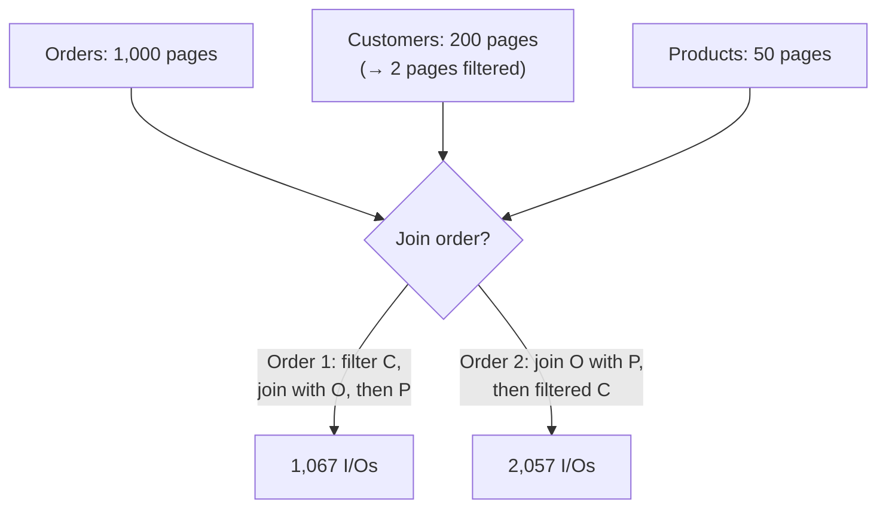

## Learning Objectives

- Build a page-I/O cost estimate for a physical plan from the same page-count and cardinality reasoning already used in the join-algorithm concepts.
- Compare two different join orderings for the same three-table query by hand and show, with real numbers, that one is genuinely cheaper.
- Distinguish rule-based optimization (fixed heuristics) from cost-based optimization (estimate and compare across a search space of plans).
- State honestly what this concept covers versus what a full production query optimizer additionally does.

## Context & Motivation

`the-relational-model-and-relational-algebra` already made the key observation this concept builds on: a single declarative query can be computed by multiple algebraically-equivalent expressions with very different real costs — that concept's own worked example showed `σ_b_id=102(R ⋈ S)` (filter after joining) and `R ⋈ (σ_b_id=102(S))` (filter first) always return the same result, while doing genuinely different amounts of work. `join-algorithms-sort-merge-and-hash-join` then gave this discipline real cost formulas — `M + N` for a hash join whose build side fits in memory, `M + ⌈M/(B−2)⌉ × N` for block nested-loop — expressed entirely in terms of page counts already tracked per table. **Query optimization** is the step that puts these two pieces together: given many equivalent ways to compute one query, estimate each candidate's real cost using exactly these formulas, and choose the cheapest one.

## Core Theory

### From logical equivalence to physical cost

A query like `SELECT * FROM Orders O JOIN Customers C ON O.cust_id = C.id JOIN Products P ON O.prod_id = P.id WHERE C.country = 'BR'` can be computed by joining the three tables in more than one order — `(Orders ⋈ Customers) ⋈ Products` and `(Orders ⋈ Products) ⋈ Customers` both return the identical final result, since natural join is associative and commutative. But the two orderings do not cost the same, because each order produces a different **intermediate result** partway through, and that intermediate's size directly determines the cost of the *next* join in the plan.

### Building a cost estimate

Using the hash-join cost model from the previous concept (`M + N` page I/Os when the build side fits in memory), a query optimizer estimates the cost of a candidate plan by working through it join by join: it needs each base table's page count (tracked directly by the storage layer), the estimated selectivity of any filter (how large a fraction of rows a predicate like `country = 'BR'` is expected to match), and the resulting size of each intermediate result, which becomes an input to the *next* join's cost estimate in the plan.

### Rule-based optimization

A **rule-based optimizer** applies a fixed set of heuristic transformations to a query, unconditionally, without ever estimating a real cost number — "always push a selection below a join," "always apply the most selective filter as early as possible," "always join the smallest available relation first." These rules are cheap to apply and correct far more often than not, precisely because a smaller intermediate result usually *does* mean a cheaper subsequent join — but a rule-based optimizer has no way to know when a specific rule's usual benefit doesn't hold for the actual data at hand.

### Cost-based optimization

A **cost-based optimizer** instead enumerates some space of candidate physical plans (different join orders, different physical operators per join), estimates each candidate's real cost using the page-count/cardinality-based formulas above, and picks the cheapest one it found — genuinely computing and comparing numbers rather than trusting a heuristic to be right by assumption. This is more expensive to run (estimating and comparing many candidate plans takes real optimizer time before the query itself even starts executing) but catches cases a fixed rule would get wrong, and is what essentially every production relational DBMS actually implements for anything beyond the most trivial queries.

### Scope: Core-Tier2, not a full optimizer

ACM/IEEE CS2013's Data Management knowledge area places query optimization at Core-Tier2 depth — real, expected knowledge, but not the deepest elective material in the KA. Consistent with that, this concept builds real cost estimation and a real two-plan comparison by hand, but does not derive the search-space enumeration algorithms (dynamic programming over join orders, System R-style plan-space pruning) or cardinality-estimation statistics (histograms, join-selectivity estimation under column correlation) that a production optimizer's internals additionally require — those are genuinely research-level topics beyond this discipline's scope.

## Worked Examples

### Example 1 — the setup: three tables, one selective filter

`Orders` has `M = 1,000` pages; `Customers` has `200` pages, and the predicate `country = 'BR'` is estimated (via an index on `country`) to match about 1% of customers, filterable at a cost of about `5` I/Os (a small B+Tree lookup plus fetching the few matching data pages) down to `2` pages; `Products` has `50` pages, with no filter applied to it at all. The join predicates are `O.cust_id = C.id` and `O.prod_id = P.id`. All joins below use the hash-join cost model (`M + N`, build side fits in memory).

### Example 2 — comparing two join orders

**Order 1** — filter `Customers` first, then join the filtered result with `Orders`, then join that with `Products`: filter cost `5`; join filtered `Customers` (`2` pages, build side) with `Orders` (`1,000` pages, probe side) costs `1,000 + 2 = 1,002`, producing an intermediate of roughly `10` pages (about 1% of Orders match a BR customer); joining that `10`-page intermediate with `Products` (`50` pages) costs `10 + 50 = 60`. **Total: `5 + 1,002 + 60 = 1,067` I/Os.**

**Order 2** — join `Orders` with (unfiltered) `Products` first, then join that result with filtered `Customers`: join `Orders` (`1,000` pages) with `Products` (`50` pages) costs `1,000 + 50 = 1,050`, producing an intermediate of roughly `1,000` pages (nearly every order has a product, so this join doesn't shrink the row count at all); filter `Customers` (cost `5`, same as before); joining the `1,000`-page intermediate with the `2`-page filtered `Customers` costs `1,000 + 2 = 1,002`. **Total: `1,050 + 5 + 1,002 = 2,057` I/Os.**

Order 1 costs `1,067` I/Os; Order 2 costs `2,057` — **nearly double**. The reason is structural, not incidental: Order 1 applies the one genuinely selective operation (the `country = 'BR'` filter) *before* the expensive `Orders` join, keeping every intermediate result small; Order 2 joins the two large, non-reducing relations (`Orders` and `Products`) first, producing a large intermediate that then has to be joined again at nearly full size. This is exactly the numeric evidence a cost-based optimizer computes before choosing Order 1 over Order 2 — not an assumption, a comparison.

### Example 3 — when the margin shrinks (and why cost-based reasoning still matters)

Suppose the actual selectivity of `country = 'BR'` turns out to be much weaker than assumed — 95% of customers match, not 1% (say the predicate was mis-estimated, or the data distribution shifted) — so the filtered `Customers` is `190` pages, not `2`, and the resulting order-side intermediate is roughly `950` pages, not `10`. Recomputing: **Order 1** — filter (`190`, no longer a cheap index win at this selectivity) + join with `Orders` (`1,000 + 190 = 1,190`) + join intermediate with `Products` (`950 + 50 = 1,000`) = **`2,380`** I/Os. **Order 2** — join `Orders`/`Products` (`1,050`) + filter (`190`) + join with filtered `Customers` (`1,000 + 190 = 1,190`) = **`2,430`** I/Os. Order 1 is still cheaper, but now by only about `50` I/Os (2%), not the dramatic 93% gap of Example 2. A rule-based optimizer that always applies "filter first" would still land on the right plan here by luck, but the shrinking margin is exactly why a cost-based optimizer computes both numbers rather than trusting the heuristic to hold by a wide margin every time — a small further change in the real cardinalities (a different hash-join memory assumption, a differently-selective predicate) could tip a fixed rule the wrong way, while a cost-based comparison would simply recompute and catch it.

## Common Misconceptions & Pitfalls

- **"Join order doesn't matter since natural join is associative and commutative."** Associativity and commutativity guarantee the *result* is identical regardless of join order — they say nothing about *cost*, and Example 2's `1,067` versus `2,057` I/Os for the same final answer is exactly the gap that guarantee leaves wide open.
- **"A rule-based optimizer is just a worse version of a cost-based one, so there's no reason it's ever used."** Rule-based transformations are cheap to apply and correct often enough that real systems still use them as a first pass (e.g., always pushing selections down before cost-based join-order search even starts) — the distinction this concept draws is about *how* the final choice among remaining candidates is made, not that rules are always wrong or unused.
- **"Query optimization is mostly about picking the right index."** Index choice (`choosing-an-index-hash-vs-b-plus-tree`) is one input to a cost estimate, but query optimization as covered here is about a strictly larger decision space — join order, join algorithm choice, and where to apply filters — of which index selection for a given access path is only one part.

## Summary

A single declarative query has many equivalent physical plans with genuinely different real costs — this concept builds a cost estimate from the same table page counts and join-algorithm cost formulas already established earlier in this discipline, and uses them to compare two join orderings for a small three-table query by hand: joining the selectively-filtered relation early costs `1,067` I/Os, while joining the two large, non-reducing relations first costs `2,057` — nearly double, for the identical result. Rule-based optimization applies fixed heuristics ("push selections down," "join filtered relations first") that are usually but not provably correct; cost-based optimization instead estimates and compares real costs across a search space of candidate plans, at the Core-Tier2 depth ACM/IEEE CS2013 assigns this topic — real cost estimation and comparison, not the dynamic-programming plan-space search or cardinality-estimation statistics a production optimizer's internals additionally require.

## Documentation Links

- [ACM/IEEE CS2013 — Data Management (DM) Knowledge Area](https://csed.acm.org/knowledge-areas-data-management-dm-cs2013-version/) — the curricular standard placing query optimization at Core-Tier2 depth, used here to calibrate this concept's scope against a full production optimizer's additional internals.
- [CMU 15-445/645 — Schedule (Query Planning & Optimization I & II)](https://15445.courses.cs.cmu.edu/fall2026/schedule.html) — the course schedule confirming the rule-based-versus-cost-based framing and the join-order cost comparison this concept works through by hand.
