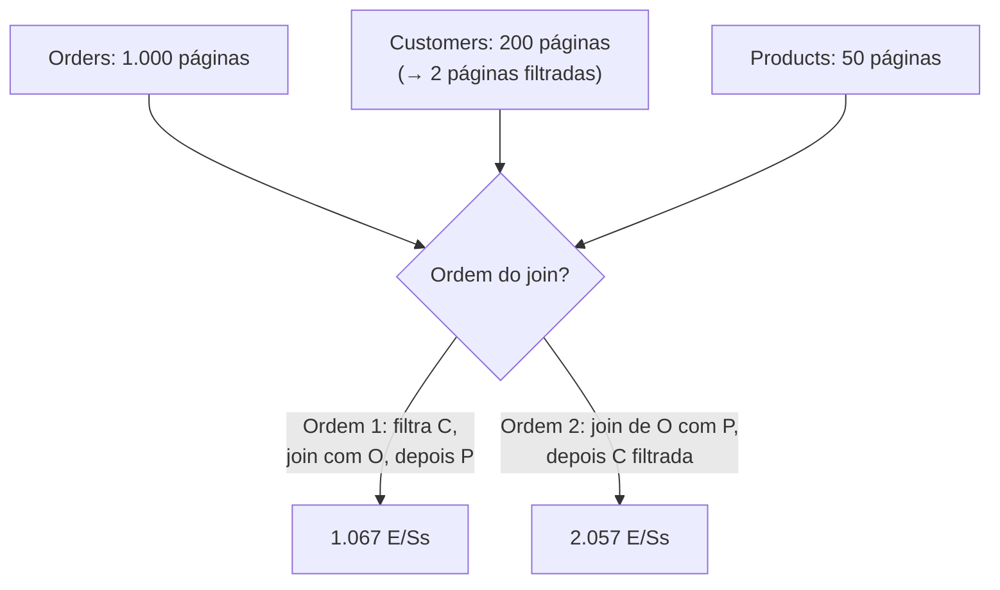

## Objetivos de Aprendizagem

- Construir uma estimativa de custo de E/S de páginas para um plano físico a partir do mesmo raciocínio de contagem de páginas e cardinalidade já usado nos conceitos de algoritmos de join.
- Comparar à mão duas ordens de join diferentes para a mesma consulta de três tabelas e mostrar, com números reais, que uma é genuinamente mais barata.
- Distinguir a otimização baseada em regras (heurísticas fixas) da otimização baseada em custo (estimar e comparar num espaço de busca de planos).
- Enunciar honestamente o que este conceito cobre versus o que um otimizador de consultas de produção completo faz adicionalmente.

## Contexto e Motivação

`the-relational-model-and-relational-algebra` já fez a observação-chave sobre a qual este conceito constrói: uma única consulta declarativa pode ser calculada por múltiplas expressões algebricamente equivalentes com custos reais muito diferentes. O próprio exemplo resolvido daquele conceito mostrou que `σ_b_id=102(R ⋈ S)` (filtrar depois do join) e `R ⋈ (σ_b_id=102(S))` (filtrar antes) sempre retornam o mesmo resultado, fazendo quantidades de trabalho genuinamente diferentes. `join-algorithms-sort-merge-and-hash-join` então deu a esta disciplina fórmulas de custo reais (`M + N` para um hash join cujo lado de construção cabe na memória, `M + ⌈M/(B−2)⌉ × N` para o block nested-loop) expressas inteiramente em termos de contagens de páginas já rastreadas por tabela. A **otimização de consultas** é o passo que junta essas duas peças: dadas muitas formas equivalentes de calcular uma consulta, estimar o custo real de cada candidata usando exatamente essas fórmulas, e escolher a mais barata.

## Teoria Central

### Da equivalência lógica ao custo físico

Uma consulta como `SELECT * FROM Orders O JOIN Customers C ON O.cust_id = C.id JOIN Products P ON O.prod_id = P.id WHERE C.country = 'BR'` pode ser calculada fazendo o join das três tabelas em mais de uma ordem: `(Orders ⋈ Customers) ⋈ Products` e `(Orders ⋈ Products) ⋈ Customers` retornam ambos o resultado final idêntico, já que o join natural é associativo e comutativo. Mas as duas ordens não custam o mesmo, porque cada ordem produz um **resultado intermediário** diferente no meio do caminho, e o tamanho desse intermediário determina diretamente o custo do *próximo* join do plano.

### Construindo uma estimativa de custo

Usando o modelo de custo do hash join do conceito anterior (`M + N` E/Ss de página quando o lado de construção cabe na memória), um otimizador de consultas estima o custo de um plano candidato trabalhando join por join: ele precisa da contagem de páginas de cada tabela base (rastreada diretamente pela camada de armazenamento), da seletividade estimada de qualquer filtro (que fração das linhas um predicado como `country = 'BR'` deve casar) e do tamanho resultante de cada resultado intermediário, que se torna uma entrada para a estimativa de custo do *próximo* join do plano.

### Otimização baseada em regras

Um **otimizador baseado em regras** aplica um conjunto fixo de transformações heurísticas a uma consulta, incondicionalmente, sem jamais estimar um número de custo real: "sempre empurre uma seleção para baixo de um join", "sempre aplique o filtro mais seletivo o mais cedo possível", "sempre faça o join da menor relação disponível primeiro". Essas regras são baratas de aplicar e corretas muito mais vezes que não, justamente porque um resultado intermediário menor geralmente *significa* um join subsequente mais barato, mas um otimizador baseado em regras não tem como saber quando o benefício usual de uma regra específica não vale para os dados reais em mãos.

### Otimização baseada em custo

Um **otimizador baseado em custo**, em vez disso, enumera algum espaço de planos físicos candidatos (ordens de join diferentes, operadores físicos diferentes por join), estima o custo real de cada candidato usando as fórmulas baseadas em contagem de páginas/cardinalidade acima, e escolhe o mais barato que encontrou, calculando e comparando números genuinamente, em vez de confiar que uma heurística esteja certa por suposição. Isso é mais caro de rodar (estimar e comparar muitos planos candidatos leva tempo real de otimizador antes mesmo de a consulta começar a executar), mas pega casos que uma regra fixa erraria, e é o que essencialmente todo SGBD relacional de produção de fato implementa para qualquer coisa além das consultas mais triviais.

### Escopo: Core-Tier2, não um otimizador completo

A área de conhecimento de Data Management do ACM/IEEE CS2013 coloca a otimização de consultas na profundidade Core-Tier2: conhecimento real e esperado, mas não o material eletivo mais profundo da área. Consistente com isso, este conceito constrói à mão uma estimativa de custo real e uma comparação real entre dois planos, mas não deriva os algoritmos de enumeração do espaço de busca (programação dinâmica sobre ordens de join, poda do espaço de planos no estilo System R) nem as estatísticas de estimativa de cardinalidade (histogramas, estimativa de seletividade de join sob correlação de colunas) que os internos de um otimizador de produção exigem adicionalmente; esses são tópicos genuinamente de nível de pesquisa, além do escopo desta disciplina.

## Exemplos Resolvidos

### Exemplo 1: a configuração: três tabelas, um filtro seletivo

`Orders` tem `M = 1.000` páginas; `Customers` tem `200` páginas, e estima-se que o predicado `country = 'BR'` (via um índice em `country`) case com cerca de 1% dos clientes, filtrável a um custo de cerca de `5` E/Ss (uma pequena busca na B+Tree mais a busca das poucas páginas de dados correspondentes) até `2` páginas; `Products` tem `50` páginas, sem filtro algum aplicado. Os predicados de join são `O.cust_id = C.id` e `O.prod_id = P.id`. Todos os joins abaixo usam o modelo de custo do hash join (`M + N`, o lado de construção cabe na memória).

### Exemplo 2: comparando duas ordens de join

**Ordem 1**: filtrar `Customers` primeiro, depois fazer o join do resultado filtrado com `Orders`, depois o join disso com `Products`. Custo do filtro `5`; o join de `Customers` filtrada (`2` páginas, lado de construção) com `Orders` (`1.000` páginas, lado de sondagem) custa `1.000 + 2 = 1.002`, produzindo um intermediário de aproximadamente `10` páginas (cerca de 1% dos pedidos casam com um cliente do BR); o join desse intermediário de `10` páginas com `Products` (`50` páginas) custa `10 + 50 = 60`. **Total: `5 + 1.002 + 60 = 1.067` E/Ss.**

**Ordem 2**: fazer o join de `Orders` com `Products` (não filtrada) primeiro, depois o join desse resultado com `Customers` filtrada. O join de `Orders` (`1.000` páginas) com `Products` (`50` páginas) custa `1.000 + 50 = 1.050`, produzindo um intermediário de aproximadamente `1.000` páginas (quase todo pedido tem um produto, então este join não encolhe a contagem de linhas); filtrar `Customers` (custo `5`, o mesmo de antes); o join do intermediário de `1.000` páginas com a `Customers` filtrada de `2` páginas custa `1.000 + 2 = 1.002`. **Total: `1.050 + 5 + 1.002 = 2.057` E/Ss.**

A Ordem 1 custa `1.067` E/Ss; a Ordem 2 custa `2.057`, **quase o dobro**. A razão é estrutural, e não incidental: a Ordem 1 aplica a única operação genuinamente seletiva (o filtro `country = 'BR'`) *antes* do join caro com `Orders`, mantendo todo resultado intermediário pequeno; a Ordem 2 faz primeiro o join das duas relações grandes que não reduzem (`Orders` e `Products`), produzindo um intermediário grande que depois precisa ser unido de novo quase no tamanho completo. Esta é exatamente a evidência numérica que um otimizador baseado em custo calcula antes de escolher a Ordem 1 em vez da Ordem 2: não uma suposição, uma comparação.

### Exemplo 3: quando a margem encolhe (e por que o raciocínio baseado em custo ainda importa)

Suponha que a seletividade real de `country = 'BR'` se revele muito mais fraca do que a suposta (95% dos clientes casam, e não 1%; digamos que o predicado foi mal estimado, ou que a distribuição dos dados mudou), então a `Customers` filtrada tem `190` páginas, e não `2`, e o intermediário resultante do lado dos pedidos tem aproximadamente `950` páginas, e não `10`. Recalculando: **Ordem 1**: filtro (`190`, não mais uma vitória barata de índice com esta seletividade) + join com `Orders` (`1.000 + 190 = 1.190`) + join do intermediário com `Products` (`950 + 50 = 1.000`) = **`2.380`** E/Ss. **Ordem 2**: join de `Orders`/`Products` (`1.050`) + filtro (`190`) + join com a `Customers` filtrada (`1.000 + 190 = 1.190`) = **`2.430`** E/Ss. A Ordem 1 ainda é mais barata, mas agora por só cerca de `50` E/Ss (2%), e não pela diferença dramática de 93% do Exemplo 2. Um otimizador baseado em regras que sempre aplica "filtre primeiro" ainda cairia no plano certo aqui por sorte, mas a margem encolhendo é exatamente por que um otimizador baseado em custo calcula os dois números em vez de confiar que a heurística valha por uma margem larga toda vez: uma pequena mudança adicional nas cardinalidades reais (uma suposição diferente de memória do hash join, um predicado de seletividade diferente) poderia virar uma regra fixa para o lado errado, enquanto uma comparação baseada em custo simplesmente recalcularia e pegaria isso.

## Equívocos Comuns e Armadilhas

- **"A ordem dos joins não importa, já que o join natural é associativo e comutativo."** A associatividade e a comutatividade garantem que o *resultado* seja idêntico independentemente da ordem dos joins; elas não dizem nada sobre o *custo*, e as `1.067` contra `2.057` E/Ss do Exemplo 2 para a mesma resposta final são exatamente a lacuna que essa garantia deixa escancarada.
- **"Um otimizador baseado em regras é só uma versão pior de um baseado em custo, então não há motivo para jamais usá-lo."** As transformações baseadas em regras são baratas de aplicar e corretas com frequência suficiente para que sistemas reais ainda as usem como uma primeira passada (ex.: sempre empurrar seleções para baixo antes mesmo de a busca de ordem de join baseada em custo começar). A distinção que este conceito traça é sobre *como* a escolha final entre os candidatos restantes é feita, e não que as regras estejam sempre erradas ou sem uso.
- **"A otimização de consultas é principalmente sobre escolher o índice certo."** A escolha de índice (`choosing-an-index-hash-vs-b-plus-tree`) é uma entrada para uma estimativa de custo, mas a otimização de consultas, como coberta aqui, é sobre um espaço de decisão estritamente maior (ordem dos joins, escolha do algoritmo de join e onde aplicar os filtros), do qual a seleção de índice para um dado caminho de acesso é só uma parte.

## Resumo

Uma única consulta declarativa tem muitos planos físicos equivalentes com custos reais genuinamente diferentes. Este conceito constrói uma estimativa de custo a partir das mesmas contagens de páginas de tabela e fórmulas de custo de algoritmos de join já estabelecidas antes nesta disciplina, e as usa para comparar à mão duas ordens de join para uma pequena consulta de três tabelas: fazer cedo o join da relação seletivamente filtrada custa `1.067` E/Ss, enquanto fazer primeiro o join das duas relações grandes que não reduzem custa `2.057`, quase o dobro, para o resultado idêntico. A otimização baseada em regras aplica heurísticas fixas ("empurre as seleções para baixo", "faça primeiro o join das relações filtradas") que geralmente estão certas, mas não comprovadamente; a otimização baseada em custo, em vez disso, estima e compara custos reais num espaço de busca de planos candidatos, na profundidade Core-Tier2 que o ACM/IEEE CS2013 atribui a este tópico: estimativa e comparação reais de custo, e não a busca no espaço de planos por programação dinâmica nem as estatísticas de estimativa de cardinalidade que os internos de um otimizador de produção exigem adicionalmente.

## Documentation Links

- [ACM/IEEE CS2013: Data Management (DM) Knowledge Area](https://csed.acm.org/knowledge-areas-data-management-dm-cs2013-version/): o padrão curricular que coloca a otimização de consultas na profundidade Core-Tier2, usado aqui para calibrar o escopo deste conceito em relação aos internos adicionais de um otimizador de produção completo.
- [CMU 15-445/645: Schedule (Query Planning & Optimization I & II)](https://15445.courses.cs.cmu.edu/fall2026/schedule.html): o calendário do curso que confirma o enquadramento de baseado em regras versus baseado em custo e a comparação de custo de ordens de join que este conceito percorre à mão.
