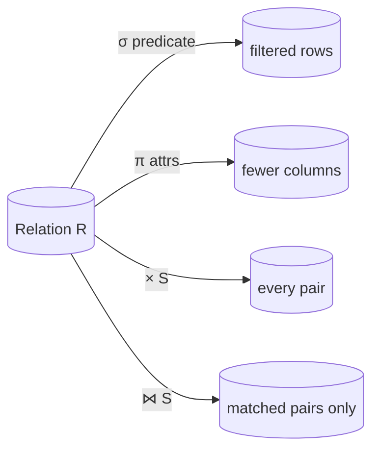

## Learning Objectives

- Define a relation formally as a subset of a Cartesian product of domains, connecting it to the set-theoretic relation already covered in `foundations/discrete-math-logic`.
- Name and apply the six core relational algebra operators (σ, π, ∪, ∩, −, ×) plus join (⋈) by hand on small concrete relations.
- Explain why relational algebra is a *procedural* target — it fixes an order of operations — while SQL is *declarative*, and why that distinction matters for query optimization later in this discipline.
- Compose operators into a multi-step query and evaluate it step by step on real tuples.

## Context & Motivation

`foundations/discrete-math-logic` already built two of exactly the ideas this concept needs: `power-sets-and-cartesian-products` defined the Cartesian product of sets, and `relations-and-their-properties` defined a relation as a subset of a Cartesian product — a set of tuples, each drawing one element from each domain. Codd's 1970 relational model is not a new abstraction layered on top of that mathematics; it is that same mathematics, applied directly to database tables. A relation (what SQL calls a table) is a set of tuples (rows) drawn from the Cartesian product of a fixed list of domains (column types) — `Artist × Year × Country`, for instance, for an `Artist` relation with three attributes. This concept's job is to reapply a structure this discipline's students have already proven correct in the abstract, now to something concrete: rows and columns.

Once relations are pinned down as sets, the natural next question is: what operations manipulate them? Relational algebra answers this with a small, closed set of operators — each one takes one or more relations as input and produces a new relation as output, so operators compose freely into arbitrarily complex queries. This is the exact mathematical foundation SQL sits on top of: every `SELECT` a real database engine executes is, underneath, compiled into (some equivalent of) a relational algebra expression, which the query-processing cluster later in this discipline will show how to execute efficiently and how to optimize.

## Core Theory

### Relations, attributes, and tuples

A **relation** `R` with attributes `A₁, A₂, …, Aₙ` (each drawn from a domain `D₁, …, Dₙ`) is formally a subset of `D₁ × D₂ × … × Dₙ` — exactly the Cartesian product `power-sets-and-cartesian-products` already defined, and exactly a relation in the sense `relations-and-their-properties` already defined, just with a fixed number of named "columns" (attributes) instead of an arbitrary pair. A **tuple** is one element of that subset — one row. Because a relation is a *set* of tuples, relational algebra inherits set semantics directly: no duplicate tuples, and no defined ordering among tuples (an important fact query optimization later exploits — the algebra defines *what* to compute, not *in what order* to return it).

### The core operators

Relational algebra's operators are based on set algebra — unordered collections with no duplicates — and each one takes relations in, produces a relation out, so they chain into longer expressions:

- **Selection** `σ_predicate(R)` — keep only the tuples of `R` satisfying `predicate`. `SELECT * FROM R WHERE …` compiles to a selection.
- **Projection** `π_A1,…,An(R)` — keep only the named attributes of each tuple, discarding the rest (and eliminating any resulting duplicate tuples, since the result must still be a set).
- **Union** `R ∪ S` — all tuples appearing in `R`, in `S`, or both (requires `R` and `S` to have the same attributes).
- **Intersection** `R ∩ S` — tuples appearing in both `R` and `S`.
- **Difference** `R − S` — tuples in `R` that do not appear in `S`.
- **Cartesian product** `R × S` — every tuple of `R` paired with every tuple of `S`, exactly the same Cartesian product operation reapplied at the relation level.
- **Join** `R ⋈ S` — tuples formed by combining one tuple from `R` and one from `S` that agree on their common attribute(s); equivalent to a Cartesian product followed by a selection on the matching condition, but computed far more efficiently in practice (the subject of the join-algorithms concepts later in this discipline).

### Declarative SQL vs. procedural algebra

Relational algebra fixes a specific order of operations — `σ_b_id=102(R ⋈ S)` (filter after joining) is a different expression from `R ⋈ (σ_b_id=102(S))` (filter one side first, then join), even when the two expressions are *guaranteed* to produce the same final relation. SQL deliberately does not ask the user to choose between these; it asks only for the high-level answer ("the joined tuples from R and S where S.b_id equals 102"), leaving the DBMS free to pick whichever equivalent algebra expression it can execute fastest. This is precisely the freedom the query-optimization concept later in this discipline exploits — an optimizer's whole job is choosing, among many algebraically-equivalent expressions for the same declarative query, the one with the lowest real execution cost.

## Worked Examples

### Example 1 — selection and projection on a single relation

Let `R(a_id, b_id)` hold four tuples: `(a1,101), (a2,102), (a2,103), (a3,104)`.

`σ_a_id='a2'(R)` keeps only tuples where `a_id = 'a2'`: `{(a2,102), (a2,103)}`.

`σ_a_id='a2' ∧ b_id>102(R)` adds a conjunction: `{(a2,103)}` — the SQL equivalent is `SELECT * FROM R WHERE a_id='a2' AND b_id>102`.

`π_b_id-100,a_id(σ_a_id='a2'(R))` then projects the filtered result onto a derived attribute `b_id-100` and `a_id`: `{(2,a2), (3,a2)}` — the SQL equivalent is `SELECT b_id-100, a_id FROM R WHERE a_id='a2'`, showing selection and projection composing directly into a real query.

### Example 2 — join on two relations

Let `R(a_id, b_id) = {(a1,101), (a2,102), (a3,103)}` and `S(a_id, b_id, val) = {(a3,103,'XXX'), (a4,104,'YYY'), (a5,105,'ZZZ')}`.

`R ⋈ S` matches tuples agreeing on both shared attributes `a_id` and `b_id`. Only `(a3,103)` from `R` and `(a3,103,'XXX')` from `S` agree on both — so `R ⋈ S = {(a3,103,'XXX')}`, a single tuple. In SQL this is `SELECT * FROM R NATURAL JOIN S`, or equivalently `SELECT * FROM R JOIN S ON R.a_id = S.a_id AND R.b_id = S.b_id`. Note the Cartesian product `R × S` would instead produce all 3×3 = 9 combined tuples, most of them meaningless combinations that don't correspond to any real matched pair — join is exactly the useful subset of the product.

### Example 3 — two algebraically equivalent plans for the same query

Take the query "find rows of `R ⋈ S` where `S.b_id = 102`." Plan A computes `σ_b_id=102(R ⋈ S)`: first the full join (all matching pairs), then filter. Plan B computes `R ⋈ (σ_b_id=102(S))`: first filter `S` down to just the rows with `b_id=102` (in this dataset, none — `S` has no row with `b_id=102`), then join the much smaller filtered result against `R`. Both plans are guaranteed to return the identical final relation (relational algebra's operators are provably equivalent here), but Plan B does far less work when `S`'s filter is selective, since the join only ever processes the already-filtered rows. This is exactly the choice a real query optimizer, several concepts ahead, is built to make automatically.

## Common Misconceptions & Pitfalls

- **"A relation is just a table, so this is a syntax question, not a mathematical one."** A relation being a table is exactly the *point* — the relational model is the decision to model tables using ordinary set theory (a relation is a subset of a Cartesian product) rather than inventing bespoke database-specific structures, which is precisely why `relations-and-their-properties` and `power-sets-and-cartesian-products` transfer here without modification rather than needing to be re-derived.
- **"Since a relation is a set, SQL tables never have duplicate rows either."** SQL tables, as implemented by real systems, are technically *multisets* (bags) by default — `SELECT` without `DISTINCT` can and does return duplicate rows — a deliberate practical deviation from the pure relational model's set semantics, made because eliminating duplicates on every query would cost real, often unnecessary, computation.
- **"Relational algebra tells the DBMS how to execute a query."** Relational algebra fixes only a logical order of *set operations*, not a physical execution strategy — `R ⋈ S` says nothing about whether the join is executed as nested-loop, hash join, or sort-merge join (the subject of the join-algorithms concepts later in this discipline); algebra is the logical target, physical operators are a separate, lower-level decision the query processor makes.

## Summary

A relation is precisely a subset of a Cartesian product of domains — the same set-theoretic relation `relations-and-their-properties` already defined, now applied to rows and columns — and relational algebra is a small, closed set of operators (σ select, π project, ∪, ∩, −, ×, ⋈ join) that take relations in and produce relations out, composing into arbitrarily complex queries. SQL is declarative precisely because it asks only for the desired relation, leaving the DBMS free to choose among many algebraically-equivalent expressions (and, later, many physical execution strategies) for computing it — the freedom every concept from indexing through query optimization in this discipline exists to exploit.

## Documentation Links

- [CMU 15-445/645 — Relational Model & Relational Algebra Slides](https://15445.courses.cs.cmu.edu/fall2025/slides/01-relationalmodel.pdf) — the primary source for this concept's operator set (σ, π, ∪, ∩, −, ×, ⋈) and their SQL correspondences, worked through in the same order here.
- [Database System Concepts (Silberschatz, Korth, Sudarshan) — Companion Site](https://www.db-book.com/) — the standard textbook treatment of the relational model and relational algebra, useful for the formal set-theoretic definitions this concept builds from `power-sets-and-cartesian-products` and `relations-and-their-properties`.
