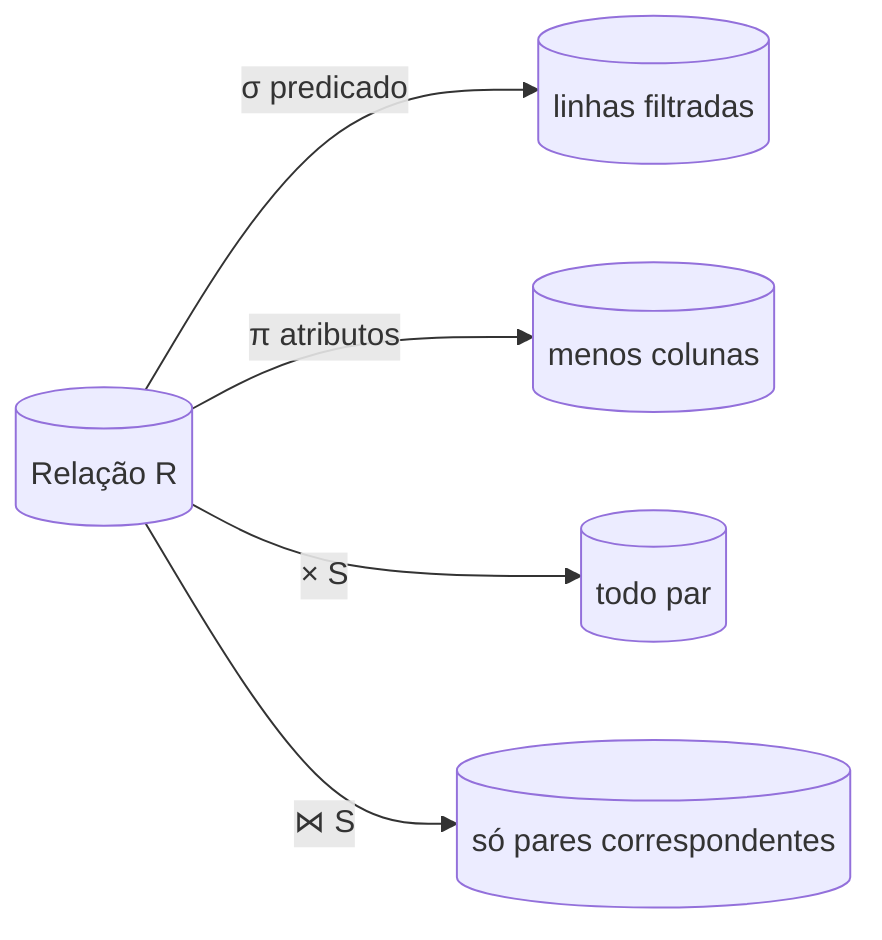

## Objetivos de Aprendizagem

- Definir formalmente uma relação como um subconjunto de um produto cartesiano de domínios, conectando-a à relação da teoria dos conjuntos já coberta em `foundations/discrete-math-logic`.
- Nomear e aplicar à mão os seis operadores centrais da álgebra relacional (σ, π, ∪, ∩, −, ×) mais o join (⋈) sobre relações pequenas e concretas.
- Explicar por que a álgebra relacional é um alvo *procedural* (ela fixa uma ordem de operações) enquanto o SQL é *declarativo*, e por que essa distinção importa para a otimização de consultas mais adiante nesta disciplina.
- Compor operadores numa consulta de vários passos e avaliá-la passo a passo sobre tuplas reais.

## Contexto e Motivação

`foundations/discrete-math-logic` já construiu duas exatamente das ideias de que este conceito precisa: `power-sets-and-cartesian-products` definiu o produto cartesiano de conjuntos, e `relations-and-their-properties` definiu uma relação como um subconjunto de um produto cartesiano, um conjunto de tuplas, cada uma tomando um elemento de cada domínio. O modelo relacional de Codd de 1970 não é uma abstração nova sobreposta a essa matemática; é essa mesma matemática, aplicada diretamente a tabelas de banco de dados. Uma relação (o que o SQL chama de tabela) é um conjunto de tuplas (linhas) tiradas do produto cartesiano de uma lista fixa de domínios (tipos de coluna): `Artist × Year × Country`, por exemplo, para uma relação `Artist` com três atributos. O trabalho deste conceito é reaplicar uma estrutura que os estudantes desta disciplina já provaram correta no abstrato, agora a algo concreto: linhas e colunas.

Uma vez que as relações estão fixadas como conjuntos, a próxima pergunta natural é: que operações as manipulam? A álgebra relacional responde isso com um conjunto pequeno e fechado de operadores: cada um recebe uma ou mais relações como entrada e produz uma nova relação como saída, então os operadores se compõem livremente em consultas arbitrariamente complexas. Esta é a fundação matemática exata sobre a qual o SQL fica: todo `SELECT` que um motor de banco de dados real executa é, por baixo, compilado em (algum equivalente de) uma expressão de álgebra relacional, que o bloco de processamento de consultas mais adiante nesta disciplina vai mostrar como executar com eficiência e como otimizar.

## Teoria Central

### Relações, atributos e tuplas

Uma **relação** `R` com atributos `A₁, A₂, …, Aₙ` (cada um tirado de um domínio `D₁, …, Dₙ`) é formalmente um subconjunto de `D₁ × D₂ × … × Dₙ`: exatamente o produto cartesiano que `power-sets-and-cartesian-products` já definiu, e exatamente uma relação no sentido que `relations-and-their-properties` já definiu, só que com um número fixo de "colunas" nomeadas (atributos) em vez de um par arbitrário. Uma **tupla** é um elemento desse subconjunto: uma linha. Como uma relação é um *conjunto* de tuplas, a álgebra relacional herda diretamente a semântica de conjuntos: nenhuma tupla duplicada e nenhuma ordem definida entre as tuplas (um fato importante que a otimização de consultas explora depois: a álgebra define *o que* calcular, e não *em que ordem* retornar).

### Os operadores centrais

Os operadores da álgebra relacional são baseados na álgebra de conjuntos (coleções não ordenadas, sem duplicatas), e cada um recebe relações e produz uma relação, de modo que eles se encadeiam em expressões mais longas:

- **Seleção** `σ_predicate(R)`: mantém só as tuplas de `R` que satisfazem `predicate`. `SELECT * FROM R WHERE …` compila para uma seleção.
- **Projeção** `π_A1,…,An(R)`: mantém só os atributos nomeados de cada tupla, descartando o resto (e eliminando quaisquer tuplas duplicadas resultantes, já que o resultado ainda precisa ser um conjunto).
- **União** `R ∪ S`: todas as tuplas que aparecem em `R`, em `S` ou em ambos (exige que `R` e `S` tenham os mesmos atributos).
- **Interseção** `R ∩ S`: as tuplas que aparecem tanto em `R` quanto em `S`.
- **Diferença** `R − S`: as tuplas de `R` que não aparecem em `S`.
- **Produto cartesiano** `R × S`: toda tupla de `R` pareada com toda tupla de `S`, exatamente a mesma operação de produto cartesiano reaplicada no nível de relação.
- **Join** `R ⋈ S`: tuplas formadas combinando uma tupla de `R` e uma de `S` que concordam no(s) seu(s) atributo(s) em comum; equivalente a um produto cartesiano seguido de uma seleção pela condição de correspondência, mas calculado com muito mais eficiência na prática (o assunto dos conceitos de algoritmos de join mais adiante nesta disciplina).

### SQL declarativo vs. álgebra procedural

A álgebra relacional fixa uma ordem específica de operações: `σ_b_id=102(R ⋈ S)` (filtrar depois do join) é uma expressão diferente de `R ⋈ (σ_b_id=102(S))` (filtrar um lado primeiro, depois fazer o join), mesmo quando as duas expressões têm *garantia* de produzir a mesma relação final. O SQL deliberadamente não pede ao usuário que escolha entre elas; ele pede só a resposta de alto nível ("as tuplas unidas de R e S onde S.b_id é igual a 102"), deixando o SGBD livre para escolher qualquer expressão algébrica equivalente que ele consiga executar mais rápido. Esta é precisamente a liberdade que o conceito de otimização de consultas mais adiante nesta disciplina explora: todo o trabalho de um otimizador é escolher, dentre muitas expressões algebricamente equivalentes para a mesma consulta declarativa, aquela com o menor custo real de execução.

## Exemplos Resolvidos

### Exemplo 1: seleção e projeção sobre uma única relação

Seja `R(a_id, b_id)` com quatro tuplas: `(a1,101), (a2,102), (a2,103), (a3,104)`.

`σ_a_id='a2'(R)` mantém só as tuplas onde `a_id = 'a2'`: `{(a2,102), (a2,103)}`.

`σ_a_id='a2' ∧ b_id>102(R)` acrescenta uma conjunção: `{(a2,103)}`; o equivalente em SQL é `SELECT * FROM R WHERE a_id='a2' AND b_id>102`.

`π_b_id-100,a_id(σ_a_id='a2'(R))` então projeta o resultado filtrado num atributo derivado `b_id-100` e em `a_id`: `{(2,a2), (3,a2)}`; o equivalente em SQL é `SELECT b_id-100, a_id FROM R WHERE a_id='a2'`, mostrando seleção e projeção se compondo diretamente numa consulta real.

### Exemplo 2: join sobre duas relações

Sejam `R(a_id, b_id) = {(a1,101), (a2,102), (a3,103)}` e `S(a_id, b_id, val) = {(a3,103,'XXX'), (a4,104,'YYY'), (a5,105,'ZZZ')}`.

`R ⋈ S` casa tuplas que concordam nos dois atributos compartilhados, `a_id` e `b_id`. Só `(a3,103)` de `R` e `(a3,103,'XXX')` de `S` concordam nos dois, então `R ⋈ S = {(a3,103,'XXX')}`, uma única tupla. Em SQL isto é `SELECT * FROM R NATURAL JOIN S`, ou equivalentemente `SELECT * FROM R JOIN S ON R.a_id = S.a_id AND R.b_id = S.b_id`. Note que o produto cartesiano `R × S` produziria, em vez disso, todas as 3×3 = 9 tuplas combinadas, a maioria delas combinações sem sentido que não correspondem a nenhum par real casado: o join é exatamente o subconjunto útil do produto.

### Exemplo 3: dois planos algebricamente equivalentes para a mesma consulta

Pegue a consulta "encontre as linhas de `R ⋈ S` onde `S.b_id = 102`". O Plano A calcula `σ_b_id=102(R ⋈ S)`: primeiro o join completo (todos os pares correspondentes), depois o filtro. O Plano B calcula `R ⋈ (σ_b_id=102(S))`: primeiro filtra `S` até só as linhas com `b_id=102` (neste conjunto de dados, nenhuma: `S` não tem linha com `b_id=102`), depois faz o join do resultado filtrado, muito menor, contra `R`. Os dois planos têm garantia de retornar a relação final idêntica (os operadores da álgebra relacional são comprovadamente equivalentes aqui), mas o Plano B faz muito menos trabalho quando o filtro de `S` é seletivo, já que o join só processa as linhas já filtradas. Esta é exatamente a escolha que um otimizador de consultas real, vários conceitos adiante, é construído para fazer automaticamente.

## Equívocos Comuns e Armadilhas

- **"Uma relação é só uma tabela, então esta é uma questão de sintaxe, e não matemática."** Uma relação ser uma tabela é exatamente o *ponto*: o modelo relacional é a decisão de modelar tabelas usando teoria dos conjuntos comum (uma relação é um subconjunto de um produto cartesiano) em vez de inventar estruturas sob medida específicas de banco de dados, e é precisamente por isso que `relations-and-their-properties` e `power-sets-and-cartesian-products` se transferem para cá sem modificação, em vez de precisarem ser rederivados.
- **"Como uma relação é um conjunto, as tabelas SQL também nunca têm linhas duplicadas."** As tabelas SQL, como implementadas por sistemas reais, são tecnicamente *multiconjuntos* (bags) por padrão: um `SELECT` sem `DISTINCT` pode retornar, e retorna, linhas duplicadas. É um desvio prático deliberado da semântica de conjuntos do modelo relacional puro, feito porque eliminar duplicatas em toda consulta custaria computação real, frequentemente desnecessária.
- **"A álgebra relacional diz ao SGBD como executar uma consulta."** A álgebra relacional fixa só uma ordem lógica de *operações de conjunto*, e não uma estratégia física de execução: `R ⋈ S` não diz nada sobre se o join é executado como nested-loop, hash join ou sort-merge join (o assunto dos conceitos de algoritmos de join mais adiante nesta disciplina). A álgebra é o alvo lógico; os operadores físicos são uma decisão separada, de nível mais baixo, que o processador de consultas toma.

## Resumo

Uma relação é precisamente um subconjunto de um produto cartesiano de domínios (a mesma relação da teoria dos conjuntos que `relations-and-their-properties` já definiu, agora aplicada a linhas e colunas), e a álgebra relacional é um conjunto pequeno e fechado de operadores (σ seleção, π projeção, ∪, ∩, −, ×, ⋈ join) que recebem relações e produzem relações, compondo-se em consultas arbitrariamente complexas. O SQL é declarativo precisamente porque pede só a relação desejada, deixando o SGBD livre para escolher entre muitas expressões algebricamente equivalentes (e, mais tarde, muitas estratégias físicas de execução) para calculá-la, a liberdade que todo conceito desta disciplina, da indexação à otimização de consultas, existe para explorar.

## Documentation Links

- [CMU 15-445/645: Relational Model & Relational Algebra Slides](https://15445.courses.cs.cmu.edu/fall2025/slides/01-relationalmodel.pdf): a fonte principal do conjunto de operadores deste conceito (σ, π, ∪, ∩, −, ×, ⋈) e das suas correspondências em SQL, percorridos na mesma ordem aqui.
- [Database System Concepts (Silberschatz, Korth, Sudarshan): Companion Site](https://www.db-book.com/): o tratamento padrão de livro-texto do modelo relacional e da álgebra relacional, útil para as definições formais da teoria dos conjuntos que este conceito constrói a partir de `power-sets-and-cartesian-products` e `relations-and-their-properties`.
