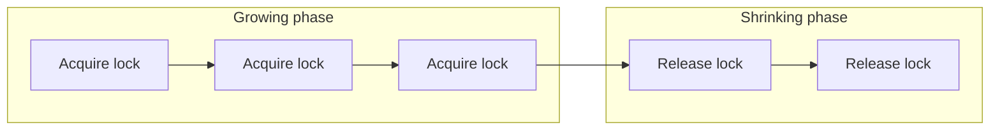

## Learning Objectives

- Define shared and exclusive locks at the granularity of a database tuple/page, connecting them to the same lock primitive already built for shared-memory variables.
- State the Two-Phase Locking (2PL) protocol precisely: a growing phase that only acquires locks, followed by a shrinking phase that only releases them.
- Build a precedence graph for a schedule and use it to determine whether that schedule is conflict serializable.
- Explain why Strict 2PL — holding every lock until commit or abort — is needed on top of basic 2PL to eliminate cascading aborts.

## Context & Motivation

`concurrency-anomalies-dirty-reads-and-lost-updates` showed, with real numbers, exactly what goes wrong with no concurrency control at all: a dirty read of an in-progress transfer produced a wrong total (`$700` instead of `$800`), and that same dirty read created a real cascading-abort risk once the transferring transaction later aborted. `computer/operating-systems-i`'s `locks-and-atomic-hardware-primitives` already built the general mechanism this concept needs to prevent exactly that: a lock, acquired before touching a shared resource and released afterward, so that two threads never observe each other's half-finished work on the same variable. **Two-Phase Locking (2PL)** is that same lock primitive, applied not to a shared-memory variable but to individual database tuples or pages — with one additional structural rule (the "two phases") that is exactly what makes the resulting schedules provably equivalent to some serial execution, closing the gap `acid-properties-precisely-defined` left open.

## Core Theory

### Shared and exclusive locks, now per-tuple

A transaction acquires a **shared (S) lock** on a data item before reading it, and an **exclusive (X) lock** before writing it. Multiple transactions may hold S-locks on the same item simultaneously (readers don't conflict with each other), but an X-lock is exclusive against every other lock, of either kind, on that same item — exactly the shared/exclusive distinction real lock implementations already make, just scoped here to one tuple or page instead of one shared-memory variable.

### The Two-Phase Locking protocol

**2PL** adds exactly one structural rule on top of ordinary locking: every transaction is divided into a **growing phase**, during which it may only *acquire* locks (never release any), and a **shrinking phase**, during which it may only *release* locks (never acquire any new one) — once a transaction releases its first lock, it can never go back to acquiring more.

This single rule — never acquire after releasing — is what the **2PL theorem** shows is sufficient to guarantee every resulting schedule is **conflict serializable**: equivalent, in its final effect, to some serial (one-transaction-at-a-time) execution of the same transactions, exactly the Isolation guarantee `acid-properties-precisely-defined` defined abstractly.

### Conflict serializability and the precedence graph

Two operations **conflict** if they come from different transactions, act on the same data item, and at least one of them is a write. A schedule is **conflict serializable** if its operations can be reordered, by repeatedly swapping adjacent *non-conflicting* operations, into some serial schedule — equivalently (and far easier to check mechanically), if its **precedence graph** has no cycle: draw one node per transaction, and a directed edge `Tᵢ → Tⱼ` whenever some operation of `Tᵢ` conflicts with, and comes before, some operation of `Tⱼ`. A cycle in this graph means no consistent "who went first" ordering exists among the involved transactions — exactly the situation `concurrency-anomalies-dirty-reads-and-lost-updates`'s unconstrained schedule produced.

### Strict 2PL: additionally avoiding cascading aborts

Basic 2PL's shrinking phase may begin releasing locks — including on data a transaction has already written — well before that transaction actually commits, which still leaves the door open for another transaction to read that not-yet-committed write (a dirty read) during the gap between the write's lock being released and the writer's eventual commit or abort. **Strict 2PL** closes that gap with one further rule: hold *every* lock, both S and X, until the transaction actually commits or aborts — the shrinking phase, in effect, collapses to a single instant at transaction end. This is the version essentially every real system implements, specifically because it eliminates cascading aborts entirely: no other transaction can ever acquire a lock on data a still-active transaction has written, so no other transaction can ever read it before it's either safely committed or rolled back.

## Worked Examples

### Example 1 — 2PL forces a correct total, where no locking produced a wrong one

Reusing `concurrency-anomalies-dirty-reads-and-lost-updates`'s Example 1 (`A = $500`, `B = $300`, `T1` transfers `$100` from `A` to `B`, `T2` sums the total): under 2PL, `T1`'s growing phase must acquire `XLock(A)` **and** `XLock(B)` — completing both its `W(A) = 400` and `W(B) = 400` — before it can release either lock and enter its shrinking phase. `T2` requesting `SLock(A)` while `T1` still holds `XLock(A)` simply **blocks** until `T1` releases it. Two outcomes are now possible, and both are correct: either `T2` acquires its locks *before* `T1`'s growing phase starts (reading the pre-transfer state, `A=500, B=300`, total `$800`), or `T2` acquires them *after* `T1` has finished both writes and begun releasing locks (reading `A=400, B=400`, total still `$800`). The interleaved, half-transferred view that produced `$700` with no locking at all — reading `A`'s new value but `B`'s old one — is now structurally impossible: 2PL's growing-phase rule forces both of `T1`'s writes to complete before *either* lock is released, so `T2` can never observe one without the other.

### Example 2 — the precedence graph, with and without 2PL

The no-locking schedule from the previous concept has `T1` write `A` before `T2` reads it (a WR conflict, edge `T1 → T2`) and `T2` read `B` before `T1` writes it (an RW conflict, edge `T2 → T1`) — two edges forming a 2-node cycle `T1 → T2 → T1`, confirming that schedule is **not** conflict serializable, exactly matching its observably wrong result. Example 1's 2PL-forced schedule instead has only one possible conflict ordering per run: if `T2` runs first, every one of its conflicting operations precedes `T1`'s (all edges point `T2 → T1`, no cycle); if `T2` runs after `T1`'s locks release, every edge points `T1 → T2`, again no cycle. Either resulting graph is acyclic, confirming both are conflict serializable — consistent with `T2` always computing the correct `$800`.

### Example 3 — basic 2PL still permits a dirty read; Strict 2PL does not

Suppose, in Example 1's second outcome, `T1`'s shrinking phase releases `XLock(A)` immediately after finishing `W(B)` (legal under **basic** 2PL, since both locks were already acquired and both writes already made before any release) — but `T1` has not yet committed. `T2` acquires `SLock(A)` at that moment and reads `A = 400`, a value that is fully consistent with `B`'s (still locked, soon-to-be-visible) new value, so `T2`'s eventual total is still correct. But if `T1` then hits an error and **aborts**, rolling `A` and `B` back to `500`/`300`, `T2` has already read and acted on `A = 400` — a value that, after the rollback, never existed in the database's committed history, exactly the cascading-abort risk `concurrency-anomalies-dirty-reads-and-lost-updates`'s Example 3 raised. **Strict 2PL** prevents this outright: it would keep `XLock(A)` held until `T1`'s actual commit or abort, so `T2`'s `SLock(A)` request simply blocks until `T1` is fully resolved one way or the other — `T2` either reads `A`'s safely-committed new value or, if `T1` aborted, `A`'s unchanged original value, but never a value that might still be rolled back out from under it.

## Common Misconceptions & Pitfalls

- **"2PL means a transaction can only hold two locks at a time."** "Two-phase" refers to the two *phases* of a transaction's lifetime with respect to locking (growing, then shrinking), not to a count of two locks — a transaction under 2PL may acquire arbitrarily many locks during its growing phase, exactly as `T1` acquires both `XLock(A)` and `XLock(B)` in the examples above.
- **"Basic 2PL already prevents dirty reads, since it guarantees serializability."** Example 3 shows these are genuinely separate guarantees: basic 2PL guarantees the *final result* is equivalent to some serial order (serializability), but says nothing about whether a transaction might read another's not-yet-committed write during the gap between an early lock release and that writer's eventual commit or abort — Strict 2PL is a strictly additional rule needed to close that specific gap.
- **"A cycle in the precedence graph means the schedule produced a wrong final value."** A cyclic precedence graph means the schedule is *not guaranteed* to be equivalent to any serial order — it doesn't necessarily mean the specific numeric result was wrong in every case, only that no consistent serial explanation for the schedule exists; `concurrency-anomalies-dirty-reads-and-lost-updates`'s Example 1 happens to also produce a visibly wrong total, but the precedence-graph cycle is the general, mechanical certificate of non-serializability, independent of whether a specific run's output happens to look plausible.

## Summary

Two-Phase Locking applies the same shared/exclusive lock primitive `locks-and-atomic-hardware-primitives` already built for shared-memory variables, now scoped to individual database tuples or pages, with one added structural rule: a growing phase that only acquires locks, followed by a shrinking phase that only releases them. That single rule is what the 2PL theorem shows is sufficient to guarantee conflict serializability — verified mechanically via an acyclic precedence graph — and Example 1 shows it concretely fixing the exact wrong-total anomaly the previous concept demonstrated. Basic 2PL alone, however, can still permit a dirty read during the gap between an early lock release and eventual commit; **Strict 2PL**, which holds every lock until commit or abort, is the version real systems actually implement, specifically because it additionally eliminates cascading aborts entirely — the exact danger `concurrency-anomalies-dirty-reads-and-lost-updates` raised and this concept's Example 3 closes.

## Documentation Links

- [CMU 15-445/645 — Two-Phase Locking Concurrency Control Slides](https://15445.courses.cs.cmu.edu/fall2025/slides/18-twophaselocking.pdf) — the primary source for this concept's 2PL protocol definition, the 2PL theorem, and the Strict 2PL variant this concept builds on top of basic 2PL.
- [Berkeley CS186 — Course Notes (Transactions & Concurrency)](https://cs186berkeley.net/notes/) — covers conflict serializability and the precedence-graph cycle-detection test used in this concept's worked examples to verify schedules mechanically.
