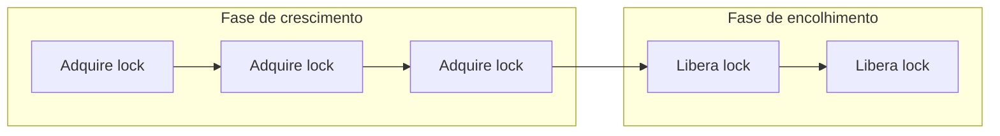

## Objetivos de Aprendizagem

- Definir locks compartilhados e exclusivos na granularidade de uma tupla/página de banco de dados, conectando-os à mesma primitiva de lock já construída para variáveis de memória compartilhada.
- Enunciar com precisão o protocolo Two-Phase Locking (2PL): uma fase de crescimento que só adquire locks, seguida de uma fase de encolhimento que só os libera.
- Construir um grafo de precedência para um agendamento e usá-lo para determinar se esse agendamento é serializável por conflito.
- Explicar por que o 2PL Estrito (segurar todo lock até o commit ou aborto) é necessário além do 2PL básico para eliminar os abortos em cascata.

## Contexto e Motivação

`concurrency-anomalies-dirty-reads-and-lost-updates` mostrou, com números reais, exatamente o que dá errado sem controle de concorrência algum: uma leitura suja de uma transferência em andamento produziu um total errado (`$700` em vez de `$800`), e essa mesma leitura suja criou um risco real de aborto em cascata quando a transação de transferência depois abortou. `locks-and-atomic-hardware-primitives`, de `computer/operating-systems-i`, já construiu o mecanismo geral de que este conceito precisa para evitar exatamente isso: um lock, adquirido antes de tocar um recurso compartilhado e liberado depois, para que duas threads nunca observem o trabalho pela metade uma da outra sobre a mesma variável. O **Two-Phase Locking (2PL)** é essa mesma primitiva de lock, aplicada não a uma variável de memória compartilhada, mas a tuplas ou páginas individuais do banco de dados, com uma regra estrutural adicional (as "duas fases") que é exatamente o que torna os agendamentos resultantes comprovadamente equivalentes a alguma execução serial, fechando a lacuna que `acid-properties-precisely-defined` deixou em aberto.

## Teoria Central

### Locks compartilhados e exclusivos, agora por tupla

Uma transação adquire um **lock compartilhado (S)** sobre um item de dados antes de lê-lo, e um **lock exclusivo (X)** antes de escrevê-lo. Múltiplas transações podem segurar locks S sobre o mesmo item simultaneamente (leitores não conflitam entre si), mas um lock X é exclusivo contra todo outro lock, de qualquer tipo, sobre aquele mesmo item: exatamente a distinção entre compartilhado/exclusivo que implementações reais de lock já fazem, só que com escopo aqui numa tupla ou página em vez de numa variável de memória compartilhada.

### O protocolo Two-Phase Locking

O **2PL** acrescenta exatamente uma regra estrutural em cima do locking comum: toda transação é dividida numa **fase de crescimento**, durante a qual ela só pode *adquirir* locks (nunca liberar nenhum), e numa **fase de encolhimento**, durante a qual ela só pode *liberar* locks (nunca adquirir um novo). Uma vez que uma transação libera o seu primeiro lock, ela nunca mais pode voltar a adquirir outros.

Esta única regra (nunca adquirir depois de liberar) é o que o **teorema do 2PL** mostra ser suficiente para garantir que todo agendamento resultante seja **serializável por conflito**: equivalente, no seu efeito final, a alguma execução serial (uma transação por vez) das mesmas transações, exatamente a garantia de Isolamento que `acid-properties-precisely-defined` definiu em abstrato.

### Serializabilidade por conflito e o grafo de precedência

Duas operações **conflitam** se vêm de transações diferentes, agem sobre o mesmo item de dados e pelo menos uma delas é uma escrita. Um agendamento é **serializável por conflito** se as suas operações podem ser reordenadas, trocando repetidamente operações adjacentes *que não conflitam*, até formar algum agendamento serial; de forma equivalente (e muito mais fácil de checar mecanicamente), se o seu **grafo de precedência** não tiver ciclo: desenhe um nó por transação, e uma aresta dirigida `Tᵢ → Tⱼ` sempre que alguma operação de `Tᵢ` conflitar com, e vier antes de, alguma operação de `Tⱼ`. Um ciclo neste grafo significa que não existe nenhuma ordem consistente de "quem foi primeiro" entre as transações envolvidas, exatamente a situação que o agendamento sem restrições de `concurrency-anomalies-dirty-reads-and-lost-updates` produziu.

### 2PL Estrito: evitando adicionalmente os abortos em cascata

A fase de encolhimento do 2PL básico pode começar a liberar locks (incluindo sobre dados que uma transação já escreveu) bem antes de essa transação de fato confirmar, o que ainda deixa a porta aberta para outra transação ler essa escrita ainda não confirmada (uma leitura suja) durante o intervalo entre a liberação do lock da escrita e o eventual commit ou aborto de quem escreveu. O **2PL Estrito** fecha esse intervalo com mais uma regra: segurar *todo* lock, tanto S quanto X, até que a transação de fato confirme ou aborte; a fase de encolhimento, na prática, colapsa para um único instante no fim da transação. Esta é a versão que essencialmente todo sistema real implementa, especificamente porque ela elimina os abortos em cascata por completo: nenhuma outra transação pode jamais adquirir um lock sobre dados que uma transação ainda ativa escreveu, então nenhuma outra transação pode jamais lê-los antes que eles sejam confirmados com segurança ou revertidos.

## Exemplos Resolvidos

### Exemplo 1: o 2PL força um total correto, onde a ausência de locks produziu um errado

Reutilizando o Exemplo 1 de `concurrency-anomalies-dirty-reads-and-lost-updates` (`A = $500`, `B = $300`, `T1` transfere `$100` de `A` para `B`, `T2` soma o total): sob o 2PL, a fase de crescimento de `T1` precisa adquirir `XLock(A)` **e** `XLock(B)` (completando tanto o seu `W(A) = 400` quanto o seu `W(B) = 400`) antes de poder liberar qualquer um dos locks e entrar na sua fase de encolhimento. `T2` pedindo `SLock(A)` enquanto `T1` ainda segura `XLock(A)` simplesmente **bloqueia** até que `T1` o libere. Dois resultados agora são possíveis, e os dois estão corretos: ou `T2` adquire os seus locks *antes* que a fase de crescimento de `T1` comece (lendo o estado anterior à transferência, `A=500, B=300`, total `$800`), ou `T2` os adquire *depois* que `T1` terminou as duas escritas e começou a liberar locks (lendo `A=400, B=400`, total ainda `$800`). A visão intercalada, de transferência pela metade, que produziu `$700` sem locks (lendo o valor novo de `A`, mas o valor antigo de `B`) agora é estruturalmente impossível: a regra da fase de crescimento do 2PL força as duas escritas de `T1` a completarem antes que *qualquer um* dos locks seja liberado, então `T2` nunca consegue observar uma sem a outra.

### Exemplo 2: o grafo de precedência, com e sem 2PL

O agendamento sem locks do conceito anterior tem `T1` escrevendo `A` antes de `T2` lê-lo (um conflito WR, aresta `T1 → T2`) e `T2` lendo `B` antes de `T1` escrevê-lo (um conflito RW, aresta `T2 → T1`): duas arestas formando um ciclo de 2 nós `T1 → T2 → T1`, confirmando que aquele agendamento **não** é serializável por conflito, batendo exatamente com o seu resultado observavelmente errado. O agendamento forçado pelo 2PL do Exemplo 1, em vez disso, tem só uma ordem de conflito possível por execução: se `T2` roda primeiro, toda operação conflitante dela precede as de `T1` (todas as arestas apontam `T2 → T1`, sem ciclo); se `T2` roda depois que os locks de `T1` são liberados, toda aresta aponta `T1 → T2`, de novo sem ciclo. Qualquer um dos grafos resultantes é acíclico, confirmando que os dois são serializáveis por conflito, consistente com `T2` sempre calcular os `$800` corretos.

### Exemplo 3: o 2PL básico ainda permite uma leitura suja; o 2PL Estrito não

Suponha que, no segundo resultado do Exemplo 1, a fase de encolhimento de `T1` libere `XLock(A)` imediatamente depois de terminar `W(B)` (legal sob o 2PL **básico**, já que os dois locks já tinham sido adquiridos e as duas escritas já tinham sido feitas antes de qualquer liberação), mas `T1` ainda não confirmou. `T2` adquire `SLock(A)` nesse momento e lê `A = 400`, um valor totalmente consistente com o valor novo de `B` (ainda com lock, prestes a ficar visível), então o total eventual de `T2` ainda está correto. Mas se `T1` então encontra um erro e **aborta**, revertendo `A` e `B` para `500`/`300`, `T2` já leu e agiu com base em `A = 400`, um valor que, depois da reversão, nunca existiu no histórico confirmado do banco de dados, exatamente o risco de aborto em cascata que o Exemplo 3 de `concurrency-anomalies-dirty-reads-and-lost-updates` levantou. O **2PL Estrito** evita isso de imediato: ele manteria `XLock(A)` até o commit ou aborto real de `T1`, então o pedido de `SLock(A)` de `T2` simplesmente bloqueia até que `T1` esteja totalmente resolvida, para um lado ou para o outro. `T2` ou lê o valor novo de `A`, confirmado com segurança, ou, se `T1` abortou, o valor original e inalterado de `A`, mas nunca um valor que ainda possa ser revertido debaixo dos seus pés.

## Equívocos Comuns e Armadilhas

- **"2PL significa que uma transação só pode segurar dois locks ao mesmo tempo."** "Duas fases" se refere às duas *fases* da vida de uma transação em relação ao locking (crescimento, depois encolhimento), e não a uma contagem de dois locks. Uma transação sob 2PL pode adquirir arbitrariamente muitos locks durante a sua fase de crescimento, exatamente como `T1` adquire tanto `XLock(A)` quanto `XLock(B)` nos exemplos acima.
- **"O 2PL básico já evita leituras sujas, já que garante a serializabilidade."** O Exemplo 3 mostra que estas são garantias genuinamente separadas: o 2PL básico garante que o *resultado final* seja equivalente a alguma ordem serial (serializabilidade), mas não diz nada sobre se uma transação pode ler a escrita ainda não confirmada de outra durante o intervalo entre uma liberação antecipada de lock e o eventual commit ou aborto de quem escreveu. O 2PL Estrito é uma regra estritamente adicional, necessária para fechar esse intervalo específico.
- **"Um ciclo no grafo de precedência significa que o agendamento produziu um valor final errado."** Um grafo de precedência cíclico significa que o agendamento *não tem garantia* de ser equivalente a nenhuma ordem serial; isso não significa necessariamente que o resultado numérico específico esteve errado em todo caso, só que não existe nenhuma explicação serial consistente para o agendamento. O Exemplo 1 de `concurrency-anomalies-dirty-reads-and-lost-updates` calha de também produzir um total visivelmente errado, mas o ciclo no grafo de precedência é o certificado geral e mecânico de não serializabilidade, independentemente de a saída de uma execução específica parecer plausível.

## Resumo

O Two-Phase Locking aplica a mesma primitiva de lock compartilhado/exclusivo que `locks-and-atomic-hardware-primitives` já construiu para variáveis de memória compartilhada, agora com escopo em tuplas ou páginas individuais do banco de dados, com uma regra estrutural acrescentada: uma fase de crescimento que só adquire locks, seguida de uma fase de encolhimento que só os libera. Essa única regra é o que o teorema do 2PL mostra ser suficiente para garantir a serializabilidade por conflito (verificada mecanicamente via um grafo de precedência acíclico), e o Exemplo 1 a mostra consertando concretamente a exata anomalia de total errado que o conceito anterior demonstrou. O 2PL básico sozinho, porém, ainda pode permitir uma leitura suja durante o intervalo entre uma liberação antecipada de lock e o eventual commit; o **2PL Estrito**, que segura todo lock até o commit ou aborto, é a versão que sistemas reais de fato implementam, especificamente porque ele elimina adicionalmente os abortos em cascata por completo, o exato perigo que `concurrency-anomalies-dirty-reads-and-lost-updates` levantou e que o Exemplo 3 deste conceito fecha.

## Documentation Links

- [CMU 15-445/645: Two-Phase Locking Concurrency Control Slides](https://15445.courses.cs.cmu.edu/fall2025/slides/18-twophaselocking.pdf): a fonte principal da definição do protocolo 2PL deste conceito, do teorema do 2PL e da variante 2PL Estrito que este conceito constrói em cima do 2PL básico.
- [Berkeley CS186: Course Notes (Transactions & Concurrency)](https://cs186berkeley.net/notes/): cobre a serializabilidade por conflito e o teste de detecção de ciclos no grafo de precedência usado nos exemplos resolvidos deste conceito para verificar agendamentos mecanicamente.
