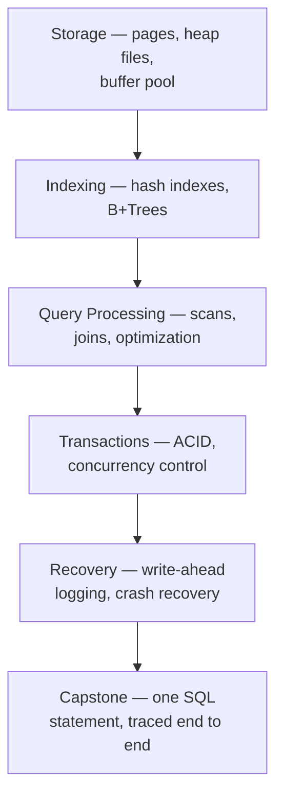

## Learning Objectives

- State precisely what a DBMS is responsible for that an application-level flat-file scheme cannot provide.
- Explain why "just using SQL" and "building a database engine" are genuinely different skills, and why this discipline is the second one.
- List the layers a DBMS is built from (storage, indexing, query processing, transactions, recovery) and how they map onto the rest of this discipline's structure.
- Distinguish this discipline's scope from a course on using existing databases in practice.

## Context & Motivation

Almost every working engineer has *used* a database — written a `SELECT`, designed a schema, tuned an index. Far fewer have ever asked what actually happens inside the software between typing that `SELECT` and getting rows back. That gap is exactly this discipline's subject. CMU's own database-systems course states its scope in almost these exact words: "This course is about the design/implementation of database management systems (DBMSs). This is not a course about how to use a DBMS to build applications or how to administer a DBMS." That is the same distinction this discipline draws relative to the Complementary Studies `database-concepts` track already published on this platform — that track is 136 concepts of practical, polyglot usage across nine real technologies (Postgres, MongoDB, DynamoDB, Cassandra, Redis, CouchDB, Neo4j, HBase and more): how to model data, tune configuration, pick the right index for a workload, troubleshoot a slow query. This discipline instead asks how *any* of that machinery is built in the first place — the storage engine, the index structure, the lock manager, the recovery log — from the inside.

To see why that inside view is a genuinely different problem, imagine building a simple alternative to a database yourself: store each entity as a CSV file (`Artist(name, year, country)`, `Album(name, artist, year)`), and have application code parse a file every time it needs to read or update a record. This "flat-file strawman" looks deceptively simple, and for a single-user, single-machine toy it even works. But it breaks in specific, concrete ways the moment real requirements show up. Data integrity: how does the application guarantee that every album's artist name matches spelling exactly, or that deleting an artist doesn't leave its albums pointing at nothing? Implementation: how do you find one particular record without scanning the entire file, and what happens when a second application — maybe running on a different machine entirely — wants to read or write the same file at the same time? Durability: what happens if the machine crashes in the middle of rewriting a file, or if the data needs to be replicated across multiple machines for availability? A DBMS exists specifically to answer all of these questions once, correctly, so that no application built on top of it has to solve them again from scratch.

## Core Theory

### What a DBMS actually is

A **database** is an organized collection of inter-related data modeling some aspect of the real world — the core component of essentially every non-trivial application. A **database management system (DBMS)** is the software layer that allows applications to store and query that data in accordance with a **data model**: a collection of concepts and rules for describing what kinds of things can exist and how they relate to each other. A **schema** is a concrete description of one particular collection of data using a given data model — without a schema, stored bytes have no meaning at all, just an undifferentiated sequence of bits. The relational model — the subject of the next concept — is the data model this entire discipline builds around, but it is worth knowing it is one option among several real alternatives in production use today: key/value, document (JSON/XML/object), wide-column, graph, and array (vector/tensor) data models each make different trade-offs, and a real engineer's job increasingly includes choosing among them, not just using the relational one by default.

### The five layers this discipline builds, in order

A DBMS is not one monolithic piece of software — it is a stack of increasingly higher-level services, each built on top of the guarantees the layer below it provides, and this discipline is organized to build the stack in exactly that order:

**Storage** answers: given that disks are organized into fixed-size blocks, how does a DBMS lay out tuples (rows) inside pages, and how does it manage a cache of pages in memory? **Indexing** answers: given a page-organized heap of tuples, how does a lookup avoid scanning every single page? **Query processing** answers: given indexes exist, how does a declarative query — "give me all rows where X" — get compiled into an actual sequence of operations, and how are two tables joined efficiently? **Transactions** answers: when many clients read and write concurrently, how does the system guarantee each one sees a consistent, isolated view of the data? **Recovery** answers: if the machine crashes mid-write, how does the system come back up in a state consistent with exactly the transactions that had actually committed? The capstone at the end of this discipline traces one real SQL statement through every one of these layers in a single worked example, showing they are not five independent topics but five cooperating parts of one engine.

### Why this is a "systems" discipline, not a "language" discipline

Learning SQL is learning a language: syntax, semantics, how to phrase a query so it returns the rows you want. Building a DBMS is systems work in the same sense as building an operating system or a compiler — it is about managing scarce physical resources (disk I/O, memory, CPU, concurrent access) correctly and efficiently underneath a much simpler-looking interface. This is exactly the same posture this platform's other `systems` disciplines already take toward their subject matter (`operating-systems-ii` toward the kernel, `computer-networks` toward the protocol stack) — the visible interface (a shell prompt, a URL bar, a `SELECT` statement) is a thin layer over a large and carefully engineered machine, and this discipline's job is to build that machine, concept by concept, from the disk block upward.

## Worked Examples

### Example 1 — the flat-file strawman fails on a two-table join

Continuing the `Artist`/`Album` example above: suppose the application needs "the year GZA went solo." With flat files, this means opening `Artist.csv`, scanning every line, parsing each into fields, and checking whether the first field equals `"GZA"` — an O(n) scan implemented by hand in application code, repeated identically in every application that ever needs this answer. A DBMS instead exposes this as a single declarative query, `SELECT year FROM artists WHERE name = 'GZA'`, and the query processing and indexing layers built later in this discipline are exactly what make that query fast without the application ever writing a scan loop itself.

### Example 2 — two applications, one file, no DBMS

Suppose a second application, running on a different machine, also wants to update `Album.csv` to record a new release at the same moment the first application is deleting an artist. With flat files, nothing coordinates these two writes: the first application might read the artist file, decide it's safe to delete a row, and write it back — while the second application is mid-way through appending an album referencing exactly that artist, with the two file-writes racing each other with no defined outcome. This is a real instance of the concurrent-access problem that the Transactions cluster of this discipline (ACID, two-phase locking, isolation levels) is built specifically to eliminate: a DBMS guarantees each client's work appears to run as if it were the only one running, no matter how many actually execute at once.

### Example 3 — a crash mid-write

Suppose the application is in the middle of rewriting `Artist.csv` (removing one artist, keeping the rest) when the machine loses power. Depending on exactly which bytes had been flushed to disk before the crash, the file on disk after reboot could be the old version, the new version, or — worst of all — a corrupted mixture of both, with no way for the application to know which. The Recovery cluster of this discipline (write-ahead logging, ARIES-style crash recovery) exists to make this exact scenario safe: a DBMS is built so that after any crash, at any point in the middle of any write, the data it recovers to is guaranteed to reflect exactly the set of transactions that had actually committed — no more, no less.

## Common Misconceptions & Pitfalls

- **"I know SQL, so I already understand how databases work."** Knowing SQL is knowing a declarative interface to a database; it says nothing about how a query gets turned into an efficient sequence of disk reads, how concurrent transactions are kept from corrupting each other's work, or how a crash mid-write is recovered from safely — exactly the material this discipline covers, and exactly the material `database-concepts` (Complementary Studies) does not, since that track is about using real systems well, not building one.
- **"A database is just a smarter file system."** A file system and a DBMS share some real, worked-out cross-links in this discipline (page-based I/O, journaling as the ancestor of write-ahead logging) — but a DBMS adds an entire relational (or other) data model, a declarative query language compiled into an execution plan, and transactional guarantees (ACID) that a general-purpose file system makes no attempt to provide; the similarity is at the storage layer only, not the whole system.
- **"Building a toy database engine is mostly about writing a fast parser for SQL."** Parsing SQL is a small, mechanical piece of the whole system (not covered in depth in this discipline, since the relational-model/relational-algebra concept next door covers the target the parser compiles into); the actual hard engineering — and the actual subject of this discipline — is everything downstream of parsing: storage layout, indexing, join algorithms, concurrency control, and crash recovery.

## Summary

A DBMS exists to solve exactly the problems a naive flat-file scheme cannot: atomic and durable writes, safe concurrent access from many clients at once, surviving a crash mid-write, and a declarative query interface that hides all of that complexity behind a simple-looking language. This discipline is not about learning to use one of these systems — that is `database-concepts`'s job, already covered elsewhere on this platform across nine real technologies — it is about building one, layer by layer: storage and the buffer pool, then indexing (hash tables and B+Trees), then query processing (scans, joins, optimization), then transactions (ACID, concurrency control, isolation), then recovery (write-ahead logging, crash recovery), ending in a capstone that traces one real SQL statement through every one of those layers in a single connected story.

## Documentation Links

- [CMU 15-445/645 — Relational Model & Course Overview Slides](https://15445.courses.cs.cmu.edu/fall2025/slides/01-relationalmodel.pdf) — the source of this concept's own course-scope framing ("design/implementation of a DBMS," not "how to use one"), stated here almost verbatim.
- [ACM/IEEE CS2013 — Data Management (DM) Knowledge Area](https://csed.acm.org/knowledge-areas-data-management-dm-cs2013-version/) — the curricular standard defining DBMS internals (storage, indexing, transactions, recovery) as their own knowledge area distinct from applied database usage, backing this concept's claim that building and using a DBMS are different skills.
