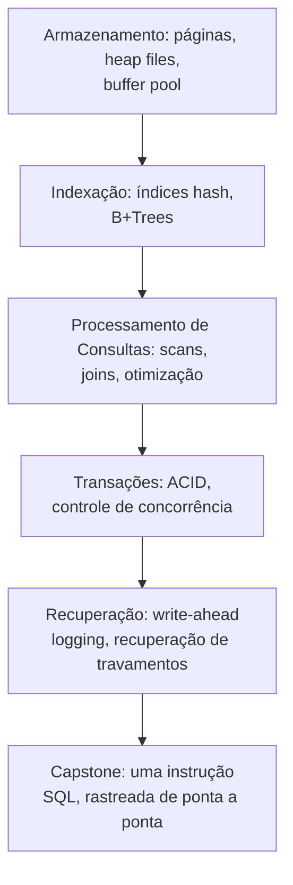

## Objetivos de Aprendizagem

- Enunciar com precisão pelo que um SGBD é responsável e que um esquema de arquivos planos no nível da aplicação não consegue fornecer.
- Explicar por que "só usar SQL" e "construir um motor de banco de dados" são habilidades genuinamente diferentes, e por que esta disciplina é a segunda.
- Listar as camadas a partir das quais um SGBD é construído (armazenamento, indexação, processamento de consultas, transações, recuperação) e como elas se mapeiam no restante da estrutura desta disciplina.
- Distinguir o escopo desta disciplina de um curso sobre o uso de bancos de dados existentes na prática.

## Contexto e Motivação

Quase todo engenheiro em atividade já *usou* um banco de dados: escreveu um `SELECT`, projetou um schema, ajustou um índice. Muito menos gente já perguntou o que de fato acontece dentro do software entre digitar esse `SELECT` e receber as linhas de volta. Essa lacuna é exatamente o assunto desta disciplina. O próprio curso de sistemas de banco de dados da CMU enuncia o seu escopo quase exatamente com estas palavras: "This course is about the design/implementation of database management systems (DBMSs). This is not a course about how to use a DBMS to build applications or how to administer a DBMS." Essa é a mesma distinção que esta disciplina traça em relação à trilha de Estudos Complementares `database-concepts` já publicada nesta plataforma: aquela trilha tem 136 conceitos de uso prático e poliglota em nove tecnologias reais (Postgres, MongoDB, DynamoDB, Cassandra, Redis, CouchDB, Neo4j, HBase e mais): como modelar dados, ajustar configuração, escolher o índice certo para uma carga de trabalho, investigar uma consulta lenta. Esta disciplina, em vez disso, pergunta como *qualquer* dessa maquinaria é construída, para começo de conversa (o motor de armazenamento, a estrutura de índice, o gerenciador de locks, o log de recuperação), por dentro.

Para ver por que essa visão interna é um problema genuinamente diferente, imagine construir você mesmo uma alternativa simples a um banco de dados: guardar cada entidade como um arquivo CSV (`Artist(name, year, country)`, `Album(name, artist, year)`), e fazer o código da aplicação analisar um arquivo toda vez que precisa ler ou atualizar um registro. Este "espantalho de arquivos planos" parece enganosamente simples e, para um brinquedo de um usuário numa máquina, até funciona. Mas ele quebra de formas específicas e concretas no momento em que requisitos reais aparecem. Integridade dos dados: como a aplicação garante que o nome do artista de todo álbum bate exatamente na grafia, ou que apagar um artista não deixa os seus álbuns apontando para o nada? Implementação: como você encontra um registro específico sem varrer o arquivo inteiro, e o que acontece quando uma segunda aplicação (talvez rodando numa máquina totalmente diferente) quer ler ou escrever o mesmo arquivo ao mesmo tempo? Durabilidade: o que acontece se a máquina travar no meio da reescrita de um arquivo, ou se os dados precisarem ser replicados em várias máquinas para disponibilidade? Um SGBD existe especificamente para responder todas essas perguntas uma vez, corretamente, para que nenhuma aplicação construída sobre ele precise resolvê-las de novo do zero.

## Teoria Central

### O que um SGBD de fato é

Um **banco de dados** é uma coleção organizada de dados inter-relacionados que modela algum aspecto do mundo real, o componente central de essencialmente toda aplicação não trivial. Um **sistema de gerenciamento de banco de dados (SGBD)** é a camada de software que permite às aplicações armazenar e consultar esses dados de acordo com um **modelo de dados**: uma coleção de conceitos e regras para descrever que tipos de coisas podem existir e como elas se relacionam. Um **schema** é uma descrição concreta de uma coleção específica de dados usando um dado modelo de dados; sem um schema, os bytes armazenados não têm significado algum, são só uma sequência indiferenciada de bits. O modelo relacional (o assunto do próximo conceito) é o modelo de dados em torno do qual toda esta disciplina é construída, mas vale saber que ele é uma opção entre várias alternativas reais em uso em produção hoje: os modelos de dados chave/valor, documento (JSON/XML/objeto), wide-column, grafo e array (vetor/tensor) fazem cada um trade-offs diferentes, e o trabalho de um engenheiro real cada vez mais inclui escolher entre eles, e não apenas usar o relacional por padrão.

### As cinco camadas que esta disciplina constrói, em ordem

Um SGBD não é um software monolítico: é uma pilha de serviços de nível cada vez mais alto, cada um construído sobre as garantias que a camada abaixo fornece, e esta disciplina é organizada para construir a pilha exatamente nessa ordem:

O **armazenamento** responde: dado que os discos são organizados em blocos de tamanho fixo, como um SGBD dispõe tuplas (linhas) dentro de páginas, e como ele gerencia um cache de páginas em memória? A **indexação** responde: dado um heap de tuplas organizado em páginas, como uma busca evita varrer cada página? O **processamento de consultas** responde: dado que índices existem, como uma consulta declarativa ("me dê todas as linhas onde X") é compilada numa sequência real de operações, e como duas tabelas são unidas com eficiência? As **transações** respondem: quando muitos clientes leem e escrevem concorrentemente, como o sistema garante que cada um veja uma visão consistente e isolada dos dados? A **recuperação** responde: se a máquina travar no meio de uma escrita, como o sistema volta num estado consistente exatamente com as transações que de fato tinham sido confirmadas? O capstone no fim desta disciplina rastreia uma instrução SQL real por cada uma dessas camadas num único exemplo resolvido, mostrando que elas não são cinco tópicos independentes, mas cinco partes cooperantes de um único motor.

### Por que esta é uma disciplina de "sistemas", e não de "linguagem"

Aprender SQL é aprender uma linguagem: sintaxe, semântica, como formular uma consulta para que ela retorne as linhas que você quer. Construir um SGBD é trabalho de sistemas no mesmo sentido em que construir um sistema operacional ou um compilador: trata-se de gerenciar recursos físicos escassos (E/S de disco, memória, CPU, acesso concorrente) de forma correta e eficiente por baixo de uma interface de aparência muito mais simples. Esta é exatamente a mesma postura que as outras disciplinas de `systems` desta plataforma já adotam em relação aos seus assuntos (`operating-systems-ii` em relação ao kernel, `computer-networks` em relação à pilha de protocolos): a interface visível (um prompt de shell, uma barra de URL, uma instrução `SELECT`) é uma camada fina sobre uma máquina grande e cuidadosamente projetada, e o trabalho desta disciplina é construir essa máquina, conceito por conceito, do bloco de disco para cima.

## Exemplos Resolvidos

### Exemplo 1: o espantalho de arquivos planos falha num join de duas tabelas

Continuando o exemplo de `Artist`/`Album` acima: suponha que a aplicação precisa de "o ano em que GZA seguiu carreira solo". Com arquivos planos, isso significa abrir `Artist.csv`, varrer cada linha, analisar cada uma em campos e checar se o primeiro campo é igual a `"GZA"`: uma varredura O(n) implementada à mão no código da aplicação, repetida de forma idêntica em toda aplicação que jamais precisar dessa resposta. Um SGBD, em vez disso, expõe isso como uma única consulta declarativa, `SELECT year FROM artists WHERE name = 'GZA'`, e as camadas de processamento de consultas e de indexação construídas mais adiante nesta disciplina são exatamente o que torna essa consulta rápida sem que a aplicação jamais escreva ela mesma um loop de varredura.

### Exemplo 2: duas aplicações, um arquivo, nenhum SGBD

Suponha que uma segunda aplicação, rodando numa máquina diferente, também queira atualizar `Album.csv` para registrar um novo lançamento no mesmo momento em que a primeira aplicação está apagando um artista. Com arquivos planos, nada coordena essas duas escritas: a primeira aplicação pode ler o arquivo de artistas, decidir que é seguro apagar uma linha e escrevê-lo de volta, enquanto a segunda aplicação está no meio de anexar um álbum que referencia exatamente aquele artista, com as duas escritas de arquivo disputando entre si sem resultado definido. Esta é uma instância real do problema de acesso concorrente que o bloco de Transações desta disciplina (ACID, two-phase locking, níveis de isolamento) é construído especificamente para eliminar: um SGBD garante que o trabalho de cada cliente pareça rodar como se fosse o único rodando, não importa quantos de fato executem ao mesmo tempo.

### Exemplo 3: um travamento no meio de uma escrita

Suponha que a aplicação está no meio da reescrita de `Artist.csv` (removendo um artista, mantendo o resto) quando a máquina perde energia. Dependendo exatamente de quais bytes tinham sido gravados no disco antes do travamento, o arquivo no disco depois de reiniciar pode ser a versão antiga, a versão nova ou (o pior de tudo) uma mistura corrompida das duas, sem nenhuma forma de a aplicação saber qual. O bloco de Recuperação desta disciplina (write-ahead logging, recuperação de travamentos no estilo ARIES) existe para tornar seguro exatamente este cenário: um SGBD é construído para que, depois de qualquer travamento, em qualquer ponto no meio de qualquer escrita, os dados para os quais ele se recupera tenham garantia de refletir exatamente o conjunto de transações que de fato tinham sido confirmadas, nem mais, nem menos.

## Equívocos Comuns e Armadilhas

- **"Eu sei SQL, então já entendo como bancos de dados funcionam."** Saber SQL é conhecer uma interface declarativa para um banco de dados; isso não diz nada sobre como uma consulta é transformada numa sequência eficiente de leituras de disco, como transações concorrentes são impedidas de corromper o trabalho umas das outras, ou como um travamento no meio de uma escrita é recuperado com segurança. Isso é exatamente o material que esta disciplina cobre, e exatamente o material que `database-concepts` (Estudos Complementares) não cobre, já que aquela trilha trata de usar bem sistemas reais, e não de construir um.
- **"Um banco de dados é só um sistema de arquivos mais esperto."** Um sistema de arquivos e um SGBD compartilham algumas ligações reais e trabalhadas nesta disciplina (E/S baseada em páginas, journaling como ancestral do write-ahead logging), mas um SGBD acrescenta um modelo de dados relacional (ou outro) inteiro, uma linguagem de consulta declarativa compilada num plano de execução, e garantias transacionais (ACID) que um sistema de arquivos de propósito geral não tenta fornecer. A semelhança é só na camada de armazenamento, e não no sistema inteiro.
- **"Construir um motor de banco de dados de brinquedo é principalmente escrever um parser rápido de SQL."** Analisar SQL é uma peça pequena e mecânica do sistema inteiro (não coberta em profundidade nesta disciplina, já que o conceito vizinho de modelo relacional/álgebra relacional cobre o alvo para o qual o parser compila). A engenharia difícil de fato, e o assunto de fato desta disciplina, é tudo o que vem depois da análise: layout de armazenamento, indexação, algoritmos de join, controle de concorrência e recuperação de travamentos.

## Resumo

Um SGBD existe para resolver exatamente os problemas que um esquema ingênuo de arquivos planos não consegue: escritas atômicas e duráveis, acesso concorrente seguro de muitos clientes ao mesmo tempo, sobreviver a um travamento no meio de uma escrita e uma interface de consulta declarativa que esconde toda essa complexidade atrás de uma linguagem de aparência simples. Esta disciplina não é sobre aprender a usar um desses sistemas (esse é o trabalho de `database-concepts`, já coberto em outra parte desta plataforma em nove tecnologias reais); ela é sobre construir um, camada por camada: armazenamento e o buffer pool, depois indexação (tabelas hash e B+Trees), depois processamento de consultas (scans, joins, otimização), depois transações (ACID, controle de concorrência, isolamento), depois recuperação (write-ahead logging, recuperação de travamentos), terminando num capstone que rastreia uma instrução SQL real por cada uma dessas camadas numa única história conectada.

## Documentation Links

- [CMU 15-445/645: Relational Model & Course Overview Slides](https://15445.courses.cs.cmu.edu/fall2025/slides/01-relationalmodel.pdf): a fonte do enquadramento de escopo do curso deste conceito ("projeto/implementação de um SGBD", não "como usar um"), enunciado aqui quase literalmente.
- [ACM/IEEE CS2013: Data Management (DM) Knowledge Area](https://csed.acm.org/knowledge-areas-data-management-dm-cs2013-version/): o padrão curricular que define os internos de SGBD (armazenamento, indexação, transações, recuperação) como uma área de conhecimento própria, distinta do uso aplicado de bancos de dados, sustentando a afirmação deste conceito de que construir e usar um SGBD são habilidades diferentes.
