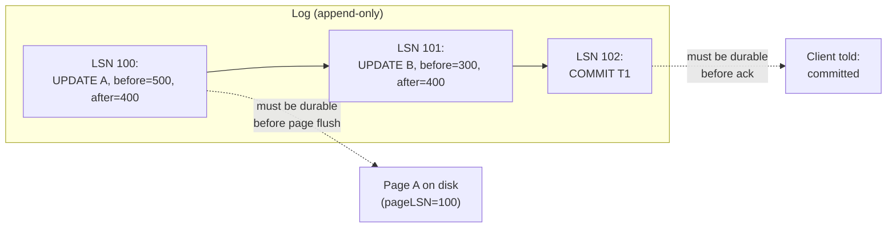

## Learning Objectives

- State the Write-Ahead Logging rule precisely: a change's log record must reach durable storage before the data page it describes does.
- Describe the log-record fields this concept builds: a globally unique LSN, each page's pageLSN, and the log's own flushedLSN.
- Explain why WAL is exactly what makes STEAL and NO-FORCE — the buffer-pool policies named several concepts ago — safe to use without losing a committed write.
- Trace a real log-record sequence for a transaction and identify exactly when the log, not the data page, must be durable.

## Context & Motivation

`buffer-pool-management` named STEAL (a dirty, uncommitted page may be evicted) and NO-FORCE (a committed transaction's dirty pages need not be flushed before commit returns) as the two policies real, high-performance systems universally choose — and flagged, at the time, that this combination is exactly what makes crash recovery a genuinely hard problem rather than something a naive policy could sidestep. **Write-Ahead Logging (WAL)** is the mechanism that makes STEAL + NO-FORCE safe anyway: `computer/operating-systems-i`'s `file-system-implementation-and-journaling` already built the identical durability idea for a file system's own journal — write a description of a change to a sequential, append-only log *before* the change itself is allowed to reach its final on-disk location — and this concept applies that exact idea to database pages instead of filesystem metadata.

## Core Theory

### The WAL rule

The **Write-Ahead Logging rule** states precisely: **a log record describing a change must reach durable storage before the data page that change was made to reaches durable storage** — and, as a stricter corollary needed for Durability specifically, a transaction's commit log record must reach durable storage before the client is told that transaction has committed. This single rule is what lets a DBMS evict a dirty, uncommitted page (STEAL) or delay flushing a committed one (NO-FORCE) without ever losing information needed to reconstruct the correct state after a crash — the log, not the data page, is what actually has to be durable at the moments that matter.

### The log record format

Every change to the database produces a log record, and this concept's format is built around three specific fields:

- **LSN (Log Sequence Number)** — a globally unique, monotonically increasing identifier assigned to every log record, in the exact order records are appended to the log. An LSN is what lets recovery (built in the next concept) refer unambiguously to "the change recorded at this specific point in the log."
- **pageLSN** — a field stored *on every data page itself*, recording the LSN of the most recent log record describing a change applied to that page. Comparing a page's pageLSN against the log tells recovery exactly how far that specific page's on-disk contents already reflect the log, and how much (if any) redo work that page still needs.
- **flushedLSN** — a single value the log manager tracks, recording the highest LSN that has actually been durably written (flushed) to the log's own storage so far. The WAL rule, precisely restated using this field: before a page with pageLSN `p` can be written to disk, `flushedLSN ≥ p` must hold; before a transaction's commit is acknowledged, `flushedLSN` must be at least that transaction's own commit-record LSN.

### Why WAL makes STEAL and NO-FORCE safe

Under STEAL, an uncommitted transaction's dirty page might be evicted and written to disk before that transaction ever commits — if it later aborts, the on-disk page already reflects a change that needs to be undone. WAL makes this safe because the log record for that change (including enough information to reverse it — the pre-change, "before," value) was already forced to disk *before* the page itself was allowed to be written, exactly the ordering the WAL rule requires; recovery can always find and undo it. Under NO-FORCE, a committed transaction's dirty page might still be sitting only in the buffer pool, not yet on disk, when the machine crashes — WAL makes this safe because the log record for that change (including enough information to reapply it — the post-change, "after," value) was already forced to disk before commit was ever acknowledged; recovery can always find and redo it. Both buffer-pool policies, adopted purely for performance, are made safe by the identical mechanism: the log, not the page, carries the actual durability guarantee.

## Worked Examples

### Example 1 — a real log-record sequence for the account transfer

`T1` transfers `$100` from `A` (`$500`) to `B` (`$300`), producing exactly three log records: `LSN 100: [T1, UPDATE, page=A, before=500, after=400]`; `LSN 101: [T1, UPDATE, page=B, before=300, after=400]`; `LSN 102: [T1, COMMIT]`. As each update is applied in the buffer pool, the corresponding page's pageLSN is set: page `A`'s pageLSN becomes `100`, page `B`'s becomes `101` — each page now carries a record of exactly which log entry it most recently reflects.

### Example 2 — the commit protocol: forcing the log, not the data

Continuing Example 1, under NO-FORCE, pages `A` and `B` remain dirty in the buffer pool — neither has been written to disk yet — at the moment `T1` wants to commit. The WAL rule's commit-specific corollary requires the log manager to force-flush the log up through LSN `102` (`flushedLSN` reaches at least `102`) *before* `T1` is told its commit succeeded. Only after that flush completes does the client receive acknowledgment. The data pages themselves might not be written to disk until minutes later, whenever the buffer pool's ordinary eviction or a periodic checkpoint gets to them — Durability was already fully guaranteed the instant `flushedLSN` reached `102`, entirely independent of when pages `A` and `B` physically reach disk.

### Example 3 — STEAL requires the log to be ahead of the page, not just eventually consistent

Suppose, before `T1` ever commits, the buffer pool needs page `A`'s frame for something else and evicts it under STEAL — writing `A`'s dirty, uncommitted contents (`400`) to disk. The WAL rule requires `flushedLSN ≥ 100` (the LSN of the log record describing exactly this change) *before* that eviction-triggered write is allowed to happen — guaranteeing the log record, including `A`'s pre-change value of `500`, is already safely durable. If `T1` subsequently aborts, recovery can find LSN `100`'s before-image and undo the already-on-disk change, restoring `A` to `500`, even though the uncommitted write had already physically reached disk before the abort ever happened.

## Common Misconceptions & Pitfalls

- **"Write-ahead logging means every data page write is preceded by writing that specific page's log record right before it, one-for-one."** The WAL rule is about *durability ordering*, not immediate one-for-one sequencing — many log records can accumulate in the log (and be flushed together in a batch) well before, or in some cases without ever needing, an immediate corresponding page flush; the rule only constrains that *whenever* a page eventually is flushed, its log record must already be durable by then, not that the two happen back-to-back.
- **"NO-FORCE means a committed transaction's durability depends on when the buffer pool happens to flush its pages."** Example 2 shows the opposite: Durability is fully established the moment the commit log record is flushed (`flushedLSN ≥ 102`), completely decoupled from whenever the actual data pages get written — NO-FORCE only delays the page write, never the actual guarantee.
- **"pageLSN and flushedLSN track the same kind of thing, just for different objects."** They answer different questions: pageLSN (stored per data page) says "which log record does this specific page's on-disk content already reflect," while flushedLSN (a single log-wide value) says "how far has the log itself actually been made durable" — recovery, in the next concept, compares a page's pageLSN against the log's contents to know how much redo work that specific page needs, while flushedLSN is what governs whether a data-page flush or a commit acknowledgment is currently allowed to proceed at all.

## Summary

The Write-Ahead Logging rule — a change's log record must reach durable storage before the data page it describes does, and a transaction's commit record must reach durable storage before that commit is acknowledged — is exactly the same durability guarantee `file-system-implementation-and-journaling` already built for a file system's own journal, now applied to database pages. The log-record format built here — a globally unique LSN per record, a pageLSN on every data page recording its most recent applied change, and a flushedLSN tracking how far the log has actually been made durable — is precisely what lets a DBMS safely run with the STEAL and NO-FORCE buffer-pool policies named back in `buffer-pool-management`: STEAL is safe because an undo-capable log record is always durable before an uncommitted page reaches disk, and NO-FORCE is safe because a redo-capable log record is always durable before commit is ever acknowledged, entirely independent of when the data page itself catches up.

## Documentation Links

- [CMU 15-445/645 — Database Logging / Recovery Slides](https://15445.courses.cs.cmu.edu/fall2025/slides/22-recovery.pdf) — the source of this concept's WAL rule, LSN/pageLSN/flushedLSN fields, and the STEAL/NO-FORCE safety argument worked through in the examples.
- [ARIES: A Transaction Recovery Method (Mohan et al., 1992) — IBM Research](https://research.ibm.com/publications/aries-a-transaction-recovery-method-supporting-fine-granularity-locking-and-partial-rollbacks-using-write-ahead-logging) — the original paper defining the log-record format (including LSN and pageLSN) this concept builds, and the foundation the next concept's recovery algorithm is named after.
