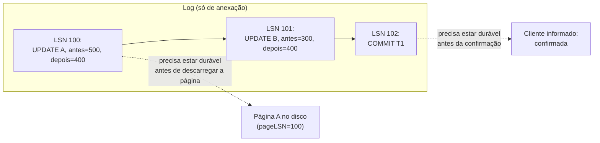

## Objetivos de Aprendizagem

- Enunciar com precisão a regra do Write-Ahead Logging: o registro de log de uma mudança precisa chegar ao armazenamento durável antes da página de dados que ele descreve.
- Descrever os campos de registro de log que este conceito constrói: um LSN globalmente único, o pageLSN de cada página e o flushedLSN do próprio log.
- Explicar por que o WAL é exatamente o que torna seguros o STEAL e o NO-FORCE, as políticas de buffer pool nomeadas vários conceitos atrás, sem perder uma escrita confirmada.
- Rastrear uma sequência real de registros de log para uma transação e identificar exatamente quando o log, e não a página de dados, precisa estar durável.

## Contexto e Motivação

`buffer-pool-management` nomeou STEAL (uma página suja e não confirmada pode ser despejada) e NO-FORCE (as páginas sujas de uma transação confirmada não precisam ser descarregadas antes que o commit retorne) como as duas políticas que sistemas reais de alto desempenho escolhem universalmente, e sinalizou, na época, que essa combinação é exatamente o que torna a recuperação de travamentos um problema genuinamente difícil, em vez de algo que uma política ingênua poderia contornar. O **Write-Ahead Logging (WAL)** é o mecanismo que torna o STEAL + NO-FORCE seguro mesmo assim: `file-system-implementation-and-journaling`, de `computer/operating-systems-i`, já construiu a ideia de durabilidade idêntica para o próprio journal de um sistema de arquivos (escrever uma descrição de uma mudança num log sequencial e só de anexação *antes* que a própria mudança tenha permissão de chegar à sua localização final no disco), e este conceito aplica exatamente essa ideia a páginas de banco de dados em vez de metadados do sistema de arquivos.

## Teoria Central

### A regra do WAL

A **regra do Write-Ahead Logging** diz com precisão: **um registro de log que descreve uma mudança precisa chegar ao armazenamento durável antes que a página de dados na qual essa mudança foi feita chegue ao armazenamento durável**, e, como corolário mais estrito necessário especificamente para a Durabilidade, o registro de log de commit de uma transação precisa chegar ao armazenamento durável antes que o cliente seja informado de que essa transação confirmou. Esta única regra é o que permite a um SGBD despejar uma página suja e não confirmada (STEAL) ou atrasar o descarregamento de uma confirmada (NO-FORCE) sem jamais perder informação necessária para reconstruir o estado correto depois de um travamento: o log, e não a página de dados, é o que de fato precisa estar durável nos momentos que importam.

### O formato do registro de log

Toda mudança no banco de dados produz um registro de log, e o formato deste conceito é construído em torno de três campos específicos:

- **LSN (Log Sequence Number)**: um identificador globalmente único e monotonicamente crescente atribuído a todo registro de log, na exata ordem em que os registros são anexados ao log. Um LSN é o que permite à recuperação (construída no próximo conceito) se referir sem ambiguidade a "a mudança registrada neste ponto específico do log".
- **pageLSN**: um campo guardado *em toda página de dados*, registrando o LSN do registro de log mais recente que descreve uma mudança aplicada àquela página. Comparar o pageLSN de uma página com o log diz à recuperação exatamente até onde o conteúdo em disco daquela página específica já reflete o log, e quanto trabalho de redo (se algum) aquela página ainda precisa.
- **flushedLSN**: um único valor que o gerenciador de log rastreia, registrando o maior LSN que de fato foi escrito (descarregado) de forma durável no próprio armazenamento do log até agora. A regra do WAL, reenunciada com precisão usando este campo: antes que uma página com pageLSN `p` possa ser escrita no disco, `flushedLSN ≥ p` precisa valer; antes que o commit de uma transação seja confirmado ao cliente, o `flushedLSN` precisa ser pelo menos o LSN do próprio registro de commit dessa transação.

### Por que o WAL torna o STEAL e o NO-FORCE seguros

Sob STEAL, a página suja de uma transação não confirmada pode ser despejada e escrita no disco antes que essa transação jamais confirme; se ela depois abortar, a página em disco já reflete uma mudança que precisa ser desfeita. O WAL torna isso seguro porque o registro de log daquela mudança (incluindo informação suficiente para revertê-la: o valor "antes" da mudança) já foi forçado para o disco *antes* que a própria página tivesse permissão de ser escrita, exatamente a ordem que a regra do WAL exige; a recuperação sempre consegue encontrá-lo e desfazê-lo. Sob NO-FORCE, a página suja de uma transação confirmada pode ainda estar só no buffer pool, ainda não no disco, quando a máquina trava. O WAL torna isso seguro porque o registro de log daquela mudança (incluindo informação suficiente para reaplicá-la: o valor "depois" da mudança) já foi forçado para o disco antes que o commit jamais fosse confirmado; a recuperação sempre consegue encontrá-lo e refazê-lo. As duas políticas de buffer pool, adotadas puramente por desempenho, são tornadas seguras pelo mecanismo idêntico: o log, e não a página, carrega a garantia de durabilidade de fato.

## Exemplos Resolvidos

### Exemplo 1: uma sequência real de registros de log para a transferência entre contas

`T1` transfere `$100` de `A` (`$500`) para `B` (`$300`), produzindo exatamente três registros de log: `LSN 100: [T1, UPDATE, page=A, before=500, after=400]`; `LSN 101: [T1, UPDATE, page=B, before=300, after=400]`; `LSN 102: [T1, COMMIT]`. Conforme cada atualização é aplicada no buffer pool, o pageLSN da página correspondente é definido: o pageLSN da página `A` passa a ser `100`, o da página `B` passa a ser `101`. Cada página agora carrega um registro de exatamente qual entrada do log ela reflete mais recentemente.

### Exemplo 2: o protocolo de commit: forçar o log, e não os dados

Continuando o Exemplo 1, sob NO-FORCE, as páginas `A` e `B` continuam sujas no buffer pool (nenhuma foi escrita no disco ainda) no momento em que `T1` quer confirmar. O corolário específico de commit da regra do WAL exige que o gerenciador de log descarregue à força o log até o LSN `102` (o `flushedLSN` chega a pelo menos `102`) *antes* que `T1` seja informada de que o seu commit teve sucesso. Só depois que esse descarregamento completa o cliente recebe a confirmação. As próprias páginas de dados podem não ser escritas no disco até minutos depois, sempre que o despejo comum do buffer pool ou um checkpoint periódico chegar até elas. A Durabilidade já estava totalmente garantida no instante em que o `flushedLSN` chegou a `102`, inteiramente independente de quando as páginas `A` e `B` chegam fisicamente ao disco.

### Exemplo 3: o STEAL exige que o log esteja à frente da página, e não só eventualmente consistente

Suponha que, antes que `T1` jamais confirme, o buffer pool precise do frame da página `A` para outra coisa e a despeje sob STEAL, escrevendo no disco o conteúdo sujo e não confirmado de `A` (`400`). A regra do WAL exige `flushedLSN ≥ 100` (o LSN do registro de log que descreve exatamente esta mudança) *antes* que essa escrita disparada pelo despejo tenha permissão de acontecer, garantindo que o registro de log, incluindo o valor de `A` anterior à mudança, `500`, já esteja durável com segurança. Se `T1` subsequentemente abortar, a recuperação consegue encontrar a imagem "antes" do LSN `100` e desfazer a mudança já em disco, restaurando `A` para `500`, mesmo que a escrita não confirmada já tivesse chegado fisicamente ao disco antes de o aborto sequer acontecer.

## Equívocos Comuns e Armadilhas

- **"Write-ahead logging significa que toda escrita de página de dados é precedida pela escrita do registro de log daquela página específica logo antes, um para um."** A regra do WAL trata da *ordem de durabilidade*, e não de um sequenciamento imediato um para um: muitos registros de log podem se acumular no log (e ser descarregados juntos em lote) bem antes de, ou em alguns casos sem jamais precisar de, um descarregamento imediato de página correspondente. A regra só restringe que, *sempre que* uma página for eventualmente descarregada, o seu registro de log já precisa estar durável até lá, e não que as duas coisas aconteçam uma logo atrás da outra.
- **"NO-FORCE significa que a durabilidade de uma transação confirmada depende de quando o buffer pool calha de descarregar as suas páginas."** O Exemplo 2 mostra o oposto: a Durabilidade é totalmente estabelecida no momento em que o registro de log de commit é descarregado (`flushedLSN ≥ 102`), completamente desacoplada de quando quer que as páginas de dados de fato sejam escritas. O NO-FORCE só atrasa a escrita da página, nunca a garantia de fato.
- **"pageLSN e flushedLSN rastreiam o mesmo tipo de coisa, só para objetos diferentes."** Eles respondem perguntas diferentes: o pageLSN (guardado por página de dados) diz "qual registro de log o conteúdo em disco desta página específica já reflete", enquanto o flushedLSN (um único valor para o log inteiro) diz "até onde o próprio log de fato foi tornado durável". A recuperação, no próximo conceito, compara o pageLSN de uma página com o conteúdo do log para saber quanto trabalho de redo aquela página específica precisa, enquanto o flushedLSN é o que governa se um descarregamento de página de dados ou uma confirmação de commit tem atualmente permissão de prosseguir.

## Resumo

A regra do Write-Ahead Logging (o registro de log de uma mudança precisa chegar ao armazenamento durável antes da página de dados que ele descreve, e o registro de commit de uma transação precisa chegar ao armazenamento durável antes que esse commit seja confirmado) é exatamente a mesma garantia de durabilidade que `file-system-implementation-and-journaling` já construiu para o próprio journal de um sistema de arquivos, agora aplicada a páginas de banco de dados. O formato de registro de log construído aqui (um LSN globalmente único por registro, um pageLSN em toda página de dados registrando a sua mudança aplicada mais recente, e um flushedLSN rastreando até onde o log de fato foi tornado durável) é precisamente o que permite a um SGBD rodar com segurança com as políticas de buffer pool STEAL e NO-FORCE nomeadas lá atrás em `buffer-pool-management`: o STEAL é seguro porque um registro de log capaz de undo está sempre durável antes que uma página não confirmada chegue ao disco, e o NO-FORCE é seguro porque um registro de log capaz de redo está sempre durável antes que o commit seja jamais confirmado, inteiramente independente de quando a própria página de dados alcança o estado atualizado.

## Documentation Links

- [CMU 15-445/645: Database Logging / Recovery Slides](https://15445.courses.cs.cmu.edu/fall2025/slides/22-recovery.pdf): a fonte da regra do WAL deste conceito, dos campos LSN/pageLSN/flushedLSN e do argumento de segurança do STEAL/NO-FORCE percorridos nos exemplos.
- [ARIES: A Transaction Recovery Method (Mohan et al., 1992): IBM Research](https://research.ibm.com/publications/aries-a-transaction-recovery-method-supporting-fine-granularity-locking-and-partial-rollbacks-using-write-ahead-logging): o artigo original que define o formato de registro de log (incluindo LSN e pageLSN) que este conceito constrói, e a fundação da qual o algoritmo de recuperação do próximo conceito tira o seu nome.
