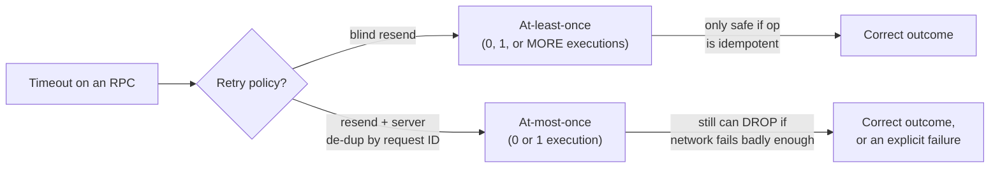

## Learning Objectives

- Define at-least-once, at-most-once, and exactly-once RPC semantics precisely, including what each one actually guarantees and what it does not.
- Explain the mechanism (blind retry, request de-duplication via IDs, and why exactly-once is fundamentally harder) that each contract is built from.
- Explain why TCP's reliable byte delivery, one layer down, does not by itself give an RPC framework any of these three call-level guarantees for free.
- Identify, for a given operation, whether at-least-once is actually safe to use because the operation is idempotent.

## Context & Motivation

`remote-procedure-calls-and-the-illusion-of-a-local-call` ended on an unavoidable ambiguity: when an RPC times out, the caller cannot tell whether the request never arrived, arrived and executed with only the reply lost, or is simply still executing. Retrying blindly on a timeout, as Example 3 of that concept showed, can execute a non-idempotent operation (like a withdrawal) twice. This concept works through the three precise, commonly-confused contracts a real RPC system can offer in response — not as competing "better" and "worse" options in the abstract, but as different points on a real cost/guarantee trade-off that Birrell & Nelson's original design already had to make explicit.

## Core Theory

### At-least-once: retry blindly, tolerate duplicates

The simplest contract: on a timeout, just resend the request. This guarantees the operation executes *at least* once (assuming the server eventually comes back and the network eventually delivers something), but says nothing about how many times — as Example 3 of the previous concept demonstrated concretely, it can execute twice, or more, if replies keep getting lost while the underlying request keeps succeeding. At-least-once is only actually safe to use when the operation is **idempotent** — applying it two or more times has the same effect as applying it once (e.g., "set balance to exactly $500" is idempotent; "withdraw $100" is not).

### At-most-once: de-duplicate via a request ID and a server-side cache

To guarantee an operation executes *at most* once — it may fail to execute at all if messages are lost badly enough, but it will never execute twice — the client attaches a unique request ID to every RPC (a monotonically increasing per-client sequence number is the classic implementation), and the server keeps a cache of request IDs it has already processed, along with the reply it sent for each. When a retry with an already-seen ID arrives, the server does not re-execute the operation — it simply resends the cached reply. This directly prevents the double-withdrawal failure from the previous concept's Example 3, at the real cost of the server needing to maintain that cache (with some policy for how long to keep entries around).

### Exactly-once: the contract everyone wants and the hardest one to actually deliver

Exactly-once — the operation executes precisely once, full stop, no duplicates and no silent drops — sounds like the obviously correct default, but it is fundamentally harder than at-most-once because it additionally requires guaranteeing the operation is *not* dropped even when the client itself crashes before it can retry, or when the server crashes after executing but before caching the reply. In practice, "exactly-once" RPC semantics as commonly advertised by real systems are usually at-most-once execution combined with a durability guarantee strong enough to make failure to execute at all vanishingly unlikely (or explicitly surfaced as an error) — genuine, unconditional exactly-once in the presence of arbitrary crashes at any point is not achievable by the RPC layer in isolation; it requires the operation itself to be tied into a larger transactional or replicated mechanism.



### Why TCP's reliability is a different guarantee entirely

`reliable-data-transfer-principles` and `tcp-reliable-data-transfer-in-practice` (`computer-networks`) already established, in full rigor, exactly what TCP guarantees: the bytes sent over one established connection arrive at the other end reliably, in order, exactly once, via sequence numbers and acknowledgment-driven retransmission. It is tempting to assume this solves RPC's problem too — it does not, for two distinct reasons. First, TCP's guarantee is scoped to bytes within one connection; if that connection is torn down (the client crashes and reconnects, or a network partition forces a new connection) and the client resends the same logical request over a *new* connection, TCP has no memory of the old one and will happily deliver the duplicate. Second, and more fundamentally, TCP has no concept of "the request was fully processed by the application" at all — it only knows bytes were delivered to the socket buffer on the other end; whether the server application actually finished executing before crashing is entirely outside TCP's visibility. At-least-once, at-most-once, and exactly-once are call-level semantics that have to be built by the RPC/application layer on top of whatever transport-level guarantees already exist underneath — they are not a byproduct of choosing a reliable transport.

## Worked Examples

### Example 1 — at-least-once is safe here, because the operation is idempotent

```text
setBalance(accountId=42, newBalance=500)

Retry 1: server sets balance to 500. Applied.
Reply lost. Client retries.
Retry 2: server sets balance to 500 AGAIN. Still 500.

Executing this operation twice produces the exact same final
state as executing it once — at-least-once with blind retry is
completely safe here, and adding a de-duplication cache would
be unnecessary complexity for no correctness benefit.
```

### Example 2 — at-most-once, worked with a real request-ID cache

```text
Client sends: { requestId: 7, op: withdraw(100) }

t=0.0s  server receives requestId=7, has NOT seen it before
        -> executes withdraw(100), balance -= 100
        -> caches { 7: replyValue }
        -> sends reply, which is LOST in transit

t=2.0s  client times out, RETRIES: { requestId: 7, op:
        withdraw(100) } (same ID — this is a retry, not a
        new request)
        -> server checks its cache: requestId 7 already seen
        -> does NOT re-execute withdraw
        -> resends the SAME cached reply

Net effect: balance is debited exactly once, despite two
network round-trips and one lost reply — the request ID and
server-side cache are exactly what Example 3 of the previous
concept was missing.
```

### Example 3 — what "exactly-once" actually requires, and where it breaks down

```text
Suppose the server in Example 2 crashes AFTER executing
withdraw(100) (balance already -= 100) but BEFORE writing
requestId=7 into its de-duplication cache.

On restart, the server has no record that requestId 7 was
ever seen. When the client's retry with requestId=7 arrives,
the server treats it as brand new and executes withdraw(100)
a SECOND time.

This is exactly why unconditional exactly-once cannot be
delivered by the RPC layer's request-ID cache alone: the
cache write and the operation's actual execution need to be
made durable TOGETHER, atomically, which is precisely the
kind of guarantee a replicated, log-based system (the
replicated-state-machine approach and Raft's own log,
several concepts ahead) is built to provide — "exactly-once"
in practice usually means "at-most-once, backed by a
sufficiently durable log that dropping a request becomes
vanishingly unlikely," not a free-standing RPC-layer trick.
```

## Common Misconceptions & Pitfalls

- **"Exactly-once is just the correct default and the other two are just weaker versions of it."** Exactly-once is not simply "at-most-once done slightly better" — Example 3 shows it requires atomically coupling the de-duplication record with the operation's actual execution, which the RPC layer cannot do in isolation without help from a durable, ordered log underneath, exactly the mechanism `raft-log-replication-and-commitment` builds later in this discipline.
- **"At-least-once is always the wrong choice because it can duplicate."** Example 1 shows at-least-once with blind retry is perfectly safe, and simpler than at-most-once, whenever the operation is idempotent — the correct choice depends entirely on the operation's own properties, not on always reaching for the strongest-sounding contract.
- **"TCP already gives my RPC calls exactly-once semantics, since TCP is reliable."** TCP guarantees byte-level delivery within one connection, not call-level "the server's application logic ran exactly once" — a new connection after a crash, or the gap between the server executing an operation and durably recording that it did, both sit entirely outside what TCP can see or guarantee.

## Summary

At-least-once (blind retry, safe only for idempotent operations), at-most-once (retry plus a request-ID de-duplication cache on the server, preventing double execution at the cost of maintaining that cache), and exactly-once (the strongest and hardest contract, requiring the de-duplication record and the operation's execution to be made durable together) are the three precise, commonly-confused answers to the ambiguity RPC leaves behind whenever a call times out. None of them are given for free by a reliable transport like TCP, which guarantees only byte-level delivery within one connection and has no visibility into whether the server's application logic actually ran. Choosing correctly among the three requires knowing whether the underlying operation is idempotent, and genuine exactly-once semantics in practice are usually built by combining at-most-once de-duplication with a durable, ordered log — the exact mechanism this discipline arrives at later through the replicated state machine approach and Raft's own log.

## Documentation Links

- [Birrell & Nelson — Implementing Remote Procedure Calls (1984)](http://www.bitsavers.org/pdf/xerox/parc/techReports/CSL-83-7_Implementing_Remote_Procedure_Calls.pdf) — the original RPC paper whose own design already had to make the at-least-once/at-most-once/exactly-once trade-off explicit, exactly what this concept works through in full.
