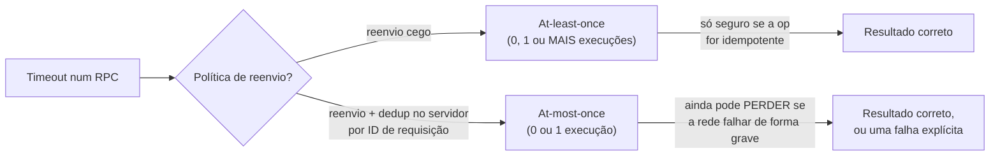

## Objetivos de Aprendizagem

- Definir com precisão as semânticas de RPC at-least-once, at-most-once e exactly-once, incluindo o que cada uma de fato garante e o que não garante.
- Explicar o mecanismo (reenvio cego, deduplicação de requisições via IDs, e por que exactly-once é fundamentalmente mais difícil) a partir do qual cada contrato é construído.
- Explicar por que a entrega confiável de bytes do TCP, uma camada abaixo, não dá por si só nenhuma dessas três garantias em nível de chamada de graça a um framework de RPC.
- Identificar, para uma dada operação, se at-least-once é de fato seguro de usar porque a operação é idempotente.

## Contexto e Motivação

`remote-procedure-calls-and-the-illusion-of-a-local-call` terminou numa ambiguidade inevitável: quando um RPC atinge o timeout, o chamador não consegue dizer se a requisição nunca chegou, se chegou e executou com só a resposta perdida, ou se está simplesmente ainda executando. Reenviar cegamente num timeout, como o Exemplo 3 daquele conceito mostrou, pode executar uma operação não idempotente (como um saque) duas vezes. Este conceito percorre os três contratos precisos e comumente confundidos que um sistema de RPC real pode oferecer em resposta, não como opções "melhores" e "piores" concorrentes no abstrato, mas como diferentes pontos num trade-off real de custo versus garantia que o projeto original de Birrell e Nelson já teve de tornar explícito.

## Teoria Central

### At-least-once: reenviar cegamente, tolerar duplicatas

O contrato mais simples: num timeout, apenas reenvie a requisição. Isso garante que a operação executa *pelo menos* uma vez (supondo que o servidor eventualmente volte e a rede eventualmente entregue algo), mas não diz nada sobre quantas vezes, como o Exemplo 3 do conceito anterior demonstrou concretamente, ela pode executar duas vezes, ou mais, se as respostas continuarem se perdendo enquanto a requisição subjacente continua tendo sucesso. At-least-once só é de fato seguro de usar quando a operação é **idempotente**: aplicá-la duas ou mais vezes tem o mesmo efeito que aplicá-la uma vez (por exemplo, "definir o saldo para exatamente R$500" é idempotente; "sacar R$100" não é).

### At-most-once: deduplicar via um ID de requisição e um cache no lado do servidor

Para garantir que uma operação executa *no máximo* uma vez (ela pode falhar em executar de todo se as mensagens se perderem de forma grave o suficiente, mas nunca executará duas vezes), o cliente anexa um ID de requisição único a cada RPC (um número de sequência por cliente monotonicamente crescente é a implementação clássica), e o servidor mantém um cache de IDs de requisição que já processou, junto com a resposta que enviou para cada um. Quando um reenvio com um ID já visto chega, o servidor não reexecuta a operação: ele simplesmente reenvia a resposta em cache. Isso previne diretamente a falha de saque duplo do Exemplo 3 do conceito anterior, ao custo real de o servidor precisar manter esse cache (com alguma política de por quanto tempo manter as entradas).

### Exactly-once: o contrato que todos querem e o mais difícil de de fato entregar

Exactly-once (a operação executa precisamente uma vez, ponto final, sem duplicatas e sem perdas silenciosas) soa como o padrão obviamente correto, mas é fundamentalmente mais difícil que at-most-once porque exige adicionalmente garantir que a operação *não* seja perdida mesmo quando o próprio cliente cai antes de poder reenviar, ou quando o servidor cai após executar mas antes de colocar a resposta em cache. Na prática, a semântica de RPC "exactly-once" como comumente anunciada por sistemas reais é geralmente execução at-most-once combinada com uma garantia de durabilidade forte o suficiente para tornar a falha de executar de todo extremamente improvável (ou explicitamente exposta como um erro). O exactly-once genuíno e incondicional na presença de quedas arbitrárias em qualquer ponto não é alcançável pela camada de RPC isoladamente; ele exige que a própria operação esteja ligada a um mecanismo transacional ou replicado maior.



### Por que a confiabilidade do TCP é uma garantia inteiramente diferente

`reliable-data-transfer-principles` e `tcp-reliable-data-transfer-in-practice` (`computer-networks`) já estabeleceram, com todo o rigor, exatamente o que o TCP garante: os bytes enviados por uma conexão estabelecida chegam à outra ponta de forma confiável, em ordem, exatamente uma vez, via números de sequência e retransmissão dirigida por confirmação. É tentador supor que isso resolve o problema do RPC também, mas não resolve, por duas razões distintas. Primeiro, a garantia do TCP tem escopo nos bytes dentro de uma conexão; se essa conexão é desfeita (o cliente cai e reconecta, ou uma partição de rede força uma nova conexão) e o cliente reenvia a mesma requisição lógica por uma *nova* conexão, o TCP não tem memória da antiga e alegremente entregará a duplicata. Segundo, e mais fundamentalmente, o TCP não tem nenhum conceito de "a requisição foi totalmente processada pela aplicação"; ele só sabe que bytes foram entregues ao buffer de socket na outra ponta; se a aplicação servidora de fato terminou de executar antes de cair está inteiramente fora da visibilidade do TCP. At-least-once, at-most-once e exactly-once são semânticas em nível de chamada que têm de ser construídas pela camada de RPC ou aplicação sobre quaisquer garantias em nível de transporte que já existam embaixo; elas não são um subproduto de escolher um transporte confiável.

## Exemplos Resolvidos

### Exemplo 1: at-least-once é seguro aqui, porque a operação é idempotente

```text
setBalance(accountId=42, newBalance=500)

Tentativa 1: servidor define o saldo para 500. Aplicado.
Resposta perdida. Cliente reenvia.
Tentativa 2: servidor define o saldo para 500 DE NOVO. Ainda 500.

Executar esta operação duas vezes produz exatamente o mesmo
estado final que executá-la uma vez: at-least-once com reenvio
cego é completamente seguro aqui, e adicionar um cache de
deduplicação seria complexidade desnecessária sem nenhum
benefício de correção.
```

### Exemplo 2: at-most-once, resolvido com um cache de IDs de requisição real

```text
Cliente envia: { requestId: 7, op: withdraw(100) }

t=0.0s  servidor recebe requestId=7, NÃO o viu antes
        -> executa withdraw(100), balance -= 100
        -> coloca em cache { 7: replyValue }
        -> envia resposta, que se PERDE em trânsito

t=2.0s  cliente atinge o timeout, REENVIA: { requestId: 7, op:
        withdraw(100) } (mesmo ID: isto é um reenvio, não uma
        nova requisição)
        -> servidor verifica seu cache: requestId 7 já visto
        -> NÃO reexecuta withdraw
        -> reenvia a MESMA resposta em cache

Efeito líquido: o saldo é debitado exatamente uma vez, apesar de
duas idas e voltas na rede e uma resposta perdida: o ID de
requisição e o cache no lado do servidor são exatamente o que
faltava ao Exemplo 3 do conceito anterior.
```

### Exemplo 3: o que "exactly-once" de fato exige, e onde ele quebra

```text
Suponha que o servidor no Exemplo 2 cai DEPOIS de executar
withdraw(100) (balance já -= 100) mas ANTES de gravar
requestId=7 em seu cache de deduplicação.

Ao reiniciar, o servidor não tem registro de que requestId 7 foi
alguma vez visto. Quando o reenvio do cliente com requestId=7
chega, o servidor o trata como totalmente novo e executa
withdraw(100) uma SEGUNDA vez.

É exatamente por isso que o exactly-once incondicional não pode
ser entregue só pelo cache de IDs de requisição da camada de RPC:
a gravação no cache e a execução real da operação precisam ser
tornadas duráveis EM CONJUNTO, atomicamente, que é precisamente o
tipo de garantia que um sistema replicado e baseado em log (a
abordagem de máquina de estados replicada e o próprio log do Raft,
vários conceitos adiante) é construído para prover: "exactly-once"
na prática geralmente significa "at-most-once, respaldado por um
log durável o suficiente para que perder uma requisição se torne
extremamente improvável", não um truque autônomo da camada de RPC.
```

## Equívocos Comuns e Armadilhas

- **"Exactly-once é só o padrão correto e os outros dois são apenas versões mais fracas dele."** Exactly-once não é simplesmente "at-most-once feito um pouco melhor": o Exemplo 3 mostra que ele exige acoplar atomicamente o registro de deduplicação com a execução real da operação, o que a camada de RPC não pode fazer isoladamente sem ajuda de um log durável e ordenado embaixo, exatamente o mecanismo que `raft-log-replication-and-commitment` constrói mais adiante nesta disciplina.
- **"At-least-once é sempre a escolha errada porque pode duplicar."** O Exemplo 1 mostra que at-least-once com reenvio cego é perfeitamente seguro, e mais simples que at-most-once, sempre que a operação é idempotente: a escolha correta depende inteiramente das propriedades da própria operação, não de sempre buscar o contrato de nome mais forte.
- **"O TCP já dá às minhas chamadas de RPC semântica exactly-once, já que o TCP é confiável."** O TCP garante entrega em nível de byte dentro de uma conexão, não "a lógica da aplicação do servidor rodou exatamente uma vez" em nível de chamada: uma nova conexão após uma queda, ou a lacuna entre o servidor executar uma operação e registrar duravelmente que o fez, ambas ficam inteiramente fora do que o TCP pode ver ou garantir.

## Resumo

At-least-once (reenvio cego, seguro só para operações idempotentes), at-most-once (reenvio mais um cache de deduplicação por ID de requisição no servidor, prevenindo execução dupla ao custo de manter esse cache) e exactly-once (o contrato mais forte e mais difícil, exigindo que o registro de deduplicação e a execução da operação sejam tornados duráveis em conjunto) são as três respostas precisas e comumente confundidas à ambiguidade que o RPC deixa para trás sempre que uma chamada atinge o timeout. Nenhuma delas é dada de graça por um transporte confiável como o TCP, que garante apenas entrega em nível de byte dentro de uma conexão e não tem visibilidade de se a lógica da aplicação do servidor de fato rodou. Escolher corretamente entre os três exige saber se a operação subjacente é idempotente, e a semântica exactly-once genuína na prática é geralmente construída combinando deduplicação at-most-once com um log durável e ordenado: o exato mecanismo a que esta disciplina chega mais tarde pela abordagem de máquina de estados replicada e o próprio log do Raft.

## Documentation Links

- [Birrell & Nelson: Implementing Remote Procedure Calls (1984)](http://www.bitsavers.org/pdf/xerox/parc/techReports/CSL-83-7_Implementing_Remote_Procedure_Calls.pdf): o artigo original de RPC cujo próprio projeto já teve de tornar explícito o trade-off at-least-once/at-most-once/exactly-once, exatamente o que este conceito percorre por completo.
