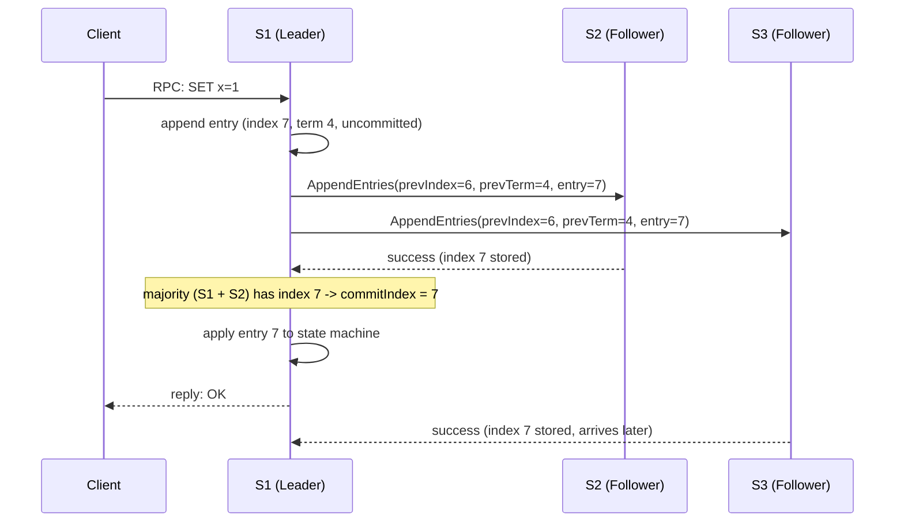

## Learning Objectives

- Trace, step by step, everything that happens between a client issuing a write and receiving a successful reply in a Raft-replicated system, naming the exact concept or mechanism responsible for each step.
- Trace what changes in that flow when a follower is slow to respond, and explain why the leader does not wait for it.
- Trace what changes when the leader crashes mid-replication — both before and after the entry is committed — and explain why the client's write is never silently lost, only possibly left unacknowledged.
- State honestly, in one paragraph, exactly where this discipline's rigor ends and the applied, production-scale treatment of the same mechanism (ZooKeeper, etcd) begins.

## Context & Motivation

This capstone closes the discipline by doing something none of the previous nineteen concepts did in isolation: following one concrete client write through every layer this discipline built, in order, and naming the exact concept responsible for each step. `the-replicated-state-machine-approach` flagged this trace by name while describing how clients submit commands: "a client's retried command needs to be recognized as a retry (not a new, duplicate command)... a concrete concern the capstone at the end of this discipline traces explicitly." That concern — what `at-least-once-at-most-once-and-exactly-once-semantics` named as the ambiguity a timeout creates — is exactly one of the things this trace has to get right, alongside `remote-procedure-calls-and-the-illusion-of-a-local-call`'s marshalling, `raft-log-replication-and-commitment`'s AppendEntries and commit index, and `raft-safety-the-election-restriction-and-log-completeness`'s guarantee that a committed write is never lost, only possibly left unacknowledged. Every mechanism traced here assumes the crash-fault model named explicitly in `crash-faults-vs-byzantine-faults`, the immediately preceding concept — a boundary this capstone states honestly rather than silently extends past.

## Core Theory

### The end-to-end path, named step by step

A client write to a 3-node Raft cluster (S1 as leader, S2 and S3 as followers) touches, in order, exactly these mechanisms:

```text
1. CLIENT -> LEADER: the client sends its command via an
   ordinary RPC (remote-procedure-calls-and-the-illusion-of-a-
   local-call) to whichever server it believes is the current
   leader. If it guesses wrong, that server redirects it (Raft
   servers always know, or quickly learn, who last claimed
   leadership at the highest term they've seen).

2. LEADER APPENDS: the leader appends the command to its own
   log as a new, UNCOMMITTED entry (raft-log-replication-and-
   commitment), tagged with its current term and the next log
   index.

3. LEADER REPLICATES: the leader sends AppendEntries RPCs,
   carrying the new entry and the preceding entry's index/term,
   to every follower (raft-log-replication-and-commitment's
   consistency check).

4. MAJORITY ACKNOWLEDGES: once a majority of the cluster
   (leader included) has stored the entry, the leader advances
   its commit index to that entry — by raft-safety-the-
   election-restriction-and-log-completeness's Leader
   Completeness proof, a committed entry can never be lost or
   overwritten by any future leader.

5. APPLY TO STATE MACHINE: the committed entry is applied to
   the leader's local state machine (the-replicated-state-
   machine-approach's determinism guarantees every replica that
   applies it produces the identical result).

6. LEADER REPLIES: only now does the leader reply to the
   client's original RPC — the client learns its write
   succeeded only after it is durably, unlosably committed,
   never before.
```



### What changes when a follower is slow

Step 4 only requires a **majority**, not unanimity — exactly the point `raft-log-replication-and-commitment`'s own Example 1 already established. If S3 is slow, the leader commits and replies to the client the instant S1 and S2 alone confirm index 7, without waiting for S3 at all. S3's eventual, late acknowledgment changes nothing about correctness — it simply confirms what was already safely true. This is precisely the payoff `primary-backup-vs-quorum-based-replication` described as quorum-based replication's advantage over requiring every replica's participation.

### What changes when the leader crashes mid-replication

Two genuinely different cases matter, depending on exactly when S1 crashes:

```text
CASE A — crash BEFORE a majority stores the entry:
  S1 appends entry 7 locally and sends AppendEntries, but
  crashes before EITHER S2 or S3 acknowledges it. The entry
  was never committed (no majority ever confirmed it). A new
  leader is elected (per raft-leader-election); that new
  leader may or may not have entry 7 in its own log (it was
  never guaranteed to propagate). The client, having received
  no reply, times out and RETRIES — exactly the ambiguity
  at-least-once-at-most-once-and-exactly-once-semantics named:
  the client cannot tell whether its write was lost entirely
  or just its acknowledgment was. A safe retry needs the
  command tagged with a client-generated, idempotent request
  ID, so that if entry 7 (or an equivalent re-submitted entry)
  ends up applied twice due to the retry, the state machine
  recognizes the duplicate and does not apply it twice.

CASE B — crash AFTER a majority stores the entry, but BEFORE
replying to the client:
  S1 appends entry 7, S2 acknowledges (majority reached,
  commitIndex advances to 7, entry applied to S1's OWN state
  machine) — and THEN S1 crashes, before its reply reaches the
  client. Here, by raft-safety's Leader Completeness proof, the
  entry is NOT lost: any future leader's log is guaranteed to
  already contain it. The client, again, sees only a timeout
  and cannot distinguish this case from Case A by itself — it
  retries, but this time the SAME idempotent request-ID
  mechanism must recognize the command as already applied and
  simply return the already-computed result, rather than
  applying "SET x=1" a second time.
```

Both cases produce the identical symptom visible to the client — a timeout, with no reply — which is exactly why `at-least-once-at-most-once-and-exactly-once-semantics`' idempotent-retry mechanism, not Raft's replication logic itself, is what actually delivers a safe, effectively-exactly-once result to the client despite Raft only ever promising the log-durability half of the guarantee.

### Where this discipline's rigor ends, and the applied layer begins

Everything traced above is exactly what this discipline proves rigorously: given the crash-fault model, a correct Raft implementation guarantees a committed write is never lost and never silently overwritten. What this discipline does not build out is the production engineering layered on top — snapshotting to bound an ever-growing log, cluster membership changes (adding or removing servers safely, live), client session tracking for de-duplication at scale, and the operational tooling real deployments need. That applied layer is exactly what `consensus-and-coordination-services` (`system-design-concepts`) covers: ZooKeeper and etcd are real, production systems built on precisely the mechanism traced here (etcd uses Raft directly), exposing it as reusable infrastructure for locks, leader election, and configuration — the same reusable-infrastructure argument `the-consensus-problem-agreement-validity-and-termination` made when it first named those two systems.

## Worked Examples

### Example 1 — the full happy path, traced with concrete indices and terms

```text
S1 leader, term 4, commitIndex currently 6. Client sends
RPC: "SET x=1" (request ID: req-882).

1. S1 appends: log[7] = (term=4, "SET x=1", req-882).
2. S1 sends AppendEntries(prevIndex=6, prevTerm=4, entries=
   [7:"SET x=1"]) to S2 and S3.
3. S2's log already agrees with S1 at index 6 (same term) ->
   S2 appends entry 7, replies success.
4. S1 now has {S1, S2} = 2 of 3 = majority. commitIndex
   advances to 7.
5. S1 applies "SET x=1" to its state machine (x becomes 1),
   records req-882 as applied.
6. S1 replies to the client: OK.
7. S3, still catching up, replies success a moment later —
   changes nothing; entry 7 was already safely committed.
```

### Example 2 — a slow follower, and why the leader never waits for it

```text
Same setup. This time S3 is partitioned away entirely for the
next several writes. S1 continues: entry 8 ("SET y=2") commits
via {S1, S2}; entry 9 ("SET x=3") commits via {S1, S2}. The
client's writes for both succeed, with replies, in normal time
— S3's absence never once blocks progress, since 2 of 3 is
already a majority. When the partition heals, S1's AppendEntries
consistency check (raft-log-replication-and-commitment) finds
S3 last agreed at index 7, and replicates entries 8 and 9 to it
in the ordinary course of subsequent AppendEntries / heartbeats,
bringing S3 back into full agreement with no special handling.
```

### Example 3 — leader crash after commit, and a safe idempotent retry

```text
S1 leader, term 4. Client sends RPC "SET x=1" (req-991).
S1 appends entry 10, replicates it, S2 acknowledges — majority
reached, commitIndex advances to 10, S1 applies it (x=1) —
and THEN S1 crashes, before its reply reaches the client.

The client's RPC times out. It cannot tell whether its write
was lost (Case A above) or committed-but-unacknowledged (Case
B) — from where it sits, both look identical.

S3's timeout fires; per the election restriction (raft-safety),
only a server whose log is at least as up-to-date as a majority
can win — S2 (which has entry 10) is eligible; a hypothetical
candidate missing entry 10 would be refused a vote by S2, so
whichever server wins, entry 10 survives into the new leader's
log, exactly as Leader Completeness guarantees.

Client retries RPC "SET x=1" (SAME req-991) against the new
leader. The state machine recognizes req-991 as already
applied (from the first, successful-but-unacknowledged attempt)
and returns the already-computed result WITHOUT re-applying
"SET x=1" a second time — the client observes a normal,
successful write, with no visible sign that a leader crash and
a retry happened at all.
```

## Common Misconceptions & Pitfalls

- **"The client's write is safe the moment the leader appends it to its own log."** Example 1's step 1 is not the safety boundary — a crash immediately after local append and before any follower acknowledges (Case A) means the entry may never reach a majority at all; the write only becomes durably safe once a majority has stored it (step 4), the exact boundary `raft-log-replication-and-commitment` defined as "committed."
- **"If the leader crashes after committing but before replying, the write is lost."** Example 3 shows precisely the opposite: the write is NOT lost — Leader Completeness guarantees it survives into every future leader's log — only the client's REPLY is lost, which is a real but entirely different problem, solved by an idempotent retry (`at-least-once-at-most-once-and-exactly-once-semantics`), not by Raft's replication guarantee itself.
- **"This trace's guarantees extend automatically to a system that must tolerate malicious, not just crashed, servers."** Every step above (majority-vote validity, majority-overlap safety, the election restriction) assumes the crash-fault model `crash-faults-vs-byzantine-faults` named explicitly as this discipline's boundary — a Byzantine server lying about having stored or applied an entry breaks this exact trace in the ways that concept walked through concretely, and requires a genuinely different protocol, not a bigger cluster.

## Summary

A client write to a Raft-replicated system passes through every mechanism this discipline built, in order: an RPC delivers the command to the leader, the leader appends it to its own log as uncommitted, AppendEntries replicates it to followers, the leader advances its commit index the instant a majority (itself included) has stored it — never waiting on a slow follower — applies the now-committed entry to its deterministic state machine, and only then replies to the client. A leader crash before that majority is reached leaves the write genuinely unconfirmed, requiring a client retry; a leader crash after commit but before the reply leaves the write safely durable (per the Leader Completeness Property) but the reply lost, requiring the same retry to be recognized, idempotently, as a duplicate rather than re-applied. Every one of these guarantees rests on the crash-fault assumption named explicitly in the previous concept — this discipline proves the mechanism rigorously under that assumption, and hands off to `consensus-and-coordination-services` (`system-design-concepts`) exactly where snapshotting, membership changes, and production-scale operational concerns begin, on top of precisely the mechanism traced here.

## Documentation Links

- [Ongaro & Ousterhout — In Search of an Understandable Consensus Algorithm (Raft, USENIX ATC 2014)](https://raft.github.io/raft.pdf) — the source paper for every mechanism this end-to-end trace names in sequence: RPC-driven client requests, log append, AppendEntries replication, majority-based commitment, and state machine application.
- [MIT 6.5840 (Distributed Systems) — Course Overview](https://pdos.csail.mit.edu/6.824/index.html) — the course whose Raft lab assignments require implementing and testing exactly this end-to-end client-write path, including the leader-crash and slow-follower scenarios traced here.
