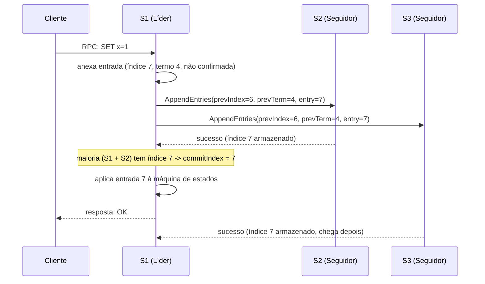

## Objetivos de Aprendizagem

- Rastrear, passo a passo, tudo o que acontece entre um cliente emitir uma escrita e receber uma resposta bem-sucedida num sistema replicado por Raft, nomeando o conceito ou mecanismo exato responsável por cada passo.
- Rastrear o que muda nesse fluxo quando um seguidor está lento para responder, e explicar por que o líder não espera por ele.
- Rastrear o que muda quando o líder cai no meio da replicação (tanto antes quanto depois de a entrada ser confirmada), e explicar por que a escrita do cliente nunca é silenciosamente perdida, apenas possivelmente deixada sem confirmação.
- Enunciar honestamente, num parágrafo, exatamente onde o rigor desta disciplina termina e o tratamento aplicado e em escala de produção do mesmo mecanismo (ZooKeeper, etcd) começa.

## Contexto e Motivação

Este capstone encerra a disciplina fazendo algo que nenhum dos dezenove conceitos anteriores fez isoladamente: seguir uma escrita de cliente concreta através de cada camada que esta disciplina construiu, em ordem, e nomear o conceito exato responsável por cada passo. `the-replicated-state-machine-approach` sinalizou este rastreamento pelo nome ao descrever como os clientes submetem comandos: "o comando reenviado de um cliente precisa ser reconhecido como um reenvio (não um comando novo e duplicado)... uma preocupação concreta que o capstone ao fim desta disciplina rastreia explicitamente". Essa preocupação, o que `at-least-once-at-most-once-and-exactly-once-semantics` nomeou como a ambiguidade que um timeout cria, é exatamente uma das coisas que este rastreamento tem de acertar, ao lado do empacotamento de `remote-procedure-calls-and-the-illusion-of-a-local-call`, do AppendEntries e índice de commit de `raft-log-replication-and-commitment`, e da garantia de `raft-safety-the-election-restriction-and-log-completeness` de que uma escrita confirmada nunca é perdida, apenas possivelmente deixada sem confirmação. Todo mecanismo rastreado aqui assume o modelo de falha por queda nomeado explicitamente em `crash-faults-vs-byzantine-faults`, o conceito imediatamente anterior, uma fronteira que este capstone enuncia honestamente em vez de estender silenciosamente além dela.

## Teoria Central

### O caminho de ponta a ponta, nomeado passo a passo

Uma escrita de cliente para um cluster Raft de 3 nós (S1 como líder, S2 e S3 como seguidores) toca, em ordem, exatamente estes mecanismos:

```text
1. CLIENTE -> LÍDER: o cliente envia seu comando via um RPC
   comum (remote-procedure-calls-and-the-illusion-of-a-
   local-call) para qualquer servidor que ele acredite ser o
   líder atual. Se ele adivinhar errado, esse servidor o
   redireciona (servidores Raft sempre sabem, ou aprendem
   rapidamente, quem reivindicou liderança por último no
   maior termo que já viram).

2. LÍDER ANEXA: o líder anexa o comando ao seu próprio log
   como uma nova entrada NÃO CONFIRMADA (raft-log-replication-
   and-commitment), marcada com seu termo atual e o próximo
   índice de log.

3. LÍDER REPLICA: o líder envia RPCs AppendEntries, carregando
   a nova entrada e o índice/termo da entrada anterior, a cada
   seguidor (a verificação de consistência de raft-log-
   replication-and-commitment).

4. MAIORIA CONFIRMA: assim que uma maioria do cluster (líder
   incluído) armazenou a entrada, o líder avança seu índice de
   commit até essa entrada: pela prova de Completude do Líder
   de raft-safety-the-election-restriction-and-log-
   completeness, uma entrada confirmada nunca pode ser perdida
   ou sobrescrita por nenhum líder futuro.

5. APLICA À MÁQUINA DE ESTADOS: a entrada confirmada é aplicada
   à máquina de estados local do líder (o determinismo de the-
   replicated-state-machine-approach garante que toda réplica
   que a aplica produz o resultado idêntico).

6. LÍDER RESPONDE: só agora o líder responde ao RPC original
   do cliente: o cliente fica sabendo que sua escrita teve
   sucesso só depois que ela está durável e confirmada de
   forma não perdível, nunca antes.
```



### O que muda quando um seguidor está lento

O passo 4 só exige uma **maioria**, não unanimidade, exatamente o ponto que o próprio Exemplo 1 de `raft-log-replication-and-commitment` já estabeleceu. Se S3 está lento, o líder confirma e responde ao cliente no instante em que S1 e S2 sozinhos confirmam o índice 7, sem esperar por S3 de todo. A confirmação eventual e tardia de S3 não muda nada sobre a correção: ela simplesmente confirma o que já era seguramente verdadeiro. Esta é precisamente a vantagem que `primary-backup-vs-quorum-based-replication` descreveu como a vantagem da replicação baseada em quórum sobre exigir a participação de toda réplica.

### O que muda quando o líder cai no meio da replicação

Dois casos genuinamente diferentes importam, dependendo de exatamente quando S1 cai:

```text
CASO A: queda ANTES de uma maioria armazenar a entrada:
  S1 anexa a entrada 7 localmente e envia AppendEntries, mas
  cai antes que S2 OU S3 a confirmem. A entrada nunca foi
  confirmada (nenhuma maioria a confirmou). Um novo líder é
  eleito (conforme raft-leader-election); esse novo líder pode
  ou não ter a entrada 7 em seu próprio log (nunca houve
  garantia de que ela se propagaria). O cliente, não tendo
  recebido nenhuma resposta, atinge o timeout e REENVIA:
  exatamente a ambiguidade que at-least-once-at-most-once-and-
  exactly-once-semantics nomeou: o cliente não consegue dizer
  se sua escrita foi inteiramente perdida ou se só sua
  confirmação foi. Um reenvio seguro precisa do comando marcado
  com um ID de requisição idempotente gerado pelo cliente, de
  modo que se a entrada 7 (ou uma entrada equivalente
  ressubmetida) acabar aplicada duas vezes devido ao reenvio,
  a máquina de estados reconheça a duplicata e não a aplique
  duas vezes.

CASO B: queda DEPOIS de uma maioria armazenar a entrada, mas
ANTES de responder ao cliente:
  S1 anexa a entrada 7, S2 confirma (maioria alcançada,
  commitIndex avança para 7, entrada aplicada à PRÓPRIA máquina
  de estados de S1), e ENTÃO S1 cai, antes de sua resposta
  alcançar o cliente. Aqui, pela prova de Completude do Líder
  de raft-safety, a entrada NÃO é perdida: o log de qualquer
  líder futuro tem garantia de já contê-la. O cliente,
  novamente, vê só um timeout e não consegue distinguir este
  caso do Caso A por si só: ele reenvia, mas desta vez o MESMO
  mecanismo de ID de requisição idempotente deve reconhecer o
  comando como já aplicado e simplesmente retornar o resultado
  já computado, em vez de aplicar "SET x=1" uma segunda vez.
```

Ambos os casos produzem o sintoma idêntico visível ao cliente (um timeout, sem resposta), que é exatamente por que o mecanismo de reenvio idempotente de `at-least-once-at-most-once-and-exactly-once-semantics`, não a própria lógica de replicação do Raft, é o que de fato entrega um resultado seguro e efetivamente exactly-once ao cliente, apesar de o Raft só prometer a metade de durabilidade de log da garantia.

### Onde o rigor desta disciplina termina, e a camada aplicada começa

Tudo rastreado acima é exatamente o que esta disciplina prova rigorosamente: dado o modelo de falha por queda, uma implementação Raft correta garante que uma escrita confirmada nunca é perdida e nunca é silenciosamente sobrescrita. O que esta disciplina não desenvolve é a engenharia de produção sobreposta: snapshotting para limitar um log em crescimento perpétuo, mudanças de composição do cluster (adicionar ou remover servidores de forma segura, ao vivo), rastreamento de sessão de cliente para deduplicação em escala, e o ferramental operacional que implantações reais precisam. Essa camada aplicada é exatamente o que `consensus-and-coordination-services` (`system-design-concepts`) cobre: ZooKeeper e etcd são sistemas reais de produção construídos precisamente sobre o mecanismo rastreado aqui (o etcd usa Raft diretamente), expondo-o como infraestrutura reutilizável para locks, eleição de líder e configuração: o mesmo argumento de infraestrutura reutilizável que `the-consensus-problem-agreement-validity-and-termination` fez quando nomeou esses dois sistemas pela primeira vez.

## Exemplos Resolvidos

### Exemplo 1: o caminho feliz completo, rastreado com índices e termos concretos

```text
S1 líder, termo 4, commitIndex atualmente 6. Cliente envia
RPC: "SET x=1" (ID de requisição: req-882).

1. S1 anexa: log[7] = (term=4, "SET x=1", req-882).
2. S1 envia AppendEntries(prevIndex=6, prevTerm=4, entries=
   [7:"SET x=1"]) para S2 e S3.
3. O log de S2 já concorda com S1 no índice 6 (mesmo termo) ->
   S2 anexa a entrada 7, responde sucesso.
4. S1 agora tem {S1, S2} = 2 de 3 = maioria. commitIndex
   avança para 7.
5. S1 aplica "SET x=1" à sua máquina de estados (x vira 1),
   registra req-882 como aplicado.
6. S1 responde ao cliente: OK.
7. S3, ainda se atualizando, responde sucesso um momento
   depois: não muda nada; a entrada 7 já estava seguramente
   confirmada.
```

### Exemplo 2: um seguidor lento, e por que o líder nunca espera por ele

```text
Mesma configuração. Desta vez S3 é particionado inteiramente
pelas próximas várias escritas. S1 continua: a entrada 8
("SET y=2") confirma via {S1, S2}; a entrada 9 ("SET x=3")
confirma via {S1, S2}. As escritas do cliente para ambas têm
sucesso, com respostas, em tempo normal: a ausência de S3 nunca
sequer uma vez bloqueia o progresso, já que 2 de 3 já é uma
maioria. Quando a partição se cura, a verificação de
consistência do AppendEntries de S1 (raft-log-replication-and-
commitment) descobre que S3 concordou pela última vez no índice
7, e replica as entradas 8 e 9 para ele no curso comum dos
AppendEntries / heartbeats subsequentes, trazendo S3 de volta
ao pleno acordo sem nenhum tratamento especial.
```

### Exemplo 3: queda do líder após o commit, e um reenvio idempotente seguro

```text
S1 líder, termo 4. Cliente envia RPC "SET x=1" (req-991).
S1 anexa a entrada 10, replica-a, S2 confirma: maioria
alcançada, commitIndex avança para 10, S1 a aplica (x=1), e
ENTÃO S1 cai, antes de sua resposta alcançar o cliente.

O RPC do cliente atinge o timeout. Ele não consegue dizer se
sua escrita foi perdida (Caso A acima) ou confirmada-mas-não-
reconhecida (Caso B): de onde ele está, ambos parecem idênticos.

O timeout de S3 dispara; pela restrição de eleição (raft-
safety), só um servidor cujo log esteja ao menos tão atualizado
quanto uma maioria pode vencer: S2 (que tem a entrada 10) é
elegível; um candidato hipotético sem a entrada 10 teria um
voto recusado por S2, então qualquer que seja o servidor que
vença, a entrada 10 sobrevive no log do novo líder, exatamente
como a Completude do Líder garante.

O cliente reenvia o RPC "SET x=1" (MESMO req-991) contra o novo
líder. A máquina de estados reconhece req-991 como já aplicado
(da primeira tentativa, bem-sucedida-mas-não-reconhecida) e
retorna o resultado já computado SEM reaplicar "SET x=1" uma
segunda vez: o cliente observa uma escrita normal e bem-
sucedida, sem nenhum sinal visível de que uma queda de líder e
um reenvio aconteceram de todo.
```

## Equívocos Comuns e Armadilhas

- **"A escrita do cliente está segura no momento em que o líder a anexa ao seu próprio log."** O passo 1 do Exemplo 1 não é a fronteira de segurança: uma queda imediatamente após o append local e antes de qualquer seguidor confirmar (Caso A) significa que a entrada pode nunca alcançar uma maioria de todo; a escrita só se torna duravelmente segura quando uma maioria a armazenou (passo 4), a fronteira exata que `raft-log-replication-and-commitment` definiu como "confirmada".
- **"Se o líder cai após confirmar mas antes de responder, a escrita é perdida."** O Exemplo 3 mostra precisamente o oposto: a escrita NÃO é perdida (a Completude do Líder garante que ela sobrevive no log de todo líder futuro), apenas a RESPOSTA do cliente é perdida, que é um problema real mas inteiramente diferente, resolvido por um reenvio idempotente (`at-least-once-at-most-once-and-exactly-once-semantics`), não pela própria garantia de replicação do Raft.
- **"As garantias deste rastreamento se estendem automaticamente a um sistema que deve tolerar servidores maliciosos, não só caídos."** Todo passo acima (validade de voto por maioria, segurança por sobreposição de maiorias, a restrição de eleição) assume o modelo de falha por queda que `crash-faults-vs-byzantine-faults` nomeou explicitamente como a fronteira desta disciplina: um servidor bizantino mentindo sobre ter armazenado ou aplicado uma entrada quebra este rastreamento exato nas formas que aquele conceito percorreu concretamente, e exige um protocolo genuinamente diferente, não um cluster maior.

## Resumo

Uma escrita de cliente para um sistema replicado por Raft passa por cada mecanismo que esta disciplina construiu, em ordem: um RPC entrega o comando ao líder, o líder o anexa ao seu próprio log como não confirmado, AppendEntries o replica para os seguidores, o líder avança seu índice de commit no instante em que uma maioria (ele incluído) o armazenou, nunca esperando por um seguidor lento, aplica a entrada agora confirmada à sua máquina de estados determinística, e só então responde ao cliente. Uma queda de líder antes de essa maioria ser alcançada deixa a escrita genuinamente não confirmada, exigindo um reenvio do cliente; uma queda de líder após o commit mas antes da resposta deixa a escrita seguramente durável (pela Propriedade de Completude do Líder) mas a resposta perdida, exigindo que o mesmo reenvio seja reconhecido, idempotentemente, como uma duplicata em vez de reaplicado. Cada uma dessas garantias repousa sobre a suposição de falha por queda nomeada explicitamente no conceito anterior: esta disciplina prova o mecanismo rigorosamente sob essa suposição, e passa o bastão a `consensus-and-coordination-services` (`system-design-concepts`) exatamente onde snapshotting, mudanças de composição e preocupações operacionais em escala de produção começam, sobre precisamente o mecanismo rastreado aqui.

## Documentation Links

- [Ongaro & Ousterhout: In Search of an Understandable Consensus Algorithm (Raft, USENIX ATC 2014)](https://raft.github.io/raft.pdf): o artigo fonte para cada mecanismo que este rastreamento de ponta a ponta nomeia em sequência: requisições de cliente dirigidas por RPC, append de log, replicação via AppendEntries, confirmação baseada em maioria e aplicação à máquina de estados.
- [MIT 6.5840 (Distributed Systems): Course Overview](https://pdos.csail.mit.edu/6.824/index.html): o curso cujas tarefas de laboratório de Raft exigem implementar e testar exatamente este caminho de escrita de cliente de ponta a ponta, incluindo os cenários de queda de líder e seguidor lento rastreados aqui.
