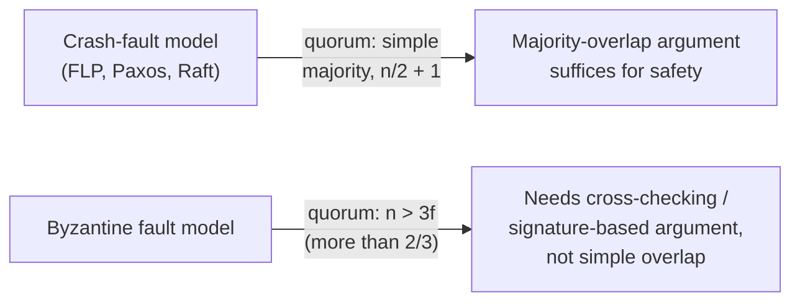

## Learning Objectives

- Define the crash-fault (fail-stop) model precisely, and state that every protocol covered in this discipline — FLP, Paxos, Raft — assumes exactly this model.
- Define the Byzantine fault model precisely, and state exactly how it differs from crash faults: not merely silence, but arbitrary, potentially contradictory behavior.
- Trace, concretely, where Raft's majority-vote and quorum-overlap arguments (the election restriction and the Leader Completeness proof from `raft-safety-the-election-restriction-and-log-completeness`) stop working once a faulty server can actively misbehave rather than merely stop.
- State honestly why a Byzantine-tolerant protocol needs a larger quorum and a different safety argument, without re-deriving one — naming `system-design-concepts`' applied treatment as where that derivation actually lives.

## Context & Motivation

`the-flp-impossibility-result` flagged this concept by name while defining its own assumptions: "Faults are the simplest kind, crash faults: a faulty process simply stops executing... it does not send corrupted or contradictory messages (that harder model is `crash-faults-vs-byzantine-faults`, later in this discipline)." Every proof this discipline has built since then — FLP's impossibility argument, Paxos's majority-overlap safety property, Raft's election restriction and Leader Completeness proof — has quietly relied on that same assumption: a faulty server goes silent, but it never lies. This concept makes that assumption explicit, names the strictly harder model where it doesn't hold, and shows concretely why the majority-overlap arguments this discipline has proven twice already (once for Paxos, once for Raft) cannot simply be reused unmodified once servers are allowed to actively misbehave.

## Core Theory

### The crash-fault (fail-stop) model, precisely

Under the crash-fault model, a faulty process does exactly one thing: **it stops.** At some point it simply ceases executing and sending any further messages — permanently, for the purposes of the protocols this discipline covers. Crucially, a crashed process never sends a message it shouldn't, never sends different, contradictory messages to different peers, and never corrupts the content of a message in transit. Every proof in this discipline assumes this: FLP's bivalence argument reasons about a process that might crash at the worst possible moment, but never about one that sends a poisoned message; Raft's Leader Completeness proof assumes a server reports its own log's term and index truthfully in every RequestVote exchange.

### The Byzantine fault model, precisely — arbitrary, not merely absent

The Byzantine fault model, named for Lamport, Shostak, and Pease's Byzantine Generals framing, assumes the opposite extreme: a faulty process may behave **arbitrarily** — it can send no message at all (subsuming crash faults as one special case), send a corrupted message, or, most importantly, send **different and mutually contradictory messages to different peers**, deliberately or otherwise. A Byzantine process is not merely broken; it may be actively adversarial, coordinating its lies with other faulty processes to cause maximum damage to the protocol's guarantees.

```text
CRASH FAULT:      stops. silence. never lies. never sends a
                   message it shouldn't.

BYZANTINE FAULT:  may send NOTHING, or CORRUPTED messages, or
                   DIFFERENT, CONTRADICTORY messages to
                   different peers, possibly in coordination
                   with other faulty processes.
```

### Where Raft's majority-overlap argument breaks

`raft-safety-the-election-restriction-and-log-completeness`'s proof depended on a specific step: the one server `S` in the overlap between the committing majority and the voting majority is assumed to report its own log truthfully when deciding whether to grant a vote, and to actually have durably stored the entry it claims to have stored. Under Byzantine faults, both assumptions can fail independently, and the majority-overlap argument no longer forces a contradiction:

```text
1. A Byzantine server can vote for TWO DIFFERENT candidates in
   the SAME term, by simply lying to each about having already
   voted. Raft's "at most one leader per term" guarantee relied
   on a fixed cluster's two majorities always overlapping in a
   server that behaves ONE consistent way — a server that
   behaves two different ways to two different recipients
   defeats the overlap argument outright, since it no longer
   represents a single, shared point of agreement.

2. A Byzantine server can ACKNOWLEDGE an AppendEntries RPC as
   successfully stored without actually persisting the entry.
   The leader's commit rule ("a majority has stored it") assumes
   an acknowledgment means the entry is genuinely durable — a
   lying acknowledgment breaks that assumption directly, letting
   an entry be "committed" that a majority never actually holds.
```

Both failures are invisible to Raft's protocol as written — nothing in RequestVote or AppendEntries requires (or lets a recipient verify) that a peer is being consistent across its interactions with everyone else.

### The quorum-size difference, named honestly

Because a Byzantine-tolerant protocol cannot simply trust an acknowledgment or a single peer's report of another peer's state, real Byzantine fault-tolerant protocols (PBFT, and its many descendants) require a larger quorum — needing more than two-thirds of the cluster (`n > 3f`, tolerating `f` Byzantine servers out of `n` total) rather than a simple majority — and a different safety argument built around servers cross-checking each other's claims rather than trusting a single overlapping voter. This discipline does not re-derive that argument in full: it is named honestly here, as a real, structurally distinct problem, and its applied protocol-level treatment (the Byzantine Generals Problem, PBFT) already exists in `byzantine-faults-and-system-models` (`system-design-concepts`).



## Worked Examples

### Example 1 — a crash fault, and why the overlap argument still holds fine

```text
Cluster S1..S5. S1 is the leader for term 4 and commits entry
E after {S1, S2, S3} store it. S1 then CRASHES — it stops
entirely, sends nothing further, ever.

A later leader S4 for term 5 must get votes from a majority
drawn from {S2, S3, S4, S5} (S1 is gone). That majority must
include S2 or S3 (as in raft-safety's Example 3), and that
server reports its OWN log truthfully — it either has E and
refuses S4's vote, or the vote proceeds correctly. S1's crash
caused no contradictory reports anywhere; the overlap argument
goes through exactly as proven.
```

### Example 2 — a Byzantine fault breaking "at most one leader per term"

```text
Same cluster. S3 is Byzantine (compromised or buggy in an
adversarial way). In term 6, both S1 and S4 campaign.

S3 votes for S1 — AND separately, in the same term 6, tells S4
it is voting for S4 too, sending each candidate a consistent-
looking but mutually exclusive RequestVote response.

If S2 votes for S1 and S5 votes for S4 (S1 and S4 split the
rest), S1's tally is {S1, S2, S3} = 3 votes; S4's tally is
{S4, S5, S3} = 3 votes — S3's DOUBLE vote lets BOTH S1 and S4
reach what looks, to each of them individually, like a
majority of 5. Raft's guarantee of "at most one leader per
term" — which relied on any two majorities of a FIXED,
consistently-behaving cluster overlapping in a server that
can only have voted once — is broken the moment that
overlapping server can report two different truths to two
different askers.
```

### Example 3 — a Byzantine fault breaking commit safety via a false acknowledgment

```text
Leader S1 sends AppendEntries(entry=10) to S2 and S3. S3 is
Byzantine and replies "success" WITHOUT actually writing entry
10 to its own durable log.

S1 sees {S1, S3} = 2 of 3 needed... but wait, S1 needs a
majority of the FULL 5-server cluster. Suppose the majority
counted is {S1, S2, S3}: S1 believes entry 10 is committed,
because it believes 3 of 5 replicas hold it. In reality only
S1 and S2 genuinely do — S3's acknowledgment was false. If S1
now crashes, the Leader Completeness proof's very first step
("a majority genuinely stored E before it was committed")
no longer holds, since S3 never really stored it — the entire
proof from `raft-safety-the-election-restriction-and-log-
completeness` was built on acknowledgments meaning genuine,
durable storage, an assumption a Byzantine server is free to
violate.
```

## Common Misconceptions & Pitfalls

- **"Byzantine fault tolerance is just crash fault tolerance with a bit more redundancy."** Examples 2 and 3 show the difference is structural, not just quantitative — a crash-tolerant protocol's safety arguments assume truthful (if possibly absent) participation, and simply adding more replicas does not stop a present-but-lying server from breaking those specific arguments; a genuinely different protocol design (cross-checking, larger quorums, often digital signatures) is required.
- **"Raft could be made Byzantine-tolerant by just requiring a bigger majority."** Example 2 shows the problem isn't the size of the majority threshold, but that a Byzantine server can report inconsistent information to different peers within the same round — no majority size alone prevents a server from lying differently to different recipients; that requires mechanisms (like requiring signed, non-repudiable votes, or protocols like PBFT's multi-round cross-checking) that Raft as designed simply does not have.
- **"The weaker crash-fault model is an unrealistic simplification, so results built on it don't matter in practice."** The crash-fault model is exactly the right, realistic assumption for a huge and important class of real systems — servers within a single trusted operator's datacenter, where hardware and software failures happen but active malice from a participating server does not — which is precisely why Raft and Paxos, both crash-fault protocols, power the overwhelming majority of production consensus systems (etcd, Consul, and most Paxos-derived systems); Byzantine tolerance matters specifically in adversarial or multi-organization settings (blockchains, cross-organization systems with no shared trust), a genuinely different deployment context.

## Summary

Every protocol this discipline has proven anything about — FLP, Paxos, Raft's election restriction and Leader Completeness — assumes the crash-fault (fail-stop) model: a faulty process stops, but never lies. The Byzantine fault model is strictly harder and assumes the opposite: a faulty process may behave arbitrarily, including sending different, contradictory messages to different peers, possibly in coordination with other faulty processes. Concretely, this breaks Raft's core arguments in at least two ways — a Byzantine server can vote for two different candidates in the same term by lying to each, defeating the "at most one leader per term" majority-overlap guarantee, and a Byzantine server can falsely acknowledge storing an entry it never durably wrote, defeating the assumption behind the Leader Completeness proof that a majority acknowledgment means genuine majority storage. Real Byzantine-tolerant protocols need a larger quorum (more than two-thirds, not a simple majority) and a fundamentally different, cross-checking safety argument — named honestly here as a real, distinct problem this discipline does not re-derive, since its applied, protocol-level treatment already exists in `byzantine-faults-and-system-models` (`system-design-concepts`).

## Documentation Links

- [Fischer, Lynch & Paterson — Impossibility of Distributed Consensus with One Faulty Process (JACM 1985)](https://groups.csail.mit.edu/tds/papers/Lynch/jacm85.pdf) — cited here for its explicit crash-fault assumption ("a faulty process simply stops"), the exact baseline this concept contrasts against the strictly harder Byzantine model.
- [ACM/IEEE — CS2013, Parallel and Distributed Computing Knowledge Area](https://csed.acm.org/knowledge-areas-parallel-and-distributed-computing-pd-cs2013-version/) — the curriculum guideline listing fault models, including the crash-vs-Byzantine distinction, as a core parallel-and-distributed-computing topic.
