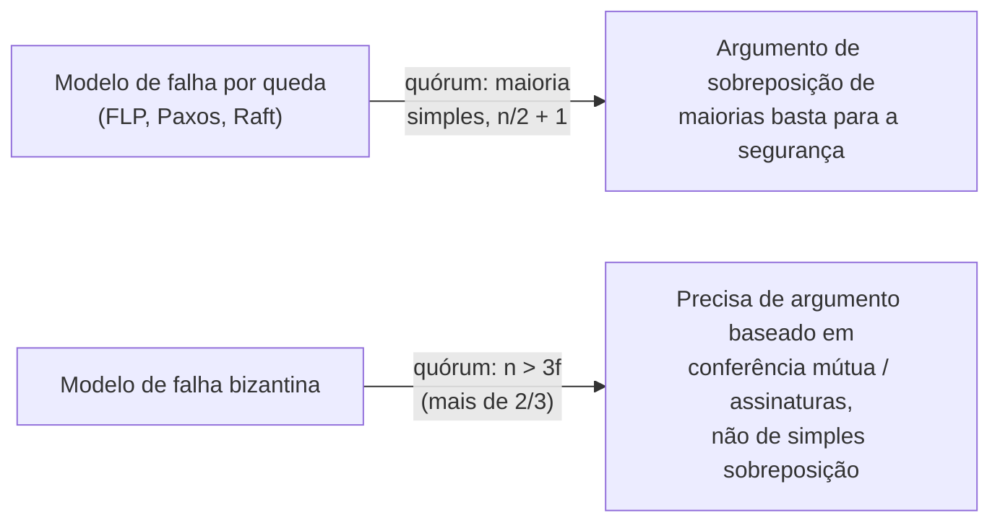

## Objetivos de Aprendizagem

- Definir com precisão o modelo de falha por queda (fail-stop), e enunciar que todo protocolo coberto nesta disciplina (FLP, Paxos, Raft) assume exatamente este modelo.
- Definir com precisão o modelo de falha bizantina, e enunciar exatamente como ele difere das falhas por queda: não meramente silêncio, mas comportamento arbitrário e potencialmente contraditório.
- Rastrear, concretamente, onde os argumentos de voto por maioria e sobreposição de quórum do Raft (a restrição de eleição e a prova de Completude do Líder de `raft-safety-the-election-restriction-and-log-completeness`) deixam de funcionar assim que um servidor defeituoso pode se comportar mal ativamente em vez de meramente parar.
- Enunciar honestamente por que um protocolo tolerante a falhas bizantinas precisa de um quórum maior e de um argumento de segurança diferente, sem re-derivar um, nomeando o tratamento aplicado de `system-design-concepts` como o lugar onde essa derivação de fato vive.

## Contexto e Motivação

`the-flp-impossibility-result` sinalizou este conceito pelo nome ao definir suas próprias suposições: "Falhas são do tipo mais simples, falhas por queda: um processo defeituoso simplesmente para de executar... ele não envia mensagens corrompidas ou contraditórias (esse modelo mais difícil é `crash-faults-vs-byzantine-faults`, mais tarde nesta disciplina)." Toda prova que esta disciplina construiu desde então (o argumento de impossibilidade de FLP, a propriedade de segurança de sobreposição de maiorias de Paxos, a restrição de eleição e prova de Completude do Líder de Raft) silenciosamente dependeu dessa mesma suposição: um servidor defeituoso fica em silêncio, mas nunca mente. Este conceito torna essa suposição explícita, nomeia o modelo estritamente mais difícil onde ela não se sustenta, e mostra concretamente por que os argumentos de sobreposição de maiorias que esta disciplina já provou duas vezes (uma para Paxos, uma para Raft) não podem simplesmente ser reutilizados sem modificação uma vez que os servidores têm permissão para se comportar mal ativamente.

## Teoria Central

### O modelo de falha por queda (fail-stop), com precisão

Sob o modelo de falha por queda, um processo defeituoso faz exatamente uma coisa: **ele para.** Em algum ponto ele simplesmente cessa de executar e de enviar quaisquer mensagens adicionais, permanentemente, para os propósitos dos protocolos que esta disciplina cobre. Crucialmente, um processo caído nunca envia uma mensagem que não deveria, nunca envia mensagens diferentes e contraditórias a diferentes pares, e nunca corrompe o conteúdo de uma mensagem em trânsito. Toda prova nesta disciplina assume isso: o argumento de bivalência de FLP raciocina sobre um processo que pode cair no pior momento possível, mas nunca sobre um que envia uma mensagem envenenada; a prova de Completude do Líder de Raft assume que um servidor relata o termo e o índice de seu próprio log com veracidade em toda troca de RequestVote.

### O modelo de falha bizantina, com precisão: arbitrário, não meramente ausente

O modelo de falha bizantina, nomeado em referência à concepção dos Generais Bizantinos de Lamport, Shostak e Pease, assume o extremo oposto: um processo defeituoso pode se comportar **arbitrariamente**, pode não enviar nenhuma mensagem de todo (subsumindo as falhas por queda como um caso especial), enviar uma mensagem corrompida, ou, mais importante, enviar **mensagens diferentes e mutuamente contraditórias a diferentes pares**, deliberadamente ou não. Um processo bizantino não está meramente quebrado; ele pode ser ativamente adversarial, coordenando suas mentiras com outros processos defeituosos para causar dano máximo às garantias do protocolo.

```text
FALHA POR QUEDA:  para. silêncio. nunca mente. nunca envia uma
                   mensagem que não deveria.

FALHA BIZANTINA:  pode não enviar NADA, ou mensagens
                   CORROMPIDAS, ou mensagens DIFERENTES e
                   CONTRADITÓRIAS a diferentes pares,
                   possivelmente em coordenação com outros
                   processos defeituosos.
```

### Onde o argumento de sobreposição de maiorias do Raft quebra

A prova de `raft-safety-the-election-restriction-and-log-completeness` dependia de um passo específico: assume-se que o único servidor `S` na sobreposição entre a maioria que confirma e a maioria que vota relata seu próprio log com veracidade ao decidir se concede um voto, e que de fato armazenou duravelmente a entrada que afirma ter armazenado. Sob falhas bizantinas, ambas as suposições podem falhar independentemente, e o argumento de sobreposição de maiorias não força mais uma contradição:

```text
1. Um servidor bizantino pode votar em DOIS CANDIDATOS
   DIFERENTES no MESMO termo, simplesmente mentindo a cada um
   sobre já ter votado. A garantia de "no máximo um líder por
   termo" do Raft dependia de duas maiorias de um cluster fixo
   sempre se sobreporem num servidor que se comporta de UMA
   forma consistente: um servidor que se comporta de duas
   formas diferentes para dois destinatários diferentes derrota
   o argumento de sobreposição de vez, já que ele não
   representa mais um único ponto compartilhado de acordo.

2. Um servidor bizantino pode CONFIRMAR um RPC AppendEntries
   como armazenado com sucesso sem de fato persistir a entrada.
   A regra de commit do líder ("uma maioria o armazenou") assume
   que uma confirmação significa que a entrada é genuinamente
   durável: uma confirmação mentirosa quebra essa suposição
   diretamente, permitindo que uma entrada seja "confirmada"
   que uma maioria nunca de fato mantém.
```

Ambas as falhas são invisíveis ao protocolo do Raft como escrito: nada em RequestVote ou AppendEntries exige (ou permite a um destinatário verificar) que um par esteja sendo consistente em suas interações com todos os outros.

### A diferença no tamanho do quórum, nomeada honestamente

Como um protocolo tolerante a falhas bizantinas não pode simplesmente confiar numa confirmação ou no relato de um único par sobre o estado de outro par, os protocolos reais tolerantes a falhas bizantinas (PBFT, e seus muitos descendentes) exigem um quórum maior, precisando de mais de dois terços do cluster (`n > 3f`, tolerando `f` servidores bizantinos de `n` no total) em vez de uma maioria simples, e um argumento de segurança diferente construído em torno de servidores conferindo mutuamente as afirmações uns dos outros em vez de confiar num único votante sobreposto. Esta disciplina não re-deriva esse argumento por completo: ele é nomeado honestamente aqui, como um problema real e estruturalmente distinto, e seu tratamento aplicado em nível de protocolo (o Problema dos Generais Bizantinos, PBFT) já existe em `byzantine-faults-and-system-models` (`system-design-concepts`).



## Exemplos Resolvidos

### Exemplo 1: uma falha por queda, e por que o argumento de sobreposição ainda se sustenta bem

```text
Cluster S1..S5. S1 é o líder do termo 4 e confirma a entrada
E depois que {S1, S2, S3} a armazenam. S1 então CAI: ele para
inteiramente, não envia nada mais, nunca.

Um líder posterior S4 do termo 5 deve obter votos de uma
maioria extraída de {S2, S3, S4, S5} (S1 se foi). Essa maioria
deve incluir S2 ou S3 (como no Exemplo 3 de raft-safety), e
esse servidor relata seu PRÓPRIO log com veracidade: ele ou tem
E e recusa o voto de S4, ou o voto prossegue corretamente. A
queda de S1 não causou relatos contraditórios em lugar nenhum;
o argumento de sobreposição passa exatamente como provado.
```

### Exemplo 2: uma falha bizantina quebrando "no máximo um líder por termo"

```text
Mesmo cluster. S3 é bizantino (comprometido ou defeituoso de
forma adversarial). No termo 6, tanto S1 quanto S4 se candidatam.

S3 vota em S1, E separadamente, no mesmo termo 6, diz a S4 que
está votando em S4 também, enviando a cada candidato uma
resposta de RequestVote com aparência consistente mas
mutuamente exclusiva.

Se S2 vota em S1 e S5 vota em S4 (S1 e S4 dividem o resto), a
contagem de S1 é {S1, S2, S3} = 3 votos; a contagem de S4 é
{S4, S5, S3} = 3 votos: o voto DUPLO de S3 permite que TANTO
S1 quanto S4 alcancem o que parece, a cada um deles
individualmente, uma maioria de 5. A garantia de "no máximo um
líder por termo" do Raft, que dependia de quaisquer duas
maiorias de um cluster FIXO e de comportamento consistente se
sobreporem num servidor que só pode ter votado uma vez, é
quebrada no momento em que esse servidor sobreposto pode relatar
duas verdades diferentes a dois interrogadores diferentes.
```

### Exemplo 3: uma falha bizantina quebrando a segurança do commit via uma confirmação falsa

```text
O líder S1 envia AppendEntries(entry=10) para S2 e S3. S3 é
bizantino e responde "sucesso" SEM de fato escrever a entrada
10 em seu próprio log durável.

S1 vê {S1, S3} = 2 dos 3 necessários... mas espere, S1 precisa
de uma maioria do cluster COMPLETO de 5 servidores. Suponha que
a maioria contada seja {S1, S2, S3}: S1 acredita que a entrada
10 está confirmada, porque acredita que 3 de 5 réplicas a
mantêm. Na realidade só S1 e S2 genuinamente a mantêm: a
confirmação de S3 foi falsa. Se S1 agora cai, o primeiro passo
da prova de Completude do Líder ("uma maioria genuinamente
armazenou E antes de ele ser confirmado") não se sustenta mais,
já que S3 nunca realmente a armazenou: toda a prova de `raft-
safety-the-election-restriction-and-log-completeness` foi
construída sobre confirmações significarem armazenamento
genuíno e durável, uma suposição que um servidor bizantino é
livre para violar.
```

## Equívocos Comuns e Armadilhas

- **"Tolerância a falhas bizantinas é só tolerância a falhas por queda com um pouco mais de redundância."** Os Exemplos 2 e 3 mostram que a diferença é estrutural, não apenas quantitativa: os argumentos de segurança de um protocolo tolerante a queda assumem participação veraz (ainda que possivelmente ausente), e simplesmente adicionar mais réplicas não impede que um servidor presente-mas-mentiroso quebre esses argumentos específicos; um projeto de protocolo genuinamente diferente (conferência mútua, quóruns maiores, frequentemente assinaturas digitais) é exigido.
- **"O Raft poderia ser tornado tolerante a falhas bizantinas apenas exigindo uma maioria maior."** O Exemplo 2 mostra que o problema não é o tamanho do limiar de maioria, mas que um servidor bizantino pode relatar informação inconsistente a diferentes pares dentro da mesma rodada: nenhum tamanho de maioria sozinho impede um servidor de mentir de forma diferente a diferentes destinatários; isso exige mecanismos (como exigir votos assinados e não repudiáveis, ou protocolos como a conferência mútua multi-rodada do PBFT) que o Raft como projetado simplesmente não tem.
- **"O modelo mais fraco de falha por queda é uma simplificação irrealista, então resultados construídos sobre ele não importam na prática."** O modelo de falha por queda é exatamente a suposição certa e realista para uma classe enorme e importante de sistemas reais (servidores dentro do datacenter de um único operador confiável, onde falhas de hardware e software acontecem mas malícia ativa de um servidor participante não), que é precisamente por que Raft e Paxos, ambos protocolos de falha por queda, alimentam a esmagadora maioria dos sistemas de consenso de produção (etcd, Consul e a maioria dos sistemas derivados de Paxos); a tolerância bizantina importa especificamente em cenários adversariais ou multi-organização (blockchains, sistemas entre organizações sem confiança compartilhada), um contexto de implantação genuinamente diferente.

## Resumo

Todo protocolo sobre o qual esta disciplina provou qualquer coisa (FLP, Paxos, a restrição de eleição e a Completude do Líder de Raft) assume o modelo de falha por queda (fail-stop): um processo defeituoso para, mas nunca mente. O modelo de falha bizantina é estritamente mais difícil e assume o oposto: um processo defeituoso pode se comportar arbitrariamente, incluindo enviar mensagens diferentes e contraditórias a diferentes pares, possivelmente em coordenação com outros processos defeituosos. Concretamente, isso quebra os argumentos centrais do Raft de pelo menos duas formas: um servidor bizantino pode votar em dois candidatos diferentes no mesmo termo mentindo a cada um, derrotando a garantia de sobreposição de maiorias de "no máximo um líder por termo", e um servidor bizantino pode falsamente confirmar ter armazenado uma entrada que nunca escreveu duravelmente, derrotando a suposição por trás da prova de Completude do Líder de que uma confirmação de maioria significa armazenamento genuíno de maioria. Os protocolos reais tolerantes a falhas bizantinas precisam de um quórum maior (mais de dois terços, não uma maioria simples) e de um argumento de segurança fundamentalmente diferente, de conferência mútua, nomeado honestamente aqui como um problema real e distinto que esta disciplina não re-deriva, já que seu tratamento aplicado em nível de protocolo já existe em `byzantine-faults-and-system-models` (`system-design-concepts`).

## Documentation Links

- [Fischer, Lynch & Paterson — Impossibility of Distributed Consensus with One Faulty Process (JACM 1985)](https://groups.csail.mit.edu/tds/papers/Lynch/jacm85.pdf): citado aqui por sua suposição explícita de falha por queda ("um processo defeituoso simplesmente para"), a linha de base exata que este conceito contrasta com o modelo bizantino estritamente mais difícil.
- [ACM/IEEE — CS2013, Parallel and Distributed Computing Knowledge Area](https://csed.acm.org/knowledge-areas-parallel-and-distributed-computing-pd-cs2013-version/): a diretriz de currículo que lista modelos de falha, incluindo a distinção entre falha por queda e bizantina, como um tópico central de computação paralela e distribuída.
