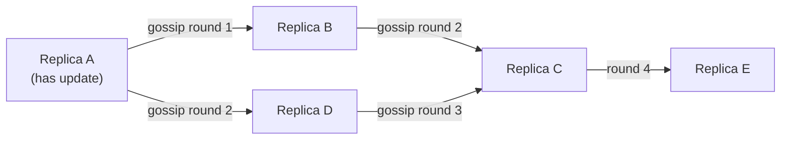

## Learning Objectives

- State eventual consistency's actual guarantee precisely: if no new writes arrive, all replicas will eventually converge to the same value, with no bound on how long convergence takes.
- Explain what eventual consistency deliberately does NOT promise (a read at any given moment can return any previously-written value, or even observe writes out of order), and why real systems accept this trade for availability during partitions.
- Explain the gossip / anti-entropy mechanism replicas commonly use to reach eventual convergence, and its genuine structural parallel to distance-vector routing's own local-information convergence.
- Order eventual consistency, sequential consistency, and linearizability from weakest to strongest guarantee.

## Context & Motivation

`sequential-consistency-and-why-it-is-weaker` showed that dropping the real-time constraint from linearizability already permits surprising, stale-read behavior. Eventual consistency drops far more — it makes no promise at all about any single read's freshness, only a long-run, liveness-style promise about what eventually happens if writes stop. Understanding exactly how weak this guarantee is, and why real systems choose it anyway, sets up the CAP theorem's actual trade-off, next, precisely.

## Core Theory

### The guarantee, stated precisely

A replicated system is **eventually consistent** if it guarantees: *if no new updates are made to a given piece of data, all replicas holding a copy of it will eventually return the same, most-recently-written value.* Notice everything this leaves unspecified: there is no bound on how long "eventually" takes (it could be milliseconds, or, under a bad enough partition, arbitrarily long); there is no guarantee about what any particular read returns *before* convergence happens (it could be any previously-written value, not necessarily the most recent one); and there is no guarantee that different replicas observe a series of writes in the same order relative to each other while convergence is still in progress.

### Why real systems choose this trade deliberately

This is not a settled-for compromise made only because something better was too hard — it is a genuine, deliberate engineering trade for **availability**: an eventually consistent system can keep answering reads and writes on any replica, even one that is currently cut off from the rest of the system by a network partition, because it never needs to coordinate with other replicas before responding. A linearizable or sequentially consistent system, by contrast, generally has to refuse to answer (or wait) on a replica that cannot currently confirm it has the latest state — exactly the tension the CAP theorem, next, formalizes.

### Gossip and anti-entropy: how convergence is actually reached

Real eventually-consistent systems don't converge by magic — they run a **gossip** (also called anti-entropy) protocol: periodically, each replica picks another replica at random (or by some fixed schedule) and exchanges recent updates with it, so that information spreads through the system the way a rumor spreads through a population — no replica needs a complete, global view of every other replica; it only needs to talk to a few neighbors repeatedly, and updates eventually reach everyone through the resulting chain of local exchanges.



### The genuine structural parallel to distance-vector routing

`routing-algorithms-link-state-vs-distance-vector` (`computer-networks`) already covered distance-vector routing as an algorithm where every router only knows about its immediate neighbors, periodically exchanges its own routing table with them, and the whole network's routing tables eventually converge to correct shortest paths — with no router ever having a complete, instantaneous global view. This is not merely analogous to gossip-based eventual consistency; it is the same underlying structural pattern (local-information-only exchange, repeated over time, converging eventually without any global coordination step), including an analogous cost: distance-vector routing has its own well-known transient-inconsistency failure mode (count-to-infinity, already covered there) during convergence, exactly paralleling how an eventually-consistent data store can return contradictory-looking, not-yet-converged answers from different replicas mid-gossip.

## Worked Examples

### Example 1 — a read that returns a stale value, entirely within the guarantee

```text
t=0    Client writes x=1 to Replica A. A now has x=1.
t=1    Client writes x=2 to Replica A (a later write, same
       key). A now has x=2. Neither write has yet reached
       Replica B via gossip.
t=2    A different client reads x from Replica B -> returns
       x=1 (B's last-known value, since gossip hasn't
       propagated A's writes to B yet)

This is NOT a bug and does not violate eventual consistency's
guarantee — the guarantee only promises convergence once
writes STOP arriving; while writes are actively happening, any
previously-written value (including x=1, and even the
system's very first, oldest value if gossip is slow enough) is
a legal read result.
```

### Example 2 — convergence actually happening, traced through gossip rounds

```text
t=0     Replica A receives write x=5 (A: x=5, B: x=?, C: x=?
        — say all start at x=0)
Round 1 A gossips with B: B updates to x=5. (A: 5, B: 5, C: 0)
Round 2 B gossips with C: C updates to x=5. (A: 5, B: 5, C: 5)

After 2 gossip rounds, with no new writes arriving in the
meantime, all 3 replicas hold x=5 — exactly the eventual
convergence the guarantee promises, reached here via the exact
gossip mechanism described above, with the actual TIME to
converge depending entirely on the gossip schedule and which
replicas happen to talk to which others.
```

### Example 3 — the distance-vector parallel, made concrete

```text
DISTANCE-VECTOR ROUTING (computer-networks):
  Router R only knows its own neighbors' advertised costs to
  each destination. R periodically exchanges its own table
  with its neighbors. After enough rounds, every router's
  table converges to correct shortest-path costs — but a link
  failure can transiently cause count-to-infinity: routers
  keep offering each other stale, mutually-reinforcing bad
  costs until enough rounds pass to correct it.

GOSSIP-BASED EVENTUAL CONSISTENCY:
  Replica R only knows what its own recent gossip partners
  told it. R periodically exchanges recent updates with a
  few other replicas. After enough gossip rounds, every
  replica converges to the same value — but a replica that
  gossiped with a stale peer can transiently propagate an
  OLD value further into the system before the newer value
  catches up, a direct structural echo of count-to-infinity's
  transient bad information spreading through local exchange.

Same underlying pattern: local-only information, repeated
exchange, eventual (not immediate) convergence, and a shared
risk of transient, self-reinforcing staleness during that
convergence window.
```

## Common Misconceptions & Pitfalls

- **"Eventual consistency means the system is basically consistent, just with a small delay."** Example 1 shows the guarantee says nothing about HOW stale a read can be while writes are ongoing — "eventually" carries no upper bound at all, and under an extended partition it can mean much longer than "a small delay."
- **"Gossip protocols and distance-vector routing are just superficially similar because both involve message-passing."** The parallel in Example 3 is structural, not superficial: both are specifically local-information-only algorithms that converge through repeated pairwise exchange rather than global coordination, and both share the same class of transient-inconsistency risk (count-to-infinity vs. stale-value propagation) as a direct consequence of that shared structure.
- **"An eventually-consistent system provides no guarantee at all, so it's not really a consistency model."** It provides a real, precisely-stated guarantee — convergence once writes stop — it's simply a much weaker guarantee than sequential consistency or linearizability, occupying a specific, well-defined point on the same spectrum, not "no guarantee."

## Summary

Eventual consistency guarantees only that replicas will converge to the same value once writes to a given piece of data stop — with no bound on how long convergence takes and no promise about what any individual read returns in the meantime — a deliberate, weaker trade real systems make specifically to remain available even on a replica currently cut off by a network partition. Real systems reach that eventual convergence through gossip (anti-entropy) protocols, in which replicas periodically exchange recent updates with a few peers rather than coordinating globally — a mechanism structurally identical to distance-vector routing's own local-information convergence, including a shared risk of transient, self-reinforcing staleness during convergence. Ordered from strongest to weakest, this discipline has now covered linearizability, sequential consistency, and eventual consistency — exactly the spectrum the CAP theorem, next, uses to make its own precise trade-off statement.

## Documentation Links

- [ACM/IEEE — CS2013, Parallel and Distributed Computing Knowledge Area](https://csed.acm.org/knowledge-areas-parallel-and-distributed-computing-pd-cs2013-version/) — the curriculum guideline listing gossip/anti-entropy convergence and weak consistency models like this one as core parallel-and-distributed-computing topics.
