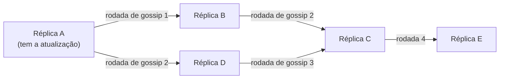

## Objetivos de Aprendizagem

- Enunciar com precisão a garantia real da consistência eventual: se nenhuma escrita nova chegar, todas as réplicas vão eventualmente convergir para o mesmo valor, sem limite para quanto tempo a convergência leva.
- Explicar o que a consistência eventual deliberadamente NÃO promete (uma leitura num dado momento pode retornar qualquer valor escrito anteriormente, ou até observar escritas fora de ordem), e por que sistemas reais aceitam essa troca em favor da disponibilidade durante partições.
- Explicar o mecanismo de gossip / anti-entropy que réplicas comumente usam para alcançar a convergência eventual, e o seu paralelo estrutural genuíno com a convergência por informação local do próprio roteamento por vetor de distâncias.
- Ordenar consistência eventual, consistência sequencial e linearizabilidade da garantia mais fraca para a mais forte.

## Contexto e Motivação

`sequential-consistency-and-why-it-is-weaker` mostrou que descartar a restrição de tempo real da linearizabilidade já permite comportamentos surpreendentes de leitura desatualizada. A consistência eventual descarta muito mais: ela não faz promessa alguma sobre o quão recente é qualquer leitura isolada, apenas uma promessa de longo prazo, no estilo de vivacidade, sobre o que eventualmente acontece se as escritas pararem. Entender exatamente quão fraca é essa garantia, e por que sistemas reais a escolhem mesmo assim, prepara com precisão o trade-off real do teorema CAP, a seguir.

## Teoria Central

### A garantia, enunciada com precisão

Um sistema replicado é **eventualmente consistente** se garante: *se nenhuma atualização nova for feita a um dado pedaço de dados, todas as réplicas que guardam uma cópia dele vão eventualmente retornar o mesmo valor, o escrito mais recentemente.* Note tudo o que isso deixa sem especificar: não há limite para quanto tempo "eventualmente" leva (pode ser milissegundos ou, sob uma partição ruim o suficiente, arbitrariamente longo); não há garantia sobre o que qualquer leitura em particular retorna *antes* que a convergência aconteça (pode ser qualquer valor escrito anteriormente, não necessariamente o mais recente); e não há garantia de que réplicas diferentes observem uma série de escritas na mesma ordem relativa entre si enquanto a convergência ainda está em andamento.

### Por que sistemas reais escolhem essa troca deliberadamente

Isto não é uma concessão aceita só porque algo melhor era difícil demais; é uma troca de engenharia genuína e deliberada em favor da **disponibilidade**: um sistema eventualmente consistente consegue continuar respondendo leituras e escritas em qualquer réplica, mesmo uma que esteja atualmente isolada do resto do sistema por uma partição de rede, porque nunca precisa se coordenar com outras réplicas antes de responder. Um sistema linearizável ou sequencialmente consistente, por contraste, geralmente precisa se recusar a responder (ou esperar) numa réplica que não consegue confirmar no momento que tem o estado mais recente, exatamente a tensão que o teorema CAP, a seguir, formaliza.

### Gossip e anti-entropy: como a convergência é de fato alcançada

Sistemas reais eventualmente consistentes não convergem por mágica: eles rodam um protocolo de **gossip** (também chamado de anti-entropy). Periodicamente, cada réplica escolhe outra réplica ao acaso (ou por algum cronograma fixo) e troca atualizações recentes com ela, de modo que a informação se espalha pelo sistema como um boato se espalha por uma população. Nenhuma réplica precisa de uma visão completa e global de todas as outras réplicas; ela só precisa falar com alguns vizinhos repetidamente, e as atualizações eventualmente alcançam todos por meio da cadeia resultante de trocas locais.



### O paralelo estrutural genuíno com o roteamento por vetor de distâncias

`routing-algorithms-link-state-vs-distance-vector` (`computer-networks`) já cobriu o roteamento por vetor de distâncias como um algoritmo em que cada roteador só conhece os seus vizinhos imediatos, troca periodicamente a sua própria tabela de roteamento com eles, e as tabelas de roteamento da rede inteira eventualmente convergem para os caminhos mais curtos corretos, sem que nenhum roteador jamais tenha uma visão global completa e instantânea. Isto não é meramente análogo à consistência eventual baseada em gossip; é o mesmo padrão estrutural subjacente (troca apenas de informação local, repetida ao longo do tempo, convergindo eventualmente sem nenhum passo de coordenação global), incluindo um custo análogo: o roteamento por vetor de distâncias tem o seu próprio modo de falha bem conhecido de inconsistência transitória (contagem ao infinito, já coberta ali) durante a convergência, exatamente paralelo a como um armazenamento de dados eventualmente consistente pode retornar respostas aparentemente contraditórias, ainda não convergidas, de réplicas diferentes no meio do gossip.

## Exemplos Resolvidos

### Exemplo 1: uma leitura que retorna um valor desatualizado, inteiramente dentro da garantia

```text
t=0    O cliente escreve x=1 na Réplica A. A agora tem x=1.
t=1    O cliente escreve x=2 na Réplica A (uma escrita posterior, mesma
       chave). A agora tem x=2. Nenhuma das escritas chegou ainda à
       Réplica B via gossip.
t=2    Um cliente diferente lê x da Réplica B -> retorna x=1 (o último
       valor conhecido por B, já que o gossip ainda não propagou as
       escritas de A para B)

Isto NÃO é um bug e não viola a garantia da consistência eventual --
a garantia só promete convergência quando as escritas PARAREM de
chegar; enquanto escritas estão ativamente acontecendo, qualquer
valor escrito anteriormente (incluindo x=1, e até o primeiríssimo e
mais antigo valor do sistema se o gossip for lento o suficiente) é um
resultado de leitura legal.
```

### Exemplo 2: a convergência de fato acontecendo, rastreada pelas rodadas de gossip

```text
t=0       A Réplica A recebe a escrita x=5 (A: x=5, B: x=?, C: x=?
          -- digamos que todas começam em x=0)
Rodada 1  A faz gossip com B: B atualiza para x=5. (A: 5, B: 5, C: 0)
Rodada 2  B faz gossip com C: C atualiza para x=5. (A: 5, B: 5, C: 5)

Depois de 2 rodadas de gossip, sem novas escritas chegando nesse meio-
tempo, as 3 réplicas guardam x=5 -- exatamente a convergência eventual
que a garantia promete, alcançada aqui via o exato mecanismo de gossip
descrito acima, com o TEMPO real para convergir dependendo inteiramente
do cronograma de gossip e de quais réplicas calham de falar com quais
outras.
```

### Exemplo 3: o paralelo com o vetor de distâncias, tornado concreto

```text
ROTEAMENTO POR VETOR DE DISTÂNCIAS (computer-networks):
  O roteador R só conhece os custos anunciados pelos seus próprios
  vizinhos para cada destino. R troca periodicamente a sua própria
  tabela com os seus vizinhos. Depois de rodadas suficientes, a tabela
  de todo roteador converge para os custos corretos de caminho mais
  curto -- mas a falha de um enlace pode causar transitoriamente a
  contagem ao infinito: roteadores continuam oferecendo uns aos outros
  custos ruins, desatualizados e que se reforçam mutuamente, até que
  passem rodadas suficientes para corrigir isso.

CONSISTÊNCIA EVENTUAL BASEADA EM GOSSIP:
  A réplica R só sabe o que os seus próprios parceiros de gossip
  recentes lhe disseram. R troca periodicamente atualizações recentes
  com algumas outras réplicas. Depois de rodadas de gossip suficientes,
  toda réplica converge para o mesmo valor -- mas uma réplica que fez
  gossip com um par desatualizado pode propagar transitoriamente um
  valor ANTIGO mais para dentro do sistema antes que o valor mais novo
  o alcance, um eco estrutural direto da informação ruim transitória
  da contagem ao infinito se espalhando por troca local.

Mesmo padrão subjacente: informação apenas local, troca repetida,
convergência eventual (não imediata) e um risco compartilhado de
desatualização transitória que se autorreforça durante essa janela de
convergência.
```

## Equívocos Comuns e Armadilhas

- **"Consistência eventual significa que o sistema é basicamente consistente, só com um pequeno atraso."** O Exemplo 1 mostra que a garantia não diz nada sobre QUÃO desatualizada uma leitura pode estar enquanto escritas estão em andamento. "Eventualmente" não carrega limite superior algum, e sob uma partição prolongada pode significar muito mais que "um pequeno atraso".
- **"Protocolos de gossip e roteamento por vetor de distâncias só são superficialmente parecidos porque ambos envolvem troca de mensagens."** O paralelo do Exemplo 3 é estrutural, e não superficial: os dois são especificamente algoritmos de informação apenas local que convergem por troca repetida entre pares em vez de coordenação global, e os dois compartilham a mesma classe de risco de inconsistência transitória (contagem ao infinito vs. propagação de valor desatualizado) como consequência direta dessa estrutura compartilhada.
- **"Um sistema eventualmente consistente não fornece garantia alguma, então não é de fato um modelo de consistência."** Ele fornece uma garantia real e enunciada com precisão (convergência quando as escritas param); é só uma garantia muito mais fraca que a consistência sequencial ou a linearizabilidade, ocupando um ponto específico e bem definido no mesmo espectro, e não "nenhuma garantia".

## Resumo

A consistência eventual garante apenas que as réplicas vão convergir para o mesmo valor quando as escritas a um dado pedaço de dados pararem, sem limite para quanto tempo a convergência leva e sem promessa sobre o que qualquer leitura individual retorna nesse meio-tempo, uma troca deliberada e mais fraca que sistemas reais fazem especificamente para continuar disponíveis mesmo numa réplica atualmente isolada por uma partição de rede. Sistemas reais alcançam essa convergência eventual por meio de protocolos de gossip (anti-entropy), em que réplicas trocam periodicamente atualizações recentes com alguns pares em vez de se coordenarem globalmente, um mecanismo estruturalmente idêntico à convergência por informação local do próprio roteamento por vetor de distâncias, incluindo um risco compartilhado de desatualização transitória que se autorreforça durante a convergência. Ordenados do mais forte para o mais fraco, esta disciplina já cobriu linearizabilidade, consistência sequencial e consistência eventual, exatamente o espectro que o teorema CAP, a seguir, usa para fazer o seu próprio enunciado preciso de trade-off.

## Documentation Links

- [ACM/IEEE: CS2013, Parallel and Distributed Computing Knowledge Area](https://csed.acm.org/knowledge-areas-parallel-and-distributed-computing-pd-cs2013-version/): a diretriz curricular que lista a convergência por gossip/anti-entropy e modelos de consistência fracos como este como tópicos centrais de computação paralela e distribuída.
