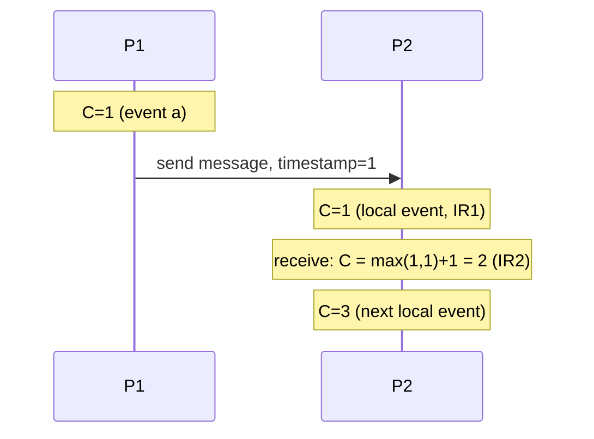

## Learning Objectives

- Define the happens-before relation (→) precisely from program order and message exchange, without reference to physical time.
- Explain why happens-before is a partial order — not a total order — and what it means for two events to be "concurrent."
- State the Clock Condition and the logical-clock algorithm (increment on every event; on receive, take the max with the message's timestamp, then increment) that satisfies it.
- Explain how ties are broken with process identifiers to extend the partial order into a total order, and why that total order is useful despite being, in a sense, arbitrary among concurrent events.

## Context & Motivation

`physical-clock-synchronization-and-drift` established that physical clocks cannot be trusted to order events across machines, because the network delay needed to synchronize them cannot be measured precisely enough. Lamport's 1978 paper takes a completely different approach: instead of trying to build a better clock, it defines an ordering of events directly from what a distributed system can actually, unambiguously observe — the order in which each individual process executes its own events, and the fact that a message is always sent before it is received. No physical time enters the definition at all.

## Core Theory

### The happens-before relation, defined directly from observation

Lamport defines `a → b` ("a happens-before b") as the smallest relation satisfying:

```text
(1) If a and b are events in the SAME process, and a occurs
    before b in that process's own sequential execution, then
    a → b.
(2) If a is the sending of a message by one process, and b is
    the receipt of that SAME message by another process, then
    a → b.
(3) Transitivity: if a → b and b → c, then a → c.
```

Both premises are things a distributed system can genuinely observe with certainty — a process knows its own execution order, and a message's send always precedes its receipt in the real world — unlike a wall-clock timestamp, which (per the previous concept) cannot be trusted for this purpose.

### Happens-before is a partial order, not a total order

Two events `a` and `b` are called **concurrent** (written `a ‖ b`) if neither `a → b` nor `b → a` holds — this happens whenever they occur on different processes with no chain of messages connecting one to the other. This is exactly the structure of a **partial order**, already defined rigorously in `partial-orders` (`discrete-math-logic`): happens-before is irreflexive and transitive, but not total, because concurrent events are genuinely incomparable — there is no fact of the matter, observable from the system's own behavior, about which one "really" happened first, because neither one could possibly have influenced the other. This is not a limitation of the definition; it is an honest reflection of the actual causal structure of the system.

### The logical clock algorithm and the Clock Condition

Lamport gives a simple algorithm assigning each event a single integer timestamp `C(e)` satisfying the **Clock Condition**: if `a → b`, then `C(a) < C(b)`. Each process maintains its own counter, following two implementation rules:

```text
IR1: Before executing any event (including sending a message),
     a process increments its own counter by 1.

IR2: When a process receives a message timestamped Tm, it sets
     its own counter to max(its current counter, Tm) + 1,
     before processing the receive event itself.
```

IR1 alone guarantees the Clock Condition holds for events within one process (rule 1 of happens-before). IR2 is what extends the guarantee across processes (rule 2): a receiving process's clock is forced to "catch up" to at least one more than whatever the sender's clock said, so the receive event's timestamp is always strictly greater than the corresponding send event's timestamp. Transitivity (rule 3) then follows automatically from the two rules applied along any chain of happens-before relationships.



### The total order, and why breaking ties is legitimate

Many practical uses (e.g. deciding a single global order for events that must be applied consistently everywhere) need a *total* order, not just a partial one. Lamport extends `→` into a total order `⇒` by breaking ties among concurrent events (equal or incomparable logical timestamps) using each event's process identifier: `a ⇒ b` if `C(a) < C(b)`, or `C(a) = C(b)` and `a`'s process ID is less than `b`'s. This total order is consistent with the *causal* partial order (it never reorders anything that happens-before requires to stay in order), but among truly concurrent events it makes an essentially arbitrary — though fixed and reproducible — choice, because there genuinely is no causal fact to break the tie with. That arbitrariness is fine for its intended purpose (e.g. giving every replica of a system the exact same global order to apply operations in), precisely because concurrent events, by definition, could not have affected each other, so no observable behavior depends on which one is treated as "first."

### Beyond Lamport clocks: what a single integer timestamp cannot tell you

Lamport's logical clock guarantees `a → b ⟹ C(a) < C(b)`, but not the converse: `C(a) < C(b)` does not imply `a → b` — two genuinely concurrent events can easily end up with `C(a) < C(b)` purely by coincidence of how the counters happened to increment, and a single integer has no way to distinguish "a definitely happened before b" from "a and b were actually concurrent, and a's counter just happened to be smaller." Detecting concurrency itself — not just producing *some* correct total order — requires strictly more information than a single scalar can carry: a structure (commonly a vector of per-process counters, one integer per process in the system, incremented and merged with a componentwise maximum on receive) that lets two events' timestamps be compared and, when neither vector dominates the other componentwise, correctly identified as concurrent rather than falsely ordered one way or the other. This discipline surveys that extension by name rather than developing its full comparison algorithm, since Lamport's simpler scalar clock is already sufficient for everything the consensus protocols later in this discipline (Raft's own term numbers and log indices) actually need.

## Worked Examples

### Example 1 — logical clocks assigned across 3 processes with real message exchange

```text
P1, P2, P3 all start with local counter = 0.

P1: local event a1        -> IR1: C=1
P1: sends msg M1 to P2     -> IR1: C=2 (send counts as an event)
P2: local event b1        -> IR1: C=1
P2: receives M1 (ts=2)     -> IR2: C = max(1,2)+1 = 3
P2: sends msg M2 to P3     -> IR1: C=4
P3: local event c1        -> IR1: C=1
P3: local event c2        -> IR1: C=2
P3: receives M2 (ts=4)     -> IR2: C = max(2,4)+1 = 5

Final timestamps: a1=1, (P1 send)=2, b1=1, (P2 receive M1)=3,
(P2 send M2)=4, c1=1, c2=2, (P3 receive M2)=5

Check the Clock Condition on the two real happens-before
chains:
  a1 → (P1 sends M1) → (P2 receives M1): 1 < 2 < 3  ✓.
  (P2 sends M2) → (P3 receives M2): 4 < 5  ✓.
b1 and c1 are on different processes with no message chain
between them — they are CONCURRENT (b1 ‖ c1), correctly
reflected by the fact that neither happens-before the other,
regardless of what their timestamps (1 and 1) happen to say.
```

### Example 2 — a scalar clock's false-ordering blind spot

```text
P1: local event x         -> C=5 (after several prior events)
P2: local event y         -> C=3 (P2 has been "slower" so far,
                                   fewer prior events)

C(x)=5 > C(y)=3 might tempt someone to say "y happened before
x" using the total order ⇒ — and for the purposes the total
order is DESIGNED for (giving every replica the same fixed
processing order), that's a perfectly legitimate, reproducible
choice. But x and y are actually CONCURRENT: neither event's
process ever sent a message the other received, so there is
no genuine causal relationship between them at all. A vector
clock would make this visible directly (neither vector would
dominate the other); Lamport's scalar clock, by design, cannot
distinguish "genuinely happened first" from "arbitrarily
ordered first by the tie-breaking total order" — which is
exactly why the total order ⇒, not the partial order →, is
the one making that choice, and why that's the right layer
for that choice to happen at.
```

### Example 3 — deriving the total order with a concrete tie

```text
Event p (process ID 2): logical timestamp C(p) = 4
Event q (process ID 1): logical timestamp C(q) = 4

Neither → holds between p and q (assume no message chain
connects them) — they are concurrent, with EQUAL logical
timestamps. Using the total order ⇒'s tie-break rule (lower
process ID wins on equal timestamps): since process ID 1 < 2,
q ⇒ p — q is placed before p in the total order, a fixed,
reproducible decision every replica applying this total order
will make identically, even though nothing about q "really"
happened before p causally.
```

## Common Misconceptions & Pitfalls

- **"A larger Lamport timestamp always means the event really happened later."** Example 2 shows this is false for concurrent events — a larger timestamp only reliably means "later" when a genuine happens-before chain connects the two events; for concurrent events the comparison is coincidental, not causal.
- **"Since happens-before is a partial order and not total, Lamport clocks are incomplete or broken."** The partial order is not a limitation to be fixed — it's an honest, correct reflection of the system's actual causal structure (Example 1's b1 and c1 truly have no causal relationship). The total order ⇒ is a separate, deliberately-added construction for situations that specifically need one, built on top of the honest partial order rather than replacing it.
- **"Lamport clocks can tell you whether two events are concurrent."** They cannot, by design — Example 2's blind spot is fundamental to using a single scalar. Genuinely detecting concurrency (as opposed to just producing some fixed total order) requires a richer structure like a vector clock, which this concept surveys by name as the honest next step beyond what a scalar Lamport clock provides.

## Summary

Lamport's happens-before relation (→) is defined entirely from what a distributed system can actually observe with certainty — each process's own execution order, and the fact that a message is always sent before it is received — producing a genuine partial order in which concurrent events (on different processes, connected by no message chain) are correctly left incomparable rather than forced into a possibly-wrong order. The logical clock algorithm (increment on every event via IR1, take the max with an incoming message's timestamp plus one via IR2) assigns integer timestamps satisfying the Clock Condition (`a → b` implies `C(a) < C(b)`), and breaking ties by process ID extends this into a total order useful whenever a system needs every replica to agree on one single, reproducible global ordering — even though that ordering makes an arbitrary, but fixed, choice among events that were never causally related in the first place. A single scalar timestamp cannot, by itself, detect concurrency (larger doesn't mean later, for concurrent events) — the honest extension for that purpose is a vector of per-process counters, named here and left as a natural next step, since Lamport's simpler construction already suffices for everything the consensus protocols later in this discipline need.

## Documentation Links

- [Lamport — Time, Clocks, and the Ordering of Events in a Distributed System (CACM 1978)](https://lamport.azurewebsites.net/pubs/time-clocks.pdf) — Lamport's own paper defining the happens-before relation and the IR1/IR2 logical-clock algorithm this concept's Core Theory works through directly.
- [ACM/IEEE — CS2013, Parallel and Distributed Computing Knowledge Area](https://csed.acm.org/knowledge-areas-parallel-and-distributed-computing-pd-cs2013-version/) — the curriculum guideline listing logical time and causal event ordering as a core parallel-and-distributed-computing topic.
