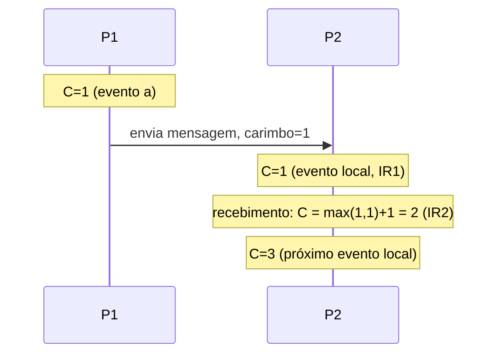

## Objetivos de Aprendizagem

- Definir com precisão a relação happens-before (→) a partir da ordem do programa e da troca de mensagens, sem referência ao tempo físico.
- Explicar por que happens-before é uma ordem parcial (e não uma ordem total) e o que significa dois eventos serem "concorrentes".
- Enunciar a Condição do Relógio e o algoritmo de relógio lógico (incrementar a cada evento; no recebimento, tomar o máximo com o carimbo da mensagem e depois incrementar) que a satisfaz.
- Explicar como os empates são desfeitos com identificadores de processo para estender a ordem parcial numa ordem total, e por que essa ordem total é útil apesar de ser, em certo sentido, arbitrária entre eventos concorrentes.

## Contexto e Motivação

`physical-clock-synchronization-and-drift` estabeleceu que relógios físicos não são confiáveis para ordenar eventos entre máquinas, porque o atraso de rede necessário para sincronizá-los não pode ser medido com precisão suficiente. O artigo de Lamport de 1978 adota uma abordagem completamente diferente: em vez de tentar construir um relógio melhor, ele define uma ordem de eventos diretamente a partir do que um sistema distribuído consegue de fato observar sem ambiguidade: a ordem em que cada processo individual executa os seus próprios eventos, e o fato de que uma mensagem é sempre enviada antes de ser recebida. Nenhum tempo físico entra na definição.

## Teoria Central

### A relação happens-before, definida diretamente a partir da observação

Lamport define `a → b` ("a acontece antes de b") como a menor relação que satisfaz:

```text
(1) Se a e b são eventos no MESMO processo, e a ocorre antes de
    b na própria execução sequencial desse processo, então a → b.
(2) Se a é o envio de uma mensagem por um processo, e b é o
    recebimento dessa MESMA mensagem por outro processo, então
    a → b.
(3) Transitividade: se a → b e b → c, então a → c.
```

As duas premissas são coisas que um sistema distribuído consegue genuinamente observar com certeza (um processo conhece a sua própria ordem de execução, e o envio de uma mensagem sempre precede o seu recebimento no mundo real), ao contrário de um carimbo de horário de relógio, que (pelo conceito anterior) não é confiável para este propósito.

### Happens-before é uma ordem parcial, não uma ordem total

Dois eventos `a` e `b` são chamados de **concorrentes** (escrito `a ‖ b`) se nem `a → b` nem `b → a` vale, o que acontece sempre que eles ocorrem em processos diferentes sem nenhuma cadeia de mensagens conectando um ao outro. Esta é exatamente a estrutura de uma **ordem parcial**, já definida com rigor em `partial-orders` (`discrete-math-logic`): happens-before é irreflexiva e transitiva, mas não total, porque eventos concorrentes são genuinamente incomparáveis. Não há nenhum fato, observável a partir do próprio comportamento do sistema, sobre qual deles "realmente" aconteceu primeiro, porque nenhum deles poderia ter influenciado o outro. Isto não é uma limitação da definição; é um reflexo honesto da estrutura causal real do sistema.

### O algoritmo de relógio lógico e a Condição do Relógio

Lamport dá um algoritmo simples que atribui a cada evento um único carimbo inteiro `C(e)` satisfazendo a **Condição do Relógio**: se `a → b`, então `C(a) < C(b)`. Cada processo mantém o seu próprio contador, seguindo duas regras de implementação:

```text
IR1: Antes de executar qualquer evento (incluindo enviar uma
     mensagem), um processo incrementa o seu próprio contador em 1.

IR2: Quando um processo recebe uma mensagem com carimbo Tm, ele
     define o seu próprio contador como max(seu contador atual, Tm) + 1,
     antes de processar o próprio evento de recebimento.
```

A IR1 sozinha garante que a Condição do Relógio vale para eventos dentro de um processo (a regra 1 de happens-before). A IR2 é o que estende a garantia entre processos (a regra 2): o relógio de um processo receptor é forçado a "alcançar" pelo menos um a mais do que o relógio do remetente dizia, então o carimbo do evento de recebimento é sempre estritamente maior que o carimbo do evento de envio correspondente. A transitividade (regra 3) então decorre automaticamente das duas regras aplicadas ao longo de qualquer cadeia de relações happens-before.



### A ordem total, e por que desempatar é legítimo

Muitos usos práticos (por exemplo, decidir uma única ordem global para eventos que precisam ser aplicados de forma consistente em todo lugar) precisam de uma ordem *total*, e não só de uma parcial. Lamport estende `→` numa ordem total `⇒` desempatando entre eventos concorrentes (carimbos lógicos iguais ou incomparáveis) usando o identificador de processo de cada evento: `a ⇒ b` se `C(a) < C(b)`, ou se `C(a) = C(b)` e o ID de processo de `a` for menor que o de `b`. Esta ordem total é consistente com a ordem parcial *causal* (ela nunca reordena nada que happens-before exija que fique em ordem), mas entre eventos verdadeiramente concorrentes ela faz uma escolha essencialmente arbitrária (embora fixa e reproduzível), porque genuinamente não existe fato causal com o qual desempatar. Essa arbitrariedade não é problema para o propósito pretendido (por exemplo, dar a toda réplica de um sistema exatamente a mesma ordem global em que aplicar operações), justamente porque eventos concorrentes, por definição, não poderiam ter afetado um ao outro, então nenhum comportamento observável depende de qual deles é tratado como "primeiro".

### Além dos relógios de Lamport: o que um único carimbo inteiro não consegue dizer

O relógio lógico de Lamport garante `a → b ⟹ C(a) < C(b)`, mas não a recíproca: `C(a) < C(b)` não implica `a → b`. Dois eventos genuinamente concorrentes podem facilmente acabar com `C(a) < C(b)` por pura coincidência de como os contadores calharam de incrementar, e um único inteiro não tem como distinguir "a definitivamente aconteceu antes de b" de "a e b eram na verdade concorrentes, e o contador de a só calhou de ser menor". Detectar a própria concorrência (e não só produzir *alguma* ordem total correta) exige estritamente mais informação do que um único escalar consegue carregar: uma estrutura (comumente um vetor de contadores por processo, um inteiro por processo do sistema, incrementado e mesclado com um máximo componente a componente no recebimento) que permite comparar os carimbos de dois eventos e, quando nenhum vetor domina o outro componente a componente, identificá-los corretamente como concorrentes em vez de falsamente ordenados numa direção ou na outra. Esta disciplina apresenta essa extensão pelo nome em vez de desenvolver o seu algoritmo completo de comparação, já que o relógio escalar mais simples de Lamport já é suficiente para tudo o que os protocolos de consenso mais adiante nesta disciplina (os próprios números de termo e índices de log do Raft) de fato precisam.

## Exemplos Resolvidos

### Exemplo 1: relógios lógicos atribuídos entre 3 processos com troca real de mensagens

```text
P1, P2, P3 começam todos com contador local = 0.

P1: evento local a1          -> IR1: C=1
P1: envia msg M1 para P2      -> IR1: C=2 (o envio conta como evento)
P2: evento local b1          -> IR1: C=1
P2: recebe M1 (ts=2)          -> IR2: C = max(1,2)+1 = 3
P2: envia msg M2 para P3      -> IR1: C=4
P3: evento local c1          -> IR1: C=1
P3: evento local c2          -> IR1: C=2
P3: recebe M2 (ts=4)          -> IR2: C = max(2,4)+1 = 5

Carimbos finais: a1=1, (envio de P1)=2, b1=1, (P2 recebe M1)=3,
(P2 envia M2)=4, c1=1, c2=2, (P3 recebe M2)=5

Conferindo a Condição do Relógio nas duas cadeias happens-before
reais:
  a1 → (P1 envia M1) → (P2 recebe M1): 1 < 2 < 3  ✓.
  (P2 envia M2) → (P3 recebe M2): 4 < 5  ✓.
b1 e c1 estão em processos diferentes sem nenhuma cadeia de
mensagens entre eles -- são CONCORRENTES (b1 ‖ c1), o que se
reflete corretamente no fato de que nenhum acontece antes do
outro, independentemente do que os seus carimbos (1 e 1) digam.
```

### Exemplo 2: o ponto cego de falsa ordenação de um relógio escalar

```text
P1: evento local x        -> C=5 (depois de vários eventos anteriores)
P2: evento local y        -> C=3 (P2 foi "mais lento" até agora,
                                  menos eventos anteriores)

C(x)=5 > C(y)=3 pode tentar alguém a dizer "y aconteceu antes de x"
usando a ordem total ⇒ -- e para os propósitos para os quais a ordem
total é PROJETADA (dar a toda réplica a mesma ordem fixa de
processamento), essa é uma escolha perfeitamente legítima e
reproduzível. Mas x e y são na verdade CONCORRENTES: o processo de
nenhum dos eventos jamais enviou uma mensagem que o outro recebeu,
então não há relação causal genuína alguma entre eles. Um relógio
vetorial tornaria isso visível diretamente (nenhum vetor dominaria
o outro); o relógio escalar de Lamport, por projeto, não consegue
distinguir "genuinamente aconteceu primeiro" de "arbitrariamente
ordenado primeiro pela ordem total de desempate" -- e é exatamente
por isso que é a ordem total ⇒, e não a ordem parcial →, que faz
essa escolha, e por que essa é a camada certa para essa escolha
acontecer.
```

### Exemplo 3: derivando a ordem total com um empate concreto

```text
Evento p (ID de processo 2): carimbo lógico C(p) = 4
Evento q (ID de processo 1): carimbo lógico C(q) = 4

Nenhuma → vale entre p e q (suponha que nenhuma cadeia de mensagens
os conecta) -- eles são concorrentes, com carimbos lógicos IGUAIS.
Usando a regra de desempate da ordem total ⇒ (o menor ID de processo
vence em carimbos iguais): como o ID de processo 1 < 2, q ⇒ p -- q é
colocado antes de p na ordem total, uma decisão fixa e reproduzível
que toda réplica aplicando esta ordem total tomará de forma idêntica,
mesmo que nada em q tenha "realmente" acontecido antes de p
causalmente.
```

## Equívocos Comuns e Armadilhas

- **"Um carimbo de Lamport maior sempre significa que o evento realmente aconteceu depois."** O Exemplo 2 mostra que isso é falso para eventos concorrentes: um carimbo maior só significa confiavelmente "depois" quando uma cadeia happens-before genuína conecta os dois eventos; para eventos concorrentes, a comparação é coincidência, e não causalidade.
- **"Como happens-before é uma ordem parcial e não total, os relógios de Lamport são incompletos ou quebrados."** A ordem parcial não é uma limitação a ser consertada; é um reflexo honesto e correto da estrutura causal real do sistema (b1 e c1 do Exemplo 1 genuinamente não têm relação causal). A ordem total ⇒ é uma construção separada, adicionada deliberadamente para situações que especificamente precisam de uma, construída em cima da ordem parcial honesta em vez de substituí-la.
- **"Relógios de Lamport conseguem dizer se dois eventos são concorrentes."** Não conseguem, por projeto: o ponto cego do Exemplo 2 é fundamental ao uso de um único escalar. Detectar genuinamente a concorrência (em vez de só produzir alguma ordem total fixa) exige uma estrutura mais rica, como um relógio vetorial, que este conceito apresenta pelo nome como o próximo passo honesto além do que um relógio escalar de Lamport fornece.

## Resumo

A relação happens-before (→) de Lamport é definida inteiramente a partir do que um sistema distribuído consegue de fato observar com certeza (a própria ordem de execução de cada processo, e o fato de que uma mensagem é sempre enviada antes de ser recebida), produzindo uma ordem parcial genuína na qual eventos concorrentes (em processos diferentes, conectados por nenhuma cadeia de mensagens) são corretamente deixados incomparáveis em vez de forçados numa ordem possivelmente errada. O algoritmo de relógio lógico (incrementar a cada evento via IR1, tomar o máximo com o carimbo de uma mensagem recebida mais um via IR2) atribui carimbos inteiros que satisfazem a Condição do Relógio (`a → b` implica `C(a) < C(b)`), e desempatar por ID de processo estende isso numa ordem total útil sempre que um sistema precisa que toda réplica concorde com uma única ordem global reproduzível, mesmo que essa ordem faça uma escolha arbitrária, mas fixa, entre eventos que nunca tiveram relação causal. Um único carimbo escalar não consegue, por si só, detectar concorrência (maior não significa depois, para eventos concorrentes); a extensão honesta para esse propósito é um vetor de contadores por processo, nomeado aqui e deixado como um próximo passo natural, já que a construção mais simples de Lamport já basta para tudo o que os protocolos de consenso mais adiante nesta disciplina precisam.

## Documentation Links

- [Lamport: Time, Clocks, and the Ordering of Events in a Distributed System (CACM 1978)](https://lamport.azurewebsites.net/pubs/time-clocks.pdf): o próprio artigo de Lamport, que define a relação happens-before e o algoritmo de relógio lógico IR1/IR2 que a Teoria Central deste conceito percorre diretamente.
- [ACM/IEEE: CS2013, Parallel and Distributed Computing Knowledge Area](https://csed.acm.org/knowledge-areas-parallel-and-distributed-computing-pd-cs2013-version/): a diretriz curricular que lista o tempo lógico e a ordenação causal de eventos como um tópico central de computação paralela e distribuída.
