## Learning Objectives

- State Herlihy & Wing's precise definition of linearizability: a real-time point between invocation and response, at which the operation appears to take effect, consistent with the return values a legal sequential history would produce.
- Explain why the real-time constraint (the linearization point must fall inside the operation's own invocation/response interval) is exactly what makes linearizability strong, and contrast this with the vaguer popular description "looks like there's just one copy of the data."
- Determine, given a concrete concurrent history with overlapping operations, whether it is linearizable by attempting to find valid linearization points.
- State honestly what linearizability does not promise (nothing about latency, nothing about surviving a total system failure) so it isn't mistaken for a stronger guarantee than it is.

## Context & Motivation

Every concept so far in this discipline has been about the *mechanics* of distributed systems — how failure looks, how RPC works, how to order events without a shared clock. This concept starts a different, equally necessary strand: precisely defining what it *means* for a system built from multiple replicas to behave "correctly," so that later concepts (CAP, and ultimately Raft) can make exact claims like "Raft provides linearizable reads and writes" rather than the vague, unfalsifiable "Raft keeps things consistent." Herlihy & Wing's 1990 paper is the source of the rigorous definition this discipline (and the field generally) uses.

## Core Theory

### The informal intuition, and why it isn't enough on its own

The popular description of linearizability — "it behaves as if there were only one copy of the data" — captures the right spirit but is too vague to check against a concrete execution: what, precisely, would "as if there were one copy" require of two operations that overlap in real time, one starting before the other finishes? The informal version has no way to answer this, which is exactly the gap Herlihy & Wing's formal definition closes.

### The formal definition: a real-time point of instantaneous effect

A concurrent history (a set of operations, each with its own invocation time and response time) is **linearizable** if there exists an assignment of a single point in real time to each operation — strictly between that operation's own invocation and its own response — such that:

```text
1. The sequence of operations, ordered by their assigned
   points, is a legal SEQUENTIAL history — i.e., it's exactly
   what you'd get if the operations really had been executed
   one at a time, in that order, on a single, non-concurrent
   copy of the object (every read sees the most recent
   preceding write, per the object's own single-threaded
   semantics).
2. If operation A's response happened strictly before
   operation B's invocation in real time (A and B do NOT
   overlap), then A's assigned point must come before B's.
```

Condition 1 is what makes this a *consistency* model at all — it has to reduce to ordinary, sequential, single-copy semantics once you fix an order. Condition 2 is the real-time constraint that makes linearizability specifically strong: it is not enough to find *some* legal sequential order of the operations — that order must respect the real-world timing of any operations that didn't overlap.

```mermaid
gantt
    dateFormat X
    axisFormat %s
    title Linearization points must fall inside each op's own [invoke, respond] interval
    section Op A: write(x=1)
    invoke-respond interval :a1, 0, 3
    section Op B: read(x)
    invoke-respond interval :a2, 2, 5
```



In this timeline, `write(x=1)` and `read(x)` overlap (B invokes before A responds) — linearizability does not force a particular order between them (either "write, then read" or "read, then write" can be legal, since real time alone doesn't decide it), but whichever order is chosen, the linearization point for each operation must land inside that operation's own bracket, and the resulting sequential history must actually be legal for the object (a read that returns `1` needs its linearization point placed after the write's).

### Why this is the strongest common consistency model

Because every non-overlapping pair of operations must be linearized in their real, observed order, linearizability gives every client a guarantee indistinguishable, from the outside, from talking to a single, correctly-behaving copy of the data with no concurrency at all — the moment an operation completes, its effect is guaranteed visible to anything that starts afterward. `sequential-consistency-and-why-it-is-weaker`, next, shows exactly what is lost by dropping just the real-time constraint (condition 2) while keeping everything else.

## Worked Examples

### Example 1 — a linearizable history with overlapping operations

```text
Real time:  0----1----2----3----4----5
Op A: write(x=1)   [invoke=0, respond=3]
Op B: read(x)            [invoke=2, respond=4]  -> returns 1

A and B overlap (B invokes at 2, before A responds at 3).
Is this linearizable? Pick linearization points: A at t=2.5
(inside [0,3]), B at t=2.7 (inside [2,4]). Sequential order:
A then B. Sequentially, write(x=1) then read(x) returning 1
is exactly legal single-copy behavior. Real-time check: A and
B overlap, so condition 2 doesn't even constrain their
relative order here — either order was permissible as long as
the RETURN VALUE (1) is consistent with whichever order is
chosen. This history IS linearizable.
```

### Example 2 — a history that is NOT linearizable

```text
Real time:  0----1----2----3----4----5
Op A: write(x=1)   [invoke=0, respond=2]
Op B: write(x=2)                [invoke=3, respond=5]
Op C: read(x)      [invoke=3.5, respond=4]  -> returns 1

A and B do NOT overlap (A responds at 2, B invokes at 3) —
condition 2 REQUIRES A's linearization point before B's.
C overlaps with B, so C's point could legally fall before or
after B's.

But C returned 1, meaning C's linearization point must come
AFTER A's write(x=1) and, for the sequential history to be
legal, BEFORE B's write(x=2) (otherwise a read after both
writes would need to return 2, not 1). That's fine on its
own — but B started at t=3, well after A already finished at
t=2, and nothing here actually breaks yet UNLESS a later
operation reveals B was already effective before C ran. Add
one more fact: suppose a subsequent read D [invoke=4.5,
respond=5] returns 2. Now C (returning 1) must linearize
BEFORE B, and D (returning 2) must linearize AFTER B — but D
invokes at 4.5, strictly after C's response at 4, so real time
alone would suggest C before D is fine — the REAL problem
would be if C had returned 2 while overlapping A in a way
that made A's write appear to take effect AFTER C's read
despite A having already fully responded before C even
invoked. That specific violation (a read overlapping nothing
of A, occurring entirely after A responded, yet returning a
value from BEFORE A's write) is the canonical concrete
linearizability violation: it would force C's linearization
point before A's, directly contradicting condition 2, which
requires A (fully completed, non-overlapping with C) to
linearize first.
```

### Example 3 — the same values, but the popular "one copy" intuition alone can't decide it

```text
Two replicas of a key-value store both report the following
CLIENT-OBSERVED history for key x:

Client 1: write(x=1) at real time [0,1]
Client 2: write(x=2) at real time [2,3]
Client 3: read(x) at real time [4,5] -> returns 1

"It behaves as if there's one copy" doesn't, by itself, tell
you whether this is acceptable — a single, correctly-behaving
copy would have applied write(x=1) then write(x=2) in that
real-time order (since they don't overlap), so any read
starting after t=3 MUST see 2, not 1. Client 3's read
overlaps nothing and starts at t=4, strictly after write(x=2)
already completed at t=3 — condition 2 requires write(x=2)'s
linearization point before read's, so the read returning 1 is
a genuine linearizability violation, precisely identifiable
ONLY because the formal definition pins down what "one copy"
would have to mean in terms of real, observed timing — the
informal slogan alone gives no way to catch this.
```

## Common Misconceptions & Pitfalls

- **"Linearizability just means operations appear atomic — any consistent global order is fine."** Any consistent global order is what `sequential-consistency-and-why-it-is-weaker` (next) actually allows — linearizability additionally constrains that order to respect real, observed non-overlapping timing (condition 2), which Example 3 shows is exactly the distinguishing, checkable requirement.
- **"If a history 'could have' happened on one machine in some order, it's linearizable."** Example 2's near-miss shows that merely finding *some* legal sequential order for the return values is not sufficient — that order additionally has to respect every non-overlapping pair's real-time order, which is a strictly stronger, independently-checkable condition.
- **"Linearizability guarantees fast responses."** Linearizability says nothing at all about latency — a linearizable system is free to be extremely slow (even to block indefinitely) as long as, whenever it does respond, the real-time-ordering guarantee holds; conflating "strongly consistent" with "fast" is a common but entirely separate mix-up, addressed directly by the CAP theorem's own framing of availability as a distinct property later in this discipline.

## Summary

Linearizability, defined precisely by Herlihy & Wing, requires that every operation in a concurrent history can be assigned a single point in real time — strictly inside its own invocation-to-response interval — such that the resulting sequence is both a legal single-copy execution and consistent with the real-time order of any operations that did not overlap. That second, real-time constraint is exactly what distinguishes linearizability from the vaguer "looks like one copy" intuition and from the weaker consistency models covered next, and it is exactly what lets later concepts in this discipline (CAP, and Raft's own consistency guarantee) make precise, checkable claims instead of informal ones.

## Documentation Links

- [Herlihy & Wing — Linearizability: A Correctness Condition for Concurrent Objects (1990)](https://cs.brown.edu/people/mph/HerlihyW90/p463-herlihy.pdf) — the original paper defining the real-time invocation/response linearization-point condition this concept's two-part definition is taken from directly.
- [MIT 6.5840 — Lecture Schedule](https://pdos.csail.mit.edu/6.824/schedule.html) — the distributed systems course syllabus situating linearizability's formal definition alongside the Raft-based labs whose correctness claims depend on it.
