## Objetivos de Aprendizagem

- Enunciar a definição precisa de linearizabilidade de Herlihy & Wing: um ponto no tempo real entre a invocação e a resposta, no qual a operação parece ter efeito, consistente com os valores de retorno que um histórico sequencial legal produziria.
- Explicar por que a restrição de tempo real (o ponto de linearização precisa cair dentro do próprio intervalo de invocação/resposta da operação) é exatamente o que torna a linearizabilidade forte, e contrastar isso com a descrição popular mais vaga "parece que só existe uma cópia dos dados".
- Determinar, dado um histórico concorrente concreto com operações sobrepostas, se ele é linearizável tentando encontrar pontos de linearização válidos.
- Enunciar honestamente o que a linearizabilidade não promete (nada sobre latência, nada sobre sobreviver a uma falha total do sistema) para que ela não seja confundida com uma garantia mais forte do que é.

## Contexto e Motivação

Todo conceito até agora nesta disciplina tratou da *mecânica* dos sistemas distribuídos: como a falha se parece, como o RPC funciona, como ordenar eventos sem um relógio compartilhado. Este conceito inicia uma vertente diferente, igualmente necessária: definir com precisão o que *significa* um sistema construído a partir de múltiplas réplicas se comportar "corretamente", para que conceitos posteriores (CAP e, no fim, o Raft) possam fazer afirmações exatas como "o Raft fornece leituras e escritas linearizáveis" em vez da vaga e infalseável "o Raft mantém as coisas consistentes". O artigo de Herlihy & Wing de 1990 é a fonte da definição rigorosa que esta disciplina (e a área em geral) usa.

## Teoria Central

### A intuição informal, e por que ela não basta sozinha

A descrição popular da linearizabilidade ("ela se comporta como se houvesse apenas uma cópia dos dados") capta o espírito certo, mas é vaga demais para ser checada contra uma execução concreta: o que, precisamente, "como se houvesse uma cópia" exigiria de duas operações que se sobrepõem no tempo real, uma começando antes que a outra termine? A versão informal não tem como responder isso, e é exatamente essa lacuna que a definição formal de Herlihy & Wing fecha.

### A definição formal: um ponto de efeito instantâneo no tempo real

Um histórico concorrente (um conjunto de operações, cada uma com o seu próprio instante de invocação e de resposta) é **linearizável** se existe uma atribuição de um único ponto no tempo real a cada operação (estritamente entre a própria invocação e a própria resposta dessa operação) tal que:

```text
1. A sequência de operações, ordenada pelos pontos atribuídos, é um
   histórico SEQUENCIAL legal -- ou seja, é exatamente o que você
   obteria se as operações realmente tivessem sido executadas uma
   por vez, naquela ordem, numa única cópia não concorrente do objeto
   (toda leitura vê a escrita precedente mais recente, segundo a
   própria semântica single-threaded do objeto).
2. Se a resposta da operação A aconteceu estritamente antes da
   invocação da operação B no tempo real (A e B NÃO se sobrepõem),
   então o ponto atribuído a A precisa vir antes do de B.
```

A condição 1 é o que torna isto um modelo de *consistência*, para começo de conversa: ela precisa se reduzir à semântica comum, sequencial, de cópia única, uma vez fixada uma ordem. A condição 2 é a restrição de tempo real que torna a linearizabilidade especificamente forte: não basta encontrar *alguma* ordem sequencial legal das operações; essa ordem precisa respeitar o timing do mundo real de quaisquer operações que não se sobrepuseram.

```mermaid
gantt
    dateFormat X
    axisFormat %s
    title Os pontos de linearização precisam cair dentro do próprio intervalo [invocação, resposta] de cada op
    section Op A: write(x=1)
    intervalo invocação-resposta :a1, 0, 3
    section Op B: read(x)
    intervalo invocação-resposta :a2, 2, 5
```



Nesta linha do tempo, `write(x=1)` e `read(x)` se sobrepõem (B invoca antes que A responda). A linearizabilidade não força uma ordem particular entre elas (tanto "escrita, depois leitura" quanto "leitura, depois escrita" podem ser legais, já que o tempo real sozinho não decide), mas, qualquer que seja a ordem escolhida, o ponto de linearização de cada operação precisa cair dentro do próprio intervalo dessa operação, e o histórico sequencial resultante precisa de fato ser legal para o objeto (uma leitura que retorna `1` precisa ter o seu ponto de linearização colocado depois do da escrita).

### Por que este é o modelo de consistência comum mais forte

Como todo par de operações não sobrepostas precisa ser linearizado na sua ordem real e observada, a linearizabilidade dá a todo cliente uma garantia indistinguível, vista de fora, de falar com uma única cópia dos dados, comportando-se corretamente, sem concorrência alguma: no momento em que uma operação completa, o seu efeito tem garantia de estar visível para qualquer coisa que comece depois. `sequential-consistency-and-why-it-is-weaker`, a seguir, mostra exatamente o que se perde ao descartar só a restrição de tempo real (condição 2), mantendo todo o resto.

## Exemplos Resolvidos

### Exemplo 1: um histórico linearizável com operações sobrepostas

```text
Tempo real:  0----1----2----3----4----5
Op A: write(x=1)   [invocação=0, resposta=3]
Op B: read(x)            [invocação=2, resposta=4]  -> retorna 1

A e B se sobrepõem (B invoca em 2, antes que A responda em 3).
Isto é linearizável? Escolha pontos de linearização: A em t=2,5
(dentro de [0,3]), B em t=2,7 (dentro de [2,4]). Ordem sequencial:
A depois B. Sequencialmente, write(x=1) seguido de read(x) retornando
1 é exatamente um comportamento legal de cópia única. Checagem de
tempo real: A e B se sobrepõem, então a condição 2 nem sequer
restringe a ordem relativa delas aqui -- qualquer ordem era permitida
desde que o VALOR DE RETORNO (1) seja consistente com a ordem
escolhida. Este histórico É linearizável.
```

### Exemplo 2: um histórico que NÃO é linearizável

```text
Tempo real:  0----1----2----3----4----5
Op A: write(x=1)   [invocação=0, resposta=2]
Op B: write(x=2)                [invocação=3, resposta=5]
Op C: read(x)      [invocação=3,5, resposta=4]  -> retorna 1

A e B NÃO se sobrepõem (A responde em 2, B invoca em 3) -- a
condição 2 EXIGE o ponto de linearização de A antes do de B.
C se sobrepõe a B, então o ponto de C poderia legalmente cair antes
ou depois do de B.

Mas C retornou 1, o que significa que o ponto de linearização de C
precisa vir DEPOIS do write(x=1) de A e, para o histórico sequencial
ser legal, ANTES do write(x=2) de B (senão uma leitura depois das
duas escritas precisaria retornar 2, e não 1). Isso por si só está
ok -- mas B começou em t=3, bem depois que A já tinha terminado em
t=2, e nada aqui de fato quebra ainda A MENOS QUE uma operação
posterior revele que B já tinha efeito antes de C rodar. Acrescente
mais um fato: suponha que uma leitura subsequente D [invocação=4,5,
resposta=5] retorne 2. Agora C (retornando 1) precisa linearizar
ANTES de B, e D (retornando 2) precisa linearizar DEPOIS de B -- mas
D invoca em 4,5, estritamente depois da resposta de C em 4, então o
tempo real sozinho sugeriria que C antes de D está ok -- o problema
REAL seria se C tivesse retornado 2 enquanto se sobrepunha a A de um
jeito que fizesse a escrita de A parecer ter efeito DEPOIS da leitura
de C, apesar de A já ter respondido por completo antes mesmo de C
invocar. Essa violação específica (uma leitura que não se sobrepõe a
nada de A, ocorrendo inteiramente depois que A respondeu, mas
retornando um valor de ANTES da escrita de A) é a violação concreta
canônica da linearizabilidade: ela forçaria o ponto de linearização
de C para antes do de A, contradizendo diretamente a condição 2, que
exige que A (completamente terminada, sem sobreposição com C)
linearize primeiro.
```

### Exemplo 3: os mesmos valores, mas a intuição popular de "uma cópia" sozinha não consegue decidir

```text
Duas réplicas de um armazenamento chave-valor reportam ambas o seguinte
histórico OBSERVADO PELOS CLIENTES para a chave x:

Cliente 1: write(x=1) no tempo real [0,1]
Cliente 2: write(x=2) no tempo real [2,3]
Cliente 3: read(x) no tempo real [4,5] -> retorna 1

"Ela se comporta como se houvesse uma cópia" não diz, por si só, se
isto é aceitável -- uma única cópia, comportando-se corretamente,
teria aplicado write(x=1) e depois write(x=2) nessa ordem de tempo
real (já que elas não se sobrepõem), então qualquer leitura começando
depois de t=3 PRECISA ver 2, e não 1. A leitura do Cliente 3 não se
sobrepõe a nada e começa em t=4, estritamente depois que write(x=2)
já completou em t=3 -- a condição 2 exige o ponto de linearização de
write(x=2) antes do da leitura, então a leitura retornando 1 é uma
violação genuína de linearizabilidade, identificável com precisão
APENAS porque a definição formal fixa o que "uma cópia" teria que
significar em termos de timing real e observado -- o slogan informal
sozinho não dá nenhuma forma de pegar isto.
```

## Equívocos Comuns e Armadilhas

- **"Linearizabilidade só significa que as operações parecem atômicas; qualquer ordem global consistente serve."** Qualquer ordem global consistente é o que `sequential-consistency-and-why-it-is-weaker` (a seguir) de fato permite. A linearizabilidade adicionalmente restringe essa ordem a respeitar o timing real e observado das operações não sobrepostas (condição 2), que o Exemplo 3 mostra ser exatamente o requisito distintivo e checável.
- **"Se um histórico 'poderia ter' acontecido numa máquina em alguma ordem, ele é linearizável."** O quase acerto do Exemplo 2 mostra que meramente encontrar *alguma* ordem sequencial legal para os valores de retorno não basta: essa ordem adicionalmente precisa respeitar a ordem de tempo real de todo par não sobreposto, o que é uma condição estritamente mais forte e checável de forma independente.
- **"A linearizabilidade garante respostas rápidas."** A linearizabilidade não diz absolutamente nada sobre latência: um sistema linearizável é livre para ser extremamente lento (até para bloquear indefinidamente) desde que, sempre que responder, a garantia de ordem de tempo real se sustente. Confundir "fortemente consistente" com "rápido" é uma confusão comum, mas inteiramente separada, tratada diretamente pelo próprio enquadramento do teorema CAP sobre a disponibilidade como uma propriedade distinta, mais adiante nesta disciplina.

## Resumo

A linearizabilidade, definida com precisão por Herlihy & Wing, exige que a toda operação de um histórico concorrente possa ser atribuído um único ponto no tempo real (estritamente dentro do seu próprio intervalo de invocação a resposta) de modo que a sequência resultante seja tanto uma execução legal de cópia única quanto consistente com a ordem de tempo real de quaisquer operações que não se sobrepuseram. Essa segunda restrição, de tempo real, é exatamente o que distingue a linearizabilidade da intuição mais vaga de "parece uma cópia" e dos modelos de consistência mais fracos cobertos a seguir, e é exatamente o que permite a conceitos posteriores desta disciplina (CAP, e a própria garantia de consistência do Raft) fazer afirmações precisas e checáveis em vez de informais.

## Documentation Links

- [Herlihy & Wing: Linearizability: A Correctness Condition for Concurrent Objects (1990)](https://cs.brown.edu/people/mph/HerlihyW90/p463-herlihy.pdf): o artigo original que define a condição de ponto de linearização entre invocação e resposta em tempo real, da qual a definição em duas partes deste conceito é tirada diretamente.
- [MIT 6.5840: Lecture Schedule](https://pdos.csail.mit.edu/6.824/schedule.html): o programa do curso de sistemas distribuídos que situa a definição formal de linearizabilidade ao lado dos labs baseados em Raft cujas afirmações de corretude dependem dela.
