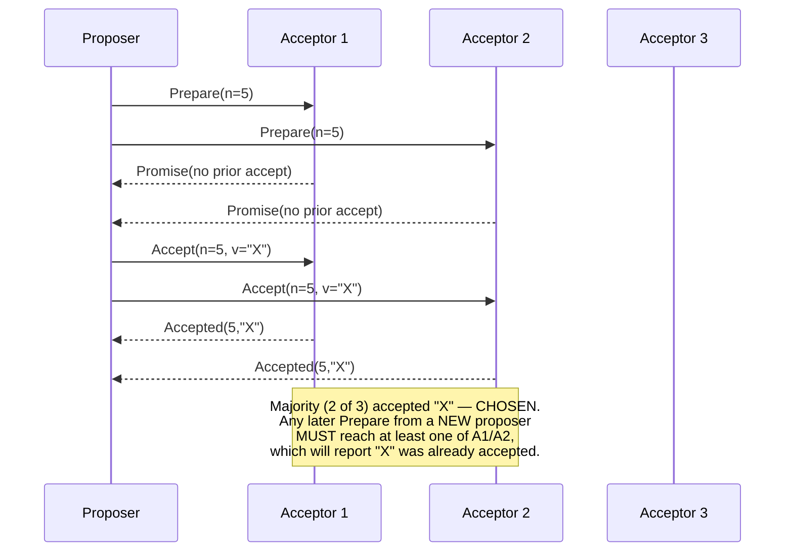

## Learning Objectives

- Name Paxos's three roles (proposer, acceptor, learner) and its two-phase structure (Prepare/Promise, then Accept/Accepted).
- State Paxos's core safety property — once a value is chosen, no different value can ever be chosen afterward — and explain why majority-quorum overlap is exactly what makes it hold.
- Explain why this concept treats Paxos at this level of detail (real roles, real phases, the real safety property, by name) rather than fully re-deriving its liveness and reconfiguration mechanics.
- State honestly why Raft, covered in full depth over the next three concepts, was designed specifically to replace Paxos as the protocol most commonly taught and implemented.

## Context & Motivation

`the-flp-impossibility-result` established the honest limit any consensus protocol has to work around. Paxos, Lamport's original 1989 solution (published as "The Part-Time Parliament" in 1998, and re-explained far more accessibly in "Paxos Made Simple" in 2001), was the first widely-adopted answer to how to actually build a working consensus protocol despite that limit. This concept covers Paxos at the level its own real safety argument deserves — enough to genuinely understand what it guarantees and why — without re-deriving every mechanical detail, since Raft, designed specifically to be more teachable, gets the full worked treatment next.

## Core Theory

### The three roles

Paxos names three roles a real process can play (a single physical process can, and often does, play more than one role at once):

```text
PROPOSER:  proposes a value, trying to get it chosen.
ACCEPTOR:  votes on proposals; a value is CHOSEN once a
           majority of acceptors have accepted it.
LEARNER:   finds out which value was chosen, once it has been.
```

### The two-phase structure

```text
PHASE 1 (Prepare / Promise):
  A proposer picks a proposal number n (unique, and higher
  than any it has used before) and sends Prepare(n) to a
  majority of acceptors.
  Each acceptor that receives Prepare(n) with n higher than
  any proposal number it has already responded to PROMISES not
  to accept any future proposal numbered lower than n, and
  replies with the highest-numbered proposal (if any) it has
  ALREADY accepted, so the proposer can find out about it.

PHASE 2 (Accept / Accepted):
  If the proposer received promises from a majority, it sends
  Accept(n, v) — where v is EITHER the value from the
  highest-numbered already-accepted proposal any acceptor told
  it about in Phase 1, OR, if no acceptor had accepted
  anything yet, the proposer's own original value.
  Each acceptor that receives Accept(n, v) accepts it UNLESS it
  has since promised (in some later Prepare) not to accept
  proposals numbered below some higher number.
  Once a MAJORITY of acceptors have accepted (n, v), v is
  CHOSEN.
```

### The safety property, and why majority overlap is exactly what proves it

Paxos's core safety guarantee is: **once a value v is chosen, no different value can ever be chosen by any later proposal.** The argument rests entirely on the fact that any two majorities of the same acceptor set must overlap in at least one acceptor — the same overlap fact `primary-backup-vs-quorum-based-replication`'s R+W>N reasoning already relied on. If value v was chosen by proposal number n (accepted by some majority M1), any LATER proposal n' > n attempting a different value must first go through Phase 1 with some majority M2 — and M1 and M2, both majorities of the same acceptors, must share at least one acceptor A. That acceptor A already accepted v (as part of M1), so when A responds to the later Prepare(n'), it must report back that it already accepted v at proposal n — forcing the new proposer, per Phase 2's rule, to also propose v, not a different value. The overlap makes it structurally impossible for a later proposal to "forget" a value that was already chosen.



### Why this level of treatment, and why Raft next

Paxos's safety argument (majority overlap forcing a chosen value to persist) is exactly the concept worth understanding deeply, because it is the same core idea Raft's own safety proof reuses (`raft-safety-the-election-restriction-and-log-completeness`, several concepts ahead). What this concept deliberately does not re-derive in full is Paxos's liveness mechanics (handling dueling proposers who keep pre-empting each other's Prepare phases with higher numbers, a real and well-known practical difficulty) and its cluster-membership/reconfiguration story — both are exactly the areas Lamport's own "Paxos Made Simple" paper acknowledges are harder to explain clearly than the safety argument itself, and exactly what motivated Ongaro & Ousterhout to design Raft specifically to make understandable from the ground up, without changing the fundamental safety guarantee Paxos already established.

## Worked Examples

### Example 1 — a straightforward, uncontested Paxos round

```text
3 acceptors: A1, A2, A3. Proposer P wants to get value "X"
chosen.

Phase 1: P sends Prepare(n=1) to A1, A2, A3.
  All 3 have never seen a Prepare before — each promises not
  to accept anything below 1, and reports "no prior accepted
  value."
Phase 2: since no acceptor reported a prior value, P proposes
  its OWN value: Accept(n=1, v="X") to all 3.
  A1, A2, A3 all accept (n=1 is still the highest they've
  promised). 3 out of 3 (a majority) accepted "X" — CHOSEN.
```

### Example 2 — a later proposer forced to adopt the already-chosen value

```text
Continuing Example 1 ("X" already chosen via proposal n=1,
accepted by A1, A2, A3). A NEW proposer Q, unaware "X" was
already chosen, tries to get its OWN value "Y" chosen:

Phase 1: Q sends Prepare(n=2) to A1 and A2 (a majority of 3).
  A1 promises not to accept below 2, and reports back: "I
  already accepted (n=1, v=X)."
  A2 reports the same: "I already accepted (n=1, v=X)."
Phase 2: per the Accept rule, Q must now propose the VALUE
  from the highest-numbered prior accepted proposal it heard
  about — which is "X", NOT its own original "Y". Q sends
  Accept(n=2, v="X") — forced to propose "X", not "Y".

This is exactly the safety property in action: the majority
overlap (A1 and A2 both being in BOTH the original majority
that chose "X" and Q's new Prepare majority) made it
structurally impossible for Q to get "Y" chosen instead.
```

### Example 3 — where Paxos's liveness difficulty (not covered in depth here) actually shows up

```text
Two proposers, P and Q, alternate sending ever-higher Prepare
numbers, each pre-empting the other's in-flight Accept phase:

P sends Prepare(n=1) -> gets promises -> starts Accept(1, X)
Q sends Prepare(n=2) BEFORE P's Accept messages arrive ->
  acceptors now refuse P's Accept(1, X) (a higher number, 2,
  was promised in the meantime)
P sends Prepare(n=3), pre-empting Q's now in-flight Accept(2,Y)
... this can, in principle, repeat indefinitely, with NEITHER
value ever actually being chosen — a real liveness concern,
NOT a safety violation (Agreement and Validity both still
hold at every point; only Termination is at risk, echoing FLP's
own honest limit) — and exactly the kind of subtlety this
concept names but does not fully develop, since Raft's
single-leader design (raft-leader-election, next) sidesteps
this specific dueling-proposers scenario by construction.
```

## Common Misconceptions & Pitfalls

- **"Paxos guarantees a value gets chosen quickly and reliably."** Example 3 shows Paxos's SAFETY (Agreement, Validity) holds unconditionally, but its LIVENESS (Termination) can genuinely stall under dueling proposers — this is a real, acknowledged limitation, consistent with FLP's own honest impossibility result, not a flaw unique to Paxos.
- **"Once a proposer's Prepare phase succeeds, its own original value will be chosen."** Example 2 shows exactly the opposite can happen — a proposer whose Prepare succeeds can still be forced, by the Accept rule, to propose a DIFFERENT, previously-accepted value it learned about during Phase 1, specifically to preserve the safety property.
- **"This concept skipping Paxos's liveness and reconfiguration details means Paxos isn't really understood here."** The safety argument (majority overlap forcing chosen values to persist) is Paxos's real intellectual core and is covered in full — the deliberately-skipped liveness/reconfiguration mechanics are exactly the parts Lamport's own writing acknowledges as harder to teach cleanly, and exactly what motivated Raft's redesign, covered next in full depth specifically because it makes those same guarantees easier to reason about.

## Summary

Paxos, Lamport's original consensus protocol, assigns three roles (proposer, acceptor, learner) and runs two phases (Prepare/Promise, then Accept/Accepted) built entirely on the fact that any two majorities of acceptors must share at least one member — that overlap is exactly what proves Paxos's core safety property, that a chosen value can never be superseded by a different one, since any later proposal's Prepare phase is guaranteed to encounter an acceptor that already knows the chosen value and will report it, forcing the later proposal to adopt it rather than override it. This concept covers Paxos at exactly this level — real roles, real phases, the real safety argument — while deliberately not re-deriving its harder liveness (dueling proposers can genuinely stall progress, though never violate safety) and reconfiguration mechanics, since those are precisely the aspects that motivated Raft, covered next in full depth, to redesign consensus specifically for understandability without weakening the underlying guarantee.

## Documentation Links

- [Lamport — Paxos Made Simple (2001)](https://lamport.azurewebsites.net/pubs/paxos-simple.pdf) — the accessible restatement of Paxos this concept's three roles, two-phase structure, and majority-overlap safety argument are drawn from directly.
- [Ongaro & Ousterhout — In Search of an Understandable Consensus Algorithm (Raft, USENIX ATC 2014)](https://raft.github.io/raft.pdf) — cited here for its own account of why Paxos's dueling-proposer liveness difficulty and reconfiguration story motivated a ground-up redesign for understandability.
