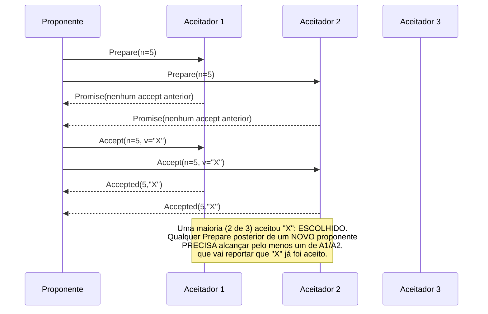

## Objetivos de Aprendizagem

- Nomear os três papéis do Paxos (proponente, aceitador, aprendiz) e a sua estrutura em duas fases (Prepare/Promise, depois Accept/Accepted).
- Enunciar a propriedade de segurança central do Paxos (uma vez escolhido um valor, nenhum valor diferente pode jamais ser escolhido depois) e explicar por que a sobreposição de quóruns de maioria é exatamente o que a faz valer.
- Explicar por que este conceito trata o Paxos neste nível de detalhe (papéis reais, fases reais, a propriedade de segurança real, pelo nome) em vez de rederivar por completo a sua mecânica de vivacidade e reconfiguração.
- Enunciar honestamente por que o Raft, coberto em toda a profundidade nos próximos três conceitos, foi projetado especificamente para substituir o Paxos como o protocolo mais comumente ensinado e implementado.

## Contexto e Motivação

`the-flp-impossibility-result` estabeleceu o limite honesto que qualquer protocolo de consenso precisa contornar. O Paxos, a solução original de Lamport de 1989 (publicada como "The Part-Time Parliament" em 1998, e reexplicada de forma muito mais acessível em "Paxos Made Simple" em 2001), foi a primeira resposta amplamente adotada para como de fato construir um protocolo de consenso funcional apesar desse limite. Este conceito cobre o Paxos no nível que o seu próprio argumento de segurança real merece (o suficiente para entender genuinamente o que ele garante e por quê) sem rederivar cada detalhe mecânico, já que o Raft, projetado especificamente para ser mais ensinável, recebe o tratamento trabalhado completo a seguir.

## Teoria Central

### Os três papéis

O Paxos nomeia três papéis que um processo real pode desempenhar (um único processo físico pode, e frequentemente faz, desempenhar mais de um papel ao mesmo tempo):

```text
PROPONENTE: propõe um valor, tentando fazê-lo ser escolhido.
ACEITADOR:  vota em propostas; um valor é ESCOLHIDO quando uma maioria
            de aceitadores o aceitou.
APRENDIZ:   descobre qual valor foi escolhido, depois que foi.
```

### A estrutura em duas fases

```text
FASE 1 (Prepare / Promise):
  Um proponente escolhe um número de proposta n (único, e maior que
  qualquer um que ele já usou) e envia Prepare(n) a uma maioria de
  aceitadores.
  Cada aceitador que recebe Prepare(n) com n maior que qualquer número
  de proposta ao qual ele já respondeu PROMETE não aceitar nenhuma
  proposta futura numerada abaixo de n, e responde com a proposta de
  maior número (se houver) que ele JÁ aceitou, para que o proponente
  fique sabendo dela.

FASE 2 (Accept / Accepted):
  Se o proponente recebeu promessas de uma maioria, ele envia
  Accept(n, v) -- onde v é OU o valor da proposta já aceita de maior
  número sobre a qual algum aceitador lhe contou na Fase 1, OU, se
  nenhum aceitador tinha aceitado nada ainda, o próprio valor original
  do proponente.
  Cada aceitador que recebe Accept(n, v) o aceita A MENOS QUE tenha,
  desde então, prometido (num Prepare posterior) não aceitar propostas
  numeradas abaixo de algum número maior.
  Quando uma MAIORIA de aceitadores aceitou (n, v), v é ESCOLHIDO.
```

### A propriedade de segurança, e por que a sobreposição de maiorias é exatamente o que a prova

A garantia de segurança central do Paxos é: **uma vez escolhido um valor v, nenhum valor diferente pode jamais ser escolhido por qualquer proposta posterior.** O argumento depende inteiramente do fato de que quaisquer duas maiorias do mesmo conjunto de aceitadores precisam se sobrepor em pelo menos um aceitador, o mesmo fato de sobreposição no qual o raciocínio R+W>N de `primary-backup-vs-quorum-based-replication` já se apoiava. Se o valor v foi escolhido pela proposta de número n (aceito por alguma maioria M1), qualquer proposta POSTERIOR n' > n tentando um valor diferente precisa primeiro passar pela Fase 1 com alguma maioria M2, e M1 e M2, ambas maiorias dos mesmos aceitadores, precisam compartilhar pelo menos um aceitador A. Esse aceitador A já aceitou v (como parte de M1), então, quando A responde ao Prepare(n') posterior, ele precisa reportar que já aceitou v na proposta n, forçando o novo proponente, pela regra da Fase 2, a também propor v, e não um valor diferente. A sobreposição torna estruturalmente impossível que uma proposta posterior "esqueça" um valor que já foi escolhido.



### Por que este nível de tratamento, e por que o Raft a seguir

O argumento de segurança do Paxos (a sobreposição de maiorias forçando um valor escolhido a persistir) é exatamente o conceito que vale entender a fundo, porque é a mesma ideia central que a própria prova de segurança do Raft reutiliza (`raft-safety-the-election-restriction-and-log-completeness`, vários conceitos adiante). O que este conceito deliberadamente não rederiva por completo é a mecânica de vivacidade do Paxos (lidar com proponentes em duelo que ficam se antecipando às fases Prepare uns dos outros com números maiores, uma dificuldade prática real e bem conhecida) e a sua história de pertencimento ao cluster/reconfiguração. Essas são exatamente as áreas que o próprio artigo "Paxos Made Simple" de Lamport reconhece serem mais difíceis de explicar com clareza do que o próprio argumento de segurança, e exatamente o que motivou Ongaro & Ousterhout a projetar o Raft especificamente para ser compreensível desde a base, sem mudar a garantia de segurança fundamental que o Paxos já tinha estabelecido.

## Exemplos Resolvidos

### Exemplo 1: uma rodada do Paxos direta e sem disputa

```text
3 aceitadores: A1, A2, A3. O proponente P quer fazer o valor "X" ser
escolhido.

Fase 1: P envia Prepare(n=1) para A1, A2, A3.
  Nenhum dos 3 jamais viu um Prepare antes -- cada um promete não
  aceitar nada abaixo de 1, e reporta "nenhum valor aceito anterior".
Fase 2: como nenhum aceitador reportou um valor anterior, P propõe o
  SEU PRÓPRIO valor: Accept(n=1, v="X") para os 3.
  A1, A2, A3 aceitam todos (n=1 continua sendo o maior que eles
  prometeram). 3 de 3 (uma maioria) aceitaram "X" -- ESCOLHIDO.
```

### Exemplo 2: um proponente posterior forçado a adotar o valor já escolhido

```text
Continuando o Exemplo 1 ("X" já escolhido via proposta n=1, aceito por
A1, A2, A3). Um NOVO proponente Q, sem saber que "X" já foi escolhido,
tenta fazer o SEU PRÓPRIO valor "Y" ser escolhido:

Fase 1: Q envia Prepare(n=2) para A1 e A2 (uma maioria de 3).
  A1 promete não aceitar abaixo de 2, e reporta de volta: "Eu já aceitei
  (n=1, v=X)."
  A2 reporta o mesmo: "Eu já aceitei (n=1, v=X)."
Fase 2: pela regra do Accept, Q agora precisa propor o VALOR da proposta
  aceita anterior de maior número sobre a qual ouviu -- que é "X", e NÃO
  o seu "Y" original. Q envia Accept(n=2, v="X") -- forçado a propor
  "X", e não "Y".

Esta é exatamente a propriedade de segurança em ação: a sobreposição de
maiorias (A1 e A2 estando AMBOS tanto na maioria original que escolheu
"X" quanto na nova maioria do Prepare de Q) tornou estruturalmente
impossível que Q fizesse "Y" ser escolhido no lugar.
```

### Exemplo 3: onde a dificuldade de vivacidade do Paxos (não coberta em profundidade aqui) de fato aparece

```text
Dois proponentes, P e Q, alternam enviando números de Prepare cada vez
maiores, cada um se antecipando à fase Accept em andamento do outro:

P envia Prepare(n=1) -> recebe promessas -> começa Accept(1, X)
Q envia Prepare(n=2) ANTES que as mensagens Accept de P cheguem ->
  os aceitadores agora recusam o Accept(1, X) de P (um número maior, 2,
  foi prometido nesse meio-tempo)
P envia Prepare(n=3), antecipando-se ao Accept(2,Y) agora em andamento de Q
... isto pode, em princípio, se repetir indefinidamente, com NENHUM
valor jamais sendo de fato escolhido -- uma preocupação real de
vivacidade, e NÃO uma violação de segurança (Acordo e Validade
continuam valendo em todo ponto; só a Terminação está em risco, ecoando
o próprio limite honesto do FLP) -- e exatamente o tipo de sutileza que
este conceito nomeia, mas não desenvolve por completo, já que o projeto
de líder único do Raft (raft-leader-election, a seguir) contorna por
construção este cenário específico de proponentes em duelo.
```

## Equívocos Comuns e Armadilhas

- **"O Paxos garante que um valor seja escolhido de forma rápida e confiável."** O Exemplo 3 mostra que a SEGURANÇA do Paxos (Acordo, Validade) vale incondicionalmente, mas a sua VIVACIDADE (Terminação) pode genuinamente travar sob proponentes em duelo. Esta é uma limitação real e reconhecida, consistente com o próprio resultado honesto de impossibilidade do FLP, e não uma falha exclusiva do Paxos.
- **"Uma vez que a fase Prepare de um proponente tem sucesso, o seu próprio valor original vai ser escolhido."** O Exemplo 2 mostra que exatamente o oposto pode acontecer: um proponente cujo Prepare tem sucesso ainda pode ser forçado, pela regra do Accept, a propor um valor DIFERENTE, aceito anteriormente, sobre o qual ficou sabendo durante a Fase 1, especificamente para preservar a propriedade de segurança.
- **"Este conceito pular os detalhes de vivacidade e reconfiguração do Paxos significa que o Paxos não é de fato entendido aqui."** O argumento de segurança (a sobreposição de maiorias forçando valores escolhidos a persistir) é o verdadeiro núcleo intelectual do Paxos e é coberto por completo. A mecânica de vivacidade/reconfiguração deliberadamente pulada é exatamente a parte que os próprios escritos de Lamport reconhecem ser mais difícil de ensinar de forma limpa, e exatamente o que motivou o redesenho do Raft, coberto a seguir em toda a profundidade justamente porque ele torna essas mesmas garantias mais fáceis de raciocinar.

## Resumo

O Paxos, o protocolo de consenso original de Lamport, atribui três papéis (proponente, aceitador, aprendiz) e roda duas fases (Prepare/Promise, depois Accept/Accepted), construídas inteiramente sobre o fato de que quaisquer duas maiorias de aceitadores precisam compartilhar pelo menos um membro. Essa sobreposição é exatamente o que prova a propriedade de segurança central do Paxos, de que um valor escolhido nunca pode ser substituído por um diferente, já que a fase Prepare de qualquer proposta posterior tem garantia de encontrar um aceitador que já conhece o valor escolhido e vai reportá-lo, forçando a proposta posterior a adotá-lo em vez de sobrescrevê-lo. Este conceito cobre o Paxos exatamente neste nível (papéis reais, fases reais, o argumento de segurança real) e deliberadamente não rederiva a sua mecânica mais difícil de vivacidade (proponentes em duelo podem genuinamente travar o progresso, embora nunca violem a segurança) e de reconfiguração, já que esses são precisamente os aspectos que motivaram o Raft, coberto a seguir em toda a profundidade, a redesenhar o consenso especificamente pela compreensibilidade, sem enfraquecer a garantia subjacente.

## Documentation Links

- [Lamport: Paxos Made Simple (2001)](https://lamport.azurewebsites.net/pubs/paxos-simple.pdf): a reapresentação acessível do Paxos da qual os três papéis, a estrutura em duas fases e o argumento de segurança por sobreposição de maiorias deste conceito são extraídos diretamente.
- [Ongaro & Ousterhout: In Search of an Understandable Consensus Algorithm (Raft, USENIX ATC 2014)](https://raft.github.io/raft.pdf): citado aqui pelo seu próprio relato de por que a dificuldade de vivacidade com proponentes em duelo e a história de reconfiguração do Paxos motivaram um redesenho desde a base pela compreensibilidade.
