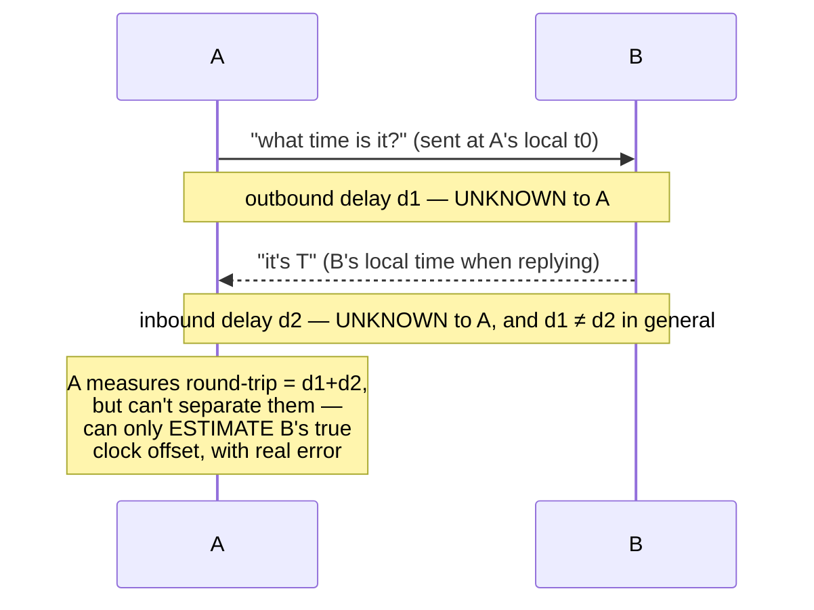

## Learning Objectives

- Explain why every machine's physical clock drifts at its own rate, and why two unsynchronized clocks disagree more the longer they run.
- Explain, precisely, why network message delay being uncertain and asymmetric makes physical clock synchronization fundamentally limited, not just an engineering inconvenience.
- State why a distributed system cannot simply timestamp events with local wall-clock time and trust cross-machine comparisons of those timestamps.
- Connect this limitation to the motivation for logical clocks, the next concept.

## Context & Motivation

`why-distributed-systems-are-hard-partial-failure-and-no-shared-state` named "no shared clock" as one of the three defining properties of a distributed system, alongside partial failure and no shared memory. This concept makes that concrete: physical clocks genuinely cannot be perfectly synchronized across machines connected only by a network with uncertain delay, and understanding exactly why that limit exists — not just that it exists — is what makes Lamport's alternative, entirely clock-free approach to ordering events (the next concept) make sense as a necessity rather than an arbitrary design choice.

## Core Theory

### Clock drift: every oscillator runs at its own rate

A computer's local clock is ultimately a physical oscillator (a quartz crystal, historically) whose actual frequency is never exactly the nominal value stamped on it — it runs slightly fast or slightly slow, by an amount that varies with temperature, manufacturing tolerance, and age. Two machines' clocks, even if set to the exact same time at some instant, will drift apart afterward: the longer they run unsynchronized, the larger the gap between what each one reports as "now." This alone means periodic re-synchronization is unavoidable in any system that cares about cross-machine time agreement over any meaningful duration.

### Why synchronizing over a network is fundamentally limited

The obvious fix — machine A asks machine B for its current time, and A adjusts its own clock to match — runs into a problem that isn't about engineering effort, it's structural: A can measure the *round-trip time* of that request (the time between sending the request and receiving B's timestamped reply), but it cannot measure how that round-trip time splits between the outbound leg (A → B) and the inbound leg (B → A) individually, because network delay in each direction can differ and can vary unpredictably from one message to the next. The best A can do is assume the delay was split evenly and estimate B's clock accordingly, but that assumption can be wrong by however much the actual asymmetry was — there is no way to measure the asymmetry itself using only round-trip timing. Lamport's 1978 paper works through exactly this problem in its second half (synchronizing physical clocks), deriving a real, quantified bound on how far out of sync clocks can remain even under a correct synchronization protocol, precisely because of this unmeasurable asymmetry.



### Why this rules out "just use wall-clock timestamps to order events"

If two events happen on different machines close together in real time, and each machine timestamps its own event using its own (imperfectly synchronized) local clock, comparing those two timestamps to decide "which one really happened first" is unreliable exactly in proportion to how far the two clocks have drifted apart or been mis-estimated during the last synchronization. For events far apart in time this error is negligible; for events close together — which is exactly the case that matters for reasoning about causality in a fast-moving distributed system — the uncertainty can be larger than the actual gap between the events, making the comparison meaningless. This is not a claim that physical clock synchronization is useless (NTP-style synchronization is genuinely valuable for many purposes, like log timestamps humans read), only that it cannot be trusted as the *sole* mechanism for determining a reliable ordering of events when correctness depends on getting that ordering right.

## Worked Examples

### Example 1 — measurable round-trip, unmeasurable asymmetry

```text
A sends a time-request to B at A's local time t0 = 100.000s
B replies with its own timestamp T = 100.050s
A receives the reply at its local time t1 = 100.030s

Round-trip time (A's clock) = t1 - t0 = 0.030s

If A assumes the delay was split evenly (0.015s each way):
  estimated one-way delay = 0.015s
  estimated B's clock at the moment A sent the request
    = T - 0.015s = 100.035s
  A adjusts its own clock toward this estimate

But suppose the ACTUAL split was 0.005s outbound and 0.025s
inbound (asymmetric, e.g. due to different queuing on each
leg) — the TRUE one-way delay was 0.005s, and B's clock at
the moment A's request arrived was actually T - 0.005s (using
the correct, but to A unknowable, split). A's adjustment is
now off by exactly the amount the true split differed from
the assumed even split — an error A has no way to detect from
round-trip timing alone.
```

### Example 2 — drift accumulating between synchronizations

```text
Two machines' clocks are synchronized exactly at t=0.
Machine A's oscillator runs 10 parts per million (ppm) fast;
Machine B's runs 5 ppm slow — a combined drift rate of 15 ppm.

After 1 hour (3600 seconds) with no re-synchronization:
  accumulated skew = 3600s × 15×10⁻⁶ = 0.054s = 54ms

54 milliseconds is enormous relative to the microsecond-to-
millisecond timescales at which real distributed events (e.g.
network round-trips, lock acquisitions) actually occur — this
is exactly why systems that care about cross-machine event
ordering re-synchronize frequently, and why they cannot rely
on physical clocks alone to get a fine-grained ordering right
even between two re-synchronizations.
```

### Example 3 — a wrong conclusion drawn from unsynchronized timestamps

```text
Machine A logs: "wrote x=1" at local timestamp 100.200
Machine B logs: "wrote x=2" at local timestamp 100.195

Naively comparing these timestamps suggests B's write to x=2
happened FIRST (100.195 < 100.200), so "the final value should
be 1" (A's later write "wins").

But suppose A's clock is running 10ms AHEAD of true time and
B's clock is exactly correct. Correcting for that, A's write
actually occurred at true time ≈100.190, genuinely BEFORE B's
write at true time 100.195 — the opposite of what the raw
timestamps suggested. Without knowing the exact clock error
(which, per Example 1, cannot be measured exactly), there is
no way to be CONFIDENT which write really happened first from
timestamps this close together — exactly the gap Lamport's
logical clocks, next, are built to close by deriving ordering
from actual message exchange instead of clock readings.
```

## Common Misconceptions & Pitfalls

- **"NTP-style synchronization solves this — clocks can just be kept in sync well enough."** NTP genuinely reduces drift and is valuable for many real purposes, but Example 1 shows the underlying limitation (unmeasurable delay asymmetry) is structural, not a matter of insufficiently frequent synchronization — no amount of synchronization frequency removes the fact that round-trip measurement alone cannot separate outbound from inbound delay.
- **"A shorter round-trip time means a more accurate clock estimate, so just synchronize over the fastest possible connection."** A shorter round-trip time reduces the MAGNITUDE of the potential error (less total delay to mis-split), but does not eliminate the asymmetry problem itself — Example 1's error is proportional to how asymmetric the split was, not to the absolute round-trip time.
- **"Comparing wall-clock timestamps from different machines is fine as long as the clocks were synchronized recently."** Example 3 shows that even a small, entirely plausible clock error (well within normal drift/synchronization tolerances) can reverse the apparent order of two events that occurred close together in time — "recently synchronized" reduces the error but does not make timestamp comparison safe for events whose true gap is comparable to or smaller than that remaining error.

## Summary

Physical clocks drift at rates specific to each machine's own oscillator, and synchronizing them over a network runs into a structural limit, not merely an engineering shortfall: round-trip time can be measured, but the split between outbound and inbound delay cannot, so any synchronization protocol's accuracy is bounded by an asymmetry it cannot see or correct for — a limit Lamport's 1978 paper quantifies directly. The practical consequence is that comparing wall-clock timestamps produced by different machines' physical clocks cannot be trusted to reliably determine which of two events happened first, especially when those events occur close together in real time. This is exactly the gap the next concept, Lamport logical clocks, closes by deriving an ordering of events directly from observable message exchange rather than from physical clock readings at all.

## Documentation Links

- [Lamport — Time, Clocks, and the Ordering of Events in a Distributed System (CACM 1978)](https://lamport.azurewebsites.net/pubs/time-clocks.pdf) — cited here for its second half specifically, which derives a real, quantified bound on synchronization accuracy from the network's unmeasurable outbound/inbound delay asymmetry, exactly this concept's core argument.
- [MIT 6.5840 (Distributed Systems) — Course Overview](https://pdos.csail.mit.edu/6.824/index.html) — the course overview giving the broader syllabus context for why physical clock synchronization is treated as a foundational limitation early in a distributed systems curriculum.
