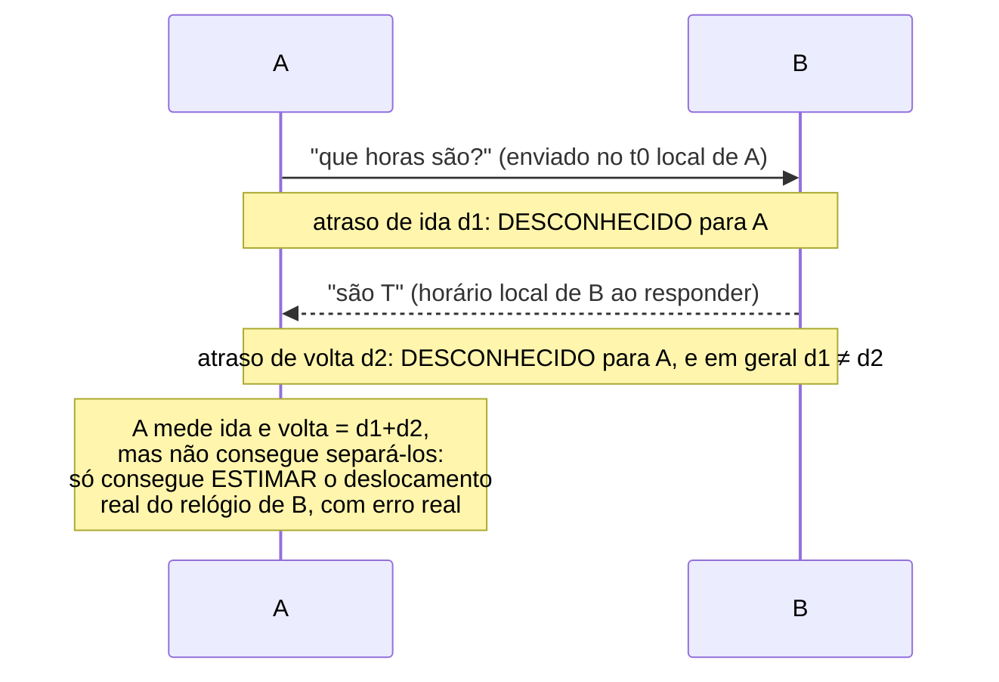

## Objetivos de Aprendizagem

- Explicar por que o relógio físico de toda máquina deriva na sua própria taxa, e por que dois relógios não sincronizados discordam mais quanto mais tempo rodam.
- Explicar, com precisão, por que o atraso de mensagens na rede ser incerto e assimétrico torna a sincronização de relógios físicos fundamentalmente limitada, e não apenas um inconveniente de engenharia.
- Enunciar por que um sistema distribuído não pode simplesmente carimbar eventos com o horário de relógio local e confiar em comparações desses carimbos entre máquinas.
- Conectar essa limitação à motivação para os relógios lógicos, o próximo conceito.

## Contexto e Motivação

`why-distributed-systems-are-hard-partial-failure-and-no-shared-state` nomeou "nenhum relógio compartilhado" como uma das três propriedades definidoras de um sistema distribuído, ao lado da falha parcial e de nenhuma memória compartilhada. Este conceito torna isso concreto: relógios físicos genuinamente não podem ser perfeitamente sincronizados entre máquinas conectadas apenas por uma rede com atraso incerto, e entender exatamente por que esse limite existe (e não só que ele existe) é o que faz a alternativa de Lamport, uma abordagem para ordenar eventos inteiramente sem relógios (o próximo conceito), fazer sentido como uma necessidade, e não como uma escolha de projeto arbitrária.

## Teoria Central

### Deriva de relógio: todo oscilador roda na sua própria taxa

O relógio local de um computador é, no fim das contas, um oscilador físico (historicamente, um cristal de quartzo) cuja frequência real nunca é exatamente o valor nominal impresso nele: ele roda ligeiramente rápido ou ligeiramente devagar, por uma quantidade que varia com a temperatura, a tolerância de fabricação e a idade. Os relógios de duas máquinas, mesmo que ajustados para exatamente o mesmo horário em algum instante, vão derivar um do outro depois disso: quanto mais tempo rodam sem sincronização, maior a diferença entre o que cada um reporta como "agora". Só isso já significa que a ressincronização periódica é inevitável em qualquer sistema que se importe com o acordo de tempo entre máquinas por qualquer duração significativa.

### Por que sincronizar por uma rede é fundamentalmente limitado

A correção óbvia (a máquina A pergunta à máquina B o seu horário atual, e A ajusta o próprio relógio para bater) esbarra num problema que não é de esforço de engenharia, é estrutural: A consegue medir o *tempo de ida e volta* dessa requisição (o tempo entre enviar a requisição e receber a resposta carimbada de B), mas não consegue medir como esse tempo de ida e volta se divide entre a perna de ida (A → B) e a perna de volta (B → A) individualmente, porque o atraso de rede em cada direção pode diferir e pode variar de forma imprevisível de uma mensagem para a seguinte. O melhor que A pode fazer é presumir que o atraso se dividiu igualmente e estimar o relógio de B de acordo, mas essa suposição pode estar errada em tanto quanto foi a assimetria real, e não há como medir a própria assimetria usando apenas o tempo de ida e volta. O artigo de Lamport de 1978 trabalha exatamente este problema na sua segunda metade (sincronizar relógios físicos), derivando um limite real e quantificado de quão fora de sincronia os relógios podem continuar mesmo sob um protocolo de sincronização correto, justamente por causa dessa assimetria não mensurável.



### Por que isto descarta "é só usar carimbos de horário de relógio para ordenar eventos"

Se dois eventos acontecem em máquinas diferentes, próximos no tempo real, e cada máquina carimba o seu próprio evento usando o seu próprio relógio local (imperfeitamente sincronizado), comparar esses dois carimbos para decidir "qual realmente aconteceu primeiro" é não confiável exatamente na proporção de quanto os dois relógios derivaram um do outro ou foram mal estimados durante a última sincronização. Para eventos distantes no tempo esse erro é desprezível; para eventos próximos (que é exatamente o caso que importa para raciocinar sobre causalidade num sistema distribuído que se move rápido), a incerteza pode ser maior do que a diferença real entre os eventos, tornando a comparação sem sentido. Isto não é uma afirmação de que a sincronização de relógios físicos é inútil (a sincronização no estilo NTP é genuinamente valiosa para muitos propósitos, como carimbos de horário em logs que humanos leem), apenas de que ela não pode ser confiada como o *único* mecanismo para determinar uma ordem confiável de eventos quando a corretude depende de acertar essa ordem.

## Exemplos Resolvidos

### Exemplo 1: ida e volta mensurável, assimetria não mensurável

```text
A envia uma requisição de horário para B no horário local de A t0 = 100,000s
B responde com o seu próprio carimbo T = 100,050s
A recebe a resposta no seu horário local t1 = 100,030s

Tempo de ida e volta (relógio de A) = t1 - t0 = 0,030s

Se A presumir que o atraso se dividiu igualmente (0,015s em cada sentido):
  atraso estimado de uma via = 0,015s
  relógio estimado de B no momento em que A enviou a requisição
    = T - 0,015s = 100,035s
  A ajusta o seu próprio relógio em direção a esta estimativa

Mas suponha que a divisão REAL foi 0,005s na ida e 0,025s na volta
(assimétrica, ex.: devido a enfileiramento diferente em cada perna)
-- o atraso VERDADEIRO de uma via foi 0,005s, e o relógio de B no
momento em que a requisição de A chegou era na verdade T - 0,005s
(usando a divisão correta, mas impossível de A conhecer). O ajuste
de A agora está errado exatamente na diferença entre a divisão
verdadeira e a divisão igual presumida -- um erro que A não tem
como detectar só a partir do tempo de ida e volta.
```

### Exemplo 2: deriva se acumulando entre sincronizações

```text
Os relógios de duas máquinas são sincronizados exatamente em t=0.
O oscilador da Máquina A roda 10 partes por milhão (ppm) rápido;
o da Máquina B roda 5 ppm devagar -- uma taxa de deriva combinada
de 15 ppm.

Depois de 1 hora (3600 segundos) sem ressincronização:
  defasagem acumulada = 3600s × 15×10⁻⁶ = 0,054s = 54ms

54 milissegundos é enorme em relação às escalas de tempo de
microssegundos a milissegundos em que eventos distribuídos reais
(ex.: idas e voltas na rede, aquisições de lock) de fato ocorrem --
é exatamente por isso que sistemas que se importam com a ordem de
eventos entre máquinas ressincronizam com frequência, e por que não
podem depender só de relógios físicos para acertar uma ordem de
granularidade fina mesmo entre duas ressincronizações.
```

### Exemplo 3: uma conclusão errada tirada de carimbos não sincronizados

```text
A Máquina A registra: "escreveu x=1" no carimbo local 100,200
A Máquina B registra: "escreveu x=2" no carimbo local 100,195

Comparar esses carimbos ingenuamente sugere que a escrita de B em
x=2 aconteceu PRIMEIRO (100,195 < 100,200), então "o valor final
deveria ser 1" (a escrita posterior de A "vence").

Mas suponha que o relógio de A está rodando 10ms ADIANTADO em
relação ao tempo verdadeiro e o relógio de B está exatamente certo.
Corrigindo isso, a escrita de A na verdade ocorreu no tempo
verdadeiro ≈100,190, genuinamente ANTES da escrita de B no tempo
verdadeiro 100,195 -- o oposto do que os carimbos brutos sugeriam.
Sem saber o erro exato do relógio (que, pelo Exemplo 1, não pode ser
medido exatamente), não há como ter CONFIANÇA sobre qual escrita
realmente aconteceu primeiro a partir de carimbos tão próximos --
exatamente a lacuna que os relógios lógicos de Lamport, a seguir,
são construídos para fechar, derivando a ordem da troca real de
mensagens em vez de leituras de relógio.
```

## Equívocos Comuns e Armadilhas

- **"A sincronização no estilo NTP resolve isso: os relógios podem simplesmente ser mantidos em sincronia bem o suficiente."** O NTP genuinamente reduz a deriva e é valioso para muitos propósitos reais, mas o Exemplo 1 mostra que a limitação subjacente (assimetria de atraso não mensurável) é estrutural, e não uma questão de sincronização insuficientemente frequente. Nenhuma frequência de sincronização remove o fato de que a medição de ida e volta sozinha não consegue separar o atraso de ida do de volta.
- **"Um tempo de ida e volta menor significa uma estimativa de relógio mais precisa, então é só sincronizar pela conexão mais rápida possível."** Um tempo de ida e volta menor reduz a MAGNITUDE do erro potencial (menos atraso total para dividir errado), mas não elimina o próprio problema da assimetria. O erro do Exemplo 1 é proporcional a quão assimétrica foi a divisão, e não ao tempo absoluto de ida e volta.
- **"Comparar carimbos de horário de relógio de máquinas diferentes é aceitável desde que os relógios tenham sido sincronizados recentemente."** O Exemplo 3 mostra que mesmo um erro de relógio pequeno e inteiramente plausível (bem dentro das tolerâncias normais de deriva/sincronização) pode inverter a ordem aparente de dois eventos que ocorreram próximos no tempo. "Sincronizado recentemente" reduz o erro, mas não torna segura a comparação de carimbos para eventos cuja diferença real é comparável a esse erro restante, ou menor que ele.

## Resumo

Relógios físicos derivam em taxas específicas do oscilador de cada máquina, e sincronizá-los por uma rede esbarra num limite estrutural, e não meramente numa deficiência de engenharia: o tempo de ida e volta pode ser medido, mas a divisão entre o atraso de ida e o de volta não pode, então a precisão de qualquer protocolo de sincronização é limitada por uma assimetria que ele não consegue ver nem corrigir, um limite que o artigo de Lamport de 1978 quantifica diretamente. A consequência prática é que comparar carimbos de horário de relógio produzidos pelos relógios físicos de máquinas diferentes não é confiável para determinar qual de dois eventos aconteceu primeiro, especialmente quando esses eventos ocorrem próximos no tempo real. Esta é exatamente a lacuna que o próximo conceito, os relógios lógicos de Lamport, fecha, derivando uma ordem de eventos diretamente da troca observável de mensagens em vez de leituras de relógios físicos.

## Documentation Links

- [Lamport: Time, Clocks, and the Ordering of Events in a Distributed System (CACM 1978)](https://lamport.azurewebsites.net/pubs/time-clocks.pdf): citado aqui especificamente pela sua segunda metade, que deriva um limite real e quantificado para a precisão da sincronização a partir da assimetria não mensurável entre o atraso de ida e o de volta na rede, exatamente o argumento central deste conceito.
- [MIT 6.5840 (Distributed Systems): Course Overview](https://pdos.csail.mit.edu/6.824/index.html): a visão geral do curso que dá o contexto mais amplo do programa sobre por que a sincronização de relógios físicos é tratada como uma limitação fundamental logo no início de um currículo de sistemas distribuídos.
