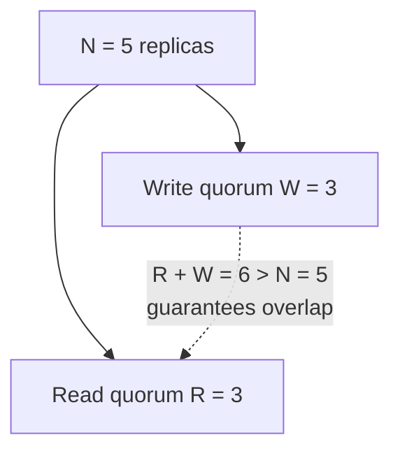

## Learning Objectives

- Describe primary-backup replication and name its central weakness: the primary is a single point of stall.
- Describe quorum-based replication (majority quorums, and the general R+W>N overlapping-quorum register scheme) and explain why it tolerates individual node failures without one designated node stalling everything.
- State the real cost quorum-based replication pays for that tolerance: needing an actual majority-agreement protocol rather than one node's unilateral say-so.
- Explain how a dynamically-chosen replica set (via consistent hashing) and quorum-based replication compose: the ring answers "which N nodes," quorum reasoning answers "how many of them must agree."

## Context & Motivation

`the-replicated-state-machine-approach` established that replication reduces to guaranteeing every replica applies the same commands in the same order — Agreement and Order. This concept covers the two broad architectural families real systems use to actually deliver that guarantee, before the next several concepts dive into the specific consensus protocols (Paxos, then Raft in full depth) that implement the quorum-based family rigorously.

## Core Theory

### Primary-backup: one designated writer, simple but single-stalled

In primary-backup replication, one replica is designated the **primary**: every write goes to the primary first, which orders it (trivially — it's the only one deciding order at all) and then forwards it to the backups, which apply it in the order the primary sent it. This directly satisfies the replicated-state-machine requirement (same commands, same order — the primary is the single source of that order) with a genuinely simple mechanism: no voting, no quorum arithmetic, just one node's decisions propagated outward.

The cost is exactly what "one designated writer" implies: if the primary becomes unreachable, the whole system stalls — no new writes can be ordered — until either the primary recovers or some separate mechanism detects the failure and promotes a backup to be the new primary. That promotion mechanism is itself a genuinely hard problem (how do the backups agree on which one becomes the new primary, especially if the network is behaving unpredictably during the failure?) — often solved, in real systems, by layering a full consensus protocol underneath just to handle leader promotion, which starts to blur the line between "simple primary-backup" and "consensus-based replication with an elected leader," exactly the architecture Raft itself uses.

### Quorum-based replication: no single point of stall, at the cost of needing real agreement

Quorum-based replication instead requires only some **quorum** — typically a strict majority — of the replica set to participate in each operation. The general register-based version of this idea uses two quorum sizes, R (read quorum) and W (write quorum), chosen so that R + W > N (where N is the total number of replicas): this guarantees any read quorum and any write quorum must share at least one common replica, so a read is mathematically guaranteed to overlap with (and therefore be able to see) the most recent completed write, without ever needing all N replicas to participate in every operation.



This tolerates individual node failures gracefully — as long as enough replicas remain reachable to form a quorum, the system keeps operating, with no single node's unavailability stalling everything the way a primary's failure does. The real cost is that *every* operation, not just leader promotion, now genuinely needs multiple replicas to actively agree (or at least acknowledge) before it can proceed — this is exactly the problem Paxos and Raft, covered in full over the next several concepts, solve: how to get a real majority of replicas to agree on the next entry in an ordered log, correctly, even when messages are delayed and some replicas crash mid-protocol.

### Composing with consistent hashing: choosing *which* N nodes

In a system where data is sharded across many more machines than any single piece of data needs to be replicated onto, the question "which N nodes hold replicas of this specific key?" is answered by `consistent-hashing` (`system-design-concepts`) — the hash ring deterministically assigns a fixed, well-distributed set of N nodes to any given key, and rebalances gracefully (moving only a small fraction of keys) when nodes join or leave. Quorum-based replication's own reasoning (R+W>N, majority agreement) then operates entirely on top of whatever N-node set the ring has already selected for that key — the ring answers "which N," and quorum-based replication answers "how many of those N must actually participate."

## Worked Examples

### Example 1 — primary-backup, traced through a primary failure

```text
Primary P, Backups B1, B2. Client writes x=5:
  1. Client sends write(x=5) to P.
  2. P applies it locally, forwards to B1 and B2.
  3. P acknowledges the client once forwarding is done.

Now P crashes. New writes CANNOT be ordered — there is no
primary to accept them — until either P recovers, or some
separate mechanism promotes B1 (or B2) to be the new primary.
Until that happens, the system is effectively stalled for
writes, exactly the single-point-of-stall weakness primary-
backup accepts in exchange for its simplicity.
```

### Example 2 — quorum-based replication tolerating the same failure without stalling

```text
N=3 replicas (R1, R2, R3), majority quorum = 2.
Client writes x=5: the write succeeds once ANY 2 of the 3
replicas acknowledge it — say R1 and R2 do, R3 is slow/
unreachable. Write succeeds without waiting for R3 at all.

Now R1 crashes (playing the role of "the primary" failing in
Example 1). A NEW write, x=7, is attempted: it only needs 2
of the remaining reachable replicas (R2 and R3) to
acknowledge — it succeeds WITHOUT any special promotion step,
because no single replica was ever the sole decision-maker.
The system tolerated a node failure that would have stalled
a primary-backup design, at the cost of every write needing
2 replicas' participation instead of always going through 1
designated node — that participation being coordinated
correctly (agreeing on ORDER when multiple concurrent writes
are in flight) is exactly the harder problem Paxos/Raft solve.
```

### Example 3 — R+W>N guaranteeing overlap, worked with real numbers

```text
N=5 replicas. Choose W=3, R=3 (R+W=6 > N=5).

Write x=9 succeeds once 3 of the 5 replicas have it — say
replicas {1,2,3} do; {4,5} don't yet (they'll get it later
via replication catch-up).

A read then queries R=3 replicas, chosen arbitrarily — say
{3,4,5}. Is at least one of these guaranteed to have the
fresh write?

Write quorum = {1,2,3}. Read quorum = {3,4,5}.
Intersection = {3} — non-empty, guaranteed by R+W=6 > N=5
(by the pigeonhole principle: two subsets of a 5-element set
with sizes summing to more than 5 must share at least one
element). Replica 3 has the fresh value and will return it,
so the read is guaranteed to see x=9 — even though 2 of the
5 replicas ({4,5}) are still stale at read time.
```

## Common Misconceptions & Pitfalls

- **"Quorum-based replication has no single point of failure at all, unlike primary-backup."** Quorum-based replication removes the single point of STALL for ordinary reads/writes (Example 2), but real quorum systems built on consensus (Raft, next) still elect a leader for efficiency — the difference from primary-backup is that leader FAILURE is handled by the same majority-agreement machinery that handles everything else, not by a separate, bolted-on promotion mechanism.
- **"R+W>N means every read sees every write immediately."** R+W>N guarantees a read quorum and a write quorum share at least one replica (Example 3) — it guarantees the read CAN see the fresh value through that shared replica, assuming the read correctly resolves conflicting versions returned by different replicas in its quorum (e.g., via a version number or timestamp) — it does not by itself make every replica in the read quorum equally fresh.
- **"Primary-backup is simply the worse option and should never be used."** Primary-backup is genuinely simpler to reason about and implement when its single-point-of-stall weakness is acceptable (e.g., a short stall during failover is tolerable for the application) — the right choice, as with consistency models earlier in this discipline, depends on the actual requirements, not on always preferring the more fault-tolerant-sounding option.

## Summary

Primary-backup replication routes every write through one designated primary — simple, but stalled entirely whenever that primary is unreachable, until a separate promotion mechanism (itself a hard problem) elects a new one. Quorum-based replication instead requires only a majority (or, more generally, an overlapping R+W>N pair of quorums) of the replica set to participate in each operation, tolerating individual node failures without any single node's unavailability stalling the system — at the real cost of needing genuine multi-replica agreement, not one node's unilateral decision, for every operation. When the replica set for a given piece of data is chosen dynamically at scale via `consistent-hashing`, quorum-based reasoning operates on top of whatever N-node set the hash ring has already assigned. Getting that multi-replica agreement right, correctly and provably, in the presence of real failures and network delay, is exactly the consensus problem this discipline formalizes next.

## Documentation Links

- [Schneider — Implementing Fault-Tolerant Services Using the State Machine Approach: A Tutorial (1990)](https://cdn.nakamotoinstitute.org/docs/implementing-fault-tolerant-services.pdf) — the tutorial defining the state-machine replication approach that both primary-backup and quorum-based designs are alternative architectural implementations of.
- [Ongaro & Ousterhout — In Search of an Understandable Consensus Algorithm (Raft, USENIX ATC 2014)](https://raft.github.io/raft.pdf) — the paper whose leader-based replication design is exactly what this concept points to as blurring the line between simple primary-backup and full quorum-based consensus.
- [MIT 6.5840 — Lecture Schedule](https://pdos.csail.mit.edu/6.824/schedule.html) — the course syllabus that places quorum-based replication and its Paxos/Raft implementations in the context of a full distributed systems curriculum.
