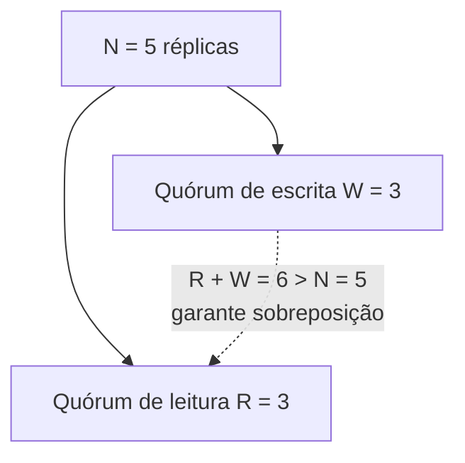

## Objetivos de Aprendizagem

- Descrever a replicação primário-backup e nomear a sua fraqueza central: o primário é um ponto único de travamento.
- Descrever a replicação baseada em quórum (quóruns de maioria, e o esquema geral de registrador com quóruns sobrepostos R+W>N) e explicar por que ela tolera falhas de nós individuais sem que um nó designado trave tudo.
- Enunciar o custo real que a replicação baseada em quórum paga por essa tolerância: precisar de um protocolo de acordo por maioria de fato em vez da palavra unilateral de um nó.
- Explicar como um conjunto de réplicas escolhido dinamicamente (via hashing consistente) e a replicação baseada em quórum se compõem: o anel responde "quais N nós", o raciocínio de quórum responde "quantos deles precisam concordar".

## Contexto e Motivação

`the-replicated-state-machine-approach` estabeleceu que a replicação se reduz a garantir que toda réplica aplique os mesmos comandos na mesma ordem: Acordo e Ordem. Este conceito cobre as duas grandes famílias arquiteturais que sistemas reais usam para de fato entregar essa garantia, antes que os próximos vários conceitos mergulhem nos protocolos de consenso específicos (Paxos, depois Raft em toda a profundidade) que implementam rigorosamente a família baseada em quórum.

## Teoria Central

### Primário-backup: um escritor designado, simples mas com travamento único

Na replicação primário-backup, uma réplica é designada como o **primário**: toda escrita vai primeiro para o primário, que a ordena (trivialmente, já que ele é o único decidindo a ordem) e então a encaminha aos backups, que a aplicam na ordem em que o primário enviou. Isso satisfaz diretamente o requisito da máquina de estados replicada (mesmos comandos, mesma ordem: o primário é a fonte única dessa ordem) com um mecanismo genuinamente simples: sem votação, sem aritmética de quórum, só as decisões de um nó propagadas para fora.

O custo é exatamente o que "um escritor designado" implica: se o primário fica inalcançável, o sistema inteiro trava (nenhuma escrita nova pode ser ordenada) até que o primário se recupere ou que algum mecanismo separado detecte a falha e promova um backup a novo primário. Esse mecanismo de promoção é ele próprio um problema genuinamente difícil (como os backups concordam sobre qual deles se torna o novo primário, especialmente se a rede está se comportando de forma imprevisível durante a falha?), frequentemente resolvido, em sistemas reais, colocando um protocolo de consenso completo por baixo só para tratar a promoção do líder, o que começa a borrar a linha entre "primário-backup simples" e "replicação baseada em consenso com um líder eleito", exatamente a arquitetura que o próprio Raft usa.

### Replicação baseada em quórum: nenhum ponto único de travamento, ao custo de precisar de acordo real

A replicação baseada em quórum, em vez disso, exige que apenas algum **quórum** (tipicamente uma maioria estrita) do conjunto de réplicas participe de cada operação. A versão geral desta ideia baseada em registrador usa dois tamanhos de quórum, R (quórum de leitura) e W (quórum de escrita), escolhidos de modo que R + W > N (onde N é o número total de réplicas): isso garante que qualquer quórum de leitura e qualquer quórum de escrita precisam compartilhar pelo menos uma réplica em comum, então uma leitura tem garantia matemática de se sobrepor à (e portanto conseguir ver a) escrita completada mais recente, sem jamais precisar que todas as N réplicas participem de toda operação.



Isso tolera graciosamente falhas de nós individuais: desde que réplicas suficientes continuem alcançáveis para formar um quórum, o sistema continua operando, sem que a indisponibilidade de um único nó trave tudo como a falha de um primário trava. O custo real é que *toda* operação, e não só a promoção de líder, agora genuinamente precisa que múltiplas réplicas concordem ativamente (ou pelo menos confirmem) antes de poder prosseguir. Este é exatamente o problema que o Paxos e o Raft, cobertos por completo nos próximos vários conceitos, resolvem: como fazer uma maioria real de réplicas concordar sobre a próxima entrada de um log ordenado, corretamente, mesmo quando mensagens são atrasadas e algumas réplicas caem no meio do protocolo.

### Compondo com o hashing consistente: escolhendo *quais* N nós

Num sistema em que os dados são fragmentados entre muito mais máquinas do que qualquer pedaço isolado de dados precisa ser replicado, a pergunta "quais N nós guardam réplicas desta chave específica?" é respondida pelo `consistent-hashing` (`system-design-concepts`): o anel de hash atribui deterministicamente um conjunto fixo e bem distribuído de N nós a qualquer chave dada, e rebalanceia graciosamente (movendo só uma pequena fração das chaves) quando nós entram ou saem. O próprio raciocínio da replicação baseada em quórum (R+W>N, acordo por maioria) então opera inteiramente em cima de qualquer conjunto de N nós que o anel já tenha selecionado para aquela chave: o anel responde "quais N", e a replicação baseada em quórum responde "quantos desses N precisam de fato participar".

## Exemplos Resolvidos

### Exemplo 1: primário-backup, rastreado através de uma falha do primário

```text
Primário P, Backups B1, B2. O cliente escreve x=5:
  1. O cliente envia write(x=5) para P.
  2. P a aplica localmente, encaminha para B1 e B2.
  3. P confirma ao cliente quando o encaminhamento termina.

Agora P cai. Novas escritas NÃO PODEM ser ordenadas -- não há primário
para aceitá-las -- até que P se recupere, ou que algum mecanismo
separado promova B1 (ou B2) a novo primário. Até isso acontecer, o
sistema fica efetivamente travado para escritas, exatamente a fraqueza
de ponto único de travamento que o primário-backup aceita em troca da
sua simplicidade.
```

### Exemplo 2: replicação baseada em quórum tolerando a mesma falha sem travar

```text
N=3 réplicas (R1, R2, R3), quórum de maioria = 2.
O cliente escreve x=5: a escrita tem sucesso assim que QUAISQUER 2 das
3 réplicas a confirmam -- digamos que R1 e R2 confirmam, R3 está lenta/
inalcançável. A escrita tem sucesso sem esperar por R3.

Agora R1 cai (fazendo o papel do "primário" falhando no Exemplo 1). Uma
NOVA escrita, x=7, é tentada: ela só precisa que 2 das réplicas
alcançáveis restantes (R2 e R3) confirmem -- ela tem sucesso SEM nenhum
passo especial de promoção, porque nenhuma réplica isolada jamais foi a
única tomadora de decisão. O sistema tolerou uma falha de nó que teria
travado um projeto primário-backup, ao custo de toda escrita precisar
da participação de 2 réplicas em vez de sempre passar por 1 nó
designado -- coordenar corretamente essa participação (concordar sobre
a ORDEM quando múltiplas escritas concorrentes estão em andamento) é
exatamente o problema mais difícil que o Paxos/Raft resolvem.
```

### Exemplo 3: R+W>N garantindo sobreposição, trabalhado com números reais

```text
N=5 réplicas. Escolha W=3, R=3 (R+W=6 > N=5).

A escrita x=9 tem sucesso assim que 3 das 5 réplicas a têm -- digamos
que as réplicas {1,2,3} têm; {4,5} ainda não (elas vão recebê-la depois
via recuperação de atraso da replicação).

Uma leitura então consulta R=3 réplicas, escolhidas arbitrariamente --
digamos {3,4,5}. Pelo menos uma delas tem garantia de ter a escrita nova?

Quórum de escrita = {1,2,3}. Quórum de leitura = {3,4,5}.
Interseção = {3} -- não vazia, garantida por R+W=6 > N=5 (pelo princípio
da casa dos pombos: dois subconjuntos de um conjunto de 5 elementos com
tamanhos somando mais de 5 precisam compartilhar pelo menos um
elemento). A réplica 3 tem o valor novo e vai retorná-lo, então a
leitura tem garantia de ver x=9 -- mesmo com 2 das 5 réplicas ({4,5})
ainda desatualizadas no momento da leitura.
```

## Equívocos Comuns e Armadilhas

- **"A replicação baseada em quórum não tem ponto único de falha algum, ao contrário do primário-backup."** A replicação baseada em quórum remove o ponto único de TRAVAMENTO para leituras/escritas comuns (Exemplo 2), mas sistemas de quórum reais construídos sobre consenso (o Raft, a seguir) ainda elegem um líder por eficiência. A diferença em relação ao primário-backup é que a FALHA do líder é tratada pela mesma maquinaria de acordo por maioria que trata todo o resto, e não por um mecanismo de promoção separado e acoplado depois.
- **"R+W>N significa que toda leitura vê toda escrita imediatamente."** R+W>N garante que um quórum de leitura e um quórum de escrita compartilham pelo menos uma réplica (Exemplo 3): garante que a leitura CONSEGUE ver o valor novo através dessa réplica compartilhada, supondo que a leitura resolva corretamente versões conflitantes retornadas por réplicas diferentes no seu quórum (ex.: via um número de versão ou um carimbo de horário). Isso por si só não torna toda réplica do quórum de leitura igualmente atualizada.
- **"Primário-backup é simplesmente a pior opção e nunca deveria ser usado."** O primário-backup é genuinamente mais simples de raciocinar e implementar quando a sua fraqueza de ponto único de travamento é aceitável (ex.: um breve travamento durante o failover é tolerável para a aplicação). A escolha certa, como com os modelos de consistência vistos antes nesta disciplina, depende dos requisitos reais, e não de sempre preferir a opção que soa mais tolerante a falhas.

## Resumo

A replicação primário-backup roteia toda escrita por um único primário designado: simples, mas inteiramente travada sempre que esse primário fica inalcançável, até que um mecanismo de promoção separado (ele próprio um problema difícil) eleja um novo. A replicação baseada em quórum, em vez disso, exige que apenas uma maioria (ou, mais geralmente, um par de quóruns sobrepostos R+W>N) do conjunto de réplicas participe de cada operação, tolerando falhas de nós individuais sem que a indisponibilidade de um único nó trave o sistema, ao custo real de precisar de acordo genuíno entre múltiplas réplicas, e não da decisão unilateral de um nó, para toda operação. Quando o conjunto de réplicas de um dado pedaço de dados é escolhido dinamicamente em escala via `consistent-hashing`, o raciocínio de quórum opera em cima de qualquer conjunto de N nós que o anel de hash já tenha atribuído. Acertar esse acordo entre múltiplas réplicas, de forma correta e demonstrável, na presença de falhas reais e atraso de rede, é exatamente o problema do consenso que esta disciplina formaliza a seguir.

## Documentation Links

- [Schneider: Implementing Fault-Tolerant Services Using the State Machine Approach: A Tutorial (1990)](https://cdn.nakamotoinstitute.org/docs/implementing-fault-tolerant-services.pdf): o tutorial que define a abordagem de replicação por máquina de estados da qual os projetos primário-backup e baseado em quórum são implementações arquiteturais alternativas.
- [Ongaro & Ousterhout: In Search of an Understandable Consensus Algorithm (Raft, USENIX ATC 2014)](https://raft.github.io/raft.pdf): o artigo cujo projeto de replicação baseado em líder é exatamente o que este conceito aponta como borrando a linha entre o primário-backup simples e o consenso completo baseado em quórum.
- [MIT 6.5840: Lecture Schedule](https://pdos.csail.mit.edu/6.824/schedule.html): o programa do curso que situa a replicação baseada em quórum e as suas implementações Paxos/Raft no contexto de um currículo completo de sistemas distribuídos.
