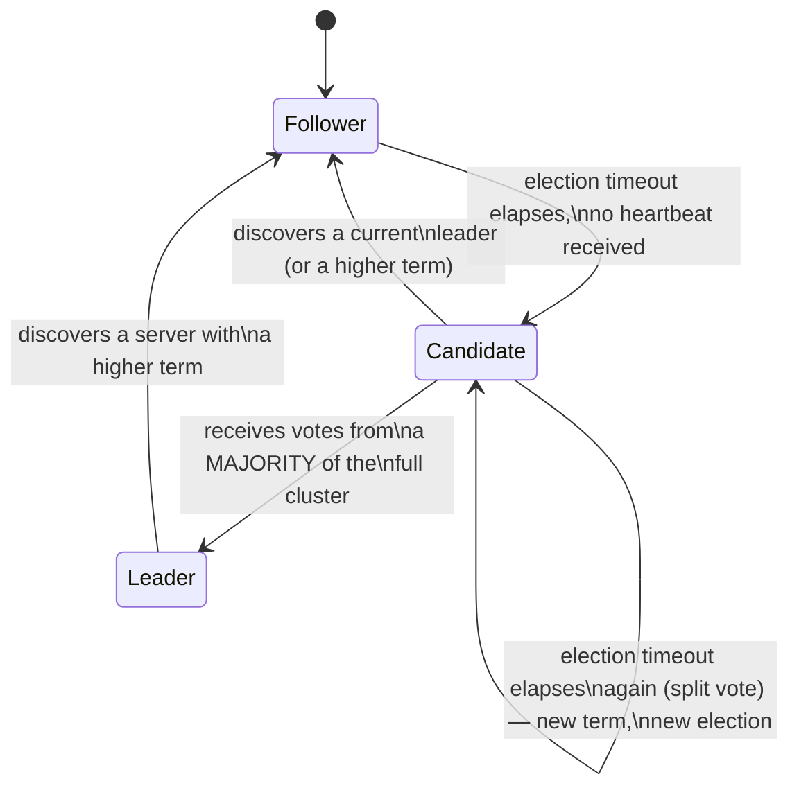

## Learning Objectives

- Explain Raft's decomposition of consensus into leader election, log replication, and safety, and why that decomposition is specifically what makes it more understandable than Paxos.
- Describe terms, the three server states (Follower, Candidate, Leader), and the RequestVote RPC mechanism precisely.
- Explain why randomized election timeouts are the actual mechanism that makes split votes rare rather than impossible, and why that specific design choice matters.
- Explain why a candidate needs votes from a majority of the FULL cluster (not just of currently-reachable servers) to become leader, and connect this to the same majority-overlap idea Paxos's safety argument used.

## Context & Motivation

`paxos-the-original-consensus-protocol` covered Paxos's safety argument in depth but deliberately left its liveness mechanics (dueling proposers, Example 3 of that concept) underdeveloped, exactly because that was one of the areas Ongaro & Ousterhout's 2014 Raft paper identified as genuinely hard to teach and reason about. Raft's answer, as its own title states directly, is a consensus algorithm designed "in search of understandability" — and its first major decomposition is separating out leader election as its own clearly-scoped piece, covered here in full, before log replication and safety, over the next two concepts, build on top of it.

## Core Theory

### Raft's decomposition, and why it aids understandability

Rather than Paxos's single, somewhat entangled protocol, Raft splits consensus into three named sub-problems, solved (mostly) independently: **leader election** (this concept — how the cluster picks a single leader, and re-picks one if it fails), **log replication** (`raft-log-replication-and-commitment`, next — how the leader gets its log copied out to followers and decides when an entry is safely committed), and **safety** (`raft-safety-the-election-restriction-and-log-completeness`, after that — the actual guarantee, and proof, that these mechanisms never let two different values get committed at the same log position). By having exactly one leader at a time responsible for ordering commands, Raft sidesteps Paxos's dueling-proposers liveness concern by construction — only one server acts as proposer while it remains leader.

### Terms and server states

Raft divides time into **terms**, numbered with monotonically increasing integers. Each term has at most one leader (possibly none, if an election fails to produce one). Every server is, at any moment, in exactly one of three states:

```text
FOLLOWER:  the default, passive state. Responds to RPCs from
           leaders and candidates, never initiates anything.
CANDIDATE: used to campaign for leadership during an election.
LEADER:    handles all client requests and log replication for
           as long as it holds this role.
```

A Follower that receives no communication (a heartbeat, specifically an empty AppendEntries RPC, covered fully in the next concept) from a current leader within its **election timeout** assumes there is no functioning leader for the current situation, transitions to Candidate, increments its own term number, votes for itself, and sends RequestVote RPCs to every other server in the cluster, asking for their vote for this new term.



### RequestVote and the majority requirement

A server receiving a RequestVote RPC grants its vote only if it has not already voted for someone else in this term, and (per the election restriction covered fully in `raft-safety-the-election-restriction-and-log-completeness`) the candidate's log is at least as up-to-date as its own. A candidate becomes leader only once it receives votes from a **majority of the entire cluster** — not merely a majority of servers currently reachable or responding. This is deliberate, and rests on exactly the same majority-overlap idea Paxos's safety argument used: requiring a majority of the *full, fixed* cluster membership guarantees that at most one candidate can win an election in any given term (two disjoint majorities of the same fixed set cannot both exist, since any two majorities must overlap), which is precisely what makes "at most one leader per term" an actual guarantee rather than a hope.

### Why randomization is the real mechanism preventing split votes

If every follower used the exact same, fixed election timeout, a scenario where the leader fails could cause many followers to time out simultaneously and become candidates in the same term at once, splitting the vote so that no single candidate gets a majority — a **split vote**, forcing a new election. Raft's actual fix is that each server picks its election timeout **randomly** from a fixed range (e.g., 150–300ms) independently, every time it resets — this makes it likely that one follower's timer will fire meaningfully before any other's, so that server usually completes its election (getting votes from everyone else, who are still waiting on their own, longer timeouts, and haven't yet started their own competing campaign) before a split vote can even occur. This does not make split votes impossible — two servers can still occasionally pick very close timeout values and both start campaigning near-simultaneously — but it makes them rare enough, in practice, that elections usually resolve in a single round, which is exactly the kind of departure from strict determinism that `the-flp-impossibility-result` predicted a real, working protocol would need to make.

## Worked Examples

### Example 1 — a clean election with no split vote

```text
Cluster: S1, S2, S3, S4, S5 (5 servers). Current term = 3.
Leader S1 crashes.

S3's randomized election timeout (say, 180ms) fires FIRST,
before S2, S4, or S5's own (longer) timeouts.
S3 transitions to Candidate, increments its term to 4, votes
for itself, sends RequestVote(term=4) to S1(unreachable), S2,
S4, S5.

S2, S4, S5 have not yet timed out themselves and have not
voted for anyone else in term 4 yet — each grants S3 its vote
(assuming S3's log is at least as up-to-date, per the election
restriction).

S3 now has votes from itself + S2 + S4 + S5 = 4 out of 5 — a
MAJORITY of the full 5-server cluster. S3 becomes leader for
term 4, immediately starts sending heartbeats to establish its
authority and reset everyone else's election timers.
```

### Example 2 — a split vote, and Raft's recovery from it

```text
Cluster: S1..S5, term = 3, leader crashed. This time, S2 and
S4's randomized timeouts happen to fire within a few
milliseconds of each other:

S2 becomes Candidate for term 4, votes for itself, requests
votes from everyone.
S4 ALSO becomes Candidate for term 4 (having already
incremented to term 4 independently before hearing from S2),
votes for itself, requests votes from everyone.

S1, S3, S5 each vote for whichever RequestVote arrives FIRST
at them (and refuse the second, having already voted in term
4) — say S1 votes for S2, and S3 and S5 both vote for S4.

Final tally: S2 = {S2, S1} = 2 votes; S4 = {S4, S3, S5} = 3
votes, a majority of the 5-server cluster — S4 becomes leader
for term 4. If the votes had instead split evenly (say S1 for
S2, S3 for S4, and S5's vote arriving too late to matter),
NEITHER candidate would reach a majority, term 4 would end
with no leader, and every candidate's OWN election timeout
(independently randomized again) would eventually fire,
starting a fresh election in term 5 — repeating until some
term's randomization happens to avoid a split, which happens
quickly in expectation.
```

### Example 3 — a stale leader discovering it's been superseded

```text
S1 is leader for term 4, but is network-partitioned away from
the rest of the cluster for a while. S3 wins a new election
for term 5 among the reachable majority {S2,S3,S4,S5}.

The partition heals. S1 (still believing it's the term-4
leader) sends a heartbeat (AppendEntries) to S3, which now
includes term=4.

S3, currently on term 5, sees S1's message carries a LOWER
term number than its own — S3 simply rejects it (rather than
accepting S1 as leader). S1, upon receiving S3's rejection
(which includes S3's current term, 5), recognizes a higher
term exists, immediately steps down to Follower, and updates
its own term to 5 — Raft servers ALWAYS defer to the highest
term number they've seen, which is exactly the mechanism that
resolves a stale leader's confusion once connectivity returns.
```

## Common Misconceptions & Pitfalls

- **"A candidate just needs votes from whichever servers happen to be reachable."** The majority requirement is specifically against the FULL, fixed cluster membership, not just currently-reachable servers — Example 1's candidate needed 3 of 5, not 3 of however many happened to respond; this is exactly what guarantees at most one leader per term via majority overlap.
- **"Randomized election timeouts make split votes impossible."** Example 2 shows split votes can still happen — randomization only makes them statistically unlikely per attempt, not structurally impossible; Raft's actual guarantee is that elections eventually succeed (a liveness property helped along by randomization), not that any single election is guaranteed to avoid splitting.
- **"A leader that gets network-partitioned away just stops working, with no further complications."** Example 3 shows the more subtle real behavior: a partitioned leader can keep believing it's still in charge and keep sending stale heartbeats once reconnected — Raft's term-comparison rule (always defer to the higher term seen) is what correctly resolves this, not the partitioned leader somehow "knowing" it's been superseded on its own.

## Summary

Raft splits consensus into leader election, log replication, and safety specifically to be more understandable than Paxos, starting with election: time is divided into terms, each with at most one leader, and a Follower whose randomized election timeout elapses without hearing from a leader becomes a Candidate, increments its term, and requests votes via RequestVote RPCs. Randomization is the actual mechanism making split votes rare (not impossible) by making it likely one candidate's timer fires meaningfully before any competitor's. A candidate becomes leader only upon winning votes from a majority of the entire, fixed cluster — the same majority-overlap principle Paxos's own safety argument relies on — guaranteeing at most one leader per term. `raft-log-replication-and-commitment`, next, covers what an elected leader actually does with that authority.

## Documentation Links

- [Ongaro & Ousterhout — In Search of an Understandable Consensus Algorithm (Raft, USENIX ATC 2014)](https://raft.github.io/raft.pdf) — the source paper for the leader-election mechanics (terms, server states, RequestVote, randomized election timeouts) this concept works through in full.
- [MIT 6.5840 — Lecture Schedule](https://pdos.csail.mit.edu/6.824/schedule.html) — the course whose Raft labs are built directly on the leader-election mechanism covered here.
