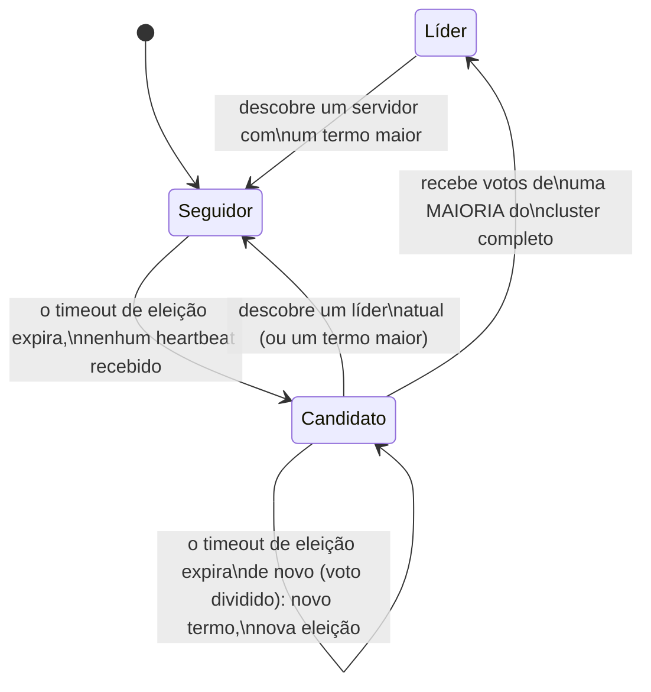

## Objetivos de Aprendizagem

- Explicar a decomposição do consenso no Raft em eleição de líder, replicação de log e segurança, e por que essa decomposição é especificamente o que o torna mais compreensível que o Paxos.
- Descrever com precisão os termos, os três estados de servidor (Seguidor, Candidato, Líder) e o mecanismo de RPC RequestVote.
- Explicar por que os timeouts de eleição randomizados são o mecanismo de fato que torna os votos divididos raros, e não impossíveis, e por que essa escolha de projeto específica importa.
- Explicar por que um candidato precisa de votos de uma maioria do cluster COMPLETO (e não só dos servidores atualmente alcançáveis) para se tornar líder, e conectar isso à mesma ideia de sobreposição de maiorias que o argumento de segurança do Paxos usava.

## Contexto e Motivação

`paxos-the-original-consensus-protocol` cobriu a fundo o argumento de segurança do Paxos, mas deliberadamente deixou pouco desenvolvida a sua mecânica de vivacidade (proponentes em duelo, Exemplo 3 daquele conceito), exatamente porque essa foi uma das áreas que o artigo do Raft de Ongaro & Ousterhout de 2014 identificou como genuinamente difícil de ensinar e raciocinar. A resposta do Raft, como o seu próprio título diz diretamente, é um algoritmo de consenso projetado "em busca da compreensibilidade", e a sua primeira grande decomposição é separar a eleição de líder como uma peça própria e de escopo claro, coberta aqui por completo, antes que a replicação de log e a segurança, nos próximos dois conceitos, construam sobre ela.

## Teoria Central

### A decomposição do Raft, e por que ela ajuda a compreensibilidade

Em vez do protocolo único e um tanto emaranhado do Paxos, o Raft divide o consenso em três subproblemas nomeados, resolvidos (em grande parte) de forma independente: **eleição de líder** (este conceito: como o cluster escolhe um único líder, e escolhe de novo se ele falhar), **replicação de log** (`raft-log-replication-and-commitment`, a seguir: como o líder faz o seu log ser copiado para os seguidores e decide quando uma entrada está confirmada com segurança) e **segurança** (`raft-safety-the-election-restriction-and-log-completeness`, depois disso: a garantia de fato, e a prova, de que esses mecanismos nunca deixam dois valores diferentes serem confirmados na mesma posição do log). Ao ter exatamente um líder por vez responsável por ordenar os comandos, o Raft contorna por construção a preocupação de vivacidade dos proponentes em duelo do Paxos: só um servidor atua como proponente enquanto continua sendo líder.

### Termos e estados de servidor

O Raft divide o tempo em **termos**, numerados com inteiros monotonicamente crescentes. Cada termo tem no máximo um líder (possivelmente nenhum, se uma eleição não conseguir produzir um). Todo servidor está, a qualquer momento, em exatamente um de três estados:

```text
SEGUIDOR:  o estado padrão, passivo. Responde a RPCs de líderes e
           candidatos, nunca inicia nada.
CANDIDATO: usado para fazer campanha pela liderança durante uma eleição.
LÍDER:     trata todas as requisições de clientes e a replicação de log
           enquanto detiver este papel.
```

Um Seguidor que não recebe nenhuma comunicação (um heartbeat, especificamente um RPC AppendEntries vazio, coberto por completo no próximo conceito) de um líder atual dentro do seu **timeout de eleição** presume que não há um líder funcionando na situação atual, passa a Candidato, incrementa o seu próprio número de termo, vota em si mesmo e envia RPCs RequestVote a todo outro servidor do cluster, pedindo o voto deles para este novo termo.



### RequestVote e o requisito de maioria

Um servidor que recebe um RPC RequestVote só concede o seu voto se ainda não votou em outra pessoa neste termo e (pela restrição de eleição coberta por completo em `raft-safety-the-election-restriction-and-log-completeness`) se o log do candidato for pelo menos tão atualizado quanto o seu. Um candidato só se torna líder quando recebe votos de uma **maioria do cluster inteiro**, e não meramente de uma maioria dos servidores atualmente alcançáveis ou respondendo. Isso é deliberado, e se apoia exatamente na mesma ideia de sobreposição de maiorias que o argumento de segurança do Paxos usava: exigir uma maioria do pertencimento *completo e fixo* do cluster garante que no máximo um candidato consegue vencer uma eleição em qualquer termo dado (duas maiorias disjuntas do mesmo conjunto fixo não podem existir ao mesmo tempo, já que quaisquer duas maiorias precisam se sobrepor), que é precisamente o que faz de "no máximo um líder por termo" uma garantia de fato, e não uma esperança.

### Por que a randomização é o mecanismo real que evita votos divididos

Se todo seguidor usasse exatamente o mesmo timeout de eleição fixo, um cenário em que o líder falha poderia fazer muitos seguidores darem timeout simultaneamente e se tornarem candidatos no mesmo termo de uma vez, dividindo o voto de forma que nenhum candidato isolado obtenha uma maioria: um **voto dividido**, forçando uma nova eleição. A correção real do Raft é que cada servidor escolhe o seu timeout de eleição **aleatoriamente** dentro de uma faixa fixa (ex.: de 150 a 300ms), de forma independente, toda vez que o reinicia. Isso torna provável que o timer de um seguidor dispare significativamente antes do de qualquer outro, de modo que esse servidor geralmente completa a sua eleição (obtendo votos de todos os outros, que ainda estão esperando pelos seus próprios timeouts mais longos e ainda não começaram a sua própria campanha concorrente) antes que um voto dividido possa sequer ocorrer. Isso não torna os votos divididos impossíveis (dois servidores ainda podem ocasionalmente escolher valores de timeout muito próximos e começar ambos a fazer campanha quase simultaneamente), mas os torna raros o suficiente, na prática, para que as eleições geralmente se resolvam numa única rodada, que é exatamente o tipo de desvio do determinismo estrito que `the-flp-impossibility-result` previu que um protocolo real e funcional precisaria fazer.

## Exemplos Resolvidos

### Exemplo 1: uma eleição limpa, sem voto dividido

```text
Cluster: S1, S2, S3, S4, S5 (5 servidores). Termo atual = 3.
O líder S1 cai.

O timeout de eleição randomizado de S3 (digamos, 180ms) dispara
PRIMEIRO, antes dos timeouts (mais longos) de S2, S4 ou S5.
S3 passa a Candidato, incrementa o seu termo para 4, vota em si mesmo,
envia RequestVote(term=4) para S1 (inalcançável), S2, S4, S5.

S2, S4, S5 ainda não deram timeout e ainda não votaram em ninguém no
termo 4 -- cada um concede o seu voto a S3 (supondo que o log de S3 seja
pelo menos tão atualizado, pela restrição de eleição).

S3 agora tem votos de si mesmo + S2 + S4 + S5 = 4 de 5 -- uma MAIORIA do
cluster completo de 5 servidores. S3 se torna líder do termo 4, e começa
imediatamente a enviar heartbeats para estabelecer a sua autoridade e
reiniciar os timers de eleição de todos os outros.
```

### Exemplo 2: um voto dividido, e a recuperação do Raft

```text
Cluster: S1..S5, termo = 3, o líder caiu. Desta vez, os timeouts
randomizados de S2 e S4 calham de disparar com poucos milissegundos de
diferença:

S2 se torna Candidato para o termo 4, vota em si mesmo, pede votos a todos.
S4 TAMBÉM se torna Candidato para o termo 4 (tendo já incrementado para o
termo 4 de forma independente antes de ouvir de S2), vota em si mesmo,
pede votos a todos.

S1, S3, S5 votam cada um em qualquer RequestVote que chegue PRIMEIRO até
eles (e recusam o segundo, já tendo votado no termo 4) -- digamos que S1
vota em S2, e S3 e S5 votam ambos em S4.

Contagem final: S2 = {S2, S1} = 2 votos; S4 = {S4, S3, S5} = 3 votos, uma
maioria do cluster de 5 servidores -- S4 se torna líder do termo 4. Se os
votos tivessem se dividido igualmente (digamos S1 para S2, S3 para S4, e o
voto de S5 chegando tarde demais para importar), NENHUM candidato
alcançaria uma maioria, o termo 4 terminaria sem líder, e o PRÓPRIO
timeout de eleição de cada candidato (randomizado de novo de forma
independente) eventualmente dispararia, começando uma nova eleição no
termo 5 -- repetindo até que a randomização de algum termo calhe de
evitar uma divisão, o que acontece rápido, em média.
```

### Exemplo 3: um líder desatualizado descobrindo que foi substituído

```text
S1 é líder do termo 4, mas fica isolado por uma partição de rede do
resto do cluster por um tempo. S3 vence uma nova eleição para o termo 5
entre a maioria alcançável {S2,S3,S4,S5}.

A partição se resolve. S1 (ainda acreditando ser o líder do termo 4)
envia um heartbeat (AppendEntries) para S3, que agora inclui term=4.

S3, atualmente no termo 5, vê que a mensagem de S1 carrega um número de
termo MENOR que o seu -- S3 simplesmente a rejeita (em vez de aceitar S1
como líder). S1, ao receber a rejeição de S3 (que inclui o termo atual de
S3, 5), reconhece que existe um termo maior, desce imediatamente a
Seguidor e atualiza o seu próprio termo para 5 -- servidores Raft SEMPRE
cedem ao maior número de termo que já viram, que é exatamente o mecanismo
que resolve a confusão de um líder desatualizado quando a conectividade
volta.
```

## Equívocos Comuns e Armadilhas

- **"Um candidato só precisa de votos de quaisquer servidores que calhem de estar alcançáveis."** O requisito de maioria é especificamente contra o pertencimento COMPLETO e fixo do cluster, e não só contra os servidores atualmente alcançáveis: o candidato do Exemplo 1 precisava de 3 de 5, e não de 3 de quantos quer que tivessem respondido. É exatamente isso que garante no máximo um líder por termo via sobreposição de maiorias.
- **"Timeouts de eleição randomizados tornam os votos divididos impossíveis."** O Exemplo 2 mostra que votos divididos ainda podem acontecer: a randomização só os torna estatisticamente improváveis a cada tentativa, e não estruturalmente impossíveis. A garantia de fato do Raft é que as eleições eventualmente têm sucesso (uma propriedade de vivacidade ajudada pela randomização), e não que qualquer eleição isolada tenha garantia de evitar uma divisão.
- **"Um líder isolado por uma partição de rede simplesmente para de funcionar, sem mais complicações."** O Exemplo 3 mostra o comportamento real mais sutil: um líder particionado pode continuar acreditando que ainda está no comando e continuar enviando heartbeats desatualizados quando reconectado. A regra de comparação de termos do Raft (sempre ceder ao maior termo visto) é o que resolve isso corretamente, e não o líder particionado de alguma forma "saber" por conta própria que foi substituído.

## Resumo

O Raft divide o consenso em eleição de líder, replicação de log e segurança especificamente para ser mais compreensível que o Paxos, começando pela eleição: o tempo é dividido em termos, cada um com no máximo um líder, e um Seguidor cujo timeout de eleição randomizado expira sem ouvir de um líder se torna um Candidato, incrementa o seu termo e pede votos via RPCs RequestVote. A randomização é o mecanismo de fato que torna os votos divididos raros (não impossíveis), tornando provável que o timer de um candidato dispare significativamente antes do de qualquer concorrente. Um candidato só se torna líder ao vencer votos de uma maioria do cluster inteiro e fixo (o mesmo princípio de sobreposição de maiorias no qual o próprio argumento de segurança do Paxos se apoia), garantindo no máximo um líder por termo. `raft-log-replication-and-commitment`, a seguir, cobre o que um líder eleito de fato faz com essa autoridade.

## Documentation Links

- [Ongaro & Ousterhout: In Search of an Understandable Consensus Algorithm (Raft, USENIX ATC 2014)](https://raft.github.io/raft.pdf): o artigo fonte da mecânica de eleição de líder (termos, estados de servidor, RequestVote, timeouts de eleição randomizados) que este conceito percorre por completo.
- [MIT 6.5840: Lecture Schedule](https://pdos.csail.mit.edu/6.824/schedule.html): o curso cujos labs de Raft são construídos diretamente sobre o mecanismo de eleição de líder coberto aqui.
