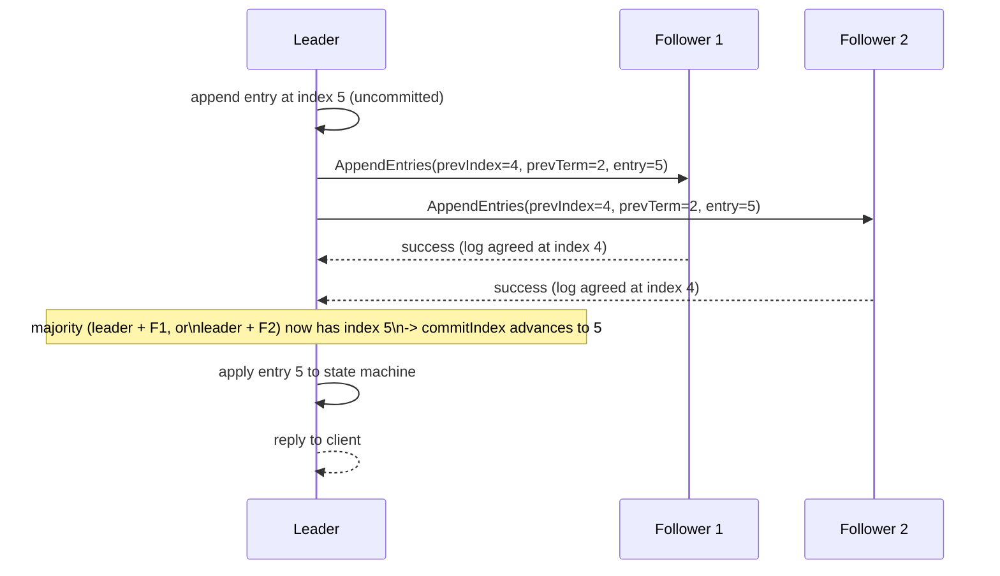

## Learning Objectives

- Describe how a Raft leader appends client commands to its own log and replicates them via AppendEntries RPCs.
- Explain precisely when a leader advances its commit index, and why that specific threshold (a majority of the cluster, including the leader) is what makes a committed entry durable.
- State the Log Matching Property and explain why it lets AppendEntries' single previous-index/term consistency check stand in for comparing entire log histories.
- Trace what happens to a follower whose log has fallen behind or diverged, and how the leader brings it back into agreement.

## Context & Motivation

`raft-leader-election` covered how a cluster picks a single leader; this concept covers what that leader actually does with its authority — the heart of the replicated-state-machine approach's Order property, applied concretely. Every mechanism here exists to guarantee one specific thing: once an entry is marked committed, it will appear, at the exact same log position, in the log of every future leader, forever — the guarantee `raft-safety-the-election-restriction-and-log-completeness`, next, proves formally.

## Core Theory

### Appending and replicating: AppendEntries

Once elected, a Raft leader is the only server in the cluster that accepts client requests. For each new client command, the leader appends it as a new entry to its own local log — tagged with the current term and the entry's log index — marking it, for now, as **uncommitted**. The leader then sends **AppendEntries** RPCs to every follower, each carrying the new entry (or entries — AppendEntries can batch several at once for efficiency) plus the index and term of the entry immediately preceding it in the leader's log. AppendEntries RPCs with no new entries at all double as **heartbeats**, which is exactly the mechanism `raft-leader-election` relies on to keep followers from starting unnecessary elections.

### The Log Matching Property

Raft's logs are held together by a strong, provable structural guarantee, the **Log Matching Property**: if two servers' logs both contain an entry with the same index and the same term, then their logs are guaranteed to be *identical* in every entry up to and including that index. This holds because a leader creates at most one entry per log index per term (it never rewrites its own log at a position it has already assigned), and because — as covered next — an AppendEntries call's consistency check refuses to append anything unless the follower's log already agrees with the leader's at the position immediately before the new entries. The property means a single (index, term) pair, agreed upon, is enough to guarantee everything before it also already agrees — comparing one pair stands in for comparing arbitrarily long log histories.

### The AppendEntries consistency check

When the leader sends AppendEntries carrying new entries at index `N`, it includes the index and term of entry `N-1` (the one immediately preceding). A follower **rejects** the RPC unless its own log already contains an entry at that exact index with that exact term — if the follower's log is missing that entry, or holds a different term there (a sign the logs have diverged), it refuses the append and reports failure. On failure, the leader decrements the index it's trying to match against and retries with an earlier entry, repeating until it finds a point where the two logs agree (per Log Matching, everything up to that point is now guaranteed identical) — at which point the leader overwrites anything in the follower's log after that point with its own entries, bringing the follower back into agreement.

### Commitment: when is an entry safely durable?

An entry is **committed** once the leader has confirmed it has been replicated to (stored in the log of) a majority of the cluster, the leader itself included. The leader tracks this via its **commit index** — the highest log index it knows is committed — and advances it precisely once a majority of `matchIndex` values (the leader's per-follower record of how far each follower's log is confirmed to match its own) reach that index. Crucially, committing entry `N` also, by construction, guarantees every entry *before* `N` in the same log is committed too (they were necessarily replicated to that same majority first, in order). Once committed, an entry is applied to the replicated state machine, and the leader can safely reply to the client that issued the corresponding command.



## Worked Examples

### Example 1 — a commit index advancing with a real 3-node cluster

```text
Cluster: Leader L, Followers F1, F2. Log initially empty.

Client sends command "SET x=1". L appends it at index 1
(term 3, uncommitted). L sends AppendEntries(prevIndex=0,
prevTerm=0 [i.e. "no prior entry"], entry=(1,3,"SET x=1")) to
both F1 and F2.

F1 responds success (its log was also empty, so prevIndex=0
trivially matches). F2 is slow to respond.

L now has: itself (has index 1) + F1 (confirmed index 1) = 2
out of 3 — a MAJORITY of the 3-node cluster. commitIndex
advances to 1, EVEN THOUGH F2 hasn't confirmed yet. L applies
"SET x=1" to its state machine and replies to the client.

F2 eventually responds success too — L now knows all 3
replicas have index 1, but commitIndex was already correctly
advanced the moment a majority (2 of 3) confirmed, without
needing to wait for F2.
```

### Example 2 — bringing a diverged follower back into agreement

```text
Leader's log: [1:"A", 2:"B", 3:"C", 4:"D"] (index:command,
terms omitted for brevity, assume all term 5).
Follower F's log (diverged after a past leader crash mid-
replication): [1:"A", 2:"B", 3:"X"]  <- entry 3 is DIFFERENT
                                          from the leader's "C"

Leader tries: AppendEntries(prevIndex=3, prevTerm=5, entries=
[4:"D"]) — F checks index 3: F HAS an entry at index 3, but
with a DIFFERENT term than what the leader expects there (the
old, wrong entry "X" came from a different, earlier term) ->
F REJECTS.

Leader decrements, tries: AppendEntries(prevIndex=2, prevTerm=5,
entries=[3:"C", 4:"D"]) — F checks index 2: F's entry 2 ("B")
DOES match (same term) -> F ACCEPTS, and per the leader's
instructions, DELETES its own entry 3 ("X") and everything
after it, then appends the leader's [3:"C", 4:"D"].

F's log is now [1:"A", 2:"B", 3:"C", 4:"D"] — identical to the
leader's, exactly as the Log Matching Property predicts once
agreement is found at some earlier point.
```

### Example 3 — why committing entry N guarantees everything before it is committed too

```text
Leader's log has entries at indices 1 through 5. Suppose
entries 1-4 were already committed in earlier rounds (a past
majority already confirmed each). Now entry 5 gets confirmed
by the SAME majority (Leader + F1, say).

Since F1's matchIndex is now 5, and F1's log must (by the
AppendEntries consistency check having succeeded to GET to
index 5) already contain entries 1 through 4 as well — F1
could not have accepted an entry at index 5 without the
leader's consistency check confirming agreement at index 4
first, which in turn required agreement at index 3, and so on.
Committing 5 therefore doesn't need to separately re-confirm
1-4 — their commitment was already guaranteed transitively,
which is exactly the leader's commitIndex advancing to the
SINGLE highest index confirmed by a majority, not requiring a
per-index majority check all the way back to 1.
```

## Common Misconceptions & Pitfalls

- **"An entry needs to be confirmed by EVERY follower before it can be committed."** Example 1 shows commitment only requires a MAJORITY (leader included) — L committed index 1 the moment F1 (not F2) confirmed, without waiting for the slower F2 at all; requiring unanimity would make the whole system stall on any single slow or failed follower, exactly the single-point-of-stall weakness quorum-based replication (`primary-backup-vs-quorum-based-replication`) was designed to avoid.
- **"AppendEntries' consistency check needs to compare the follower's ENTIRE log history to the leader's, entry by entry, every time."** The Log Matching Property is exactly what makes this unnecessary — Example 2 shows the leader only needs to find ONE point of agreement (working backward from the most recent entries) to guarantee, by that property, that everything before it already matches too.
- **"A follower with a diverged log has a serious, hard-to-fix problem."** Example 2 shows Raft's recovery mechanism handles this as an entirely routine, automatic process — the leader simply decrements its search index until it finds agreement, then overwrites the follower's conflicting suffix, with no special-case handling needed beyond the ordinary AppendEntries protocol already covers.

## Summary

A Raft leader appends every client command to its own log first, then replicates it to followers via AppendEntries RPCs, which double as heartbeats when carrying no new entries. The Log Matching Property — two logs agreeing on one entry's index and term guarantees they agree on everything before it too — is what lets a single previous-entry consistency check stand in for comparing entire log histories, and is exactly what lets the leader efficiently locate and repair a follower whose log has diverged, by walking backward until agreement is found and then overwriting the follower's conflicting suffix. An entry is committed, and safely applied to the state machine, the moment a majority of the cluster (leader included) has stored it — not requiring unanimous confirmation — and committing one entry transitively guarantees every earlier entry is already committed too. `raft-safety-the-election-restriction-and-log-completeness`, next, is the formal proof that these mechanisms, combined with the election restriction, never let two different values get committed at the same log position.

## Documentation Links

- [Ongaro & Ousterhout — In Search of an Understandable Consensus Algorithm (Raft, USENIX ATC 2014)](https://raft.github.io/raft.pdf) — the source paper for the log-replication mechanics (AppendEntries, the Log Matching Property, majority-based commitment via matchIndex) this concept works through in full.
